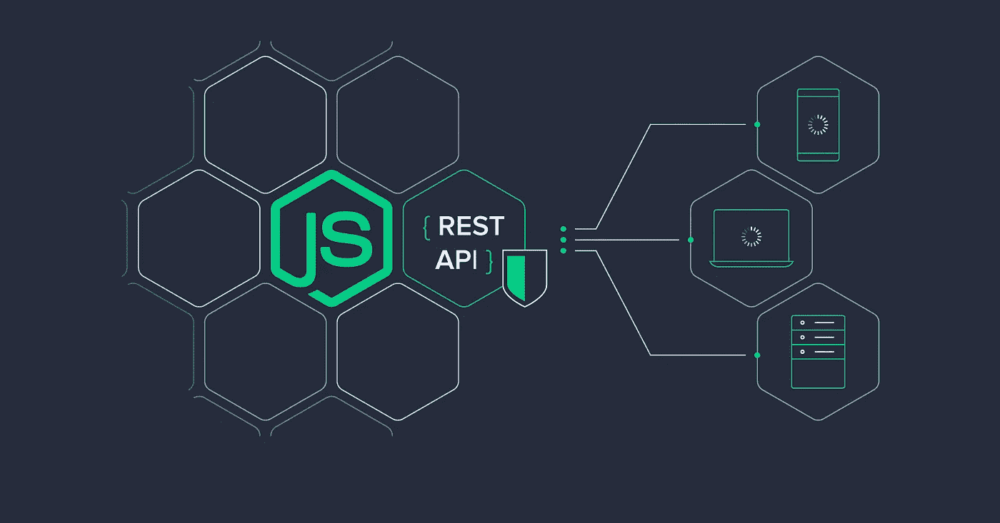

# 为什么为您的下一个 Web 应用程序开发项目选择 Node.js

> 原文：<https://javascript.plainenglish.io/why-choose-node-js-for-your-next-web-application-development-project-9597c96666f1?source=collection_archive---------4----------------------->

想知道 Node 开发成功背后的炒作是什么吗？有几个原因。

它从各个方面简化了 web 应用程序开发，并为 Node.js 开发人员提供了很多选择。

对于希望致力于跨平台实时应用和运行时环境的公司来说，这是一个理想的选择。

JavaScript 支持是开发人员使用 Node.js 进行 web 应用程序开发的一个原因，node . js 有很多很酷的特性，比如让开发人员借助 JavaScript 添加网络工具和 web 服务器。

对于初学者来说，使用 Node.js 进行产品开发可能技术性太强，这让他或她对创建成功的 web 应用程序的选择感到焦虑。

但这并不意味着它很复杂。考虑到通过集成双向客户机-服务器交互来完成工作是多么容易，它已经成为 web 开发公司的理想选择。

Node.js 能够在多个提供者和客户端请求之间分担工作负载，因此有很多优点。

如果您希望在服务器上创建动态内容和读/写文件以方便地修改数据，请选择 Node.js。

# 在下一个项目中考虑 Node.js 的几大理由

# 1.快节奏

使用谷歌的 V8 引擎，Node.js 将 JavaScript 编译成相当快的机器码。

因此，它可以加速任何框架。愿意雇佣专门的 Node.js 开发人员的公司可以构建快速灵活的 web 应用程序来处理多个并行连接。

PayPal 通过 Node.js 应用程序将响应时间大幅缩短了 35%,每秒处理的查询数量增加了一倍。

# 2.让分享变得简单

Node.js 对节点包管理器或 NPM 的接近使得容量共享成为可能。

超过 50，000 个软件包的存储库可以帮助设计人员在开始项目之前进行必要的调整。它允许开发者轻松地共享、更新甚至重用代码。

Web 开发公司充分利用动态包管理器来帮助设计者。

# 3.实时构建 web 应用程序

Node.js 对于那些希望简化游戏和 messenger 应用程序等实时应用程序开发的人很有帮助。

对于那些需要事件驱动和非阻塞服务器的 web 应用程序，实时 web 应用程序是一个解决方案，Node.js 提供了最好的解决方案。

# 4.公共代码库

在服务器和客户端之间发送数据以实现高效同步，说起来容易做起来难。

因此，在下一个项目中使用 Node.js 是有意义的，有助于您为服务器和客户端分别编写 JavaScript。

Node.js 能够在客户端和服务器端执行相似的代码，这使得它成为 Nodejs 开发人员的理想选择。

# 5.流式数据

每一个成功的产品开发都需要卓越的 I/O 处理。因为 web 框架将 HTTP0 请求和响应视为完整的数据对象，所以这很困难。

Node.js 来帮忙了，因为它可以很好地处理 I/O 过程，允许用户在上传过程中同时转码媒体文件。

向 Websockets 读写流使得这种 HTTP 处理相对容易。

# 6.利用开发人员的 JavaScript 技能

每个 web 开发人员都会在某个时候编写一些 JavaScript，即使是在入侵一个 jQuery 插件。

现在找一个网络开发人员很难。所以，如果你选择一个网络平台，为什么不选择一个世界上每个网络开发者都知道其语言的平台呢？

# 7.简化的网络浏览

随着越来越多的开源开发者喜欢 Node.js，该平台正在增加更多的功能，并加快新功能的采用速度。

这对于那些参与平台即服务(PaaS)服务的组织来说非常有用，因为这些服务将组织限制为单一订阅。也许这就是 Heroku 更喜欢 Node.js 的原因。

# 8.提高生产率

生产力特性是多维的，因为必须排除 Node.js 开发人员认为 Java 由于编译时错误处理而具有高生产力的方面。

当前端和后端团队一起加速产品开发过程时，提高生产率是很容易的。

# 9.使用节点。代理服务器的 Js

使用 Node.js 可以做很多事情，因此可以使用它进行大量跨操作管理，同时补偿响应时间。

仅用 20 行代码将 Node.js 用作代理服务器也是一种很好的方式，可以用它从多个来源传输信息。

# 10.搜索引擎友好

如果在开发 web 应用程序时有什么东西是你不想失去的，那就是 SEO 游戏。

用 Node.js 渲染后端会给你的网站更多的可视性，因为搜索引擎可以优化 React 项目。

高速和顶级性能也有助于改善搜索引擎优化的前景以及优质的用户体验。

# 11.使用开源工具

开源开发公司使用 Node.js 是因为它免费提供了一个非常有趣的生态系统。

它包含了开发者需要的所有工具，比如 Redux 和 Flux，而 Node.js 运行在后端。许多 Node.js 开发服务将开源库用于基于任务的活动。

# 12.社区存在

该公司维护和支持 deep library，因为它最初是由脸书开发的，有超过 1000 名独立贡献者。

这也是一个更受信任的帮助社区，由于其动态存在和强大的公司支持，它使用最新的可用技术。

# 13.单线程、基于事件的平台

因为 Node.js 是单线程的，所以它可以轻松处理大型工作负载。在开发实时应用程序时，您需要在不降低速度的情况下处理大量并发连接。

这为开发人员提供了在更短的时间内创建面向性能的 web 应用程序所需的所有工具。

# 14.利用知名度

论坛是实时和活跃的，使得 Node.js 开发人员可以很容易地解决线程中的问题。找到一个解决方案并不难，尤其是考虑到社区是多么乐于接受并愿意提供任何帮助。

Node.js 是一个很容易上手的库，其中有大量的学习资源。

# 15.易于部署 Node.js 应用程序

如果您认为您的项目需要 Node.js 应用程序，那么考虑其他平台就没有意义了。

它为需要编程环境专用应用程序的项目提供了类似的解决方案。

借助动态生态系统和专业配置，项目完成将大大简化。

# 16.最小化开发工作

Node.js 的几个资源丰富的框架和库的可用性极大地简化了项目工作。

web 开发公司总是有可能为多种用途创建一组这样的资源。

这有助于减少开发时间，因为它允许您编写可重用的实用程序类，而不是每次都为一个新项目从头开始。

相反，Node.js 开发公司可以利用这一点，让 Node.js 开发人员编写特定于商店的逻辑。

# 17.运行经典 web 应用程序

节点。Js 可以快速传输 HTML 数据，使得在服务器端加载和运行经典的 web 应用程序变得容易。这最适合在创建对 SEO 更友好的内容时使用。

# 18.启用聊天/RTA

对于所有轻量级实时应用程序，如 messenger 应用程序界面、聊天软件、Twitter，这变得很容易。

在多种设备上利用其简单的界面和数据密集型功能。

# 19.API 开发

开始通过 REST/JSON 利用 web 服务数据库接口。这样可以省去你在多个系统之间转换的麻烦。

# 20.部署代理服务器

如果需要，将 Node 部署为代理服务器会很有用，它可以处理连接而不会阻塞任何东西。

当开发一个依赖其他外部服务来导出和导入大量数据的应用程序时，这种方法非常有效。

# 21.创建仪表板

集成仪表板是让您的受众参与 web 应用程序的一个很好的方式。对于创建和监控这样的 web 应用程序，Node.js 是一种优势，它结合了跟踪用户动作的能力。

最重要的是，Node 允许应用程序实时可视化这种交互，并根据用户操作做出反应。

行业领先公司对 Node.js 的成功使用

行业巨头信任 Node，并广泛使用它以获得最佳结果。有很多关于企业在实现 Node.js 后如何开始繁荣的故事。

例如，Groupon 从 Ruby on Rails 转向 Node，以摆脱维护网站的麻烦，因为网站每次都必须更新。

另一个很好的例子是 sky catch——一家与商业无人机合作的数据公司。

通过使用 Node.js，他们简化了从网站获取数据的工作，而不是创建新的 SQL，这是一个漫长而复杂的过程。

# 结论

有很多原因，也确实如此——node . js 为构建 web 应用程序提供了一个有效的替代方案。

它可以大大减少您的项目时间，同时平衡结果。

它允许开发人员和用户充分利用 web 应用程序，并达到预期的效果。

确保你雇佣了正确的 Node.js 开发人员进行产品开发，印度有许多[网络开发公司](https://www.standardfirms.com/top-web-development-companies-india/)可以确保网络应用开发的顺利进行。

*更多内容尽在*[plain English . io](http://plainenglish.io/)