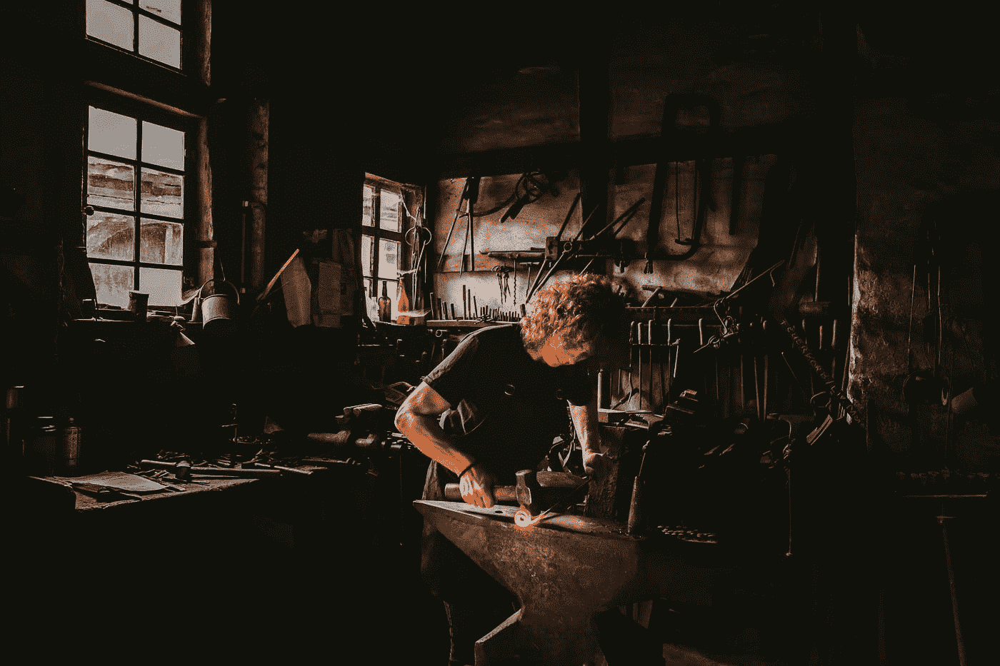

# 为什么工艺如此重要

> 原文：<https://javascript.plainenglish.io/why-craftsmanship-matters-f7a496cdf87b?source=collection_archive---------15----------------------->

这是一篇由[软件工匠](https://digitalbuff.dev/)的同事 [Yennick Trevels](https://twitter.com/yennickt) 写的客座博文。

作为客户，我们喜欢漂亮的产品，可以持续多年的优质产品，我们不必担心的产品，以及可以正常工作的产品。这些产品通常伴随着更高的成本，但我们愿意为此付费，因为产品或服务让我们的生活更轻松或更丰富多彩。

但有时，我们会被诱惑去购买更便宜的产品或与更便宜的承包商合作。当我们这样做的时候，它通常已经从订购过程开始，没有给我们实际需要的建议，但我们还是决定订购。随着时间的推移，我们还没有收到订单状态的更新，所以我们决定给他们打电话。原来他们忘记发送产品，但承诺他们会立即发送。送货的日子终于到了，我们打开了包装。结果是毫无生气的，灰色的，但是有用…直到它在使用一个月后开始坏掉。这时，我们会问自己，为什么不去买那些质量明显更好、由工匠制作但价格更贵的产品或服务。

显然做工匠很重要，但是需要长期持续的投入。那么，为什么您应该尽早开始投资 it 以在以后获得收益呢？这些收益到底是什么呢？

# 什么是工匠精神？

工艺，高效制造美丽和高质量产品的艺术。它已经存在了几千年了。各行各业都用它来区分自己和竞争对手，因为他们热爱这门手艺，接触喜欢制作精良的产品的顾客，并找到一个价格不是唯一决定因素的市场。

首先要学会使用合适的工具，并知道如何选择这些工具。真正理解什么是伟大的工具，甚至知道如何创建必要的工具。没有一套好的工具，就很难有效率并交付一致的质量。学习制造高质量的产品，迭代它，并强化它。研究新概念，让你深入了解如何制造更好的产品，这些概念将持续很长时间。但做一个匠人并不止于技术层面，还需要成为一个高效的沟通者和策划者。知道如何收集需求，如何计划工作，以及沟通进展。

手艺就是不断努力提高自己的手艺。

# 它让你与众不同

软件工程是一个非常抢手的职业，但仍然是一个竞争激烈的职业。如果你只看一些公司雇佣的令人疲惫的面试过程，你最好从人群中脱颖而出。但是怎么脱颖而出呢？古代的工匠在公共场所练习他们的手艺，让所有人看到他们如何从原材料开始，最终制作出完美的产品。人们会注意到，会相信它的质量，并愿意支付额外费用。口碑会迅速传播，为工匠提供稳定的工作流。

作为软件工程师，我们也可以做同样的事情，通过共享我们的知识和在公开的环境中构建软件。这是我们向世界展示我们的技能和工艺的方式。当你开发有价值的软件并分享知识时，关于你工作的消息会更容易传播(通过 Twitter、公司、社区等等)。这一切都是为了建立信任，而不需要人们真的和你一起工作。这让你比其他人更容易选择。

虽然公开工作肯定有助于让你脱颖而出，但私人工作也能缓慢但稳步地建立你的声誉。当在项目中工作时，你会很快注意到那些表现不佳的开发人员，以及那些已经明确投资于他们的技术并脱颖而出的开发人员。这是最后一类会产生正面口碑的开发者。当人们跳槽到其他公司，并且该公司打算雇佣更多的人时，他们的名字就会出现。不要低估这些年来和你一起工作的人的数量，以及这如何能迅速滚雪球般地在业内建立一个正面的名字。当别人愿意为你担保时，这可能是避开那些令人疲惫不堪的面试环节的最有效方法。

# 它让你变得可靠

作为客户，你最不想做的事情就是对你的承包商进行微观管理。反复检查他们交付的质量，跟踪他们的进度，甚至不得不告诉他们如何工作。你付给他们(好)钱来解决你的问题，这样你就不用担心了。这就是你作为一个工匠的品质的来源，这使你成为一个可靠的合作伙伴。客户可以期待可靠的建议、高质量的产品和清晰的沟通。对于重视时间并愿意为此付费的客户，您将成为他们的无忧解决方案。

# 它建立了你的网络

行会一直是工匠们聚集、分享知识和互相帮助的地方。在我们的软件工程领域，我们通过在线和离线的用户组和聚会走到一起。持续参与并为这些团体做出贡献将会与其他成员建立关系，建立信任。如果你也表现出你的手艺熟练和乐于助人，他们也会很乐意把工作交给你。

# 它让你有更高的价值

当你不持续投资于你的手艺时，除了价格，你没有任何东西可以竞争。这让你成为了一个低利润的商品。另一方面，工匠有一套独特的技能或产品出售，这使得价格不再是一个因素。作为一个手艺人，更容易建立一个忠诚的、回头客的客户群，因为他们不会简单地拿价格跟你比。质量结果的一致输出也使得价格上涨不会让您的客户轻易转向竞争，因为这已经成为一种高风险的行为(他们真的想为了轻微的价格上涨而冒更坏结果的风险吗？！).是的，你可以通过良好的营销卖一坨屎，赚很多钱，但是营销和销售一个精心制作的产品或服务的质量要容易得多。

# 结论

当你不着眼于大局时，关于如何提高自己技能的深入文章很容易被视为“开发人员浪费时间的一些蓬松的东西”。但是这些知识的小宝石不断积累，当持续应用时，会成为你成为工匠的一部分。它们不仅满足了我们内心的极客需求，还对我们作为软件开发人员的职业生涯产生了持久的影响。

# 关于扬尼克·特雷维尔

15 年来，Yennick 一直在为各种公司(初创公司、企业公司、政府)担任各种角色(初级-高级软件工程师、顾问、技术团队负责人、自雇开发人员)，实践和应用他的软件开发技能。他现在在 [digitalbuff.dev](https://digitalbuff.dev) 上分享他在软件工程领域建立职业生涯的知识。

今天到此为止！✨

PS: [查看电子书的 Dev Concepts 集合](https://dev-concepts.dev)，[加入软件工匠社区](https://join.slack.com/t/softwarecrafterstalk/shared_invite/zt-umgx3v06-4rtJ20PXz867GTPzCk1zeQ)，[个人知识管理社区](https://dsebastien.net/pkm-community)，[来 Twitter 打个招呼吧！](https://twitter.com/dSebastien)

*原载于 2021 年 11 月 3 日 https://dsebastien.net***。**

**更多内容请看*[***plain English . io***](http://plainenglish.io/)*