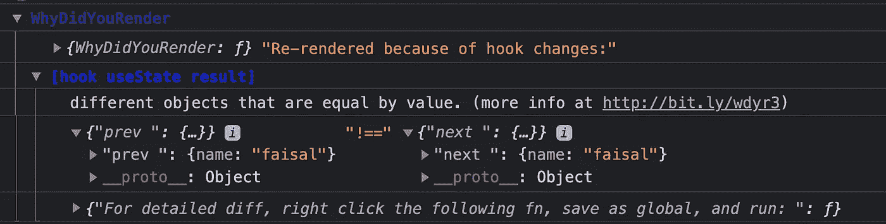

# 确定 React 组件的性能问题

> 原文：<https://javascript.plainenglish.io/why-did-your-react-component-render-a8c95e8310e6?source=collection_archive---------6----------------------->

## 为什么我的 React 组件重新呈现？


Photo by [Andrea Piacquadio](https://www.pexels.com/@olly?utm_content=attributionCopyText&utm_medium=referral&utm_source=pexels) from [Pexels](https://www.pexels.com/photo/pensive-male-teen-on-gray-background-3854130/?utm_content=attributionCopyText&utm_medium=referral&utm_source=pexels)

反应很快。我是说非常非常快。这是它受欢迎的主要原因之一。

但是有时我们滥用它的特性会在应用程序中产生性能问题。组件不应该渲染超过他们需要的！

今天我们就来看看如何使用一个名为`[**why-did-you-render**](https://www.npmjs.com/package/@welldone-software/why-did-you-render)`的牛逼库来自动识别组件不必要的渲染，以及如何解决！

# 安装依赖项

首先，将包安装到您的项目中。

```
yarn add @welldone-software/why-did-you-render
```

# 创建配置文件

在项目的根文件夹中创建一个名为`wydr.js`的文件。

在这里你可以找到更多的选项[。我们保持简单。](https://www.npmjs.com/package/@welldone-software/why-did-you-render)

# 添加到项目

将这个文件作为**的第一件事**导入到你的项目的根中(即`index.js`)。这一点很重要！

# 让我们看看它的实际效果

让我们创建一个名为`WhyDidYouRenderDemo.js`的新组件。并添加下面这段代码。

这段代码的作用是在你每次点击`Update`按钮时设置用户对象。这不是一个实际的例子，但对于演示来说足够了。

我们添加了一个控制台来识别何时渲染。

# 浪费渲染的问题

现在我们先试着理解一下问题。每当有人点击`Update`按钮，整个组件将重新呈现。

在 javascript 中，每次创建一个新的对象引用，这就是组件被重新呈现的原因。但是这是一个问题，因为实际上用户对象的内容是相同的。

您可以通过反复单击更新按钮来验证这一点。


这是一个浪费的渲染，因为在视图方面没有任何更新应该通知用户。

# 让我们打开“为什么渲染”

现在让我们打开`why-did-you-render`,看看它是否能给我们一些启示。在要跟踪的组件的末尾添加下面一行。

```
WhyDidYouRender.whyDidYouRender= true;
```

最终的组件看起来像这样。

# 现在看看魔法

现在，当你点击`**Update**`按钮时，你要留意控制台。



Magic!

看看这个。控制台上写着。

*   为什么会发生这种情况->因为钩子的变化
*   底层原因**->-**不同的对象即值相等
*   上一个和下一个值->用户的值

**多酷啊？**现在我们清楚了为什么会发生这种情况，并试图解决这个问题。

# 解决办法

因为我们的组件因为一个新的对象引用而被重新渲染，所以让我们把对象放到全局范围来解决这个问题。

现在，如果你点击`Update`按钮，你的组件应该不会重新渲染。

# 结论

React 的设计非常具有性能。你不应该经常使用这个图书馆。因为大多数时候都是你要负责任。因此，先学习 React 的基础知识和最佳实践。

但是如果你不能用概念解决问题，那么你可以把它作为最后的手段。

祝您愉快！

**视频格式:**https://www.youtube.com/watch?v=0wneu4s1xDo&t = 180s

**有话要说？通过** [**LinkedIn**](https://www.linkedin.com/in/56faisal/) 联系我

[](https://betterprogramming.pub/top-7-libraries-for-blazingly-fast-reactjs-applications-c0069e87c8b7) [## 快速反应应用的 7 大库

### 摇滚明星开发人员的必备工具

better 编程. pub](https://betterprogramming.pub/top-7-libraries-for-blazingly-fast-reactjs-applications-c0069e87c8b7) [](/20-essential-parts-of-any-large-scale-react-app-ee4bd35436a0) [## 任何大型 React 应用程序的 20 个基本部分

### 如果您正在编写企业级代码，您需要了解这一点

javascript.plainenglish.io](/20-essential-parts-of-any-large-scale-react-app-ee4bd35436a0)