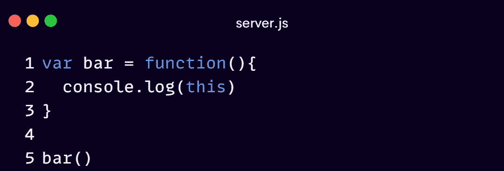
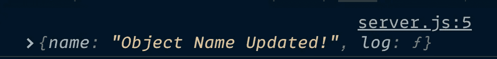
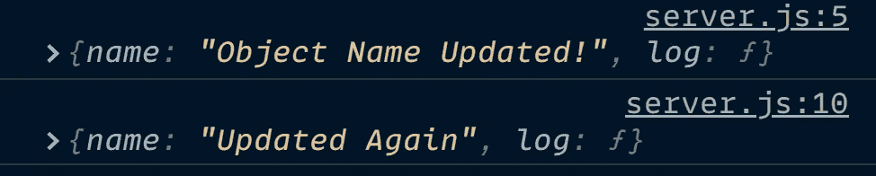

# 了解 JavaScript 最令人恐惧的特性

> 原文：<https://javascript.plainenglish.io/why-do-developers-fear-this-fb7497f95570?source=collection_archive---------7----------------------->

## 不要害怕“这个”关键字

Illustrations by [Somnath](https://www.twitter.com/tweetsbysoma)

有人说“ ***这种“*** 是他们遇到的最令人困惑的概念。对某些人来说， ***这个*** 是最难把握的概念。有些人甚至非常讨厌它，以至于他们不惜一切代价试图在代码中避免它，因为它造成了太多的混乱。

Hoisting is covered beautifully [here](/90-of-developers-get-this-wrong-fdbdb2e4bf66?source=friends_link&sk=16af24e78c923fc24c57b0172710ea62)

“`this`”机制如此令人困惑，甚至对于经验丰富的 JavaScript 开发人员来说，人们可能会奇怪它为什么会在那里！

是不是麻烦大于值得？让我们试着解开这个谜，弄清楚`this`到底是怎么回事。

在我们开始之前，确保你对 JavaScript 如何工作有一些基本的了解。

利用它来温习您的 JavaScript 基础知识。

Execution Context of foo() is created and put inside the global Execution Context

## 打开你的开发控制台，是时候把手弄脏了！

关键字`this`指向代码中这一层的全局对象。在浏览器内部，全局对象就是我们所知道的`Window`对象。

现在，让我们看另一个例子。假设我有一个函数，我称它为`foo`，我将记录`this`。然后我会调用`foo`

foo is just a random name here, you can use anything!

记住，调用`foo`意味着运行代码属性，它包含了函数中的所有代码行。它做的第一件事就是创建执行上下文。其中一个难题是关键字`this`的创建。

那么，在通过调用`foo`执行上下文来运行`foo`函数而创建的执行上下文中，关键字`this`会是什么呢？

现在让我们来看看。

它也是**窗口的**对象

所以，当你创建一个函数，并决定使用`this`时，它仍然指向全局对象。

类似地，如果我使用一个函数表达式来设置对象，

bar is just a random name here, you can use anything you wish!

以上案例中的`this`会是什么？

而且还是`Window`对象！

所以，每当我创建一个函数或函数表达式或函数语句时，`this`就会指向全局对象。

尽管我们在这里实际上看到了三个执行上下文，

The global one, the one that’s created when `foo` is invoked, and another execution context that’s created when `bar` is invoked.

在每一种情况下，他们都有自己的`this`。

Creation of Execution Context in action

Execution Context of foo() and bar()

但是在所有这些情况下，`this`关键字都指向你计算机内存中的同一个位置，都指向全局对象！

有道理吗？

这意味着你甚至可以做一些奇怪的事情，比如:

After I call `foo`, I can `console.log(newVariable)`, because that has been created. Using the dot operator, I’ve attached the `newVariable` to the **global object**.

Remember, any variables attached to the global object, I can just reference like that, I don’t need to use the dot operator, it just assumes I’m asking for a variable on the global object.

有点奇怪，对吧？

如果你不明白`this`关键字指向什么，并且你认为你在某种程度上把`this`附加到函数上，你不是！实际上，您正在进入全局名称空间，这可能会给自己带来很多问题。

所以，当你只是调用函数时，`this`总是指向一个全局变量。

## 对象方法呢？

让我们从一个方法创建一个新的对象和`console.log(this)`

functions inside an object is called method

`this`会是什么？

记住，每次调用一个函数，都会创建一个新的执行上下文。JavaScript 引擎决定`this`应该指向哪里。早先是 `Window` 对象，但这里是对象上的方法。在这种情况下，函数实际上是一个附加到对象上的方法，`this`关键字就变成了方法所在的对象。

See that?

这里 JavaScript 引擎说，啊，你被附加到一个对象上。所以当你使用`this`关键字时，我将指向包含你的那个对象。

我们可以做一些事情，

你看到了吗？我可以改变包含我的对象，如果我是那个对象的方法，通过使用`this`关键字！

能够访问特定方法所在的同一对象上的其他属性和方法非常有用。

现在，还有一样东西要给你看！

很多人认为这是 JavaScript 中的一个错误。你可能会说，JavaScript 中的 bug 是什么意思？JavaScript 是一种编程语言，引擎和语言是由人设计的。决定是关于事情应该如何运作的，在这种情况下，这个决定，很多人觉得是错误的。让我展示给你看。

假设我在一个方法中创建了一个函数，我们能做到吗？

setName() inside the method log()

我将传递一个变量给我的函数，比如说 newName。

在这里，我要说`this.name = newName`。我正试图用`newName.`改变我的对象

让我们看看输出

哇哦。等等…，这不是我们所期望的！我们有吗？

我们期望`this`关键字仍然指向包含它的对象！因为它是对象内部函数内部的函数。因为`this`关键字指向对象，你期望，再向下一个函数，它仍然指向对象，你可以改变它。

嗯，这是个问题！我们得到了“`Object Name Updated`”和“`Object Name Updated`”，这意味着第二次`this`跑，但似乎没有做任何事情！

还是做到了？让我们来看看`Window`物体

Did you see that? That name property was instead created and added by the equals operator on the global object

这意味着第二个内部函数当它的执行上下文被创建时，`this`关键字指向全局对象，即使它位于我创建的对象内部。

我认为那是错误的。而且很多人都这样！

但这就是 JavaScript 在这种情况下的工作方式。在这一点上我们也无能为力。

那么，当我遇到这种情况时，我们能做些什么来确保我使用了正确的对象，即`this`关键字不会导致我犯一个意外的错误。在这种情况下，我们可以使用一种非常常见的模式。

我要设置一个变量，我叫它`self`，有人叫它`that`，我喜欢`self`，

我要设置`self` = `this`。

这里发生了什么？好了，现在我们有了一个新变量，`self`。

因为这些都是对象，所以要通过引用设置为。

所以`self`将指向内存中与`this`关键字相同的位置。第 4 行代码中的`this`关键字指向我的整个对象。然后为了健康起见，我们简单地到处使用`self`，在我们通常会使用`this`的地方，甚至在这些子函数内部。

这样，我就不用考虑我是否指向了正确的对象。变量`self`仍然指向与`this`相同的位置和内存。当我改变它时，它会更新适当的东西，在这个例子中，是我的整个对象。

看那个。这是我们所期望的！不是吗？

## 那么，我们学到了什么？

我们了解到没有一种编程语言是完美的。它们都有自己的怪癖，JavaScript 当然也不例外。但是我们可以使用一些模式来解决编程语言可能存在的任何问题。现在，我还想提一下，如果你在任何真实的 JavaScript 场景中工作，那么你会经常看到上面的模式。

然而，在 ES6 出现后，作为`var`关键字和`arrow`函数的替代物的`let`关键字旨在解决这些问题。

our code in es6

We achieved the same output without meddling with “this” keyword

A word of advice from JavaScript Creator himself.

# 摘要

*   每次调用一个函数，都会创建一个**执行上下文**。
*   **在每个** *执行上下文*中，我们得到一个名为“`this`”的对象
*   当仅仅调用一个**函数**时，`this`关键字指向**全局对象**。
*   当函数是对象的**方法**时，`this`关键字指向该对象。
*   然而，任何内部子函数都有问题，所以我们可以**设置一个变量**等于`this`，然后在剩下的过程中只携带那个**变量**，以确保我们不会遇到任何无意的错误。
*   新的 **ES6 arrow function** 特性的主要动机是解决基于`this`的普通函数代码带来的困扰。

如果你发现这篇文章在某些方面有帮助，那么考虑与他人分享。让我知道你对此的看法，因为对我来说这很重要！

保重！我的另一篇帖子见！