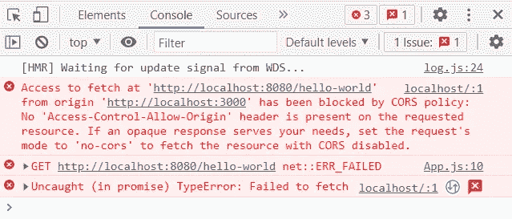
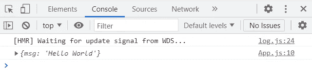
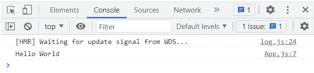

# 为什么 CORS 讨厌我？

> 原文：<https://javascript.plainenglish.io/why-does-cors-hate-me-9b53a0bdaf31?source=collection_archive---------20----------------------->

Photo by [Francisco Gonzalez](https://unsplash.com/@franciscoegonzalez?utm_source=unsplash&utm_medium=referral&utm_content=creditCopyText) on [Unsplash](https://unsplash.com/s/photos/depression?utm_source=unsplash&utm_medium=referral&utm_content=creditCopyText)

如果您以前尝试过发出 API 请求，您可能会遇到这样的错误:

*xxx 已被 CORS 策略阻止:请求的资源上不存在 Access-Control-Allow-Origin 标头。*

就这样，你被 CORS 政策划分为朋友区。

但我甚至不知道 CORS 是什么。我要怎么让它重新喜欢上我？

作为一个多次遇到这个问题的人，我无法告诉你这有多令人沮丧。幸运的是，我们可以通过一些简单的步骤来解决这种爱恨交加的关系。

让我们看看如何才能重新点燃我们与 CORS 的友谊。

# 什么是 CORS？

就像在现实生活中一样，在我们的友谊进入下一阶段之前，我们必须先了解 CORS。跨源资源共享，或 CORS，防止其他人试图访问来自不同来源的资产或数据，而不是出于安全目的运行我们的应用程序的来源。

想象一下，你刚买了一栋房子。房子里有一堆不同的物品，或者珍贵的财产，这些都是你努力工作换来的。你决定和你所有的朋友和家人举行一个小型的乔迁派对。与此同时，一群路人注意到你正在举办派对，并决定他们想加入庆祝活动。

我不知道你怎么想，但是除非我知道这些陌生人是谁，否则我不希望他们未经我允许就擅自进来。CORS 政策也是如此。

CORS 在那里保护我们免受路人的攻击，这些人可能会在那里窃取我们的资产或数据。就像俱乐部的保镖，除非你在名单上，否则你进不去。

很高兴知道有人在这里照顾我们。

现在，让我们看看 CORS 的行动。

# CORS 在行动

要看到这一点，我们必须首先设置一个外部服务器来发出请求。

为此，我们可以创建一个新项目——您可以随意命名它——并将其命名为`external-server`。一旦完成，我们将打开一个新的终端并运行命令`npm init -y`，这将为我们提供一个`package.json`文件。现在我们可以通过运行命令`npm install express`来安装 express 包。

最后，让我们添加一个新文件并将其命名为`server.js`，并用以下内容替换该文件:

在这里，我们为应用程序创建了一个要访问的端点，名为`/hello-world`。重要的是，外部服务器使用不同的端口，而不是我们的应用程序使用的端口，这样才能正常工作。我们现在可以通过在终端中运行`npm start`来启动我们的外部服务器。

接下来，让我们设置我们的 web 应用程序。

让我们创建一个新的项目——无论你怎么称呼它——我将称它为`my-app`。从我们的终端，我们可以运行命令`npx create-react-app client`，它将创建我们的客户端应用程序所需的所有文件。

完成后，我们可以导航到我们的`App.js`文件，并用以下内容替换它:

运行`npm start`之后，我们现在可以尝试从外部服务器调用 API。

如果我们做了所有正确的事情，我们的 API 请求应该会像预期的那样失败。如果我们看一下控制台，我们可以看到我们确实被 CORS 政策阻挡了。

Blocked by CORS policy

看起来我们还有一段路要走，直到 CORS 接受我们回到它的生活中。那么，我们如何着手解决这个问题呢？

# 让我们成为朋友吧

由于我们试图向不同于我们自己的源发出请求，我们无法从外部服务器检索数据。解决这个问题的一种方法是通过添加一行代码来允许跨来源访问我们的外部服务器。

如果我们允许跨源访问我们的外部端点，并再次运行我们的示例，我们可以看到这次我们的请求是成功的。

Not blocked by CORS policy

在现实世界中，我们向其发出请求的服务器允许像这样的跨源访问是不常见的。另外，无论如何，直接从我们的客户那里发出 API 请求是不好的做法。因此，我们应该忽略这个选项，并从我们的外部服务器中删除跨源访问。

那么正确的做法是什么呢？

实际上，实现这一点的最佳方式是通过我们的应用服务器而不是客户端发出 API 请求。在我们当前的应用程序中还没有设置，所以我们现在就开始吧。

在我们的`my-app`文件夹中，我们应该创建一个名为`server`的新文件夹。在这里，我们想要创建一个名为`server.js`的文件。打开一个新的终端选项卡并运行命令`npm init -y`，像以前一样安装 express，并将我们的文件更改为以下内容:

现在我们的项目中应该有两个文件夹，`client`和`server`。让我们通过运行命令`npm i axios`将 Axios 包安装到客户机和服务器文件夹中。这将允许我们向我们的应用服务器发出请求，然后我们将使用它向外部服务器发出 API 请求。

在我们的`client`文件夹中，我们需要导航到我们的`package.json`文件并添加下面一行:`"proxy": "http://localhost:3001"`。这是非常重要的，否则它不会工作。

让我们继续对我们的`App.js`文件做一些修改，如下所示:

现在，让我们保存所有文件，并再次重新运行它们，看看会发生什么。

Not blocked by CORS policy

厉害！成功了！

通过从我们的应用程序服务器发出请求，我们已经成功地从不同来源的外部服务器检索到数据。这需要一点说服力，但我认为可以肯定地说，我们已经重新赢得了友谊。

# 结论

正如你所看到的，与 CORS 打交道可能有点令人头疼。凭借一点点知识和诀窍，我们可以通过简单的几步来消除这些问题。

对于新开发人员来说，这不是一个容易理解的概念，但是我希望通过更好地解释这一点，您可以更好地理解它是如何工作的。

感谢阅读，下期再见。

*更多内容请看*[***plain English . io***](http://plainenglish.io/)