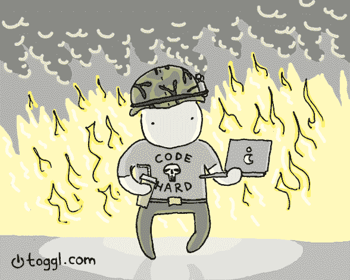

# 为什么工程师应该有年度主题

> 原文：<https://javascript.plainenglish.io/why-engineers-should-have-yearly-themes-335257c44389?source=collection_archive---------18----------------------->

TL；灾难恢复解决方案很少奏效。制定一个更广泛的目标，比如“健康年”，你可以集中精力做更多的体育活动，这样就有了更多的灵活性。为你在可预见的未来想要如何成长制定一个主题。如果你想提高后端或编码挑战技能，可以选择“后端年”或“挑战年”。年度主题使你能够在根据需要调整焦点的同时，始终朝着一个松散定义的目标努力，而不是有一个严格定义的目标。

年度主题的想法并不是我最初的想法。伟大的 CGP Grey 和 T2 的 Mike Hurley 在他们的播客上第一次给我看了这个视频。愿他们的胡须永远不会变薄。

# 为什么

年度主题不是决议。决心并不能很好地发挥作用，快速的谷歌搜索会产生太多的文章来解释为什么会这样。更有效的是小的有意义的改变。主题没有明确的目标，比如“我想减掉 10 磅”或者“我想每年加薪 2 万美元”。取而代之的是，你有一个广泛的可调整的主题，可以容纳一些事情，比如说一个疫情，改变你那一年的计划。主题类似于“少之年”或“发现之年”(这是 CGP Grey 和 Mike Hurley 用过的)。我自己也经历了“精炼年”,在这一年里，我试图限制发展新技能/爱好的诱惑，以利于进步和精炼现有的技能/爱好。这让我能够调整并专注于我试图以一种更易管理的方式完成的事情。我通常有太多的项目/爱好，这真的帮助我不在亚马逊上购买东西或尝试学习 C++，这两者都将占用我想要培养的更重要的习惯的时间。我没有正面实现我的目标，而是做了一些有意义的小改变，让我像正常人一样进步。这并不是说我没有目标，更多的是我有一个意向，有一个想去的地方。

目标是令人惊奇的事情，我们把它放在远处，感觉转瞬即逝。引用布兰登·桑德森的[风暴之光系列](https://www.brandonsanderson.com/the-stormlight-archive-series/#THEWAYOFKINGS)中的话，目的地之前的旅程。旅程是成就的一部分，它教会并塑造了我们。主题是突出这一切的*旅程*部分的一种方式。

一个主题允许优雅和宽容。试着一周做一个编码问题，你错过了一个？那很好。记住，不应该有‘2021 年 52 个挑战’的硬性目标；目标应该更像是“编码挑战年”。这种方法的神奇之处在于，当你没有全速冲向目标时，它可以让你不那么自责，而你可能需要一点一点地爬。

# 怎么

你如何走一百英里？一步一步来。

从可管理的挑战开始并不是弱点。很聪明。负担过重很容易让你很快筋疲力尽。培养习惯本身就是一门科学，主题的主要思想在方法上是相似的。咬掉小块。如果你的目标是跑得更多，从慢跑/步行开始。走出去并取得进步是保持动力和前进势头的好方法。有些人可以一头扎进去，立即行动，保持势头，但他们是局外人。这些人有着惊人的勇气。

在安吉拉·杜克沃斯的书《T2 的勇气》中，她解释了这是成功最重要的因素之一。然而，有不同层次的毅力。我认为工程师天生坚韧不拔。这就是软件工程师在许多方面成为软件工程师的原因。我们不会因为第一次尝试没有解决问题就放弃。我们都不得不努力克服，并以艰难的方式学习；然而，有些人比其他人更坚韧。

尽管我们喜欢大卫·高金斯的[故事，但我们都不喜欢，尤其是我。我感到疲倦和沮丧。我喜欢“我自己”的时间。我喜欢休息。这并没有让我成为一个坏人，只是让我成为一个会照顾自己的人。我们对心理健康了解得越多，我们就越远离大男子主义的“隐藏你的感情”的花言巧语。我们都不需要那些令人敬畏、惊天动地的故事，那些为了达到目标而不吃饭、失眠的故事。也许我们可以冷静下来，一边吃零食什么的，一边一点一点地向目标前进。不管怎样，你都会到达那里。](https://davidgoggins.com/)

# 当...的时候

当你准备好的时候。一个主题并不局限于年度日历，但这并不是说你不应该跟踪它或不时检查你的进展。我可以在六月份换一个，它仍然有效。然而，这种灵活性确实需要问责制。我推荐一本记录里程碑的日志或清单。美妙之处在于主题的灵活性。因为没有那么多可衡量的目标，所以以我的经验来看，当你犯错时不会感到沮丧。我可以自由地跳上跳下，没有判断或内疚。

# **工程师**

这听起来不像是一个工程职位，但它是。编码很难。跟上新技术的发展是很难的，需要做大量的工作。如果你打算在未来申请新的工作，做一年的挑战，开始解决编码问题。如果你想建立梦想的应用程序:梦想之年应用程序。有太多的方法可以让你进步，让刻度盘移动得更远一点。有一次睡觉前看了一段编码视频讲解，第二天醒来后就解决了问题。我很懒，但是我完成了，现在我知道如何做一件新的事情，并且离我想要的更近了一步。

许多 2021 年工程师趋势帖子强调了一个事实，即软件工程的变化越来越快，要求工程师比以往任何时候都要学习。这是一件伟大的事情，因为这意味着我们的社区正在蓬勃发展，但人们需要一些结构来扩展自己的知识。没有任何疯狂的系统或方法，很难保持竞争力。使用主题系统是拥抱成长思维和不断学习的一种方式。也就是说，我认为工程师可以从这种心态中受益匪浅，并通过选择他们想要改进的特定领域成长为更好的程序员。

## 最后

试试看。没什么可失去的。也许可以在博客上分享你的故事。黑客快乐！