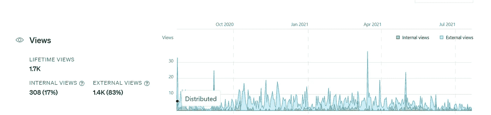
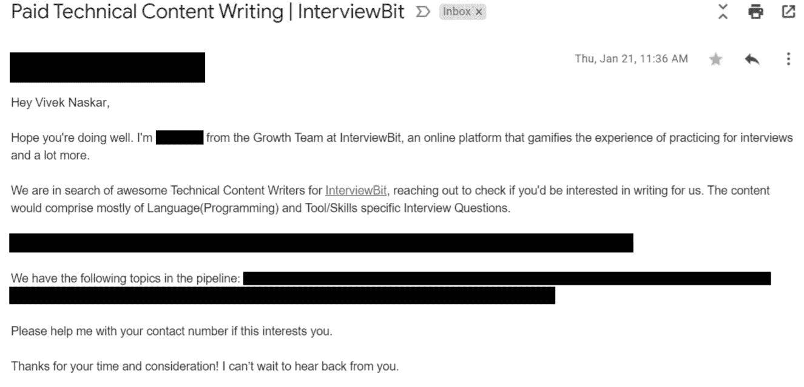

# 为什么每个开发者都必须立刻开始写博客

> 原文：<https://javascript.plainenglish.io/why-every-developer-must-start-blogging-at-once-aa8e37c88b24?source=collection_archive---------16----------------------->

## 开始时只是一种爱好，很快就变成了通向其他机会的大门。

Photo by [Scott Graham](https://unsplash.com/@homajob?utm_source=unsplash&utm_medium=referral&utm_content=creditCopyText) on [Unsplash](https://unsplash.com/s/photos/developer-blog?utm_source=unsplash&utm_medium=referral&utm_content=creditCopyText)

写作被证明是缓解压力、变得更有条理和提高生产力的最有效的方法之一。如果你打算在互联网上发布你的内容，这是非常有益和有效的。让我们现实一点。如果你是一个从事项目的开发人员，你可能已经为你所从事的模块编写了文档，以便与你的团队分享你的知识。

# 20 多年了，仍然很强大。

在 20 世纪 90 年代，最初的博客主要是由专注于高度技术性主题的程序员创建的。到 21 世纪初，博客成为主流。这是谷歌从 Pyra Labs 购买 Blogger 并向全世界免费开放的时候。当人们开始通过 Google Adsense 将其内容货币化时，博客引起了轰动，并被认为是一种赚钱的选择。

截至 2021 年，互联网上有超过 6 亿个博客。起初只是一种爱好，现在已经成为全世界数百万用户的在线业务。这也包括我。

# 我的第一次博客经历&我为什么开始写博客。

尽管我一直想写作，但写博客对我来说只是一种爱好。我开始写作，只是为了记录我自己学到的东西。作为开发人员，每当新技术发布时，我们总是需要提升技能。我有创造手写笔记的诀窍。我想到了在网上记录我的学习，可以随时随地访问。

我发表的第一篇文章是可笑的蹩脚。我买了自己的域名和托管空间，并于 2018 年 7 月发表了我的第一篇文章。我甚至促使我的同事们对我的故事(*实际上没有任何有意义的内容*)发表评论，他们也这么做了。😊

 [## 你的开发者故事？-开发商的故事

### 你好。这是博客的第一篇文章，我将讨论所有可能发生的事情…

thedeveloperstory.com](https://thedeveloperstory.com/2018/07/03/your-developer-story/) 

我试着每个月至少一次在我的 [*个人博客*](https://thedeveloperstory.com/) 上连续发帖。在每篇帖子中，我对自己的写作甚至开发技能越来越有信心，因为我只会发布或记录我作为开发人员的旅程。

# 一个博客如何改变了我的一切。

那是 2020 年 7 月，当时我正在为我的项目研究谷歌云数据流管道，我正在我的博客上记录它。 [*数据流是谷歌云平台上的一项重要服务，被 Spotify*](https://blog.devgenius.io/the-technology-behind-spotify-wrapped-2019-dce9e129265f) 等大型机构所使用，当时关于它的报道并不多。

我还碰巧在 Medium 上重新发表了一个月前我署名的文章。

 [## 云数据流:批处理和流数据处理的统一模型

### Dataflow 是一项完全托管的服务，用于在谷歌云平台生态系统中执行管道。这是一项服务…

medium.com](https://medium.com/swlh/cloud-dataflow-a-unified-model-for-batch-and-streaming-data-processing-43f48b3f3c3d) 

令我惊讶的是，这篇文章爆红了。这是“*策划和选择进一步分发*”我不知道这是什么意思。尽管浏览量不到 100 次，我还是获得了这篇文章的持续浏览量。

Stats for my first-ever [curated article](https://medium.com/swlh/cloud-dataflow-a-unified-model-for-batch-and-streaming-data-processing-43f48b3f3c3d).

在两周内，我收到了大约 80 个 LinkedIn 连接请求，从我个人的角度来看，这是相当惊人的。只是给你一个视角，我当时只有 200+的人脉。

# 爱好到机遇。

我很快意识到写博客不仅仅是我的爱好。我需要把这些变成机会。我的原则是永远不要依赖博客或媒体的收入，因为我赚的是花生(字面上的意思)。我只是想提高我的写作水平，提高我的技能，为自己创造机会。

2020 年 9 月开始坚持写作，开始发表最少 5 篇文章。就是这样。我会主要写一些话题，比如生活经验、自我提高和编程与技术。

我很荣幸能成为强大的 Medium 写作社区的一员，我非常喜欢他们中的一些人和他们的文章，以至于我每天都期待着阅读它们。

一些公司和网站找到了我，让我付费撰写技术内容，因为他们在网络搜索上找到了我的文章。虽然由于时间限制，我没有为他们中的任何一个人写过文章，但是我把这些文章转发给了我的朋友们，他们正在寻找这样的写作机会。

Masking the details of the contact person and the topics (in-demand topics)

我也曾被招聘者联系过，要求从事编程和技术内容写作方面的自由职业。

# 我最后的想法。

写作本身就是一个有利可图的职业(从长远来看是*)，当结合开发技能时，可能性是无穷无尽的。是的，作为一个初学者，考虑到数以百万计的博客，你可能会认为一切都已经被写过了。没什么区别。人们甚至批评我的语法。真实事件。一个人在网上诋毁我的一篇文章，声称我的文章令他震惊。没关系，信不信由你。你只会变得更好。你将学会优雅地接受批评。*

*最好的事情是你在为世界写作，因此你展示了你的作品。如果你找不到任何话题，就记录下你已经知道的东西。你可以做我做过的事。您可以为您的开发项目记录您所学到的一切。这将作为参考永远留在你身边。*

***如果你喜欢读这篇文章，你可能也会发现下面的文章值得你花时间去读。***

* [## 每个开发者现在都必须收藏的 15 个 GitHub Repos

### 从命令行(Linux)、Python、Java、JavaScript、web 开发等等。

python .平原英语. io](https://python.plainenglish.io/15-github-repos-that-every-developers-must-bookmark-right-now-eee01db63977)  [## 每个程序员必看的 10 部电影

### 这些电影要么会激励你，要么会娱乐你，或者两者兼而有之。

blog.devgenius.io](https://blog.devgenius.io/10-movies-that-every-programmer-must-watch-465186bb7f2a) 

您可能还会找到下面的目录，来自*The practical Programmer*，他们在那里出版了关于经典和前沿主题的*实用书籍和学习资源，以帮助您练习技能并加快您的职业发展。*

 [## 媒体实用程序员书籍目录

medium.com](https://medium.com/pragmatic-programmers/directory-of-pragmatic-programmer-books-on-medium-6a5cbadbd4b4) 

*更多内容尽在*[*plain English . io*](http://plainenglish.io/)*