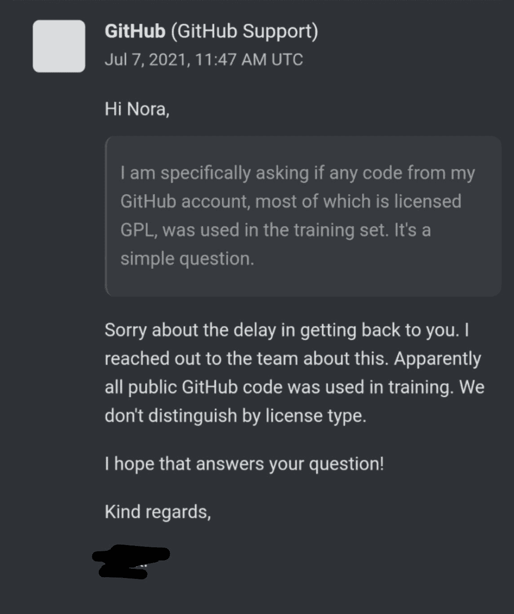
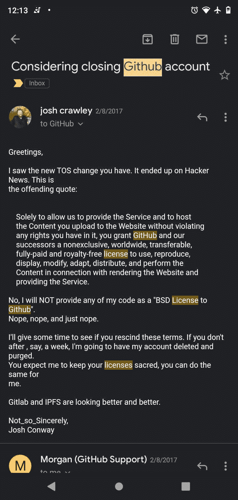
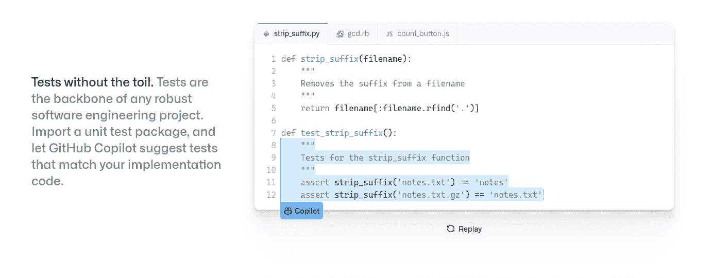

# 为什么 GitHub Copilot 不会淘汰软件工程师

> 原文：<https://javascript.plainenglish.io/why-github-copilot-wont-render-software-engineers-obsolete-fe173998188?source=collection_archive---------17----------------------->

## GitHub Copilot 不会取代你的 5 个理由


[source](https://i.ytimg.com/vi/uwfhDNxR_Zw/maxresdefault.jpg)

# 1.副驾驶不知道你的领域

Copilot 是一个增强的自动完成功能。副驾驶不知道领域。你需要提供种子，副驾驶会播种。*要点——开发者仍然至关重要。*

副驾驶不知道利弊。开发人员了解某个解决方案的利弊。你不能把这些决策外包给副驾驶。我们需要一个领域专家来权衡这个解决方案。Copilot 是一个将我们的思想转化为代码的工具。*开发人员了解原因，Copilot 帮助解决方法。*

*Copilot 在编码上比较专一。开发人员在编码方面是通用的。*开发人员知道如何将解决方案作为一个整体进行重用、重构和测试。Copilot 帮助你解决一个具体的编程问题。*开发者知道更大的画面，副驾驶只有几个像素。*

# 2.副驾驶学习 GitHub 的代码

*为什么这很重要？你可能会遇到这样的情况。其中代码被逐字填写。*本质上不是你想要的代码。**

*哪些开发者看不到 Copilot 的价值？* ***我。*** 我在做一个闭源系统，名为 SAP Commerce。我不能用它来生成新的`Converter`，或者新的`Populator`，或者新的`Service`。 *Copilot 对于闭源、专有或很少使用的系统没有什么价值。*

*还有什么比前面的例子更糟糕的？* ***使用新手程序员的代码。*** 外码有谱，从新手到本金。你不会总是得到后者。开发人员不应该依赖 GitHub 的关键任务特性的重复代码。

*你觉得这不可能吗？*看看 beta 测试的结果:

*我的一个追随者在 Twitter 上* [*开玩笑说*](https://twitter.com/mplewis/status/1410770862983172098) *他们迫不及待地允许 Copilot 写一个函数来验证 JSON web 令牌。* ***副驾驶:***

```
*//* [*source*](https://gist.github.com/0xabad1dea/be18e11beb2e12433d93475d72016902) *function validateUserJWT(jwt: string): boolean {
    return true;
}*
```

# 3.副驾驶不关心授权

Copilot 用了 GitHub 所有的代码。副驾驶没看代码执照。



[source](https://twitter.com/NoraDotCodes/status/1412741339771461635?s=20)

当 Copilot 吐出 GPL 代码时，你可能会遇到问题。即使 Copilot 从 GPL 代码中学习，我们仍然可以得到逐字的代码。你不应该冒险在商业项目中使用 Copilot。教育项目可以将此视为一种好处。

一名开发人员注意到了 TOS 中的这一微妙变化。他从 GitHub 移除了代码。



[source](https://twitter.com/CrankyLinuxUser/status/1412807080243830786?s=20)

# 4.副驾驶不会挠你的痒

Copilot 根据您的输入以统计方式生成代码——[*来源*](https://gist.github.com/0xabad1dea/be18e11beb2e12433d93475d72016902)

*您期望 Copilot 提供正确的解决方案。你会得到一个差不多正确的答案。*每个副驾驶输入—产生不同的答案。简单测试后，可以得到[两种不同的解决方案](https://gist.github.com/0xabad1dea/be18e11beb2e12433d93475d72016902#moon-phase-calculator-a)。两者都不能解决问题。他们离你所需要的足够近了。*你需要额外的努力去通过外来代码，测试，并作出调整。*

"**以相同的方式提示生成模型两次通常不会得到相同的输出。然而，**这与可靠性的一个最基本的原则相抵触:决定论。它可能某一天完全按照你想要的方式完成你的样板文件，而第二天就全错了。” *—* [*来源*](https://gist.github.com/0xabad1dea/be18e11beb2e12433d93475d72016902)****

# 5.副驾驶写错误的测试

副驾驶也为你写测试。你尝试过让 Copilot 为这些错误的例子生成测试吗？— [*来源*](https://gist.github.com/0xabad1dea/be18e11beb2e12433d93475d72016902#gistcomment-3810070)



[*source*](https://gist.github.com/0xabad1dea/be18e11beb2e12433d93475d72016902#gistcomment-3810070)

副驾驶先生成[不安全代码](https://gist.github.com/0xabad1dea/be18e11beb2e12433d93475d72016902#example-security-flaw-sql-injection-in-php)。然后甚至为不安全的代码编写测试。嗯，测试通过了，所以我们没事了。不要让人工智能为你写代码或测试。这些测试可能适得其反，毫无帮助。

不要让副驾驶为你写错误的代码。不要让 Copilot 为它产生的错误代码编写测试。让 Copilot 为您生成一个样板文件。

我不会让副驾驶进我家(IDE)。副驾驶夺走了我的自由、创造力和解决问题的能力。 我不喜欢那样。请在评论中告诉我你的想法。

# 继续在 Copilot 上阅读

[GitHub Copilot 的风险评估](https://gist.github.com/0xabad1dea/be18e11beb2e12433d93475d72016902#moon-phase-calculator-a)

[GitHub 确认使用所有公共代码培训副驾驶，不考虑许可证](https://www.reddit.com/r/coding/comments/ogb8yn/github_confirmed_using_all_public_code_for/?utm_source=share&utm_medium=web2x&context=3)

[GitHub 副驾驶为开源代码洗钱？](https://www.reddit.com/r/programming/comments/oaxyxu/github_copilot_as_open_source_code_laundering/?utm_source=share&utm_medium=web2x&context=3)

[副驾驶复述雷神之锤代码，包括评论和执照](https://www.reddit.com/r/programming/comments/oc9qj1/copilot_regurgitating_quake_code_including_sweary/?utm_source=share&utm_medium=web2x&context=3)

*更多内容请看*[***plain English . io***](http://plainenglish.io)