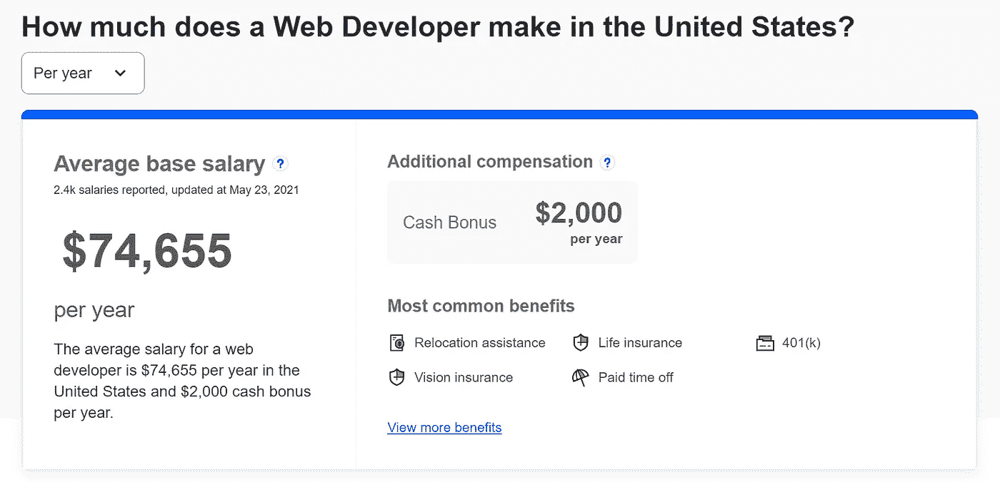

# 为什么&如何在当今世界学习 Web 开发

> 原文：<https://javascript.plainenglish.io/why-how-you-should-learn-web-development-in-todays-world-d0fdf9f7bf66?source=collection_archive---------10----------------------->

## 一个完整的指南，以消除你的疑虑，让你开始为世界的网页开发

Photo by [AZGAN MjESHTRI](https://unsplash.com/@azganmjeshtri?utm_source=medium&utm_medium=referral) on [Unsplash](https://unsplash.com?utm_source=medium&utm_medium=referral)

你终于来了，可能是因为

1.  你真的不懂 Web 开发，想了解一下。
2.  你有一个粗略的想法，但现在你有点糊涂了。
3.  你喜欢我的内容，想看我所有的东西(可选)。

如果你是其中之一，那么这篇文章一定会帮助你选择你的职业。

我写过几个关于 Medium 的故事，帮助初学者。但也有必要解决初学者的疑问，所以我在这里与这个故事。

在这里，我将简单地谈谈，这样你就可以有一个想法。很多时候，我会用 Web 开发来代替前端 Web 开发，因为前端 Web 开发是 Web 开发的一部分。

所以现在让我们开始。

首先说一个耐人寻味的事实。

> 你不需要任何学位或类似的东西，就可以开始你的 Web 开发之旅或更进一步。

此外，你可以基于你的项目得到你的第一份工作，成为一名网络开发人员。是的，我的朋友，如果你手中没有学位，他们永远不会拒绝你。

而且报酬会比你预期的多很多。

但是报酬的证明人在哪里呢？

在这里，我的朋友。

Source: Indeed

根据[事实上](https://www.indeed.com/career/web-developer/salaries)的数据，美国网络开发人员的平均基本工资接近 74655 美元。

请注意，这是平均基本工资，如果你有技能，你可以赚得更多。因此，除了很多福利外，还有额外的补偿。

现在你会问我。

所以，会很费钱？我的回答是不，一点也不。

相比之下，如果我告诉你，你可以免费学习 Web 开发。

你不会相信我的。

对吗？

但你必须这么做。因为我给你提供了免费资源。

 [## 2021 年为网页设计师和网页开发者提供 80+免费资源。

### 成为网页开发者的完整指南。

javascript.plainenglish.io](/80-free-resources-for-web-designers-and-web-developers-in-2021-f400be2875ea)  [## 如何利用免费资源学习 Web 开发

### 初学者的深入指南。

javascript.plainenglish.io](/how-to-learn-web-development-using-free-resources-1c677e70de14) 

# 如果出现以下情况，以上几点都没有用

所以我已经消除了你最重要的疑虑，也就是说，你不需要学位，你的工作会有很高的报酬，而且你可以免费学习。

但是没有用。如果你对它不感兴趣。

我认为网络开发者是为解决问题而生的。如果你不能，那么请忘记这个字段。

我知道你没有预料到这一点，但是请相信我，没有兴趣，你将不会在任何领域取得成功。我有责任向你展示我正在写的每个主题的起伏。

一个网页开发者必须专注于他/她的工作。一个客户需要网站，老板需要产出，要靠你在时间内完成。

对于所有这些，你必须对它感兴趣。

我认为，兴趣实际上是随着时间的推移，通过对某个领域的实践和学习而产生的。

# 开始你的旅程

如果你在进一步阅读，我想你对这个话题是真的感兴趣。

所以让我们用一种更有趣的方式来开始这个话题。

我知道每个人都有不同的背景，不同的地方，所以我会为你们所有人保持简单。

首先也是最重要的，你必须对网页开发产生兴趣。它会在一段时间后生成。

第二个最关键的因素是从目标开始，或者称之为最终目标。你必须至少在头脑中有一个目标，比如你为什么学习 Web 开发，你会从中得到什么，等等。

它会激励你去学习，去解决问题。

现在我想，你已经差不多清除了你的疑惑。是时候谈谈技术问题了。

那我们开始吧。

Web 开发是一个广阔的领域。即使你谷歌一下，你也会被那里所有的编程语言、框架、教程和学习资源淹没。

他们中的许多人想向用户出售一些东西。

别担心，我知道，这里不会有东西卖，不需要跟随或鼓掌，只是学习。

仅此而已。

现在我们开始吧。

嗯，Web 开发主要分为前端和后端两种。

1.  [前端开发](/how-i-would-learn-front-end-web-development-if-i-had-to-start-over-again-24e6228050d0)就是用户可以在互联网上看到的网站。
2.  后端开发是用户看不到的，但有助于前端工作。

如果你愿意，你也可以读读这个，[作为一名面向初学者的 Web 开发人员，开始工作并获得 105，813 美元/年的收入。](https://medium.com/code-blog/getting-started-and-earning-105-813-yr-as-a-web-developer-for-beginners-19b2cd26fcc2)

除此之外，在网页开发中还有其他领域，如图形设计、用户界面/UX 设计等。

你可以在任何一个网络开发领域赚到钱。

为了进一步激励你，这里有一个 UX 设计师年薪 75000 美元的视频。

# 第一步是学习 HTML 和 CSS

第一步也是最容易的一步是学习 HTML 和 CSS。你可以用它创建一个网站。

为此，访问 [freeCodeCamp](https://www.freecodecamp.org/) 、 [YouTube](https://www.youtube.com/) 、 [w3schools](https://www.w3schools.com/) 或 [MDN Web Docs](https://developer.mozilla.org/en-US/) 并学习 HTML 和 CSS。

不要担心，以上所有资源都是免费使用的。

你也可以关注这些 [YouTube 频道](https://medium.com/code-blog/top-12-youtube-channels-every-web-developer-should-follow-4b5a4f6ee1e4)来学习 Web 开发。

现在你会问我，学习 HTML 和 CSS 需要多少时间？我的回答是这取决于你，但至少需要一周的时间来学习。

它会理清你的概念，帮助你理解更多的语言。

然后，用 HTML 和 CSS 创建一个你自己的作品集网站。

# 第二步是学习 JavaScript

如果你学过 HTML 和 CSS。目前为止你做得很好。

现在你可以很容易地创建一个网站。

但是你需要添加额外的特性和功能，为此，你必须学习 JavaScript。

当我在互联网上搜索时，我对 JavaScript 语言的流行程度感到惊讶。

让我也和你分享一下。

Source: Google

根据谷歌的说法，使用最多的编程语言是 JavaScript。

你现在就要学习。

为此，你可以关注相同的资源，如 freeCodeCamp、YouTube、w3school 和 MDN Web Docs。

除此之外，我还通过使用 [JavaScript.info](https://javascript.info/) 学到了一些重要的概念。你也可以看一看。

学习 JavaScript 至少需要一两周的时间。

如果你已经学习了 JavaScript，恭喜你已经学习了最常用的编程语言。

您还学习了前端 Web 开发的基础知识。

# 第三步是练习，练习，只有练习

老实说，我没有实践过这个重要的概念，也没有人在这方面帮助我或指导我。

其实学完这个，我就去学 React，Node.js 了。

因此，我已经忘记了 HTML、CSS 和 JavaScript 的重要概念。而且，对我来说，理解新的概念变得越来越困难。

所以至少尝试一周的时间来练习 HTML，CSS，JavaScript。

整合这三种语言，并从中创造出一些东西。

不要只关注学习，试着从中有所作为。例如，创建将来对你有帮助的项目。

# 第四步

对于前端 Web 开发，您已经学习了 HTML、CSS 和 JavaScript。

这没关系。

现在你可以创建一个网站。

但在工作或创业中，你必须创建像亚马逊、Myntra 或 Udemy 这样的网站。

为此，你需要反应，角度，或 Vue。我不打算比较其中任何一个，因为它们以自己的方式是最好的。

学习这些框架是你的选择。实际上 React 是一个库，但许多程序员称它为框架。

# 第五步是工作

如果你已经学习了 HTML、CSS 和 JavaScript 以及 React、Angular 或 Vue。

恭喜你现在是一名前端 Web 开发人员👏👏👏。

是时候应用这些语言的知识了。

为此，你可以在 LinkedIn、Angellist 找一份实习工作，或者自己创业，或者创建自己的网站并在互联网上托管。

选择权在你。但是不要离开学习或者停止练习。

# 让我们结束吧

现在你知道 Web 开发是一个广阔的领域，所以请不要停留在任何地方。只给 1 或 2 周的 HTML，CSS。然后继续前进。你必须理清你的概念。

不要从 Udemy 或任何其他网站购买大量课程。一切都是免费的。如果看到其他网站代码可以学习就足够好了。

此外，使用 GitHub 和开源来学习以适当的格式编写代码。

最后，不要看成百上千的教程，最好尝试自己创作。

今天到此为止。

谢了。

 [## 6 个免费工具，帮助我成为一名专业的网络开发人员

### 由一位拥有 30 多年经验的 web 开发人员建议。

javascript.plainenglish.io](/6-free-tools-that-helped-me-become-an-expert-web-developer-41b999403865) 

*更多内容看*[***plain English . io***](http://plainenglish.io)