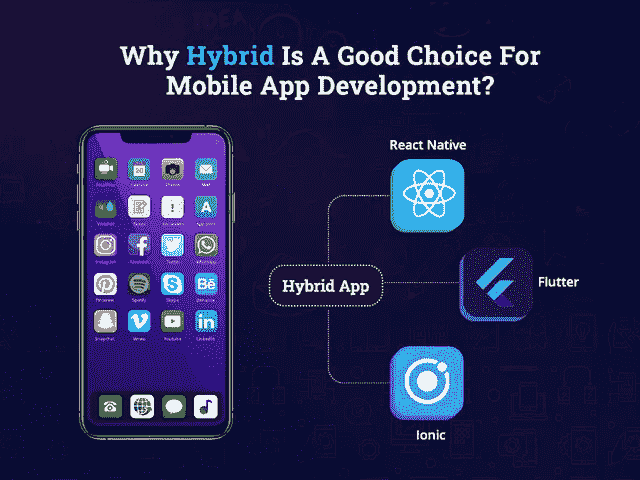

# 为什么混合是移动应用开发的好选择

> 原文：<https://javascript.plainenglish.io/why-hybrid-is-a-good-choice-for-mobile-app-development-3856cdca358f?source=collection_archive---------7----------------------->

## 混合应用程序开发:这是移动技术的未来吗？

在这样一个不确定的时代，来自几个行业的创业公司和商业领袖对“等待和观察”的方法感到麻痹。但在这种不确定性中，有一件事逐渐增长，那就是消费者在移动应用和安装上花费巨大。

根据一项调查，移动应用见证了应用下载的显著增长，预计到 2023 年将产生[9352 亿美元的收入。](https://www.statista.com/statistics/269025/worldwide-mobile-app-revenue-forecast/)

尽管如此，全球各地的日常业务都在投资移动应用开发服务，并成为这一蓬勃发展的行业的一部分。想到创建一个移动应用程序可能会让你兴奋，但很快这种兴奋就会变成最大的困境:开发移动应用程序的最佳方法是什么？

虽然原生和跨平台应用程序开发是构建移动应用程序的两种最常见的方法，但由于使用单一代码库构建单一应用程序项目并在移动、web 和桌面上运行的灵活性— — *难怪混合应用程序开发解决方案已经超过了原生应用程序。*

*原因！*

## **混合应用开发相对于原生应用开发的简要概述**

无论你想开发一个像 Instagram、Whatsapp、脸书、Skype、Twitter 或 Snapchat 这样的应用程序，企业总是要求更快的开发，同时保持低开发成本。

谈到现实，当企业规划应用程序开发解决方案时，他们脑海中总会出现一个问题，即应该开发 iOS 应用程序还是 Android 应用程序？这两个平台都有自己的优势，例如 iOS 应用程序可以确保更好的用户体验，而 Android 应用程序开发可以提供更快的开发速度，同时保持低开发成本。

然而，在应用程序开发行业的人实际上可以理解，在两个操作系统上创建你的存在的理想方法是开发混合应用程序。

混合应用程序开发不仅弥补了用户体验和开发简易性之间的差距，还缩短了开发周期，缩短了开发时间，并确保了卓越的应用程序性能。

通过使用单一语言和框架来创建 iOS 和 Android 应用程序的选择将慢慢引领这场竞赛，照亮移动应用程序开发的未来。

选择混合 [**应用程序开发公司**](https://www.xicom.biz/services/mobile-app-development/) 的最大好处是，那里有特定的技术来支持混合应用程序的创建，其中包括脸书推出的谷歌婴儿“颤振和反应”。

对于那些不熟悉混合动力这个术语的人，有一个见解！

## **什么是混合应用开发？**

简单来说，混合应用是通过 webview 包装在移动应用中的网页，使用 CSS3、HTML5 和 JavaScript 编写。混合应用是本地和移动应用的独特组合，可以在各种平台上无缝工作。

混合移动应用程序可以安装在设备上，就像任何其他应用程序一样。但是，让他们脱颖而出的是，他们处理来自特定平台上的本地应用程序的元素，以及来自 web 应用程序的元素。因此，它可以在多个平台上运行，而不会影响应用程序的性能。

这些应用程序的最大好处是，它们可以使用任何设备的功能，并具有内置功能。它结合了网站和应用程序的优势。此外，这些应用程序也可以依赖于提供 Javascript APIs 的平台。

希望通过对混合应用开发的详细解释，你一定能理解为什么混合应用被广泛选择而不是本地应用，为什么企业对雇佣具有相同技能的移动应用开发者更感兴趣。现在做一些计算，自己算出来:

*   使用混合应用程序开发可以节省多少时间？
*   你能避免多少挫折而不纠结于原生 ide、SDK 和苹果特定的需求？
*   测试你的应用有多容易？
*   第三方库的负载会轻多少？
*   采用一种专用的技术方法比不得不“丛林”使用多种编程语言来开发不同的本地应用程序要容易得多。

对于混合应用程序开发，您需要为您计划的所有平台采用一个软件开发过程。

# **1。商家为什么选择混合移动 App 开发？**

很多企业倾向于混合应用有很多原因，但最主要的原因是应用开发成本比原生应用低。此外，创建一个应用程序花费的时间更少，维护起来也容易得多。

尽管如此，我们还是列出了混合应用程序开发的几个主要优势:

## **A .代码的可重用性**

企业创建应用程序时考虑的最主要的应用程序版本是 iOS 和 Android。这两款原生应用都是使用该平台特定的编程语言开发的——Swift 用于 iOS 和 Java，Kotlin 用于 Android。

另一方面，混合应用程序允许你用开发者已经熟悉的语言——HTML、JavaScript 和 CSS——来构建应用程序。

混合应用基于简单的原则“编写一次代码，然后部署到任何地方”。有了这个概念，你就不需要浪费时间用不同的代码库构建不同的应用程序。

## **B .在线和离线访问的最佳应用性能**

混合应用程序是开发的最终选择，因为它允许你在没有互联网连接的情况下运行。你只需要选择 [**雇佣一个应用开发者**](https://www.xicom.biz/solutions/hire-developers/) 就可以轻松定制功能，并提供连接到提供在线-离线访问的服务器的选项。具有离线工作能力的应用程序将会因其易访问性而受到用户的欢迎。

## **C .在多个应用商店上分发**

认识到一个本地移动应用程序需要打包代码，提交到应用程序商店，然后等待批准。每个应用商店都有自己的指导方针，审批过程需要两到七天。然而，在不同的移动应用程序商店上分发应用程序变得更加容易，因为混合应用程序可以通过一次批准轻松地在不同的应用程序商店之间分发。

## **D .降低应用开发成本**

混合应用程序在 Android 和 iOS 应用程序开发中使用相同的 HTML 代码，尽管它减少了开发的时间和成本。还有，当你在寻找一个性价比高的外包移动 app 开发解决方案时，那么它会大幅降低 app 制作成本。

> **开发混合应用的一些额外好处:**

*   跨多个移动平台的用户体验的一致性使得混合应用成为最受欢迎的选择之一。
*   对于混合应用程序，解决集成问题的机会更少，您可以轻松使用设备的内部编程系统。
*   混合应用程序能够存储设备的 API，以便保存离线数据，从而增加应用程序的整体加载时间，并确保在没有性能故障的情况下也是如此。

有了这些好处和理由，让我们假设你有足够的信心为你的企业构建一个混合应用。但正如我们所说的，它可以在多个平台上运行，你们中的许多人都进退两难，不知道测试一个应用程序需要多长时间？会要求在不同平台上测试一个 app 吗？它需要自动化测试还是手工测试？

让我们来寻找答案吧！

## **2。与混合应用程序开发相关的 QA 测试结果**

在将您的应用程序发布到 app store 之前，让您的应用程序通过质量保证流程以识别所有错误和问题以避免导致任何性能问题是非常重要的。

现在的问题是，混合应用程序开发的主要测试结果是什么？

***一个应用的自动化测试…***

混合应用程序的测试过程将遵循与任何首选的 [**应用程序开发公司**](https://www.xicom.biz/services/mobile-app-development/) 更喜欢遵循的 web 应用程序相同的方式。对于每个测试用例，都编写了一个定义良好的脚本，乍一看似乎很简单。

当应用程序包含本机代码时，真正的挑战就来了，这是常见的情况。每个测试用例都有多个测试脚本，每个脚本都是用测试平台的本地语言编写的。

为了解决这个问题，雇佣质量保证工程师是很重要的，他们将解决这些错误，并可以在平台上单独测试它们，并保持版本同步。

***混合应用比原生应用测试速度更快…***

首先，混合应用基于“编写一次代码，在任何地方运行”的原则，因此，你只需要测试一个代码库。

其次，混合应用程序可以很容易地通过现代测试模块进行测试，这些模块可以由你从任何移动应用程序开发公司雇佣的专家来访问。此外，应用程序测试可能会受到您选择创建混合应用程序的应用程序开发框架的极大影响。

但是如何为你的项目选择最好的混合 app 开发框架！

## **3。混合应用程序开发框架及其未来范围**

企业必须围绕有限的应用程序开发选项移动的日子已经一去不复返了。随着伟大的创新和新兴技术进入移动应用程序开发行业，有大量的框架可供您选择来构建应用程序。

但是从 app 开发流程入手哪一个最好呢？

根据 Statista 的最新调查[报告，预计在 2021 年统治行业的最受欢迎的混合应用程序开发框架将是 Flutter、React Native 和 Ionic。](https://www.statista.com/statistics/869224/worldwide-software-developer-working-hours/)

> **3.1:Flutter——谷歌的 SDK，用于创建漂亮的跨平台应用**

Flutter 于 2017 年 5 月推出，通过保持作为跨平台应用开发框架的领先地位，成功取得了发展势头。

尽管是一个领域的新人，但 Flutter 已经成为 2021 年顶级混合应用程序开发工具和框架…

怎么会？

当你需要在一个快速的框架下创建一个具有高度视觉吸引力和交互性的 MVP 时，它的特性和广泛的小部件选择使它成为一个必不可少的选择。此外，一个 [**应用程序开发公司**](https://www.xicom.biz/services/mobile-app-development/) 可以利用其灵活的设计组件，在短时间内制作出令人惊叹的 UI。此外，使用 Flutter 开发的应用程序将是高度交互式的，并帮助您创建用户实际期望的吸引人的体验。

它的 powerpack 工具包将为您提供广泛的小部件选择，使您能够立即制作和运行跨平台的应用程序。

***你为什么选择 Flutter 作为你的下一个混合应用开发项目？***

*因为……*

*   它提供了自己的小部件，使得实现按钮、滑块、开关、对话框、标签框、标签栏等等变得更加容易。
*   它与谷歌的移动操作系统 Fuchsia 兼容。
*   它为您提供了一个热重新加载功能，以加快测试过程，并在实时代码中进行即时更改。
*   它使你能够组装多个小部件来制作你的应用程序的用户界面。

> **3.2:React Native——开发者的选择！**

你们中的许多人仍然想知道为什么 Flutter 在所有人中领先，为什么 React Native 仍然占据着开发者的心。

*因为……*

React Native 是一个基于 Javascript 的框架，大多数用户已经熟悉使用它，并且发现它更容易访问。所以具备 Java 和 Swift 知识的开发者可以很容易地学习 React Native。此外，该框架提供了本地模块和组件，从而使他们能够将顶级性能“注入”到他们的混合应用中。因此，如果你仍然不明白为什么要 [**雇佣一名 React 原生应用开发者**](https://www.xicom.biz/offerings/hire-react-native-developers/) ，那么你需要考虑这些令人信服的理由…

***除此之外，以下是使它成为赢家的几个亮点:***

*   顾名思义，React Native 为用户提供了类似于本机的体验。
*   代码的可重用性可以为你节省大量的应用程序开发成本。
*   由您可以轻松信赖的庞大开发人员社区提供支持。
*   它为您提供了更短的应用程序开发周期。
*   它有两个不同的屏幕来更新你的代码，并实时预览这些更新。
*   提供一个选项来选择各种各样的社会插件，包括显示网格图片，饲料等。

> **3.3:Ionic——一个功能丰富且易于实现的框架**

如果有人问哪个框架最适合创建混合应用，10 个中肯定有 8 个会回答——Ionic。

这是最熟悉的一个，毕竟，它在“混合应用程序开发阶段”的时间比 Flutter 和 React Native 更长。

*除此之外，以下是你应该雇佣应用开发者开发 Ionic 应用的理由:*

*   它为您提供了丰富的强大功能。
*   这是一个基于角度的框架，所以它包括一个低的学习曲线。
*   为您提供大量的 UI 组件和预定义元素。
*   还确保您实时重新加载系统和应用程序，使您能够在目标设备上预览您的混合应用程序。
*   受到大型开发社区的支持，并提供了广泛的调试工具选择。

由行业巨头推出并基于最熟悉的编程语言，这些框架肯定也会在未来继续存在。要建立一个能为你的业务增加竞争优势的应用，你所需要的就是 [**雇佣精通各自编程语言的移动应用开发者**](https://www.xicom.biz/offerings/hire-mobile-developers/) 。

希望这些框架能让你了解混合应用开发如何让你的企业受益。

# **做一个混合 App 要多少钱？**

无论是开发原生 app 还是混合 app，其开发成本都是商家最关心的问题。但可悲的是，没有人会向你透露应用程序开发的固定价格。

然而，考虑到市场研究报告和调查，得出的结论是，与原生移动应用相比，混合应用的构建成本更低。

通常，构建任何应用程序的成本取决于各种因素，包括操作系统、复杂性、应用程序的特性和功能、雇佣应用程序开发公司的成本、应用程序开发人员的位置、应用程序测试、UI/UX 设计等。

基于这些因素，我们在此向您提供一个不同复杂性的混合应用程序开发成本的概念:

**简单的混合应用程序开发成本:**它包括非常基本的功能，或者你可以说 MVP 开发需要大约 3 到 4 个月的开发时间，大约需要 20，000 美元。

**中等混合应用程序开发成本:**它们比简单的更复杂，并提供所有重要的功能，开发时间为 4 到 7 周。通常，开发成本将在 25，000 美元到 30，000 美元之间，这取决于应用程序的功能和复杂性。

**企业级混合应用程序开发成本:**它包括所有现代但先进的功能，并具有复杂的应用程序结构，将需要 9 个多月才能推出。这些类型的应用程序开发可能需要 35，000 美元以上。

这些都是粗略的估计，因为每个企业都有不同的需求和目标要实现，所以应用程序开发的每一项增加都会增加开发成本和时间。因此，对于真正的评估，值得与专家联系！

# **结论:拥抱混合应用，为未来做好准备**

毫无疑问，移动应用是未来的发展方向，但了解未来你需要什么类型的应用来抵御市场竞争是很重要的。希望有了所有这些好处、框架和测试结果，你会认为混合应用程序开发是组织的完美方法。因此，雇佣一家 [**移动应用程序开发公司**](https://www.xicom.biz/services/mobile-app-development/) 来帮助你采用混合方法，使你能够在多个操作系统上运行一个应用程序是值得的。

如果您已经有了一个应用程序的想法，希望通过选择一个混合框架来确保更好的用户体验，并采用面向未来的应用程序开发策略，将它转化为一个强大的解决方案，那么您可以 [***联系我们***](https://www.xicom.biz/contact/) 或在下面提出疑问。

*更多内容请看*[***plain English . io***](http://plainenglish.io/)