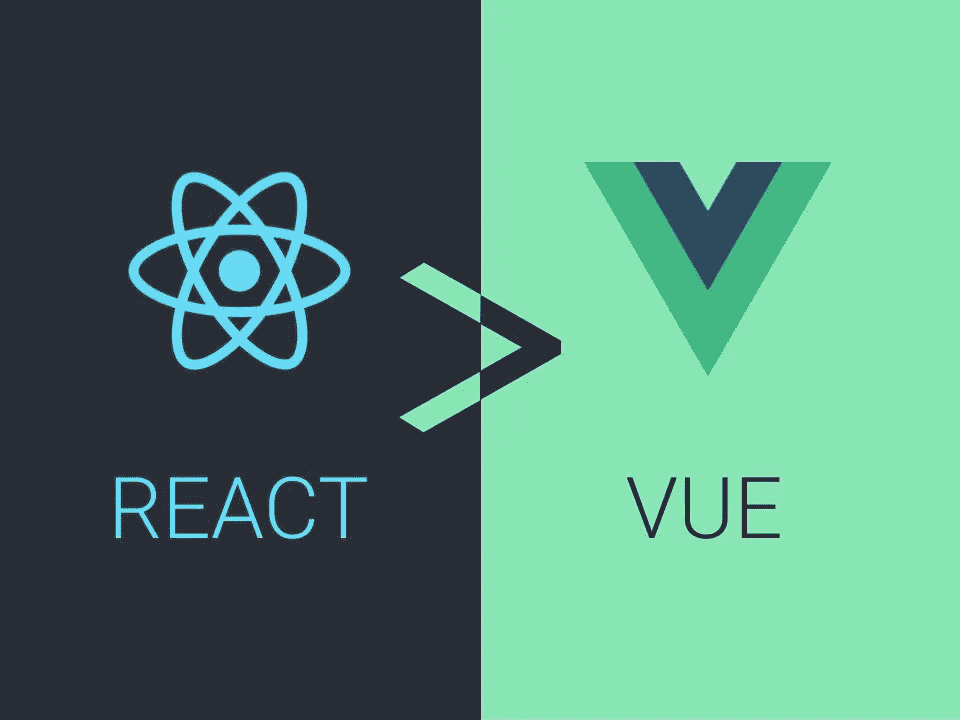

# 为什么我最终选择 React 而不是 Vue.js

> 原文：<https://javascript.plainenglish.io/why-i-finally-chose-react-over-vue-f090cb0e097a?source=collection_archive---------0----------------------->



在过去的十年中，单页面应用程序(SPA)框架已经确立了其作为现代 web 开发标准的地位。React 和 Vue.js 是新项目中最受欢迎的两个 SPA 库，在这场 web 革命中扮演了重要角色。

从远处看，这些库在形式和功能上几乎完全相同；在这两者之间做出选择主要决定了你代码的风格，而不是你产品的质量。然而你只能为你的下一个项目选择一个。你应该选择哪个？

这场激烈的辩论引发了许多充满激情的文章和讨论，但共识似乎逐年远离我们。

在用这两个库构建应用程序几年后，我发现我更喜欢 React。在我陈述我的理由之前，我将讨论一些通常被引用的理由，这些理由并没有真正影响我的决定。

## 并不是因为 React 更受欢迎

React 的粉丝通常会指出其生态系统的规模和成熟度。这是真的:React 有更多的 Github 库和经验丰富的开发人员，与此相关的是，附加组件在质量和数量上都更胜一筹。

这意味着您可以参考更多的堆栈溢出问题、教程和示例，以及更多可以使用的 NPM 软件包。但是我不认为这是选择 React 的令人信服的理由，原因有二。

首先，随着 Vue 的势头飙升，这一差距正在缩小，这一趋势在可预见的未来肯定会继续。

第二，目前的差距本身还不足以排除 Vue，Vue 有足够多的官方和非官方图书馆来保持强大的竞争力。

## Vue.js 更简单——但还不足以产生影响

Vue 粉丝通常会引用易用性和更温和的学习曲线作为他们的理由。虽然更加主观，但这一点通常也没有争议。Vue 的文档是现存的最好的文档之一。它的模板系统比 JSX 更直观，尤其是对初学者来说，视图和模型代码更清晰的分离有助于新的 web 开发人员理解 MVC 设计背后的重要原则。

这个*是*初学者在 React 之前学习 Vue 的一个令人信服的理由。事实上，这是我向两者都没有经验的程序员推荐的顺序。

但是 React 更陡峭的学习曲线不应该阻止更有经验的工程师。一旦开发人员在 React 和 Vue 中构建了一个重要的应用程序，学习曲线不会显著影响开发速度或产品质量。

那么，如果两个库如此相似，并且各有利弊，为什么我更喜欢 React 呢？

答案最终在于 JSX，React 的模板系统。Vue 使用嵌入 Javascript 的 XML，而 JSX 是真正的 Javascript，只是格式像 XML。

因此，React 完全是 JavaScript 这有两个重要的好处。

# 1.与 TypeScript 更好的兼容性

为了理解 Typescript 兼容性的价值，我们首先需要回顾一下拥有类型系统的好处。

首先，它使代码更具可读性。这不仅有利于你的队友，也有利于未来你扩展应用程序。

第二，类型系统帮助你设计更健壮的抽象。如果没有一个，随着模块数量的增加，管理许多不同的模块会变得异常困难。静态定义类型所损失的时间可以很容易地重新获得，并且不再需要记忆或手动引用类型。

TypeScript 的最后一个好处是它有助于快速捕捉细微的错误。考虑以下等式比较:

```
const num = 5;
const str = "5";
if (num === str) {
  // do something
}
```

这段代码的简单性立刻暴露了我们的错误:使用严格的等式来比较一个数字和一个字符串。但是我们可以想象，在一个没有类型的更大的系统中，我们可能会完全忽略这个错误。如果我们给我们的变量类型，IDE 将立即突出错误，潜在地节省几分钟甚至几小时的挫折。

所有这些好处意味着更快的开发和更少的错误，随着应用程序复杂性的增加，改进的回报也会增加。

## JSX =更多类型

但是打字稿和 JSX 有什么关系呢？对 Javascript 更真实的库对 TypeScript 也更真实。JSX 元素的每个部分都可以(也应该)被类型化:组件、道具、子元素等等。

使用 Typescript 的一个重要原则是我所说的全有或全无原则。对一些文件使用 Typescript，对另一些文件使用普通 JS 会助长懒惰。同样，为一些变量设置类型，但对另一些变量使用`any`,这违背了拥有类型的初衷。

因此，要使一个库与 Typescript 很好地集成，它的所有特性都必须易于键入。多亏了 JSX，React 轻松满足了这个标准。

事实上，在 Vue 中也可以输入许多这样的元素，但是需要的工作量通常更大，文档和堆栈溢出问题更少。

然而，如果你执意同时使用 Vue 和 Typescript，所有的希望都不会落空。最近，Vue 团队已经优先改善库的类型脚本体验——毕竟，Vue 3 是用它编写的。

但是除了采用 JSX(可能性极小)，Vue 无法与 React 的类型脚本兼容性相媲美。

## React 更大的生态系统确实有所不同

React 与 TypeScript 配合得更好还有一个重要原因，这要归功于更大的生态系统。因为 TypeScript 更容易与 JSX 一起使用，更多的 React 项目比 Vue 项目依赖它；反过来，React 库和插件更有可能支持 TypeScript。

最终，这意味着我们更多的文件可以以。ts 而不是。js，全有或全无原则的胜利。

如果您对在下一个 SPA 项目中使用 TypeScript 不感兴趣怎么办？如果不是因为 JSX 的第二个重要好处，我可能会推荐 Vue，因为它易于使用，原型制作能力更快。

但我也要警告你，对于任何比四函数计算器更复杂的应用程序来说，绕开类型系统都是错误的，尤其是如果你打算以后扩展应用程序的话。

# 2.更实用的范例

让我们简单回顾一下功能性代码的含义，以及为什么我们通常更喜欢功能性代码而不是过程性代码。

在数学和计算机科学中，函数是消耗一些输入并返回一些输出的运算。最好的函数是**纯**和**确定性**。

纯函数没有副作用；它们忽略状态，只关心函数的输入。

给定相同的输入，确定性函数总是返回相同的输出。

出于各种原因，尽可能编写确定性的纯函数可以提高代码质量。这些函数更容易测试，更容易思考，并且提高了代码的可读性。

考虑功能代码和过程代码之间的简单对比:

```
const arr = [4, 5, 6];// Procedural
for (let i of arr) {
  i += 1;
}// Functional equivalent
arr = arr.map(i => i + 1);
```

我们去掉了两行代码，但更重要的是，第二个代码片段更简洁，更容易阅读:*我们将* `*arr*` *设置为同一个数组，由一个函数映射，该函数返回它的输入加上一个*。

如果你想了解更多关于函数式 JavaScript 的好处或操作方法，请查看本文。

为什么 JSX 鼓励更多的函数式代码？由于 JSX 是 JavaScript，我们可以将 JSX 元素视为一级变量。我们可以通过呈现元素列表来轻松演示这一点:

```
const arr = [4, 5, 6];const renderFunction = (n) => {
  return <SomeComponent someProp={n} />
}return (
  <>
    { arr.map(renderFunction) }  
  </>
)
```

但是在 Vue 中，使用`v-for`可以说更加简单:

```
<template>
  <SomeComponent v-for="n in arr" :someProp="n" />
</template>
...
{
  data() {
    return {
      arr: [4, 5, 6]
    }
  }
}
```

但是如果我们想传入的不是`n`，而是*对* `n`的某种操作的结果，作为某个组件的道具，比如将其格式化为货币，该怎么办呢？

在 React 中，调整是最小的:

```
const arr = [4, 5, 6];const renderFunction = (n) => {
  const formattedText = `$${n.toFixed(2)}`;
  return <SomeComponent someProp={formattedText} />
}return (
  <>
    { arr.map(renderFunction) }  
  </>
)
```

如您所见，我们将格式化逻辑包含在`renderFunction`中，确保关注点的分离。但是在 Vue 中，我们必须为整个组件定义一个方法:

```
<template>
  <SomeComponent v-for="n in arr" :someProp="n" />
</template>
...
{
  data() {
    return {
      arr: [4, 5, 6]
    }
  },
  methods: {
    formatAsMoney(n) {
      return `$${n.toFixed(2)}`
    }
  }
}
```

(是的，在这两个例子中，您可以在模板中编写格式化逻辑，但是要考虑一个复杂得多的操作)。

这种差异可能看起来微不足道，但 Vue 的组织有两个明显的缺点。首先，它将组件一部分的代码分散到整个文件中。第二，仅仅通过查看`formatAsMoney`方法并不清楚该方法在哪里被使用，或者如果它被更改或删除会发生什么。

React 和 Vue 的另一个重要区别是，子组件如何将数据传递给父母。在 reaction 中，父组件将一个函数传递给子组件调用的子组件；这种模式需要对函数式 JavaScript 有深入的理解，但比 Vue 的`emit`模式要强大和灵活得多。同时，由于 React 的功能模式更接近于 Javascript，因此它还提供了卓越的 TypeScript 兼容性。

# 这对你来说意味着什么？

决定使用哪种技术并不是一个普遍的客观问题，因为软件工程并不是一门有简单答案的硬科学。

在选择 SPA 框架时，您应该考虑各种因素。这里提出的想法应该有助于你的决定，以及任何其他原因，你可能有赞成或反对或 Vue 或反应；这些可能与您的编程风格、您的团队对库的舒适度或者对特定附加库的需求有关。

最后，我想提几点建议:不要在没有充分了解自己的选择之前就做出重大科技决策。在开始一个大型网络客户端之前，不要因为你一直在使用 Vue 就选择 Vue(这个错误我已经犯过很多次了)。花点时间精通 reaction，了解它的优缺点。那些一直使用“反应”的人也是如此。

无论你选择什么，你的选择都不应该决定你的最终产品的质量，它当然也不应该决定你的代码的质量。

作为一个团队，理清你的需求，讨论你的选择的利弊，达成一个让你的团队尽可能满意的协议。

如果之后你仍然无法自拔，那就选择“做出反应”吧。

*更多内容参见*[T4](http://plainenglish.io/)