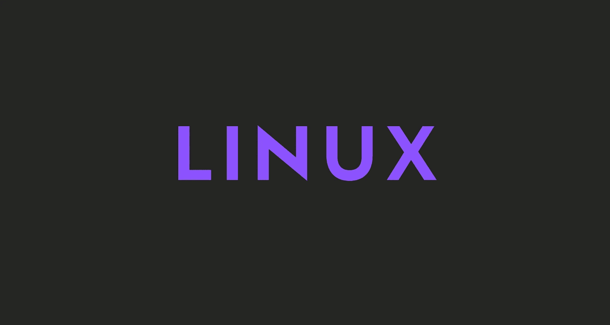

# 为什么我转到 Linux，为什么你也应该转到 Linux

> 原文：<https://javascript.plainenglish.io/why-i-switched-to-linux-and-why-you-should-too-d124ad791273?source=collection_archive---------15----------------------->

切换到 Linux 是我做过的最好的决定之一。

在这个故事中，我将谈谈为什么我转到 Linux，为什么你也应该这样做。

开始吧！

# 什么是 Linux？

> Linux 是一系列基于 Linux 内核的开源类 Unix 操作系统，Linux 内核是由 Linus Torvalds 于 1991 年 9 月 17 日首次发布的操作系统内核。Linux 通常打包在 Linux 发行版中。
> 
> -维基百科

基本上，就像 Windows 和 macOS 一样，Linux 是一个操作系统。

事实上，这个星球上最受欢迎的平台之一，Android，是由 Linux 操作系统驱动的。

## Linux 发行版

Linux 不像 Windows 或 Mac OS X。

例如，微软在内部将 Windows 的所有部分结合起来，生产 Windows 的每一个新版本，并作为一个单独的包分发。如果你想要 Windows，你需要选择微软提供的一个版本。

Linux 的工作方式不同。Linux 操作系统不是由一个单一的组织生产的。不同的组织和人员处理不同的部分。有 Linux 内核(操作系统的核心)、GNU shell 实用程序(终端界面和您使用的许多命令)、X 服务器(生成图形桌面)、桌面环境(运行在 X 服务器上以提供图形桌面)等等。

## 为什么这么多分布？

因为它们都有不同的利弊！例如，如果你想感受一下 Linux，但又不想太过技术化，你可以选择 [**Ubuntu**](https://ubuntu.com/) 或基于 Ubuntu 的发行版，如 [**Pop！_ OS**。](https://pop.system76.com/)

或者，如果你想真正技术化，想控制你系统中的每个小软件包，你可以使用 [**Arch**](https://archlinux.org/) 或任何基于 Arch 的发行版，如 [**哥鲁达**](https://garudalinux.org/) 。

当然还有更多发行版，但我不会在这里一一解释，因为这要花很长时间。

## 我使用的是什么发行版？

现在，我用 Pop！_OS。主要是因为我想习惯 Linux，只是想要一个快速简单的解决方案。

砰！_OS 基于 Ubuntu。它实际上是 Ubuntu，但有一些额外的功能和较少的性能问题。

# 我为什么从 Windows 转到 Linux？

因为很酷。开玩笑的。

我转向 Linux 主要是因为定制和性能。

大多数 Linux 发行版都是高度可定制的。如果你知道怎么做，你可以改变你看到的一切。

此外，Linux 非常小，性能也很好，这意味着你可以在你奶奶的笔记本电脑上运行它，没有任何问题。

我的系统是高端的，但还是。Linux 的表现比 Windows 好得多，有时我在游戏中的表现甚至更好。

# 应该转 Linux 吗？

绝对的。

看，你不必完全切换到 Linux。您可以在虚拟机上运行它，或者通过双引导来尝试它。我只是全力以赴，移除了我的旧操作系统。，但你当然不必像我这样做。

在我看来，每个人都应该至少尝试过一次 Linux。相信我，切换到 Linux 非常快速和简单。这甚至比切换到 Windows 或 Mac 更容易。

前几天我在 2 小时内切换了 3 个发行版，没有丢失任何数据。疯狂吧？

# 在 Linux 上编程

这是 Linux 最棒的地方。

在 Linux 上编程太棒了。您可以使用几个命令安装您需要的任何工具。比如我不到一分钟就安装了 Elixir 和 Erlang。

在 Windows 上，同样的过程需要 10 多分钟。

您还可以使用终端在许多不同的文件之间快速导航。

一般来说，当出于技术原因使用 Linux 时，你会发现自己花了很多时间使用终端。就应该是这样。

# Linux 上的游戏

信不信由你，但在 Linux 上玩游戏确实不错。当然比不上 Windows，但是一天比一天好。

我个人成功运行了我玩的 90%的游戏，一点问题都没有。

Linux 游戏是 Linux 社区中的一个重要话题，正如我所说，它每天都在变得更好。

我真的认为 Linux 上的游戏很快就会变得和 Windows 一样好。

# Linux 的优点

现在让我们来看看使用 Linux 的好处的实际列表。优点列表挺长的，我觉得挺好的，哈哈。

## 1.开放源码

因为它是开源的，所以它的源代码很容易获得。任何有编程知识的人都可以定制操作系统。人们可以出于任何目的贡献、修改、分发和增强代码。

## 2.安全性

Linux 的安全特性是它成为开发人员最佳选择的主要原因。它不是完全安全的，但比其他的更不容易受到攻击。每个应用程序需要由管理员用户授权。在管理员提供访问密码之前，病毒不会被执行。Linux 系统不需要任何反病毒程序。

## 3.自由的

当然，Linux 系统最大的优点是它可以免费使用。我们可以很容易地下载它，而且没有必要为它购买许可证。它是在 GNU GPL(通用公共许可证)下发布的。相比之下，我们必须为其他操作系统的许可支付巨额费用。

## 4.轻量级选手

Linux 是轻量级的。运行 Linux 的要求比其他操作系统要少很多。在 Linux 中，内存占用和磁盘空间也较低。一般来说，大多数 Linux 发行版只需要 128MB 的内存，磁盘空间也差不多。

## 5.稳定性

Linux 比其他操作系统更稳定。Linux 不需要重启系统来保持性能水平。它很少挂机或变慢。它有很长的运行时间。

## 6.表演

Linux 系统在不同的网络上提供高性能。它能够同时处理大量用户。

## 7.灵活性

Linux 操作系统非常灵活。它也可以用于桌面应用程序、嵌入式系统和服务器应用程序。它还为特定计算机提供了各种限制选项。我们只能为系统安装必要的组件。

## 8.软件更新

在 Linux 中，软件更新由用户控制。我们可以选择所需的更新。有大量的系统更新可用。这些更新比其他操作系统快得多。因此，系统更新可以轻松安装，不会遇到任何问题。

## 9.发行版

市场上有许多可用的 Linux 发行版。它为用户提供了各种选项和 Linux 风格。我们可以根据需要选择任何发行版。一些流行的发行版有 **Ubuntu，Fedora，Debian，Linux Mint，Arch Linux，**等等。

对于初学者来说，Ubuntu 和 Linux Mint 会很有用，对于熟练的程序员来说，Debian 和 Fedora 会是不错的选择。

## 10.Live CD/USB

几乎所有的 Linux 发行版都有**Live CD/USB**选项。它允许我们不用安装就可以尝试或运行 Linux 操作系统。

## 11.图形用户界面

Linux 是一个基于命令行的操作系统，但是它提供了一个像 [Windows](https://www.javatpoint.com/windows) 一样的交互式用户界面。

## 12.适合程序员

它支持几乎所有最常用的编程语言，如 C/C++、Java、Python、Ruby 等等。此外，它为开发提供了大量有用的应用程序。

比起 Windows 命令行，程序员更喜欢 Linux 终端。Linux 系统上的包管理器帮助程序员理解事情是如何完成的。Bash 脚本也是程序员的一个功能特性。它还支持 SSH，这有助于快速管理服务器。

## 13.社区支持

Linux 提供了大量的社区支持。我们可以从各种渠道找到支持。网上有许多论坛可以帮助用户。此外，来自各种开源社区的开发人员随时准备帮助我们。

## 14.隐私

Linux 总是保护用户隐私，因为它从不从用户那里获取私人数据。相比之下，其他操作系统要求用户的私人数据。

## 15.建立工作关系网

Linux 为网络提供了强大的支持。客户机-服务器系统可以很容易地设置为 Linux 系统。它提供了各种命令行工具，如 ssh、ip、mail、telnet 等，用于与其他系统和服务器的连接。网络备份等任务要比其他快得多。

## 16.和睦相处

Linux 兼容大量的文件格式，因为它支持几乎所有的文件格式。

## 17.装置

Linux 安装过程比其他操作系统(如 Windows)花费的时间少。此外，它的安装过程更容易，因为它需要更少的用户输入。它不需要太多的系统配置，即使它可以很容易地安装在配置较少的旧机器上。

## 18.多桌面支持

Linux 系统为其增强使用提供了多种桌面环境支持。安装期间可以选择桌面环境选项。我们可以选择任何桌面环境，如 **GNOME (GNU 网络对象模型环境)**或 **KDE (K 桌面环境)**，因为两者都有其特定的环境。

## 19.多任务处理

它是一个多任务操作系统，因为它可以同时运行多个任务，而不会影响系统速度。

## 20.针对初学者的大量文档

有许多命令行选项提供了关于命令、库、标准的文档，例如手册页和信息页。此外，互联网上有大量不同格式的文档，比如 Linux 教程、Linux 文档项目、Serverfault 等等。为了帮助初学者，有几个社区可用，如 **Ask Ubuntu** ，Reddit，和 **StackOverflow。**

# Linux 的缺点

现在让我们来看看使用 Linux 的一系列缺点。与优点列表相比，缺点列表很短，优点列表也很好。

## 1.游戏仍不完美

Linux 上的游戏是一个有趣的话题。但是还没准备好。

## 2.硬件支持

Linux 硬件支持相当不错，但并不完美。你的硬件可能会有问题。

## 3.应用程序并不总是完美的

取决于你的发行版，一些应用程序可能会在 Linux 上引起一些麻烦。

# 最后的想法

我试图在不太偏颇的情况下解释 Linux 的利弊。我希望这个故事对你有所帮助，你今天学到了一些新东西。

如果你决定转用 Linux，请告诉我！

## 仅此而已。感谢您阅读这个故事！

如果你喜欢这个故事，一定要让我们在评论中知道，并随时问我你想问的任何问题。

在 Twitter 上关注我:

 [## re _ ally 边缘

twitter.com](https://twitter.com/Re_allyedge) 

在 Patreon 上支持我:

 [## 阿里木阿尔斯兰卡亚是创造编程故事和教程。帕特里翁

### 今天就成为阿里木阿尔斯兰卡亚的赞助人:在世界上最大的…

www.patreon.com](https://www.patreon.com/allyedge) 

*更多内容请看*[***plain English . io***](http://plainenglish.io/)