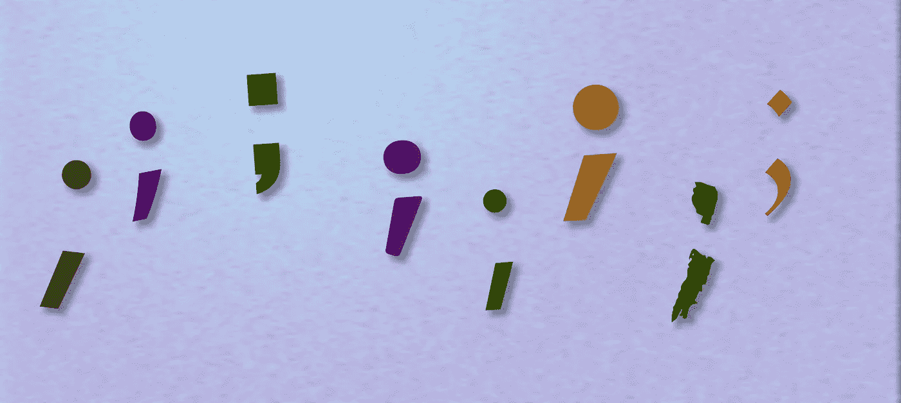

# 为什么我在 JavaScript 中使用分号来结束我的行

> 原文：<https://javascript.plainenglish.io/why-i-use-semicolons-to-terminate-my-lines-in-javascript-4d8735cd0e59?source=collection_archive---------10----------------------->

JavaScript 不要求开发人员使用分号来结束他们的行，但是您可能想要使用它们。



Photo Illustration by David Fekke

*最初发布于*[*https://fek . io*](https://fek.io/blog/why-i-use-semicolons-to-terminate-my-lines-in-java-script/)*。*

在许多基于 C 的语言中，如 C#、Java 和 C++，需要分号来结束一行。

```
// C# Example
String foo = "Hello World!";
```

JavaScript 不要求开发人员使用分号来结束他们的代码行。这让开发人员可以选择是否要使用分号。

如果行尾没有分号，JavaScript 解释器/编译器会自动在行尾添加一个分号。这被称为自动分号插入或 ASI。

因为这个特性，我遇到过很多不使用分号的 JavaScript 开发人员。出于几个不同的原因，我总是尝试在我的行尾使用分号。

# 丑八怪和变性人

Transpilers 是一种编译器，它采用 JavaScript 或另一种语言，如 TypeScript 或 JSX，并将其重新编译成普通的 JavaScript。大多数像 Babel 这样的 transpilers 在将代码转换成运行时不会出错的代码方面做得非常好。

Uglifiers 是另一种类型的 transpiler，它重命名变量并混淆 JavaScript，使得读取源代码变得困难。他们中的一些人会重写 JavaScript，这样所有的内容都在一行中。在这些类型的工具中，我发现新输出的代码不能正确运行。

如果您使用的是好的工具，这可能永远不会是一个问题。

# 声明变量

JavaScript 允许在同一行声明多个变量，但是这些变量必须用逗号隔开。

这将成为以下与 ASI

# 需要注意的代码

在您的 JavaScript 代码中有许多不同的情况，在您不希望分号被推断的地方，可能会推断出分号。这方面的一个例子可能是在函数中返回一个对象。

ASI 将导致这个函数不返回任何东西，因为开始的花括号在`return`下面的一行。ASI 会让它看起来像下面这样；

这可以通过将花括号移动到与关键字`return`相同的行来纠正。

# 关键词

JavaScript 中有一些关键字是命令。您需要在这些命令后面添加一个分号。

```
continue;break;debugger;
```

# 对象和箭头功能

函数和代码块不需要分号，但是如果你设置一个变量到一个对象或箭头函数，从风格上看，用分号结束这些行更好。

# 棉短绒

JavaScript 开发人员使用像“JSLint”或“ESLint”这样的 linters 是非常常见的。这些 linters 允许 JavaScript 开发人员设置关于如何编写代码的规则，并且如果他们的代码没有按照他们想要的方式格式化，可以警告开发人员。

```
// ESLint{"semi-style": ["error", "always"],}
```

前面的规则将迫使开发人员以分号结束每一行。

# **结论**

JavaScript 中不需要分号，但是从风格上来说，使用分号可能更好。如果您将其他语言与 JavaScript 结合使用，如 C#或 Go，那么继续使用分号可能会更好，因为它减少了在这些语言之间来回切换的上下文变化。

*更多内容尽在*[plain English . io](http://plainenglish.io/)