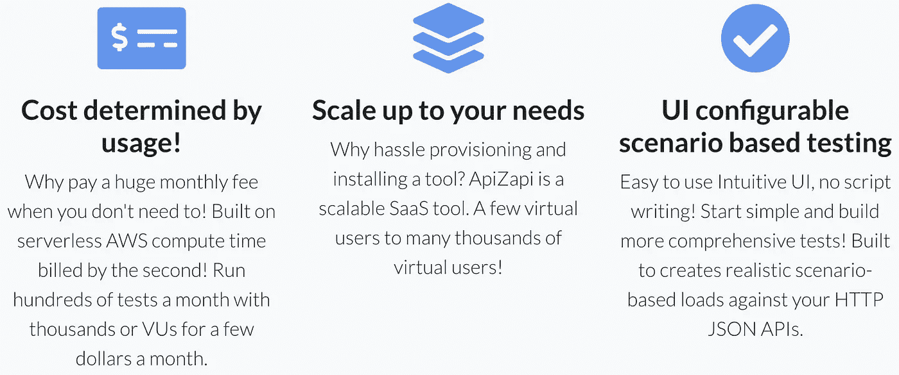

# 为什么我要编写一个新的工具来测试 HTTP APIs 负载

> 原文：<https://javascript.plainenglish.io/why-i-wrote-a-new-tool-for-load-testing-http-apis-d59c1f0d98f9?source=collection_archive---------21----------------------->

ApiZapi，一个新的 HTTP API 负载测试 SaaS 应用程序。

Screenshot from apizapi.com

# 概观

在本文中，我将解释我创建一个新的负载测试工具的动机，以及 [ApiZapi](https://www.apizapi.com) 如何提供一些不同的东西。我将深入研究我认为必要的关键需求，以满足我的负载测试需求，并希望满足其他人的需求。其他文章涵盖了 ApiZapi 工具的用法(参见这篇[中型文章](/load-testing-http-apis-with-apizapi-3e2ac01ea5c8))以及进行 HTTP API 负载测试时的注意事项。

*请注意:这并不是试图指出其他工具的不足或进行任何类型的比较，而是描述我在寻找什么，以及我是如何坐下来从头开始构建满足我需求的东西的。当然，有许多优秀的负载测试工具将继续满足需求。*

# 动机

在我作为软件开发人员的职业生涯中，我需要多次进行负载测试。我采取了各种手段来实现这一目标。这里有一些这样的经历。

*   我为需要测试的特定 API 编写了低级代码。我是一个熟练的开发人员，知道我在做什么，所以它工作得很好。在这种情况下，测试在很低的水平上证明系统是非常有效的。
*   我编写了一个测试工具，插入到 Visual Studio 中，并基于 NUnit 概念来添加负载测试功能。这受到了我在 Microsoft Visual Studio 的. Net 应用程序中所能做的事情的限制。
*   我使用 [Apache Bench](https://httpd.apache.org/docs/2.4/programs/ab.html) 对移动应用程序将使用的 HTTP APIs 进行负载测试。该 API 会出现极高的负载，每天高达数千万次调用。
*   我创建了一个托管在 AWS 中的全栈 MERN 应用程序，并尝试了各种负载测试工具。一些人录下了浏览器网站的互动，并进行回放。其他工具执行较低级别的 HTTP 协议调用。一些有直观简单的用户界面，而另一些有使用 SDK 的完整编码能力。有些需要自托管，很难设置和维护。

除了我自己的经历之外，我还从许多公司那里听说了他们在实现负载测试方面的努力。在过去的几年里，我为私募股权公司做了大量的技术尽职调查工作，涉及他们的并购活动。收购公司或私募股权公司经常想知道目标公司是否有可扩展的架构和托管解决方案。投资资金将使目标公司的客户群增长三到五倍。PE 公司自然想知道平台是否能跟上额外的客户负载。

对于我的技术勤奋工作，我总是不得不依靠我作为软件架构师的技能来评估可伸缩性和性能方面。这是因为我调查的公司几乎总是声称他们从未运行过负载测试。他们知道有必要运行负载测试，但是从来没有发现任何工具可以让他们快速到位来满足他们的需求。有趣的是，在过去的 20 年中，单元测试的采用有了很大的增长，然而，负载测试的采用仍然很低。

# 关键要求

我列出了下面的列表来描述我希望在我创建的负载测试工具中看到的内容。

*   证明 API 的基本使用场景功能，并通过其自动伸缩性、健壮性和可用性加快发现崩溃、挂起或其他基础架构问题。实现所有必要的功能来验证 HTTP 端点，以确定性能和伸缩限制。
*   使我的工具成为 SaaS 产品，能够在几分钟内注册并运行。让取消和离开变得容易。
*   让所有负载测试都在 AWS Lambda 函数中运行，这样在不使用时就不会浪费计算时间。
*   按使用量收费，没有任何月订阅费。传递运行无服务器的成本节约。
*   具有独特的用户界面驱动的编辑，具有丰富的基于场景的测试功能。
*   不要求一个人拥有使用工具的编码技能，但是要让测试人员或产品所有者能够使用它。没有脚本，文件配置或编码的必要。
*   确保该工具不会被试图进行 DDoS 攻击的黑客恶意使用。
*   作为一个扩展目标，提出 UI 的一个独立部分，它将自动化 OAuth2 授权代码授权类型 UI 交互。

我的希望是让负载测试成为一种更常见的 SDLC 实践，并消除启动和运行的任何障碍。支持将测试工具集成到 CI/CD 管道中，以便持续使用。

# 阿皮扎皮的现代建筑

ApiZapi 的架构全部托管在 AWS 中，并利用 JavaScript Fullstack 架构——React、Node.js/Express, MongoDB 作为分层架构的核心部分，Lambdas 作为实际负载测试运行的执行引擎。作为集成的一部分，它使用 Stripe 进行支付集成，使用 Zoho 进行电子邮件发送。从 AWS 来看，可以使用 Elastic Beanstalk、Lambda、Route 53、Event Bridge、SES、SQS、DynamoDB、ALB、EC2s 作为前向代理、S3、CodeBuild 和 VPC 安全，在 AZs 中具有高可用性。我的 DevOps APM 使用 AWS CloudWatch、NewRelic 和 Opsgenie。我们也花了很多心思让它变得安全，但这是另一个话题了。

# 结论

应用程序现在已经完全启动并在 AWS 中运行。您可能会觉得有趣的一件事是，我实际上使用 ApiZapi 来测试 ApiZapi！为什么不呢？作为一个平台，ApiZapi 有一个 api 并且需要扩展，所以看看我的扩展会有什么问题是非常有启发性的。

查看 ApiZapi 网站，如果你有兴趣给我关于未来特性的建议，请发邮件给 support@apizapi.com。请阅读我的其他[文章](/load-testing-http-apis-with-apizapi-3e2ac01ea5c8)以获得关于 ApiZapi 到底是什么的简要概述，或者如果你有更多的时间并且想要更深入地了解该工具，请访问[用户文档](https://www.apizapi.com/#/userdoc)。

我有很多想法可以更进一步，在我已经建立的基础上进行改进。例如，我曾几次尝试提出一个很好的解决方案来认证使用 OAuth2 机制的后端 API，并在代码中排除了这一点，因为它还不太正确。我想我终于找到了正确的方法，并会把它融入进去。

*更多内容请看*[***plain English . io***](http://plainenglish.io/)