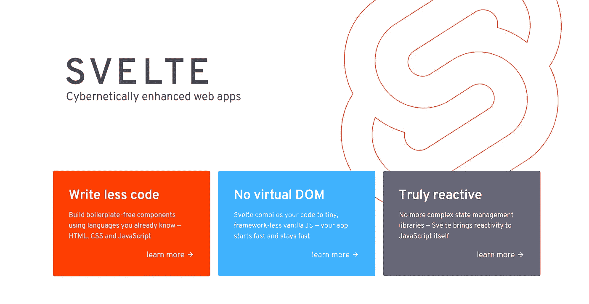
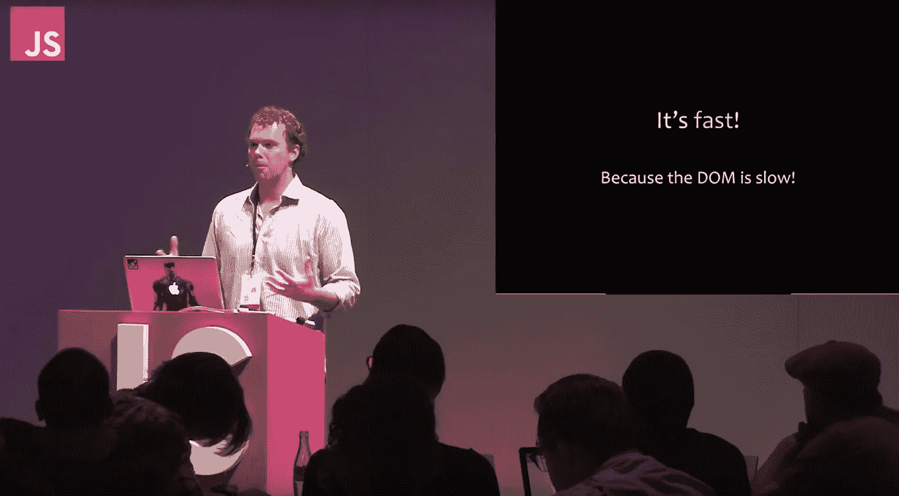

# 为什么我对学习苗条感兴趣

> 原文：<https://javascript.plainenglish.io/why-im-interested-in-learning-svelte-a149e65e279c?source=collection_archive---------12----------------------->

在 JavaScript 开发社区中，苗条已经成为一个热门话题。通常，当一个框架或库像 Svelte 一样被谈论时，我会有学习它的想法，并且很好奇想知道*为什么*人们如此关注它。



Svelte Homepage Screenshot

# 苗条身材最让我感兴趣的 4 件事

苗条似乎有很多不同的好处，但当阅读他们的营销页面和开发文档时，这里有 3 个最突出的好处。请记住，我是在将它与大型 JavaScript 框架/库进行比较，看看是什么让它与众不同，值得新项目去探索！

# 1.Svelte 是建立在 HTML 之上的

在一个框架中，我一直关注的一件事是，在屏幕上设置和开始使用你的第一个“Hello World”是多么容易。根据他们的网站，你只需要包括一个脚本标签，在那里你写你的 JavaScript，然后用花括号语法，调用你的变量或函数。

```
// App.svelte file
<script>
 let name = 'world';
</script><h1>Hello {name}!</h1>
```

需要注意几件事:组件/页面文件中没有任何返回/呈现语句；相反，在太空中只有一个 H1 标签！不能说我是一个球迷，但真的很高兴能重新站起来，去。所以在看到这个之后，我在想，你到底要怎么为一个按钮点击写一个函数呢？他们在主页上的示例代码直接跳到了这一点，请看下面。

```
<script>
// declaring a variable
let count = 0;// declaring your function
function handleClick() {
  count += 1;
 }
</script>// Calling your button and setting the onClick behavior similar to // Vue.js just no "v-" in front of it
<button on:click={handleClick}>
 Clicked {count} {count === 1 ? 'time' : 'times'}
</button>
```

大多数人可能会说构建在 HTML 之上的任何东西都是非常初级的，不被认为是编程，但是人们也必须理解 HTML 是处理 web，尤其是 JavaScript 的基础！HTML 是必须知道的，并且与所有的编程语言相比非常简单，所以在我看来，在它的基础上构建是一个成功！

# 2.没有虚拟 DOM 的反应？

关于 Svelte 的第二个最有趣的事情是，它声明它是*反应式的*，这意味着当 DOM 加载后发生变化时，它将更新而无需重新呈现整个页面。这就是 React 名字的由来，但是 React 创建了这个叫做虚拟 DOM 的东西，它只是实际 DOM 的一个副本，并且能够按照开发者的意愿对其进行更新。点击阅读更多关于那个[的内容。](https://reactjs.org/docs/faq-internals.html)

如果 Svelte 声称它是反应性的，但是没有虚拟 DOM，他们究竟在哪里做出改变呢？？他们声称常规 DOM 足够快，无需重新加载页面就能处理更改，这就是他们所利用的。对我来说听起来像魔术，但那只是因为我还没有完全理解它，但肯定很有趣。在这篇文章中，他们提供了关于虚拟 DOM 与常规 DOM 比较的所有细节。



Screenshot from [Rethinking Best Practices](https://www.youtube.com/watch?v=x7cQ3mrcKaY) at JSConfEU 2013

# 3.奇怪的语法

不过我很好奇的一件事是 HTML 中大量 JavaScript 的语法。很多看起来应该是注释代码，但是在花括号内的 HTML 中有奇怪的字符，所以我知道这肯定需要一些时间来适应。我们所有的 JavaScript 函数都有磅符号，或者对我们千禧一代来说是“标签”。但它像的是 JSX。在我看来，JSX 应该成为新的 HTML，但这是另一天的另一个讨论。

```
/* You can see the hashtag sign to open the forEach method here but you end it like you would a normal html tag except instead of carats you use curly brackets */
<ul>
   {#each items as item}
      <li>{item.name} x {item.qty}</li>
   {/each}
</ul>
```

Svelte 的 HTML 语法类似于 JSX，只是事实上你可以在 HTML 中编写 JavaScript，你需要花括号来跳转到一些 JavaScript。我喜欢 JSX 而不是这种语法的原因是，你可以在 HTML 中编写普通的 JavaScript，但是使用 Svelte，你必须学习一种新的编写方式。一旦我开始真正使用它，这应该会很有趣。

# 4.可访问性是内置的？

关于 Svelte，我最感兴趣的最后一点是可访问性，或者说“a11y”警告是内置的。回到把 HTML 变得更好的话题上来，无论如何都要在 HTML 中直接内置可访问性错误/警告。无论如何，这些可访问性检查都是在运行时完成的，这很好，但是在编写代码时，您可能仍然需要为这些检查安装额外的工具或 linters。这里有一些有希望的东西，我希望随着时间的推移，他们继续在此基础上发展。

# 最后

还有很多让我感兴趣的东西，但这些是最突出的，我可能要在我完全了解所有这些之后再更新。但是第一眼看上去，它确实引起了我的注意，原因有很多，特别是 4 个，而且可能会越来越多。

不过值得一提的是 [SvelteKit](https://kit.svelte.dev/) ，我肯定会深入其中，因为它提供了类似 Next.js 的服务器端渲染体验，我仍在等待 React 和 Vue.js 来完成。但是，我在耐心等待。SvelteKit 仍处于早期开发阶段，但如果 Svelte 的势头在发布时继续向前推进，它将吸引更多开发者的注意。

Svelte 建立在 HTML 之上。它没有虚拟 DOM。语法看起来很有趣，并且内置了可访问性警告。如果它的包大小像它承诺的那样小，并且比其他库和框架更快，我们将来可能会有一个构建 MVP 的竞争对手。小心，斯维特来了！

在我使用 Svelte 之后，我肯定会写一篇更新的文章，但是在那之前，如果你有任何关于 Svelte 的经验，或者如果你听到了大肆宣传，有什么让你感兴趣的吗？

*更多内容看*[***plain English . io***](http://plainenglish.io/)