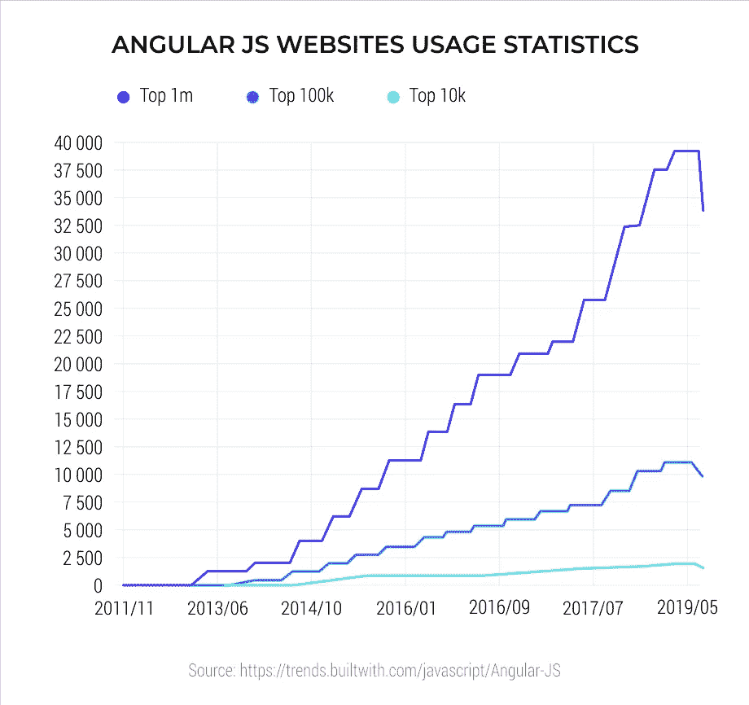

# 为什么 AngularJS 在单页应用(spa)中仍然很受欢迎？

> 原文：<https://javascript.plainenglish.io/why-is-angularjs-so-popular-for-single-page-apps-spas-f71249ff1d67?source=collection_archive---------14----------------------->

## AngularJS 在单页应用开发中受欢迎的原因。

AngularJS So Much Preferred for Single Page App Development

在进入核心话题之前，更明智的做法是了解什么是单页面应用程序。因此，在这种情况下，了解来访者的特征是很重要的。众所周知，现在大多数的访问者甚至不耐烦花几秒钟来加载页面。毫无疑问，有几种方法可以提高网站速度。但是，重点还是放在了单页应用程序的开发上，因为它可以保证提升网站的速度和用户体验。

# **什么是单页面应用？**

因此，问题来了，到底什么是单页应用程序。简单来说，就是指能够通过用户与特定页面元素交互的方式来重新加载特定页面元素的网站或 web apps。在这里，单个页面是通过用户与页面元素的交互过程动态定制的。在这方面，人们可以以在一个页面上可以找到全部内容的那些网站为例。

不用说，这样的网站更加用户友好，无论是导航还是访问。最重要的是，它避免了通过某个服务器加载新页面，最终提高了速度和用户体验。此外，SPAs 在提供用户可以从桌面应用程序中获得的确切体验方面非常重要。

单页应用程序的重要性可以很容易想象，只要看一眼它受人尊敬的用户群，包括 Gmail、Flickr、WhatsApp Web 等知名公司。保持这些应用的重要性，对于现代 [**移动应用开发者**](https://www.rlogical.com/hire-dedicated-developers/hire-mobile-app-developer/) 来说，精通这些开发已经变得至关重要。

# **什么是 AngularJS？**

What is

现在来看 **AngularJS，它是一个基于 JavaScript 的熟练框架。有趣的是，开发者经常称之为超级英雄框架。**从技术上讲，这些是动态应用的结构框架。它使用户能够使用 HTML 作为模板语言，有助于扩展 HTML 的语法，以更清晰和简洁地表达应用程序的组件。它的数据绑定可以在很大程度上减少编码需求。最重要的是，这些事情发生在浏览器本身，从而提供了一整套服务器技术的最佳伴侣。

它有许多对开发人员非常有用的特性。它为**开发者提供了使用 JavaScript 以特定的 MVC 格式编写客户端应用程序的空间。**此外，用 AngularJS 编写的应用程序可以在不同的浏览器上运行良好。一般来说，AngularJS 是为了开发突出性能优越和维护简单等特点的 web 应用程序。

# **为什么 AngularJS 在单页面应用开发中仍然受欢迎？**

在谈论技术方面之前，值得一提的是，所有排名靠前的网站，从 YouTube、谷歌到雅虎，都是使用 **AngularJS 开发的。YouTube 有 342 亿访客，谷歌翻译有 7.755 亿用户，雅虎新闻有 8.697 亿访客。美国有 76，406 个网站使用 AngularJS 开发，俄罗斯有 28，979 个，英国有 11，414 个，印度有 10，581 个**。所有这些大数字都在大声谈论 AngularJS 的重要性。

image source: Google

现在来谈谈通过 AngularJS 开发单页应用的重要性，值得注意的是，spa 已经成为 web 和智能手机应用不可或缺的一部分。这里用户不需要从一个页面跳到另一个页面。更确切地说，他们只要坚持在同一页上，就能得到这一切。

开发人员社区非常热情，他们把较少的精力放在编写代码上，以便通过相关的服务器检索页面。此外，SPA 的顺畅有助于开发商处理初创公司的各种需求。

AngularJS 能为水疗中心提供完美的发展陪伴。AngularJS 的各种特性让事情变得更加有趣。以下是一些关键属性。这些特点是现代公司强调雇佣 AngularJS 开发人员的原因。

## **1。相比之下要快得多**

通过 AngularJS 框架开发的 spa 加载速度明显更快。它带有一个组件路由器功能，使其在自动拆分代码时速度高效。这有助于用户在这个上下文中加载请求者代码。

## **2。与其他平台配合良好**

通过 AngularJS 框架，spa 可以适用于所有其他平台。

## **3。为 UI 提供难以置信的支持**

通过 AngularJS 开发 spa 将用户体验提升到一个全新的水平。

## **4。提供平稳的维护**

那些喜欢使用 AngularJS 来发展水疗的人可以放心，将来很容易维护。

## **5。提供更大的灵活性**

彻底控制住角肌，发展水疗的任务就变得容易了。Angular JS 框架仍然可以使用尽可能少的代码来开发动画时间线和其他复杂功能。通过这个过程，开发者设法开发出一个完全直观和用户友好的应用程序，具有难以置信的灵活性。

总之，AngularJS 具备开发水疗应用程序的所有优势。具体来说，上面讨论的特性使它成为目前 SPA 应用程序开发的最佳选择之一。

*更多内容看*[***plain English . io***](http://plainenglish.io/)