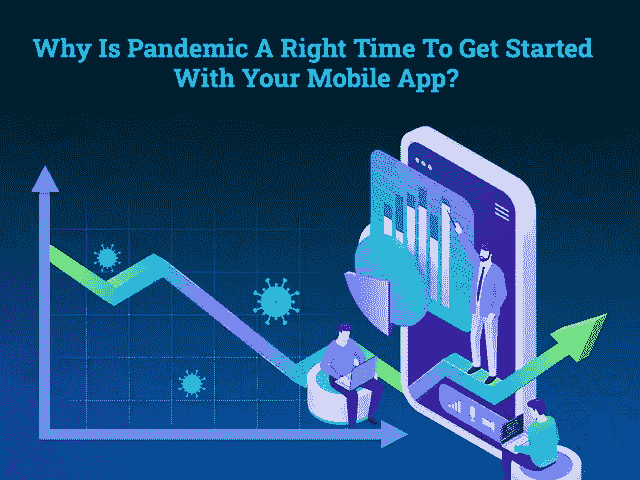
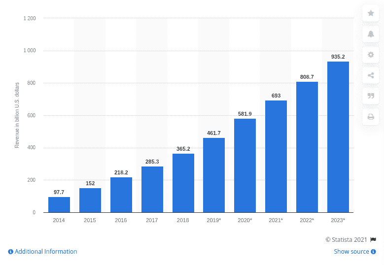
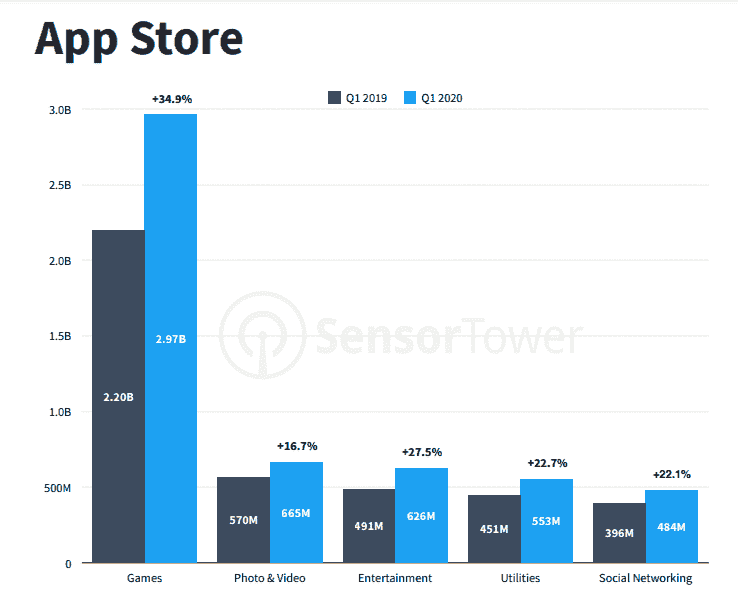
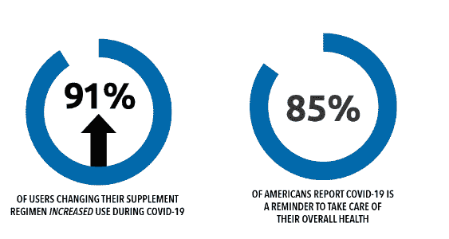
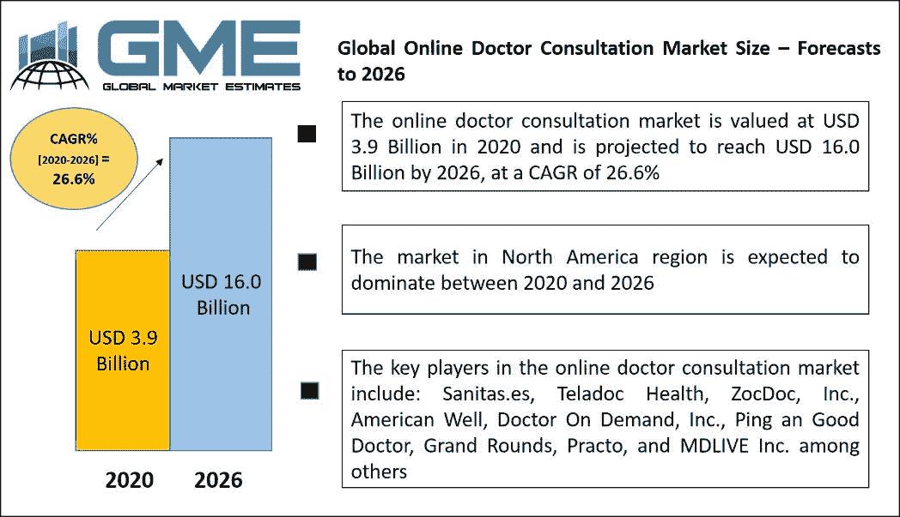
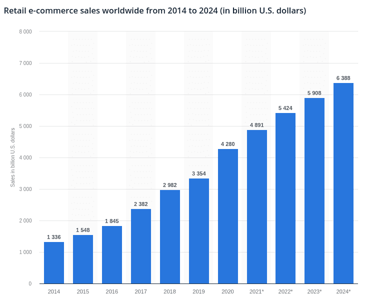

# 为什么疫情是开始使用移动应用的好时机？

> 原文：<https://javascript.plainenglish.io/why-is-the-pandemic-a-good-time-to-get-started-with-your-mobile-app-322f6bfca870?source=collection_archive---------21----------------------->

[Background vector](https://www.freepik.com/vectors/background) created by [upklyak](https://www.freepik.com/upklyak) — [www.freepik.com](https://www.freepik.com/free-vector/vector-landing-page-business-education_16793926.htm#page=1&query=mobile%20development&position=6)

可以说移动应用程序开发行业在新冠肺炎疫情中见证了惊人的崛起吗？

*是的，100%真实！*

毫无疑问，新冠肺炎疫情的严重影响已经引发了一场全球性的大规模危机，并使每个人都因自我隔离、家庭隔离和社会距离而陷入心理压力之中，没有希望恢复正常。

谈到企业界，由于严格的封锁，世界经济正处于厄运之中。

“疫情之年”让一件事情变得非常清楚，移动应用已经成为人们的一种重要需求，而不仅仅是一种在线选择。人们比以往任何时候都更加依赖它们。

最近我在数我手机上可用的应用程序，有 50 个应用程序，30 个应用程序中有 50 个每月都在使用，每天打开 50 次以上。这正是 T2 的一项调查在他们的报告中揭示的。

[据报道](https://www.appannie.com/en/insights/market-data/2020-mobile-recap-how-to-succeed-in-2021/)，应用程序有望在今年年底达到创纪录的 1120 亿美元。随着 2020 年的结束，移动应用开发行业令人瞩目的崛起和激烈的竞争给了企业家们所有新的希望，并让我们反思客户行为的变化。

一方面，冠状病毒的全球传播挑战企业家满足市场的新需求，而另一方面，为创业公司打开了机会之门。

仍然不同意创业公司在新冠肺炎疫情期间蓬勃发展的事实吗？

> **进一步阅读！**

# **在疫情 2020–21 期间，移动应用的使用量意外激增**

2020 年这一年，彻底改变了我们生活的方方面面。企业关闭了一段不可预见的时间，数百万人失去了工作，不得不重新掌握技能，制造业、旅行和旅游业、房地产、时尚、体育、娱乐甚至超本地市场等行业都受到了重大的财政冲击。

虽然所有这些领域都被严重破坏，很少或根本没有希望回到它们的根源，但在这个充满挑战的时代，移动应用作为完美的伴侣脱颖而出。 [**移动应用程序开发公司**](https://www.xicom.biz/services/mobile-app-development/) 的正确选择致力于正确的项目，这使得帮助企业向市场推出完美的解决方案成为可能。在疫情期间，当人们被软禁时，某些移动应用程序成了救命恩人。

从按需购买的杂货应用程序、远程医疗应用程序、医疗保健应用程序、娱乐应用程序，支付应用程序在危机期间飞速发展。这些应用的出现改变了人们与他人交流和互动的方式。这场巨大的数字化变革不仅让我们的生活变得更加便捷，也对移动应用行业产生了巨大影响。

*根据* [*调查报告*](https://www.businessofapps.com/data/app-revenues/) *，2019 年第四季度，app 收入为 224 亿美元，2020 年第四季度为 319 亿美元，同比增长 42%。*

*来自*[*Statista*](https://www.statista.com/statistics/269025/worldwide-mobile-app-revenue-forecast/)*的另一份报告对移动应用的收入做出了预测，预计收入将从去年的 5819 亿美元跃升至 2021 年的 6930 亿美元。*

*更大的图景是，到 2023 年* *移动应用开发产生的收入预计将达到*[*【9352 亿美元】。*](https://www.statista.com/statistics/269025/worldwide-mobile-app-revenue-forecast/)

[Image Source](https://www.statista.com/statistics/269025/worldwide-mobile-app-revenue-forecast/)

显而易见，为什么拥有数字平台的初创公司能够迅速繁荣并获益。如果你错过了这个机会，仍然没有数字存在，那么不要担心，市场为计划开始使用移动应用程序的初创公司或爱好者提供了令人大开眼界的商机和空间。你所需要的就是有正确的应用程序开发想法，然后 [**雇佣一个拥有正确技能和专业知识的应用程序开发人员**](https://www.xicom.biz/solutions/hire-developers/)——你就又回到正轨了！

在这篇博客中，我们将讨论顶尖的移动应用开发理念和商业机会，即使在疫情时期，它们也能帮助你推动业务增长。

在进入创新的创业应用创意和商业机会之前，你需要抽出一些时间来了解什么类型的应用正在主导这个行业并抓住炒作…

## 在疫情创业，什么类型的企业是好的选择？

所以，最终，你鼓足勇气，决定开发一款移动应用，让你的业务重新运转起来。但是，你可以开发什么类型的应用程序，以及你将如何进行开发——是聘请移动应用程序开发人员，还是与内部团队合作？

首先，让我们来谈谈在疫情如此困难的时期，移动应用帮助企业生存下来的最近场景。

*在了解了应用市场的基本情况后，我们发现这是应用下载量最高的几个领域:*

[Image Source](https://go.sensortower.com/rs/351-RWH-315/images/Sensor-Tower-Q1-2020-Data-Digest.pdf?mkt_tok=eyJpIjoiWmpobU5EazNaV1kwTVRJeSIsInQiOiI0YkZPMm12RkMyUGszRTlMZzJ3ejFFd3N5VkVlS1lNWmNcL2VlelJxYUlxOU9jOHdUem1HOEhXS3FrVWVMbVwvbUtmbVBLc1hTbENiUmdHeDY2Rit0OEE2ZjdrT1I0RlZcL0ZCRFQ2bTJcL1RqdTNIaXJibFJwdnRGd3Jud1VDbUhMZGsifQ%3D%3D)

*根据调查报告，2020 年苹果应用商店和 Google Play 商店中最受欢迎的应用类别是:*

*   **游戏应用:** Go 口袋妖怪、脑残、猎人刺客
*   **实用应用:**电子钱包和银行、项目管理应用、云驱动器、文档和表格
*   **娱乐/生活应用:**约会、音乐/视频应用、健身应用等等
*   **社交媒体应用:**脸书、Instagram、抖音、YouTube
*   **消息和聊天应用:** Whatsapp，Facebook Messenger

虽然这些领域已经由巨头引领，但如果你选择与正确的 [**软件开发公司**](https://www.xicom.biz/) 合作，你仍然有机会在这个过度拥挤的市场中为你的品牌创造空间。

但如果你是一家初创公司或企业，一直在寻找全新的商业机会和独特的应用创意，可以帮助你增加优势，那么直接跳到下一部分。

## **封锁后最好的创业想法/商机是什么？**

在疫情时期，什么样的企业注定会成功？希望这是你登陆这个博客时最想问的问题！

在不确定时期，当你知道经济正以陡峭的曲线下滑时，开始一项新业务是勇敢的一步。但是，通过深思熟虑的战略、分析和商业应用程序开发理念，并与外包应用程序开发公司合作，您可以清楚地了解您可以为潜在客户提供的价值。

因此，我们在这里收集了一些最佳商业机会和创业想法，帮助企业主在 2021 年开始他们的旅程:

> **医疗保健移动应用:**

## **1。维生素摄入提醒 App**

维生素摄入提醒应用程序要求你建立一个在 Android 和 iOS 设备上工作的应用程序，让用户在线订购膳食补充剂，并获得折扣。

根据[新冠肺炎关于膳食补充剂的消费者调查](https://www.crnusa.org/COVID19survey)，维生素和矿物质的消费在疫情时期飙升。在整个新冠肺炎疫情，我们都目睹了蓬勃发展的销售数据，空货架和缺货来自膳食补充剂过道。

[Image Source](https://www.crnusa.org/COVID19survey)

[**雇佣一个移动应用程序开发者**](https://www.xicom.biz/offerings/hire-mobile-developers/) 来创建一个简单的平台，提醒人们服用每日剂量的维生素，这不仅可以帮助他们建立一个更好的日常生活，还可以让他们毫无遗漏地遵循一个健康的制度。对于 2021 年的初创公司来说，这可能是最好的移动应用开发想法之一，因为通过考虑膳食补充剂的使用，你还可以抓住与多个医疗保健品牌合作的机会，并提供应用内订购设施。

***维生素摄入提醒 App 的功能***

*   注册
*   配置文件设置
*   设置提醒
*   自定义日历
*   应用内购买
*   搜索选项
*   预订预购
*   跟踪它们的效果
*   获得奖励
*   应用内支付
*   评级和审核

***制作一个维生素摄入提醒 App 的费用:****17500 美元到 20000 美元*

## **2。在线医生咨询 App**

如果有一个部门特别受益于疫情，那就是在线医生咨询服务。[全球在线医生咨询市场](https://www.globalmarketestimates.com/market-report/global-online-doctor-consultation-market-2172)将在不久的将来出现一个陡峭的曲线。据估计，2020 年市场价值为 39 亿美元，预计到 2026 年价值为 160 亿美元，CAGR 为 26%。

[Image Source](https://www.globalmarketestimates.com/market-report/global-online-doctor-consultation-market-2172)

这就是为什么创建一个在线医生咨询应用程序可能是最好的 iPhone 和 Android 应用程序创意之一，企业可以利用它开始赚钱。

该应用程序将允许用户注册和咨询注册医生的紧急和非紧急问题，当他们不能访问他们的医生进行初级保健。

***在线医生咨询 App 的特点***

*   简档注册
*   预约
*   进行应用内通话
*   发送消息
*   视频通话
*   文档文件上传
*   共享处方
*   应用内支付

***构建基础在线医生咨询 App 的平均成本:****20，000 至 25，000 美元*

## **3。保持室内健康的 app**

在冠状病毒期间，建立一个关于如何在室内保持健康的应用程序可能非常有用，因为它不仅可以帮助你遵循健康的制度，还可以指导新冠肺炎感染患者如何在家里度过大部分时间。

[Fitbit 关于“冠状病毒对全球活动的影响”的报告](https://blog.fitbit.com/covid-19-global-activity/)显示，在疫情期间，身体活动有所下降。一方面，美国居民的步数下降了 12%，另一方面，欧洲国家的步数减少了 7%至 38%。

[Image Source](https://blog.fitbit.com/covid-19-global-activity/)

这就是通过 [**雇佣应用开发者**](https://www.xicom.biz/solutions/hire-developers/) 开发应用的地方，你可以提供预先录制的锻炼或推荐的年龄组、直播冥想课、在线瑜伽课、舞蹈课或一些活动，这些将为改善呆在室内的人的身心健康提供巨大的支持。

***本 App 的特点***

*   个人资料注册
*   社交媒体整合
*   个人资料详情
*   搜索过滤器
*   健康问题小贴士
*   健身课程
*   活动

***创建一个在室内保持健康的 app 的成本:****2 万到 2.5 万美元。*

> **电子商务移动应用**

## **4。基于 AR 技术的在线市场应用**

毫无疑问，疫情近年来改变了人们购物和购买产品的方式。[数据显示](https://www.statista.com/topics/871/online-shopping/#dossier-chapter1)全球电子零售额预计将超过 4.2 万亿美元，全球电子零售额比过去几年增长了 25%以上。

[Image Source](https://www.statista.com/topics/871/online-shopping/#dossier-chapter1)

由于这一事实，许多企业已经抓住了这个机会，并利用提供在线服务的最佳利益。但在这里，你可以向前迈出一步，只需通过增强现实来增强你的市场应用程序，这将是你的应用程序的真正游戏规则改变者。

随着 AR 技术在市场应用中的实施，您可以为客户提供个性化的购物体验，因为 eMarketer 的调查报告预测，仅在美国，AR 用户预计到 2022 年将达到 9500 万。

***在线市场应用程序中包含的功能***

*   社交注册/登录
*   搜索选项
*   产品列表的结束编号
*   添加到收藏夹
*   意愿清单
*   计费和运输监控
*   应用内支付
*   客户支持
*   推送通知
*   交货状态

根据预算、你的业务需求以及你选择雇佣的 [**应用开发公司**](https://www.xicom.biz/services/mobile-app-development/) 的能力，这份清单上还有更多的东西要添加。

***开发一个像 Etsy、亚马逊这样的市场应用的成本估算:****25000 到 30000 美元+*

## **5。条码扫描 App:比较质量和价格**

随着对在线市场应用程序的需求不断增加，毫无疑问，来自世界各地的企业都进入了这个市场，以获取最大的利润。有许多卖家以不同的价格和不同的质量提供相同的产品。

*买家如何以最低的价格找到最优质的产品？*

这就是条形码扫描和比较应用程序将帮助用户使用应用内摄像头功能扫描特定条形码的地方。几秒钟内，一个应用程序就会显示这些公司的所有可用报价，包括价格、质量、报价、评论和功能。

在这个应用程序的帮助下，购物者可以很容易地做出明智的选择。

***功能建立扫描和比较条码 App***

*   用户概要
*   应用内摄像头
*   价格比较
*   特征比较
*   质量评估
*   产品详情
*   条形码扫描
*   评论和评级
*   扫描条款和条件

***构建一个条形码扫描和比较 app 的成本将是:****17500 到 20000 美元。*

> **交流聊天 App 创意**

随着政府对社交距离和在家工作的限制，人们的交流方式发生了彻底的变革。

根据伯明翰艺术与科学学院的教授蒂姆·莱文的说法

最明显的变化是，我们大多数人现在与他人面对面、面对面的交流越来越少。总体而言，我们与外界的互动减少了，而是花更多时间在 Zoom、Skype、WhatsApp、Instagram 和其他中介平台上。”

由于人们已经转向技术来维持他们的关系，因此聘请一家 [**应用程序开发公司**](https://www.xicom.biz/services/mobile-app-development/) 来将这些应用程序想法实施为一个完美的解决方案，并满足市场日益增长的需求是有意义的。

## **6。虚拟团队建设 App**

完全或部分地，企业正在虚拟地管理他们的团队，如果有一个应用程序为企业提供不同的选项来加强、简化和操作团队，而没有任何麻烦，那将是非常棒的。

这个应用程序的主要目标是，团队建设，跟踪项目，监控进展，确保无缝的工作环境。

***特色打造虚拟团队建设 App***

*   具有联系人集成的帐户登录
*   配置文件设置
*   信息交换
*   媒体文件共享
*   通知
*   安全性
*   视频/语音通话
*   联系人共享
*   项目分配
*   进度跟踪

***粗略估计，创建一个虚拟团队建设应用需要花费****20，000 到 25，000 美元。*

## **7。一款给爷爷奶奶用的通讯 App**

随着社交距离的拉开，老年人是最孤独、最焦虑、最有压力、最怀念与子女、侄子、朋友等面对面交流的人。雇佣应用程序开发人员来定制最简单的界面，并推出一个具有所有必要功能的应用程序，使他们能够方便地与他们所爱的人联系，这将是创业公司在 2021 年盈利的一个很好的选择。

***功能构建本 App***

*   使用电话号码登录
*   传统通话
*   表情符号和贴纸
*   来电提醒
*   日历
*   将语音转化为文字
*   使用多种语言的
*   简单界面
*   简单聊天

***给爷爷奶奶做一个通讯 app 的成本会:*** *USD 2 万到 2.5 万。*

2021 年，有数百个应用程序开发创意和商业机会正等待着你来启动你的业务。你需要的只是聘请一家软件开发公司，一个深思熟虑的策略和一个绝妙的 app 开发创意。

# **做一个手机 App 要多少钱？**

如果你有一些其他的商业想法，必须适合你的专业知识和业务领域，并且你正在寻找应用程序开发成本估计和时间，那么值得理解的是，它完全取决于一些关键因素，包括:

*   你计划构建什么类型的应用程序？
*   你想集成哪些特性和功能？
*   你的用户界面/UX 设计有多复杂？
*   您的目标是哪个操作平台？
*   *你用什么工具和模块做手机 app 质量保证？*
*   *你雇佣什么样的 app 开发团队，它的位置？*

因此，考虑到这些因素，平均而言，基础到中等程度的应用程序开发成本在 20，000 到 30，000 美元之间，而实施现代功能的高级移动应用程序开发成本在 30，000 到 35，000 美元以上。

要了解应用程序开发的确切成本和时间估计，建议联系移动应用程序开发公司，该公司将分析您的项目需求，并相应地为您提供最具竞争力的估计。

# **结论**

希望通过这篇博客，你一定已经理解了为什么疫情是为初创公司和企业开发移动应用的理想时机，以及对于企业家来说，将一个商业想法融入一个成熟的移动应用以使你的企业重新运转并抵御全球危机是多么重要。在疫情期间，雇佣一家 [**移动应用开发公司**](https://www.xicom.biz/services/mobile-app-development/) 为你的业务开发定制解决方案，这不仅有助于扩大你的业务增长，还能为你的顾客和客户提供无缝体验。

因此，如果您有任何应用程序开发想法或商业机会，希望在不影响数据安全的情况下将其转化为功能丰富、设计精美的应用程序，那么您可以 [**联系我们**](https://www.xicom.biz/contact/) 并在下面提出疑问。

*更多内容请看*[*plain English . io*](http://plainenglish.io/)