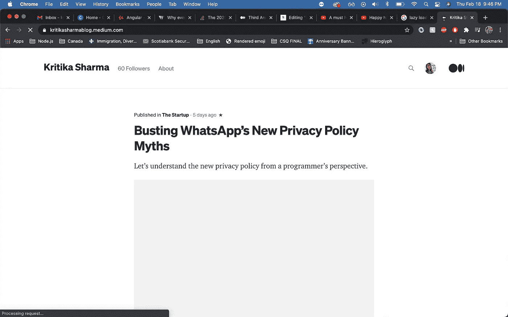

# 为什么你的网站加载很慢？

> 原文：<https://javascript.plainenglish.io/why-is-your-website-loading-slowly-af045a4fc42b?source=collection_archive---------13----------------------->

## 惰性加载——2021 年 Web 开发的必备技能

Photo by [Mike van den Bos](https://unsplash.com/@mike_van_den_bos?utm_source=medium&utm_medium=referral) on [Unsplash](https://unsplash.com?utm_source=medium&utm_medium=referral)

在本文中，除了阐明什么是*延迟加载*之外，我们还将解决一些更重要的问题，例如:

*   为什么要实现延迟加载模式？
*   急切加载的模式有什么问题？
*   为什么延迟加载不仅是一个很好的特性，而且是一个必须具备的特性？
*   什么样的内容你可以*懒懒地加载*，这对你的网站有什么好处？
*   懒加载如何提高你网站的性能和加载时间？

所以，首先要做的是。

> 惰性加载是一种将资源识别为非阻塞或非关键资源并仅在需要时加载它们的策略，它是一种缩短关键渲染路径长度的方法，这转化为减少页面加载时间。
> 
> —根据 MDN 网络文档

为了用更简单的话来理解这个看起来过于复杂的定义，让我们假设你有一个大约 100 页的网站(包括主页、联系我们、仪表板等等)。).现在，当用户访问你的网站时，他们可能对访问某些特定的页面更感兴趣，例如*主页*或*仪表板*，而不是其他页面，例如*关于我们*。也有可能用户从来没有访问过你网站上其他一些不太重要的页面。考虑一下，您还没有使用 lady-loaded 模式，现在您只是在后台下载整个网站(所有 100 个页面),即使用户只是想快速浏览一下他的仪表板。这将使用户在看到他们想看的页面之前，不得不等待你的 100 个页面中的每一个都被下载。**这就是所谓的急切加载。**

让我们从数学上来看，你的用户想要导航到*联系我们*页面，这个页面只有 50 KBs，而你的整个网站大约是 5 MB。现在，你不是要求用户只下载绝对需要的 50KBs，而是强迫他们在他们的网络浏览器中下载 5g 的数据，其中大部分他们甚至不使用。很糟糕，对吧？如果用户的互联网连接不好怎么办？**这使得延迟加载显然是必须的，而不仅仅是一个好东西。**

此外，当你建立一个网站，要求用户在访问任何其他页面之前进行身份验证时，延迟加载变得更加必要。你会问为什么？用户无论如何都不能访问其他页面/组件，除非他们完成登录或注册过程。那么，一次性加载所有这些内容有什么意义呢？

> YouTube 起初只是加载视频的缩略图，当观众点击缩略图时，他们才开始加载视频。

换句话说，偷懒加载也可以被描述为加载网站的关键或必要部分*(其余的组件/页面可能也很重要，但它们目前并不重要)*。通过这样做，您实际上减少了网站的*加载时间以及**交互时间*。

## 一种延迟加载策略

现在，有一个我最常使用的有趣的惰性加载策略，叫做**预加载所有模块，**指示我们在用户想要登陆的地方下载第一个关键资源，然后我们惰性加载其余的模块。现在，与上面提到的其他例子不同，我们不会等待用户点击一个按钮/链接，将他带到他想访问的下一个页面。我们在这个策略中做了不同的事情，当用户与他们访问的第一个页面交互时，我们看到现在没有任何东西在后台下载，也没有 API 请求被处理，所以我们开始在后台下载其他页面。现在，我个人认为这是一个很好的方法，因为这给了你两个世界中最好的。第一，你尽可能快地加载网站，第二，你没有等待用户的交互来加载你网站的其余部分。本质上，您只是在浏览器空闲时获取其他资源，所以用户根本不需要等待，只要他们准备好进行下一步操作。很整洁，对吧？

## 您可以惰性加载哪些资源？

转到您可以轻松加载的资源。在我看来，我们绝对应该永远偷懒加载的两个绝对重要的资源是: **i)图像**，和 **ii)视频**。假设您的网站上有一个视频。想想看，当你加载网站时，你真的需要下载完整的视频吗？我不这么认为！您应该延迟加载，直到用户点击播放按钮，因为视频现在不是关键资源。用户甚至可能永远看不到您的视频。

正如我们已经讨论过的，下一个可以偷懒的资源是你网站上的**页面**。

## 惰性加载示例

所以，你现在所在的网站，Medium.com，除了大量的文本数据，还有很多图片。然而，由于 Medium 遵循惰性加载模式，他们不会立即下载图像。他们只在博客加载后才在后台加载图像。

Screenshot from [https://kritikasharmablog.medium.com/](https://kritikasharmablog.medium.com/)

## 结论

好了，就这样了！谢谢你看了这篇文章，我很感谢你的时间，我希望你今天学到了新的东西！继续学习！

*原为发表于*[*https://www.theimmigrantprogrammers.com*【T21*。*](https://www.theimmigrantprogrammers.com/p/heres-what-you-need-to-know-to-improve)