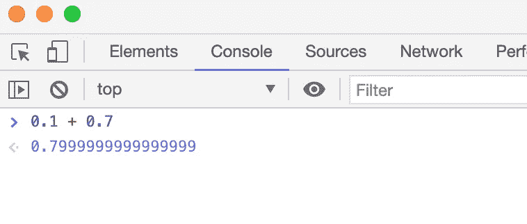
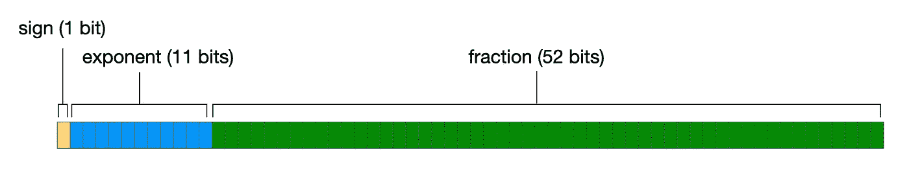
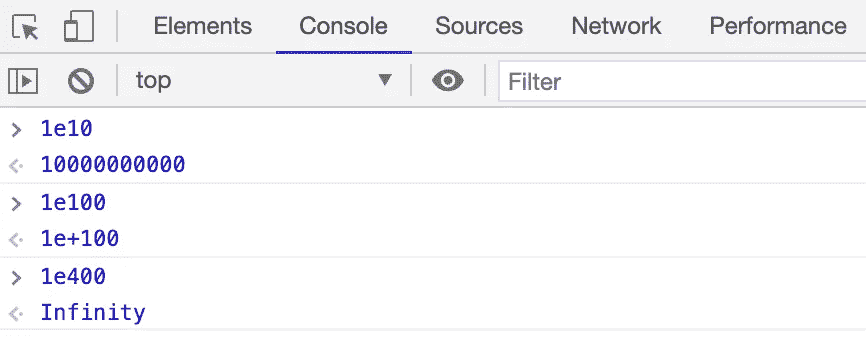
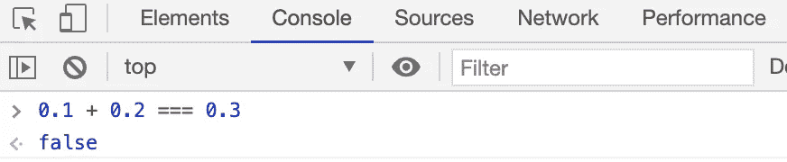

# 为什么 JavaScript 不擅长数学

> 原文：<https://javascript.plainenglish.io/why-javascript-is-bad-at-math-9b8247640caa?source=collection_archive---------3----------------------->

## 以及如何克服它的局限性

Photo by [Antoine Dautry](https://unsplash.com/@antoine1003?utm_source=medium&utm_medium=referral) on [Unsplash](https://unsplash.com?utm_source=medium&utm_medium=referral)

给你提个简单的问题:0.1 + 0.7 是多少？

如果你的回答是 0.8，恭喜你！你的加法能力比几种计算机编程语言都要好。不，真的。以下是 JavaScript 对同一问题的回答:

Nice try JavaScript, but not quite.

JavaScript 并不孤单；如果您在其他几种编程语言中执行相同的加法，您将得到类似的略微不正确的答案。那么，为什么对于所有可以在代码中执行的复杂操作，某些简单的计算会出错呢？答案在于 JavaScript 如何在内存中存储数值。

在我们深入了解这些值是如何存储在内存中的之前，我们需要先谈谈数字，以及我们表示它们的不同方式。

可以说，在它们最简单的形式中，有整数，例如`5`。这种类型的数字没有小数值。

然后是分数，如`1/5`。这意味着`1`被分成了`5`块，通常用值`0.2`来表示。我们认为这是一个有限的表示，意味着它停止了。如果我们改为考虑`1/3`，这是一个*无限的*表示，因为我们可以无限地写`0.3333333333`等等来表示这个分数。

这里需要做一个区分。我们将`1/5`表示为`0.2`是一个十进制*数，这意味着它是以*为基数 10* 写成的。我们会回来的。*

我们还有一种表示数字的方式，称为“标准形式”，或“科学符号”。在标准形式中，我们将数字分为两部分:首先，数字本身，一个数字在一个基数点之前，其他数字在它之后，然后是一个要乘以它的值，包括一个基数*和一个指数*的*，它将返回初始数字的完整形式。*

你可能会从很大或很小的数字中熟悉这个。例如，地球的质量可以写成`5.9724 x 10²⁴ kg`，这是一种不用完整写出`5,972,400,000,000,000,000,000,000 kg`的便捷方式。这里`10`是*基数*，而*指数*是`24`，即基数的幂。这些数字乘以基数的幂的指数被称为 [*符号和*](https://en.wikipedia.org/wiki/Significand) ，或者*尾数，*并且这些的数量被称为*精度*，所以在上面的例子中我们有一个`5`的精度。

我们可以用这种方式写出任何数字，而不仅仅是非常大或非常小的数字；如果我们想用这种方式表示数字`1`，我们可以把它写成`1.0 x 10⁰`。如果我们使用负指数，我们也可以用这种方式表示分数，所以如果我们愿意，我们可以将`1/5`表示为 `2.0 x 10-¹`。

以这种方式书写的数字被称为“浮点数”，指的是移动的基点。

以上浮点数的例子使用*作为 10* 的基数(十进制数)。我们也可以用这种方法用其他基数表示数字。我们对*基数 2* (二进制数)特别感兴趣，因为(剧透警报！)这就是 JavaScript 如何将数字存储在内存中，以及如何引入某些值的不精确性。

如果我们将数字`1`表示为底数 10 中的`1.0 x 10⁰`，那么底数 2 中的数字会是多少？嗯，二进制中的`1`实际上和十进制中的相同——无论哪种方式，我们只使用数字`1`。但是我们现在的基数是`2`，而不是`10`，所以将数字`1`表示为基数 2 中的浮点数就是`1.0 x 2⁰`。

让我们看看另一个例子。如果我们取`1/2`，用十进制表示，这和说`5/10`是一样的。所以为了将`1/2`用标准的形式表示出来，我们可以写`5.0 x 10–¹`。那么，这在二进制文件中会是什么样子呢？

好了，开始我们需要把我们的分数转换成二进制:`1/10`(二进制中，`10`代表`2`，和`2⁰/2¹`一样，可以化简为`2-¹`。因此，在标准形式中，我们将其表示为`1.0 x 2-¹`。如果你真的执行这个乘法，你会得到`0.1`，这就是`1/2`用二进制表示的方式。

再举个例子，我们来看`3/4`。为了把它转换成二进制，我们有了`11/1000`，当我们实际做除法时，这意味着`0.11`就是`3/4`被写成二进制分数的方式。为了将它转换成浮点，我们将把它写成`1.1 x 2-¹`。

我们也可以将`3/4`表示为`11 x 2-²`，或者`0.011 x 2¹`。然而，惯例是在基数点之前有一个整数，其余的整数跟在它后面。以这种方式编写的浮点数被认为是*规格化的*。

到目前为止，一切顺利。我们将`1/2`的有限二进制表示作为规范化的浮点数。当我们看分数时，我们的问题开始出现，我们不能用这种形式的有限数字来表示。

我们以`1/10`为例。在 10 进制中，我们可以把它写成`1.0 x 10-¹`。为了将其从分数转换成浮点数，分子*(分数的顶部)变成有效数，分母*(分数的底部)被调整为由有效数乘以的基数和指数来表示。**

**然而，当我们试图在 base 2 中进行同样的转换时，我们遇到了障碍。要把`1/10`转换成二进制小数，我们可以把这个写成`1/1010`。然而，我们没有办法从 2 的任意次方得到数字 10；2 次方数字序列跳过它(2，4，8，16，等等。).因此，在基数为 2 的情况下，任何分母不能从 2 的幂得到的分数都将被不精确地存储。**

**那么，我们如何将`1/10`存储为浮点二进制数呢？我们必须尽可能接近它。在这种情况下，我们使用指数来计算正确的小数位数，并使用有效数字来尽可能接近二进制的`1/10`；在这种情况下`1.10011001100110011001101 × 2-⁴`，与`0011`无限重复。**

**这类似于在十进制中我们不能将`1/3`有限地表示为一个有限的数。在 10 进制中，只有那些分母可以被消去到 10 次方序列中的数字的分数才能被精确地写成十进制数，这就是为什么像`1/3`、`1/6`或`1/9`这样的分数是无限的。十进制中我们能得到的最接近`1/3`的是`0.33333333`无限重复。同样的问题发生在 base 2 中，原因完全相同；`1/3`为二进制浮点数会是`1.01010101010101010101010 x 2-²`，无限重复。**

**那么这一切是如何转化为 JavaScript 数字有时不精确的呢？**

**JavaScript 将数字作为浮点二进制数存储在内存中，这就是用这种格式表示`1/10`或`1/3`的原因。JavaScript 根据 IEEE 754 标准存储数字，IEEE 754 标准是由电气和电子工程师协会建立的浮点运算标准，特别是双精度格式。**

**以这种方式存储的数字总是以 2 为基数存储。数字以 2 为基数存储的原因是，一位(计算机可用的最小内存)只能存储两个值:`0`和`1`，这有助于存储二进制数。**

**双精度 IEEE754 格式意味着一个数字正好使用 64 位在内存中存储一个数值。在这 64 位中，1 位用于存储**符号**，11 位用于存储**指数**，52 位用于存储**小数**(有效数字)。所有这些给了我们每个数字的 2⁶⁴潜在价值(大约 18 万亿分之一)。**

****

**The breakdown of a number stored in Double Precision IEEE754 format**

**让我们更详细地看看这些:**

*   ****符号**决定数字是正数还是负数。**
*   ****指数**保存基数的递增数。这 11 位给我们从`0`到`2047`的`2048`值存储在这里。基数永远是`2`，不需要指定这个。没有符号来确定指数本身是正的还是负的；相反，它以*偏移*的形式存储，这意味着从存储的指数中减去数字`1023`。同样地，`1023`存储`0`的值，负指数存储在`1`和`1022`之间(当考虑偏差时，`-1022`和`-1`)，正指数存储在`1023`和`2046`之间(当考虑偏差时，`0`和`1023`)。指数全为 0 或全为 1 的情况保留给特殊数字`Infinity`和`NaN`(由分数中跟随它们的数字区分)。这种与符号结合的编码是 JavaScript 解释`-Infinity`和`Infinity`的方式，也导致 JavaScript 具有不同的值`+0`和`-0`。**
*   ****分数**(有效位)由 52 位组成，但是假设这些数字都是*规格化的*，那么可以省略基点之前的初始`1`，因此实际上有 53 位可以存储这些数字。**

**如果您想亲自看看不同的数字是如何以这种格式编码的，这个[浮点转换器工具](https://www.h-schmidt.net/FloatConverter/)是一个很好的起点(它使用单精度而不是双精度，但想法是非常相同的)。**

**值得一提的是，虽然 64 位精度为我们提供了大范围的数字，但也有局限性。如果您试图使用一个大于该存储器允许的数，它将溢出并导致一个无穷大的值。**

****

**由于我们不能以这种方式以有限形式存储某些分数(例如`1/10`和`1/3`)，这就是为什么当我们尝试使用这些分数进行计算时，JavaScript 会给出稍微偏离的结果——实际上我们看到的是*舍入误差*。这些舍入误差以一个称为 *ulps* 的单位(最后一位的单位)来衡量——有关这方面的更多信息可在本文中找到。**

**由于在 JavaScript 中存储浮点数的双精度格式有效地为我们提供了 53 位的有效精度，因此舍入误差非常小。然而，当我们看到这样的结果时，这对我们没有帮助:**

****

**Frustrating.**

**这有道理；这相当于检查`0.3333333 + 0.666666 = 1`。`0.1`和`0.2`也是类似的不精确表示，所以不会完全加起来就是`0.3`。**

**现在我们明白了问题的原因，我们该如何解决这个问题呢？**

**一个建议是将数字存储为整数，而不是分数，然后根据需要执行任何必要的操作。例如，在电子商务中，以美分而不是美元存储价格，然后在前端计算美元价格。这当然比让你的客户偶尔看到`$10.00`和`$25.99`的组合价格显示为`$35.989999999999995`要好。如果你使用这种方法，请记住不是所有的货币都有和美元一样的分数系统，所以你不必对所有的货币执行相同的操作；例如，日元只使用整数，没有小数值。**

**如果你想产生一个整数，并需要消除不精确，另一个选择是使用内置的数学方法，如:**

*   **`[Math.round()](https://developer.mozilla.org/en-US/docs/Web/JavaScript/Reference/Global_Objects/Math/round)`，将任意数字四舍五入到最接近的整数。**
*   **`[Math.floor()](https://developer.mozilla.org/en-US/docs/Web/JavaScript/Reference/Global_Objects/Math/floor)`，将任意数字向下舍入到最接近的整数。**
*   **`[Math.ceil()](https://developer.mozilla.org/en-US/docs/Web/JavaScript/Reference/Global_Objects/Math/ceil)`，将任意数字向上舍入到最接近的整数。**
*   **`[Math.trunc()](https://developer.mozilla.org/en-US/docs/Web/JavaScript/Reference/Global_Objects/Math/trunc)`，这将删除任何小数(Internet Explorer 不支持)。**

**您也可以使用`[toFixed(n)](https://developer.mozilla.org/en-US/docs/Web/JavaScript/Reference/Global_Objects/Number/toFixed)`方法，其中 n 是您想要包含的小数位数。类似的还有`[toPrecision(n)](https://developer.mozilla.org/en-US/docs/Web/JavaScript/Reference/Global_objects/Number/toPrecision)`，其中 n 表示精度的级别。如果使用它们，请记住它们都返回字符串，因此在对它们执行任何进一步的操作之前，需要将它们转换回数字。**

**最后，有许多 JavaScript 库是专门为处理浮点数而设计的，比如[sinsic . js](https://github.com/guipn/sinful.js/wiki/API#math)和 [math.js](https://mathjs.org/docs/datatypes/fractions.html) 。**

# **结论**

**最后，让我们回到最初的 0.1 + 0.7 的例子，看看我们如何使用这些方法来得到我们可能期望的结果。**

***更多内容请看*[***plain English . io***](https://plainenglish.io/)**