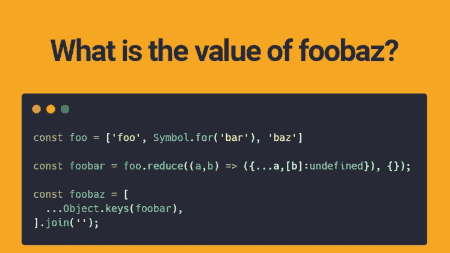
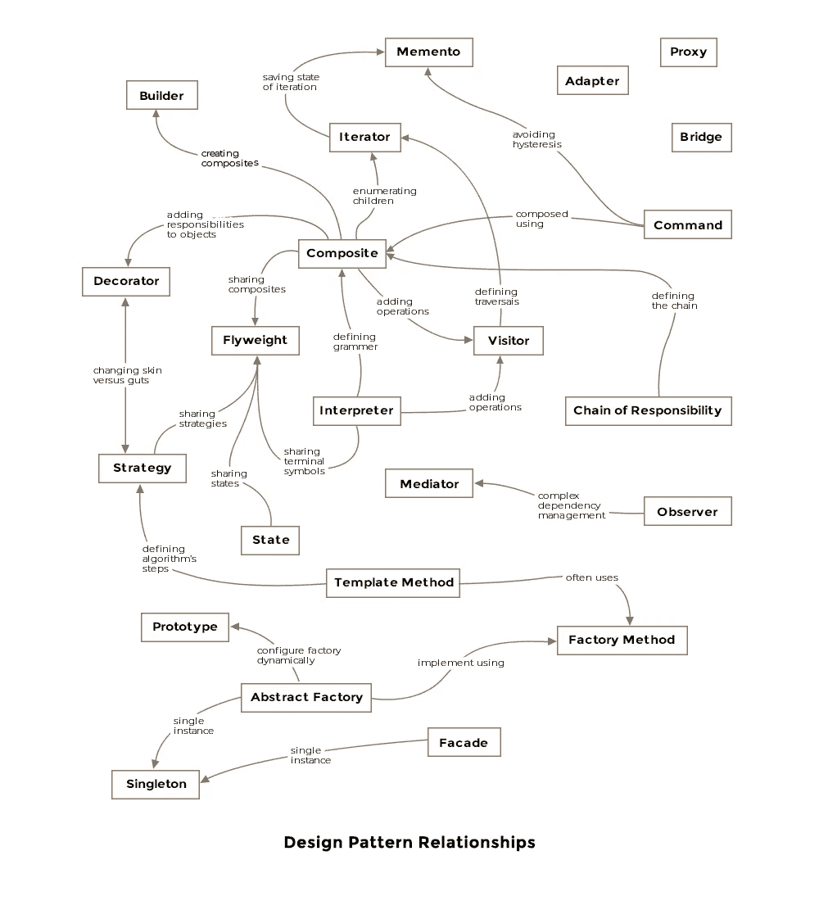
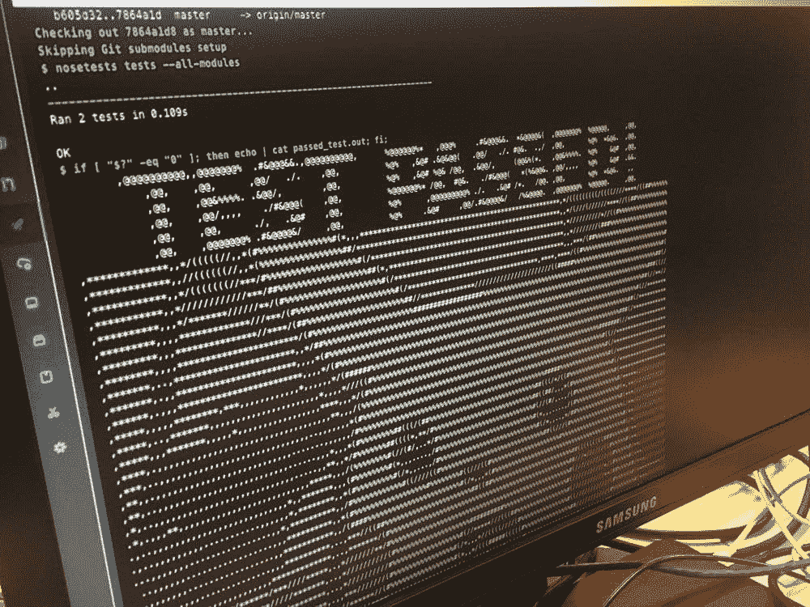
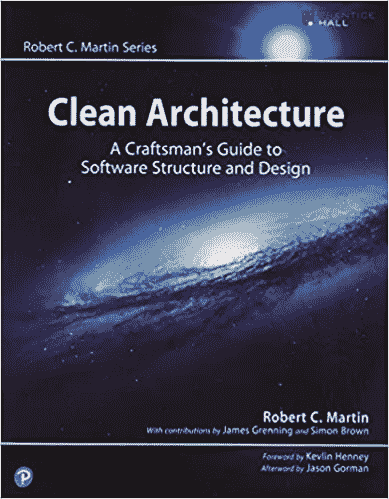
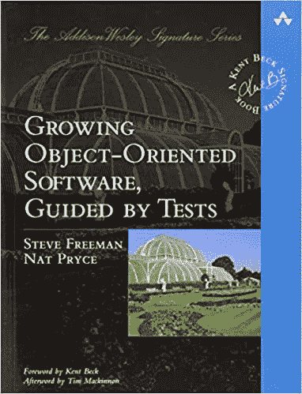
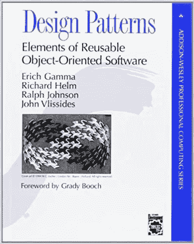
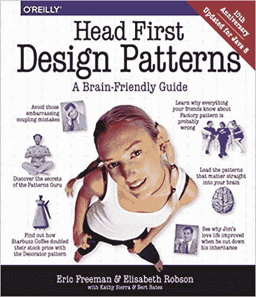
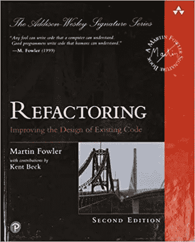

# 初级开发人员的宝贵建议

> 原文：<https://javascript.plainenglish.io/why-junior-developers-suck-at-programming-e009bfc3fd71?source=collection_archive---------6----------------------->

开发人员希望他们在开始时拥有的技巧

不要惊慌！在申请 Z tech 公司之前，你不需要学习 X 语言和知道 Y 算法。事实是，大多数高级开发人员无论如何都不会通过编码面试。以下是你在第一份工作中应该期望学到的东西。

# 1.忽略网上的琐事

许多初级开发人员被他们永远不会看到的边缘案例淹没了。失败是可以的。很多时候，这些问题只会在面试、编高尔夫或者恐怖故事中出现。忽略点击诱饵会让你专注于真正重要的事情。

Answer: Who cares?

最好的程序员是灵活的，适应当前形势的。当出现问题时，他们会与队友聊天或阅读书籍、文档、教程、论坛等资源。读书能解决多少问题，真神奇。

# 2.不要做只会一招的小马

一个完全理解基础知识的开发人员比专注于语言规范的人更有价值。再次，忽略琐事，不要惊慌。编程语言是构建思想的工具。

问问你自己，你更愿意和谁一起工作:一个总是用锤子的人，还是一个知道哪些工具和资源能让项目经得起时间考验的人？

Exhibit A

# 3.指针与引用

指点不会伤害你！没有什么可怕的。信不信由你，很多脚本语言比如 Python 和 JavaScript 都有指针。它们很难被注意到，因为这些语言没有为解引用指针指定标记。有没有注意到 object/dict 属性的行为与普通变量有什么不同？

# 4.不要忘记记忆

流行的语言处理大多数的内存管理，但是你负责剩下的。你是堆程序员还是栈程序员？你最喜欢的数据结构是什么？随着代码的老化和数据的增长，这种选择变得更加重要。

# 5.模式和原则

我的老导师曾经说过，“任何人都可以写代码，但很少有人能写架构。”

强迫自己学习单责任(SRP)、开-闭(OCP)、利斯科夫替换(LSP)等编程原理。这将使你的代码保持干净，并允许你的程序在未来几年内扩展。当你准备好了，学习将这些原则与设计模式相结合。隐藏的艺术让编程充满乐趣。

记住，这不是一朝一夕就能掌握的。现在就开始阅读并小块练习，这会有回报的。此外，要接受现代原则。

Books below explain this

# 6.计划计划计划

跳入代码是有趣的，但它会回来困扰你。计划并不像你想象的那么费力。即使是在笔记本纸上画一个简单的草图，也能省下几周的修补时间。

还有，这不仅限于 UI。数据流和架构也会变得复杂。写下你的想法有助于你更清晰地思考。另外，它还可以作为文档。

# 7.自动化测试

日志记录不是测试。编译不是测试。展示“它有效”不是测试。

*doesn’t need a beer*

编写代码来测试您的代码，因为您可能忘记了基本的功能要求。先写测试(TDD)就像提前计划——它可以让你免于成为一个酒鬼。

如果你因为任何原因不能自动化你的测试，制作一个包含手动测试步骤的文本文件，并确保包含预期。这将确保每次都遵循相同的步骤，并且整个团队就成功或失败达成一致。

# 8.证明文件

不要等到项目完成才写文档。你不仅会准备好进入新的项目，而且你不会记得大部分代码是如何工作的。

就像测试和规划一样，文档应该在项目的整个生命周期中进行。在编码之前编写的文档可以兼作计划，但它应该在之后被检查。

# **9。调试**

错误会发生，所以要学会使用调试器。这就像学习使用灭火器。有了经验，您将不再需要它，但它会一直存在，以备不时之需。

大多数调试器允许您暂停执行、更改变量或跳过大块代码。这让您可以更多地关注错误，而不是运行代码。

# 10.继续学习

我们都在一个快速变化的领域工作。一旦你停止学习，你就变成了遗留代码的人类形式。没有人喜欢遗留代码。

你不必回到学校，但是在一周之外花些时间跟上编码世界。最重要的是，要接受新的想法。记住，编程语言是工具，新的工具会创造更大更好的东西。

# 11.奖励:代码有后果

确保您理解所做每件事的“原因”。为什么要我这么做？这对公司有什么好处？它对客户有何影响？所有这些都直接体现在您对所编写的每一行代码所做的每一个微观决定中。

# 12.奖金:团队合作

代码不是神圣的。不要太依恋你写的代码，避免围绕“正确”做事方式的宗教战争。

# 其他条款

[如何在编程中坚持童子军规则](https://wadecodez.medium.com/how-to-uphold-the-scouts-rule-to-programming-3971ae4dff68)

# 信用

感谢好心的陌生人分享你的经历。提示 11 和 12 来自[https://reddit.com/u/sonstone.](https://reddit.com/u/sonstone.)

# 资源:伟大的工程书籍

*非附属链接*

[https://www.amazon.com/Clean-Architecture-Craftsmans-Software-Structure/dp/0134494164](https://www.amazon.com/Clean-Architecture-Craftsmans-Software-Structure/dp/0134494164)

[https://www.amazon.com/Growing-Object-Oriented-Software-Guided-Tests/dp/0321503627](https://www.amazon.com/Growing-Object-Oriented-Software-Guided-Tests/dp/0321503627)

[https://www.amazon.com/Design-Patterns-Elements-Reusable-Object-Oriented/dp/0201633612/](https://www.amazon.com/Design-Patterns-Elements-Reusable-Object-Oriented/dp/0201633612/)

[https://www.amazon.com/Head-First-Design-Patterns-Brain-Friendly/dp/0596007124](https://www.amazon.com/Head-First-Design-Patterns-Brain-Friendly/dp/0596007124)

[https://www.amazon.com/Refactoring-Improving-Existing-Addison-Wesley-Signature/dp/0134757599](https://www.amazon.com/Refactoring-Improving-Existing-Addison-Wesley-Signature/dp/0134757599)

*更多内容参见* [*简明英语. io*](http://plainenglish.io/)