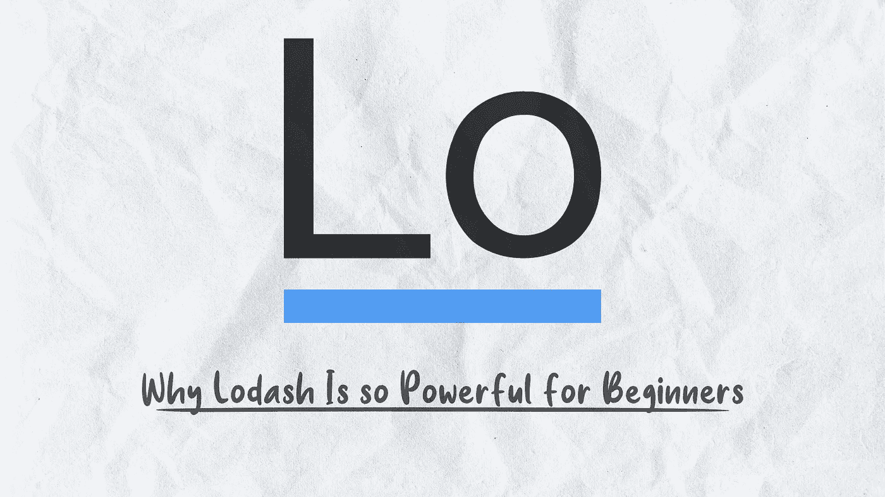

# 为什么 Lodash 对初学者来说如此强大

> 原文：<https://javascript.plainenglish.io/why-lodash-is-so-powerful-for-beginners-fe0692d53174?source=collection_archive---------14----------------------->

## 将提高初学者的性能和代码编写的 Top 5 Lodash 函数

在本文中，我们将了解为什么 Lodash 对于初学者来说是一个强大的库。我还列出了我最常用的 5 个 Lodash 函数，让初学者了解如何用 JavaScript 升级游戏。

在深入研究之前，让我们先简单了解一下 Lodash 是什么。

# 什么是 Lodash？

Lodash 是由 John-David Dalton 开发的一个 JavaScript 工具库，致力于提供高性能的 JavaScript 函数。

Lodash 中有 13 类函数，但我们将重点关注数组、对象和集合类别。我们可以在前端(React、Vue、Angular)和后端(Node.js)利用 Lodash。

在前端旅程的开始阶段，我面临着处理数组和对象的问题。像所有的前端开发人员一样，我用谷歌搜索来寻找答案。这是一个简单的问题。我必须创建一个函数来移除数组中的第一个元素。

作为初学者，我使用 for 循环来检查它是否是第一个元素，然后删除它。我对代码不满意，因为它看起来有点乱，所以我用谷歌搜索了一个更简单、更整洁的代码。当我在 googling 上搜索的时候，我偶然发现 StackOverflow 中有一条建议使用 _ 的评论。tail(Lodash 函数)。

我很惊讶。这是我的问题的一行解决方案。

我决定查看他们的文档，看到更多的函数和示例让我大吃一惊。这就像一个所有简化函数的世界，你甚至可以在复杂的代码中使用。

不仅如此，仅仅通过浏览他们的文档，我就能够发现解决和简化我的代码的方法。比如 _。交集有助于创建两个给定数组具有相同值的数组。

A vanilla way for finding the same value.

_.intersection in use

只要看看通过使用 Lodash 代码有多简单和干净就知道了。

# 我最常用的 5 个 Lodash 函数

在这个列表中，我不打算包括通常的 map、filter、find、concat，因为这些是我们在处理数组和对象时经常使用的默认函数。

这 5 个 Lodash 函数非常强大，但是经常被开发人员忽略。

# 1._.倍

我们经常创建一个虚拟对象的数组，并把这个对象复制 n 次。当我们仅仅通过复制和粘贴来创建一大堆模拟数据时，有时会非常乏味。

一行解决这个问题，可以用 _×声明你需要的模拟数据量，它会根据你声明的第 n 个数自动创建。

creating a mock array by copy-pasting

_.times to create a chuck of repeat data

# 2._.联盟

当您使用两个字符串数组时，这非常有用。常规的方法是组合两个数组，然后过滤掉。当涉及到字符串数组时，您可以使用 _。联合创建一个唯一的数组。

the conventional way to combine two arrays and filter the duplicate

_.union to create an array with a unique value

一定要注意。当涉及到两个对象数组时，union 不能很好地工作

# 3._.orderBy

在构建排序函数时，我会一直使用 _.orderBy，原因是可以灵活地对数组进行升序或降序排序。

当你对一个对象数组进行排序时，这个 Lodash 最好的部分，就像在普通的 JavaScript 中一样，你必须写一个 if-else 语句并在值之间进行比较。

a beginner way to write a sorting function

using _.orderBy to do the sorting

# 4._.挑选

当我需要创建一个要在 API 中传递的特定 JSON 对象时，我经常使用它。

_.当我需要 console.log 对象的某个字段时，pick 也很有用。假设您有一个包含近 30 个用户数据字段的对象，但您只想关注一个字段。pick 很适合这种情况。

_.pick use to get a specific field of the data

# 5._.在范围内

你曾经使用 if-else 来检查值是否在特定的范围内吗？因为我初学的时候经常这么做。

_.inRange 只是将代码最小化，使代码更具可读性。

if-else statement to check if the value is in range

_.inRange to check the value is in range

另一个不在这个列表中的 Lodash 函数是 _。正如我在文章开头提到的。至此，我相信这篇文章已经为您的 JavaScript 之旅增加了一些价值，我希望您能尝试一下 Lodash。

如果你以前用过 Lodash，请在评论区留下你的观点。

*更多内容看*[***plain English . io***](https://plainenglish.io/)