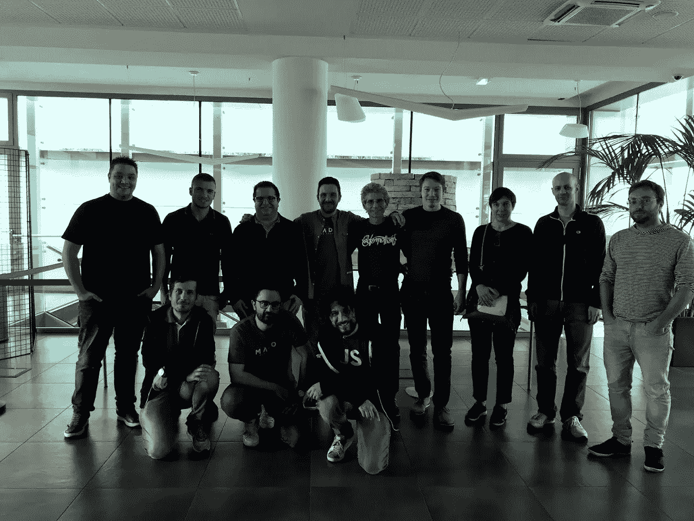

# 为什么动机对开发人员很重要

> 原文：<https://javascript.plainenglish.io/why-motivation-is-important-for-a-developer-daa6437e80cc?source=collection_archive---------23----------------------->

## 给那些想要提高自己和激励自己的程序员的个人发展小技巧。


Photo by [Clark Tibbs](https://unsplash.com/@clarktibbs?utm_source=unsplash&utm_medium=referral&utm_content=creditCopyText) on [Unsplash](https://unsplash.com/s/photos/books-programming?utm_source=unsplash&utm_medium=referral&utm_content=creditCopyText)

> 编写代码就像诗歌:这是一种艺术形式

作为一名开发人员，工作是美好和令人兴奋的，但也是极其复杂和危险的，尤其是在处理错误的时候！代码中一个非常简单的错误就可能造成数百万的损失，在某些情况下，还可能导致人员死亡。

被激励，尤其是在去年新冠肺炎考验我们的时候，应该是一个开发者的首要任务。这个工作很美，因为它需要团队合作的能力。这项工作是有回报的，尤其是当每个人都认为自己对问题的解决做出了重大贡献的时候。这项工作需要努力和不断更新，以便能够在我们所做的事情中提高自己。我们这样做是因为我们相信它，我们喜欢它。

你知道你喜欢编程，但它突然变得无聊、重复，甚至令人沮丧。也可能发生这样的情况，你感觉到你和你的同事之间的距离:他们继续工作，而你问自己如何前进，如何保持动力。

我认为，当你开始问自己这些问题，而你找不到答案时，你可能只会做出可能危及你职业前途的糟糕决定。

# 是什么激励着我们？

你为什么去工作？你们中 99.9%的人会说是为了钱。你需要钱来生活，为你的妻子买一件漂亮的礼物，或者买一辆你梦想中的汽车。然而，从我的角度来看，金钱并不会让你觉得自己没有必要回答你之前提出的问题。他们肯定会有帮助，但是他们不会让你感动太久，或者至少不会太久！

[](https://www.ted.com/talks/dan_pink_the_puzzle_of_motivation/transcript#t-421667) [## “动机之谜”的抄本

### TED Talk Subtitles and Transcript:职业分析师丹·平克从一个事实出发，研究了动机之谜…

www.ted.com](https://www.ted.com/talks/dan_pink_the_puzzle_of_motivation/transcript#t-421667) 

在这个美丽的 Ted 演讲中，Dan Pink 告诉我们指导人们工作的三个主要原因，它们适用于软件开发领域:

*   自主性:没有人比你更清楚如何组织自己以提高工作效率。人们需要空间和信任。
*   **精通**:学习新技术，提高你的技术技能让你满足。在用同样的技术做同样的事情很多年后，你可能想要改变和发现新事物。
*   **目的**:目标不能仅仅是产生计算机能理解的代码。真正的目标必须是产生另一个程序员可以快速理解的代码。

即使你的公司理解这些动机，他们当然也不能让开发人员一直做他们想做的事情。一家公司不仅要对员工的福祉负责，还要对顾客负责。因此，找到平衡是至关重要的，这也意味着对每个人来说，他是自己动力的建筑师！

不言而喻，这里有一些我经常用来激励和约束自己、学习新事物和探索我技术背景之外的话题的规则。

# 创造点什么，做点什么！


Photo by [Zan](https://unsplash.com/@zanilic?utm_source=unsplash&utm_medium=referral&utm_content=creditCopyText) on [Unsplash](https://unsplash.com/s/photos/programmer?utm_source=unsplash&utm_medium=referral&utm_content=creditCopyText)

没人送你任何东西！我认为，如果你想把自己推向一个更高的水平，提高标准，学习是必不可少的。试着把焦点放在你喜欢的和你的公司可能喜欢的话题上。通过这种方式，你首先将能够保持自己的积极性，但你也将在你的公司内带来关于“诀窍”的消息。阅读文章，观看 YouTube 视频，在社交媒体上关注社区和技术大师很重要，但这不是全部。这些工具可以给你指明一条路，但你是那个必须走下去的人。要做到这一点，你需要那些令人深恶痛绝的砖块:书籍。

# 书籍是最基本的


Photo by [Adeolu Eletu](https://unsplash.com/@adeolueletu?utm_source=unsplash&utm_medium=referral&utm_content=creditCopyText) on [Unsplash](https://unsplash.com/s/photos/javascript?utm_source=unsplash&utm_medium=referral&utm_content=creditCopyText)

对于适当的编程培训，书籍是必不可少的。对我来说，没有什么比书更有效了。我不是“边做边学”的粉丝，因为我相信这不是最好的方法，也不总是能在最短的时间内取得进步。我的方法更倾向于在更长的时间内实现设定的目标，但对走上正确的道路充满信心。因此，在数周的工作之后，您将不会被迫重构整个应用程序，因此在完成以下工作之后:

*   浪费的时间
*   浪费的公司资源
*   为了赶上最后期限而承受不必要的压力

这三点，以这种精确的顺序，本质上产生了两件事:

*   不良软件
*   消极情绪

从这个角度来说，试着通过做网上调研和阅读写得好的文章来预期自己，我觉得是个不错的选择。话虽如此，我相信这些书籍和精心编写的技术文档从这个角度来看很有帮助，它们认可了我们应用程序的正确设计和后续开发。客户规格和截止日期当然允许！

# 开源


Photo by [Roman Synkevych](https://unsplash.com/@synkevych?utm_source=unsplash&utm_medium=referral&utm_content=creditCopyText) on [Unsplash](https://unsplash.com/s/photos/github?utm_source=unsplash&utm_medium=referral&utm_content=creditCopyText)

全世界有数百万开发人员，他们都是初学者。我们软件开发人员有很强的团体意识。有许多社区可以帮助我们解决问题。

社区以不同的方式帮助我们:学习新的技巧，发现新的技术和语言。这是一个机会，让你遇到喜欢你所爱的人。

这也可以推动我们为开源项目做贡献，从这个角度来看，你可以找回你可能已经失去的动力。开发者社区不仅仅生活在网上；你绝对可以在你的工作场所或当地聚会上联系其他开发人员。与他人分享激情可能是享受激情的最佳方式。

# 分享你的知识

分享知识是告诉你能做什么，或者你已经学会做什么的一种方式。公司内部的一篇文章或一次技术会议不仅有助于提高你自己，也有助于和你一起工作的人。传播一个人的知识通常被视为一种危险，一种必须通过服务或培训课程来保存和支付的东西。一些开发人员认为不分享自己的知识会比其他同事更有优势。没有比这更糟糕的了！

> 分享你的知识是一种让你正在处理的话题更加个性化的方式。

从这个角度来看，尊重那些听你说话或阅读的人是最基本的。因此，用理论幻灯片和实际例子组织好一次技术会议，或者花大量时间在文章中阐述正确的思想，是对与你分享你所知的人的一种责任。

获得的知识和分享知识的能力是不可或缺的武器，成为你职业素养不可或缺的一部分。因此，保持你的知识的“私密性”意味着隐藏你与众不同的特质。这种态度不会创造机会，而是限制，不仅对你，对你的公司也是如此。

> 分享很重要，也是职业成长的主要驱动力之一。

# 保持同步


Photo by [Ales Krivec](https://unsplash.com/@aleskrivec?utm_source=unsplash&utm_medium=referral&utm_content=creditCopyText) on [Unsplash](https://unsplash.com/s/photos/clock?utm_source=unsplash&utm_medium=referral&utm_content=creditCopyText)

创造一些东西，做一些事情，从事你的开源项目，分享你的知识需要时间，并且有效地管理它是困难的。非常难！有了经验和一些好的建议，我明白了避免浪费时间的最不常见的倍数就是“不”字。尤其是，你必须说不:

*   到别人想逼你做的活动。
*   持续中断的活动。
*   信息和社交网络。
*   在三个小时的会议上，十五分钟就足够了。
*   当解决方案是谷歌搜索的第一个链接时，给不断寻求帮助的同事。

相信我，这些小步骤会为你节省很多时间，你可以用这些时间去做更有意义和更有成效的事情。

# 科技活动


Me and Paolo Fragomeni @ Node Conf NL — 2019 Amsterdam

加入一个专业协会，参加他们的年会或某个特定主题的会议。我最喜欢的作品之一是[热情的人](https://passionatepeople.io)。他们通常在 React、Vue、Node.js 和 JavaScript 上组织有趣的活动。还有很多其他的像 [JSConf](https://jsconf.com/) 或者 [NodeConf EU](https://www.nodeconf.eu/) ，你自己决定你最喜欢哪个。

社交，寻求建议，将自己与那些比你懂得多的人进行比较，这是一种在解决未来可能出现的任何问题时有更多选择的方法。确保你做的时候有乐趣，这很重要！与其他开发人员一起玩，拥有共同的兴趣是保持积极性的一个好方法。



Node.js Workshop with Matteo Collina — 2019 Bologna Italy

会议涉及的所有内容通常在会议结束后不久就可以在网上找到。尽管如此，参加会议意味着建立你的人际网络，结识有趣的人，并有额外的机会拓宽你的知识面。我从来没有从一个会议或研讨会回来，没有什么东西可以深化，甚至没有整个主题可以研究。

# 结论

我已经分享了我对这个主题的想法，我认为这个主题非常重要，因为我认为这是一个开发者的通用条件。我相信积极主动并相信自己不仅对你的幸福很重要，对你工作的公司也很重要！我真诚地希望这些建议能帮助你，特别是如果你此刻特别没有动力，或者不能理解你没有达到目标的原因。

你呢？你做什么来保持你的动力？想的话就在评论里留下你的看法吧！目前…

```
HAPPY READING!
```

*更多内容请看*[***plain English . io***](http://plainenglish.io/)