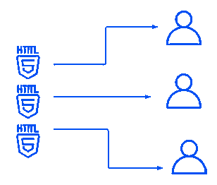

# 为什么 Next.js 比 Plain React 有更好的 SEO

> 原文：<https://javascript.plainenglish.io/why-next-js-has-better-seo-than-plain-react-6f6646d776e8?source=collection_archive---------6----------------------->


使用 plain React，要呈现的 HTML 是在客户端生成的，因此搜索引擎必须执行 JavaScript 代码来获取 HTML。js 有一个预渲染特性，即应该渲染的 HTML 在服务器端生成，然后发送到客户端。这种预渲染特性为 Next.js 应用程序提供了改进的 [SEO](https://circuit.ooo/blog/seo-for-beginners) ，因为搜索引擎将直接从服务器获取 HTML，而不需要在爬行时生成 HTML。

## 预渲染类型

*   静态生成:HTML 只在构建时生成。
*   服务器端呈现:每个请求都会生成 HTML。

## 静态生成


在静态生成中，HTML 是在构建时生成的，用户的每个请求都会重用这个 HTML。如果网页可以在用户请求之前预先呈现，静态生成是一个更好的选择。由于 HTML 仅在构建期间生成，因此静态生成比服务器端呈现要快得多。像 FAQ 和 About Us 这样的页面可以考虑静态生成，因为它们不需要用户参与渲染。

## **服务器端渲染**



有时页面只能在用户请求后呈现；服务器端渲染实现了这种情况下的预渲染。这里考虑一个电子商务站点的购物车页面，我们使用服务器端呈现，因为它需要用户请求来决定所有需要呈现的内容，它不像 FAQ 页面那样是静态的。

## **弈静代**

为了在页面上实现静态生成，您必须导出一个名为 getStaticProps 的异步函数。这个函数将告诉 Next.js 使用静态生成预先呈现页面。下面附加的代码演示了如何在特定页面上初始化静态生成预呈现。

```
/* 
 * Path: pages/blog.js
 * Description: Page pre-rendering using SG
 */function Blog({ posts }) {
    return (
       <ul>
         {posts.map((post) => (
            <li>{post.name}</li>
          ))}
       </ul>
    );
 }export async function getStaticProps() {
   const res = 
       await fetch("https://jsonplaceholder.typicode.com/comments");
   const posts = await res.json(); return {
     props: {
        posts,
     },
   };
 }export default Blog;
```

## **实现服务器端渲染**

为了在页面上实现服务器端呈现，您必须导出一个名为 getServerSideProps 的异步函数。这个函数将告诉 Next.js 使用服务器端呈现来预呈现页面。下面附加的代码演示了如何初始化特定页面上的服务器端呈现。

```
/* 
 * Path: pages/blog.js
 * Description: Page pre-rendering using SSR
 */function Blog({ posts }) {
    return (
       <ul>
         {posts.map((post) => (
            <li>{post.name}</li>
          ))}
       </ul>
    );
 }export async function getServerSideProps() {
   const res = 
       await fetch("https://jsonplaceholder.typicode.com/comments");
   const posts = await res.json();return {
     props: {
        posts,
     },
   };
 }export default Blog;
```

## 结论

预渲染功能使 Next.js 应用程序具有更好的站点性能和 SEO。js 提供了一个混合特性，静态生成和服务器端呈现都可以应用于同一个应用程序。如果要呈现的页面对所有用户都一样，那么就实现静态生成；否则，使用服务器端呈现。