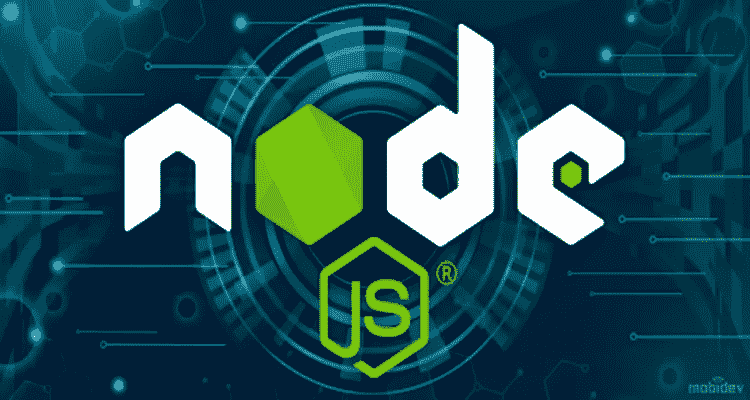
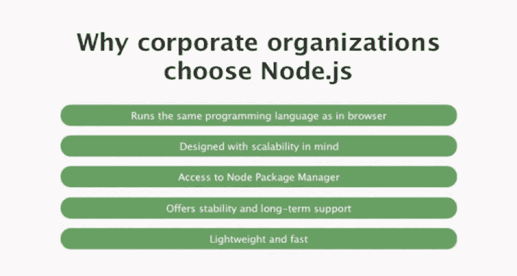
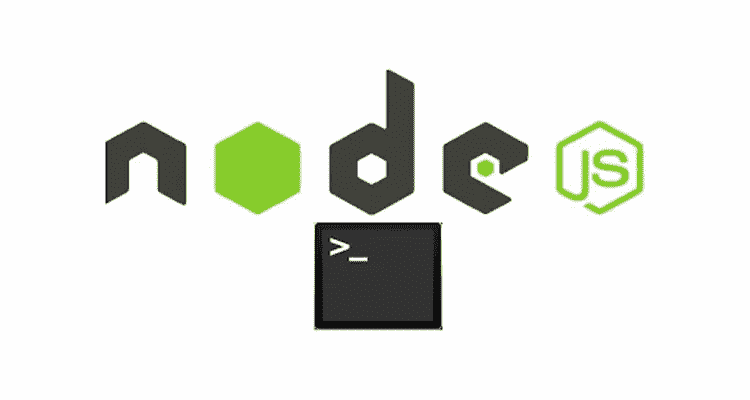

# 为什么 Node.js 开发是企业的绝佳选择

> 原文：<https://javascript.plainenglish.io/why-node-js-development-is-an-excellent-choice-for-businesses-249ebfab596b?source=collection_archive---------6----------------------->

随着扩大业务运营的需求不断增加，Node.js 最近成为了一种趋势。自从它出现以来，它就被视为 web 应用程序开发的理想选择。

虽然所有的框架和语言都有一定的好处，但在企业中处理开发的是 Node.js。根据最近的一项网络发展统计， **Node.js 为至少 2000 万个网站提供支持，降低了高达 58%的开发成本。**

这就是亚马逊、优步、微软、雅虎、PayPal 和 LinkedIn 等公司采用它的原因，也是在它不像现在这样受欢迎的时候。

你想知道 Node js 成功背后的炒作是什么吗？使用 Node.js 进行 web 应用程序开发有很多理由。对于希望参与实时应用程序和跨平台运行时环境的企业来说，这是一个理想的选择。

通过这篇文章，我将描述为什么 Node.js 是 web 应用程序开发的正确选择。让我们开始吧。

# Node.js 是什么？

Node.js 在技术上不是一个框架或库，而是一个**运行时环境，基于 Chrome 的 V8 JavaScript 引擎**。Ryan Dahl 在 2009 年率先推出了 Node.js。

换句话说，Node.js 是一个 JavaScript 运行时环境，用于在浏览器之外运行 JavaScript。全世界的开发人员都用它来创建服务器端脚本和命令行实用程序。

通过使用客户端和服务器端脚本编程，它创建了一个一致的 JavaScript 开发环境。它消除了在不同方面使用不同编程语言编写脚本的需要。

该技术已被许多技术领导者采用，如优步、易贝、沃尔玛和网飞等。

# 使用 Node Js 的公司有:

# **选择 Node JS Web 应用开发的主要原因**

出于各种原因，企业使用任何编程语言进行应用程序开发。Node.js 的事实是，它是为大规模应用程序设计的，更重要的是，它有助于全面应用程序的开发。

Node.js 从其他编程平台中脱颖而出，这要归功于它的现代工具和对构建复杂应用程序的前瞻性方法的支持。

现在，让我们深入探讨一下选择 Node.js 最适合 web 应用程序开发的重要原因。

1.  **高性能**

NodeJs 将 JavaScript 编译成本机代码，得益于谷歌的 V8 引擎，这些代码可以快速运行。因此，它可以加速任何框架。

V8 和 Node 都频繁更新，提供了性能提升、安全补丁和对现代 JavaScript 特性的支持。JavaScript 还意味着 JSON 数据 web 上最常见的数据交换格式——在默认情况下更快。

希望雇佣 nodeJs 开发人员的公司可能希望构建快速、灵活并能同时处理多个连接的网络应用程序。

**PayPal 将响应时间缩短了 35%** ，通过 Node.js 应用程序，每秒处理的请求数量增加了一倍。

此外，Node.js 从一开始就支持应用程序的可扩展性，具有强大的功能，如**集群模块**，可以在多个 CPU 内核之间实现负载平衡。像 PM2 流程管理器这样强大的工具使得监控、定制和部署节点应用程序变得更加简单。

**2。创建实时网络应用**

几乎每个公司现在都实时搜索客户信息。一个简单的原因是，对客户信息的可靠访问为企业销售的显著增长铺平了道路，因为它可以准确地向用户提供他们正在寻找的信息，而不仅仅是他们不感兴趣的随机信息。

近年来，使用 Node.js 开发实时 web 应用程序已经成为最有效的方法。

Node.js 可以消除您对低级套接字和协议的所有担忧。您可以用 Node.js 创建一个实时 web 应用程序，所用时间与用 PHP 创建一个主要博客的时间相同。

**对于多用户实时 web 项目，比如游戏和聊天应用，** Node.js 是一个绝佳的选择。事件循环使用基于 TCP 的 WebSocket 协议处理多用户功能。它还消除了 web 开发的 HTTP 开销。

**3。依赖可扩展性的应用**

Node.js 所支持的巨大可伸缩性，为能够承受高峰负载的 web 应用回答了“为什么选择 Node.js”的问题。这就是优步选择 Node.js 构建其应用程序的核心原因。

他们的网络在不断发展壮大；此外，出租车业务的性质导致节假日期间出现高需求高峰。Node.js 很好地处理了这些挑战。

另外，Node JS 并不比 PHP 或 Ruby 更具可扩展性。但是它比其他后端技术更容易扩展。对于允许产品快速增长和扩展的组织来说，这是一个显著的优势。

**4。数据流**

**Source**: [**Coders Daddy**](https://www.codersdaddy.com/)

任何成功的产品开发都需要出色的 I/O 管理。当 Web 框架将 HTTP0 查询和响应视为完整的数据对象时，就会出现问题。

还有这里，节点。Js 来帮忙了，因为它处理 I/O 过程，并允许用户同时转码和上传媒体文件。通过 WebSockets 读写流可以处理这样的 HTTP。

**5。用作代理服务器**

Node.js 最吸引人的特性之一是它能够作为一个**代理服务器，为具有不同响应时间**的服务或者从许多来源收集数据。

为了获得更好的知识，考虑以下场景:一家公司使用服务器端应用程序与第三方资源通信，从各种来源收集数据，并将图像和视频存储在第三方云服务上。

尽管企业现在可以使用专用服务器，但当缺乏基础设施或本地开发需要解决方案时，Node.js 是一个更好的选择。

**6。简化开发人员的工作**

有了 Node JS，开发人员不必不断重新发明轮子，因为他们可以利用被称为 npm 的**节点包管理器**以更小的开源软件模块的形式获得标准功能。

*“事实是 Node JS 彻底改变了我们创建网站的方式。开发人员可以在几天内，而不是几周内构建关键功能。——道琼斯首席产品和技术官拉明·贝赫什蒂"*

从本质上来说， **npm 是一个公共和付费私有包的在线数据库**，它预装在每个 Node JS 安装中。如果你熟悉 Ruby gems，npm 模块会让你马上感到熟悉。

例如，MongoDB 和 Mongojs 是 MongoDB 包装器，为 MongoDB 对象数据库提供 API。而 moment.js 是一个用于解析、验证、操作和格式化日期的库。

Pug 是一个流行的模板引擎，Connect 是一个可扩展的 HTTP 服务器框架，允许 Node.js 开发人员粘合各种中间件服务来处理请求。

**7。Robust Node.js 包管理器(NPM)**

对于应用程序开发， **Node.js 包括一个动态工具和模块的动态存储库**，开发者可以共享。

Node.js 中有几十个模块可用于各种活动，如管理文件上传、连接到 MySQL 数据库或 Redis、模板系统，以及管理与访问者的实时通信。

NPM (Node.js 包管理器)是许多需要重用外部 JavaScript 开发人员编写的代码来解决特定问题的开发人员的救命稻草。

此外，NPM 还允许开发者下载他们之前在应用中使用的特定代码的更新。

即使您不希望重用由组织外部的 Node.js 开发人员编写的代码，也可以使用基于模块的方法来促进团队成员之间的协作。

实施 NPM 后，PayPal 开发人员的工作效率大幅提高。此外，与使用 Node.js 之前相比，这家互联网支付巨头需要更少的开发人员来设计应用程序

**8。长期社区支持**

虽然开发人员，包括 Node JS 开发人员，习惯于不断改变事物，新技术取代旧技术，但企业组织寻求稳定和长期支持。

在取悦利益相关者和服务客户的同时，他们不能盲目跟风炒作，采用每一项新技术，希望它能度过婴儿期并兑现承诺。

根据 Node JS 用户调查报告，多达 **70%的 Node JS 开发人员**将 LTS 支持视为一项基本功能，这一重要数字在很大程度上解释了 Node JS 为何成为企业组织的标准。

这是一个有活力的存在和坚实的企业支持的帮助社区，通过利用尖端技术使其更加可靠。

# 包扎

Node.js 是实时 web 应用程序开发领域的重要参与者。上面提到的 Node.js 的所有好处是许多公司现在认为它是运行大容量 web 应用程序和允许团队更快地将他们的计划付诸实施的高级技术的重要原因。

鉴于 Node.js 在企业中越来越受欢迎，如果您还没有使用 node . js 进行 web 应用程序开发，现在是时候了。为此，你可以联系印度最好的node js 开发公司之一在给定的时间限制内开发你的 web 应用。

如果你有任何疑问，请在下面的评论区分享。

*更多内容请看*[***plain English . io***](http://plainenglish.io/)

**检查我们的服务:**

[**Web 应用开发服务**](https://www.codersdaddy.com/website-app-development-company-agency) **，** [**手机应用开发服务**](https://www.codersdaddy.com/mobile-app-development) **，** [**印度 UI UX 设计服务**](https://www.codersdaddy.com/ui-ux-design-service-company) **，** [**印度 IT 员工扩充服务**](https://www.codersdaddy.com/it-staff-resource-augmentation) **，** [**网站维护&支持服务**](https://www.codersdaddy.com/website-app-maintenance-support) **，** [**雇佣印度安卓应用开发者**](https://www.codersdaddy.com/hire-developer-engineer-programmer/android-app)**[**雇佣印度 iPhone 应用开发者**](https://www.codersdaddy.com/hire-developer-engineer-programmer/ios-iphone-app)**[**雇佣印度 PHP 开发者**](https://www.codersdaddy.com/hire-developer-engineer-programmer/php-web)**[**雇佣印度 Python 开发者**](https://www.codersdaddy.com/hire-developer-engineer-programmer/python)**[**雇佣。 Net 印度开发者**](https://www.codersdaddy.com/hire-developer-engineer-programmer/dot-net) **，** [**印度雇佣 Laravel 开发者**](https://www.codersdaddy.com/hire-developer-engineer-programmer/laravel) **，** [**数字营销服务**](https://www.codersdaddy.com/digital-marketing-agency-company-firm) **，** [**印度 SEO 服务**](https://www.codersdaddy.com/seo-service-company-agency-firm) **，** [**印度 ORM 服务**](https://www.codersdaddy.com/online-reputation-management-service-company)********