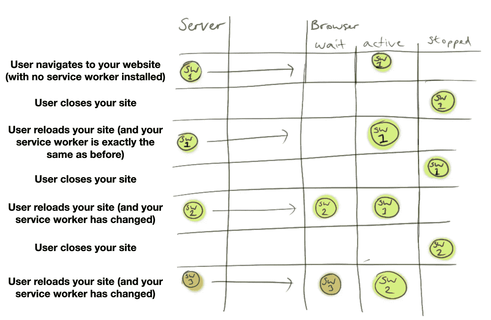
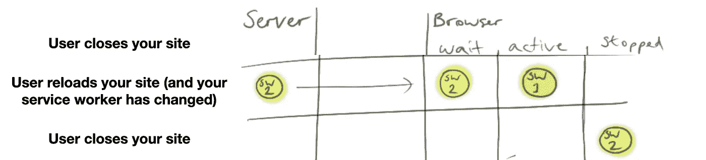
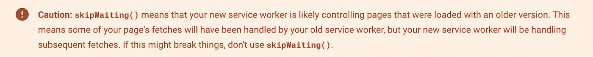
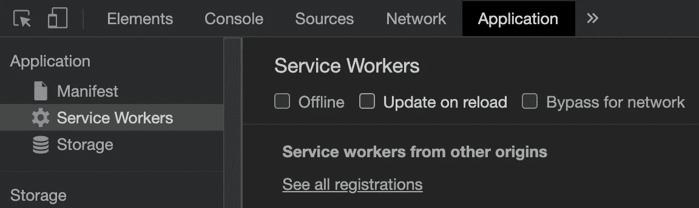
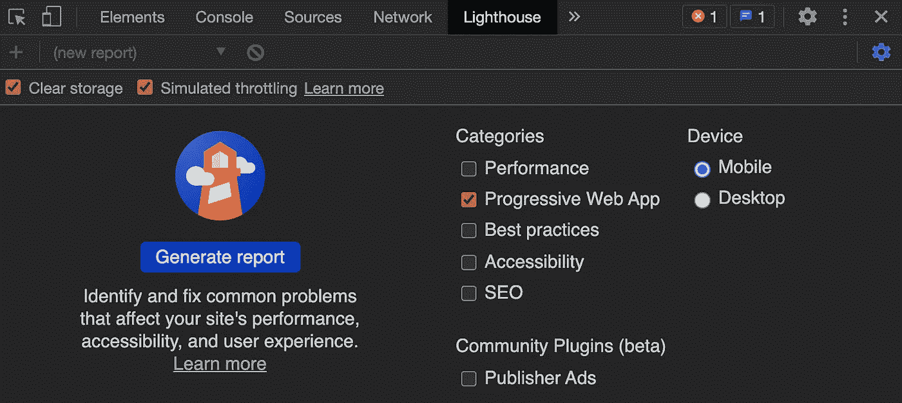

# 为什么艾滋病人既坏又聪明

> 原文：<https://javascript.plainenglish.io/why-pwas-are-annoying-as-hell-and-brilliant-and-just-like-the-music-industry-27ae07cbad8c?source=collection_archive---------13----------------------->

## 为什么它们让我想起了音乐产业

# PWAs 和服务人员生命周期基本上是一场流行竞赛

## 你谷歌过这些吗？

> PWA 冻结 app
> PWA 给旧页面
> PWA 不被替换
> 到底什么是服务人员

让我来帮忙。

## 什么是 PWA？

渐进式网络应用程序可以让用户轻松地将你的网站下载到他们的手机上，缓存页面资源，甚至给用户通知。这都是由服务人员提供动力的。

服务人员是一段代码，*提升*您的网站，能够缓存您页面的资源(疯狂快速的刷新和加载时间)，监控通知推送，安装到手机上等等…

## 怎么会？

它们很容易实现，但会造成很大的混乱，因为它们会拦截发送给浏览器的消息，并导致用户更新延迟——因为它们可以缓存结果。

这些问题是其能力的直接结果，因此要使用它们，你需要很好地了解它们。我在我的兼职项目中使用它们，这样用户可以很容易地在他们的手机上安装应用程序，我可以提醒他们记录他们的一天。

# 生命周期概述—这里发生了什么？

谷歌和戴夫·格迪斯的聪明的科学家们已经为在这里学习这个制作了一个游戏。

简而言之，服务人员是一个 Javascript 文件，可以保存在用户的浏览器中。当它存在时，它不能被改变，它必须被替换。

要被替换，你需要更新你的 Javascript 文件，让里面有不同的内容——即。与旧的不一样。

然后，当浏览器或标签下一次关闭时，新代码将安装到浏览器中，并等到浏览器再次关闭时再安装。



My simplistic understanding.

# 1.安装/注册服务人员


You are not allowed in if you don’t register

本质上，您是在要求浏览器接受`js`文件。为此，你需要告诉互联网浏览器(又名`navigator`)在浏览器的`serviceWorker`区注册这个代码。

`navigator.serviceWorker.register("/serviceWorker.js")`

如果已经安装了服务工作器，并且两个服务工作器的代码与已安装的相同，则不会发生任何事情。如果文件不同，浏览器将存储新版本。

# 2.等待


When you are the first service worker!

如果这是用户第一次运行该站点，服务人员会立即直接等待，因此新请求的服务人员将同时被安装和激活。


## 但是下次

下一次用户访问该网站时，浏览器将再次请求该网站的文件，并接收新版本的服务工作人员。


此服务工作者将不会执行；它只不过是在浏览器中等待，而先前安装的服务工作人员则做所有的艰苦工作。

# 3.激活的

激活意味着服务工作进程正在运行。它在浏览器中可操作。


The party starts; the service worker performs!

服务工作者在用户刷新后仍然存在，因此当前服务工作者将保持活动状态，直到用户导航离开您的站点或关闭浏览器…

# 4.停止

当浏览器关闭时，服务工作人员不再具有执行任何操作的控制权。它已停止，仍在浏览器中，但未终止…


Just chill here until next time — there is no-one else here lined up for next time!

# 5.终止的

只有当页面不再被使用时(即用户离开/关闭了页面的所有实例时)**和**还有另一个服务工作者在等待时，活动的服务工作者才能死亡。此操作将停止浏览器使用服务工作文件，并将其删除。

此时，下一个服务工作者(即等待中的服务工作者)将会激活，但会被停止—这只是在等待，直到下次加载站点。


We always want the newest and coolest performers



Notice the green SW1 disappears as it has been terminated and the yellow SW2 has been put in stopped

# 服务人员故意显得犹豫/有礼貌

他们等待演出或会议结束。

## 如果不是这样培养服务人员……

行为的原因是对资源的请求没有排序。因此，服务工作者可能仅在请求了一些页面资源之后才激活。这意味着您的站点可能同时加载新资源和旧资源。这可能很糟糕……

## 但如果你真的希望这样，你可以这样做:

```
self.addEventListener("activate", event => {
  // waitUntil allows you to pause all other states of life
  // in short it stops fetch events happening so you have a bit more
  // certainty that your resources are fine but it doesn't stop the 
  // main page / index file being loaded as that always happens
  // first
  event.waitUntil(clients.claim())
})
```

注意:我发现在生产环境中始终使用此选项非常谨慎:


[https://developers.google.com/web/fundamentals/primers/service-workers/lifecycle](https://developers.google.com/web/fundamentals/primers/service-workers/lifecycle)

## 在 ASAP 中强制新版本:


有了新的服务员工，你就可以实施新政策。这将意味着新版本的服务工作者将立即安装并激活。

不过在这样做的时候也要小心，因为这可能意味着缓存中没有更新您的新文件(所以您可能还想使用`clients.claim()`):



[https://developers.google.com/web/fundamentals/primers/service-workers/lifecycle](https://developers.google.com/web/fundamentals/primers/service-workers/lifecycle)

# 其他说明

您可能不想与他们一起开发，因为您可能会进行更改，但只能获得缓存版本。你可以做两件事中的一件——把它们设置为当环境变量存在时不安装(比如`development`)，或者让`update on reload`检查你的浏览器开发工具内部(尽管你需要记住总是打开这个)



Chrome’s dev tools

此外，在这些开发工具中，还有一种称为灯塔的东西，用于测试 PWAs，这对于了解一切是否正确非常有用:



*   在重新加载页面时按住`shift`将禁用活动的服务工作者对负载的干预(表现得好像负载不存在)
*   如果服务工作器获取的任何资源失败，服务工作器将被完全忽略，就好像它从未存在过一样…

## 我通过玩这个游戏学到了很多

如果你想了解 PWAs，我会全力推荐它。这很慢，但这是目的——你只能通过重复来学习。

 [## 服务人员

### 编辑描述

精通.游戏](https://mastery.games/serviceworkies/)