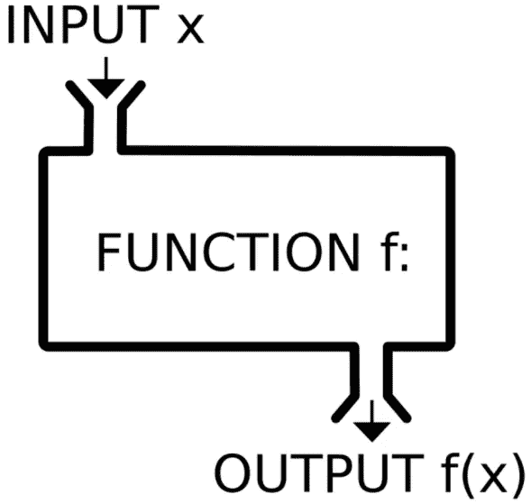
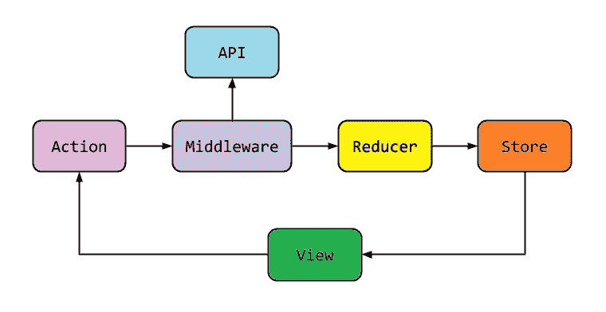
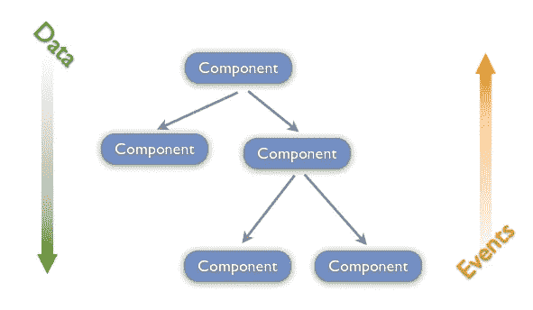

# 为什么要使用无状态组件？

> 原文：<https://javascript.plainenglish.io/why-stateless-components-7c1f2b8b3004?source=collection_archive---------4----------------------->

## 你是否在某处读到过写更多的无状态 UI 组件是好的，但是你不知道为什么？那么这里给你讲一个故事。

[Image from devhumor](https://devhumor.com/media/spaghetti-code-1)

# 介绍

当您开始阅读 [React](https://reactjs.org/docs/state-and-lifecycle.html#the-data-flows-down) 文档时，很快您就会发现越来越多的关于无状态和有状态组件的内容，以及关于使用更多无状态组件而不是有状态组件的争论。但是这种推动的背后并没有足够的推理。我试着用谷歌搜索“为什么是无状态组件”,也没有什么好的理由。我最终得到了这样的结果:

> 尽管 state 很酷，但您应该始终致力于使您的组件尽可能简单和无状态，以便不同的组件可以像乐高积木一样重用，即使您没有立即重用某个组件的计划。有状态的人应该感到幸运！
> ——[来源](https://programmingwithmosh.com/javascript/stateful-stateless-components-react/)

或者这个:

> 什么时候使用无状态组件？？当你只需要呈现道具的时候，当你不需要状态，或者任何内部变量的时候，当创建元素不需要交互的时候，当你想要可重用的代码的时候
> 你什么时候会使用有状态组件？当构建接受用户输入的元素时..或页面上交互的元素，当依赖于呈现的状态时，例如，在呈现之前获取数据，当依赖于不能作为道具传递的任何数据时
> — [源](https://medium.com/@cgcrutch18/stateful-vs-stateless-react-components-13f647f7fc4)

# 为什么是无国籍？

这不足以促使开发人员编写更多的无状态组件。我们退一步来问这个问题。

## 一个组件在软件开发中意味着什么？

一般来说，组件是一段可重用的代码，就像软件开发中的函数或类一样。软件工程师被教导要写干净的代码，分离关注点，写依赖倒置的代码，写可维护的代码。这些规则阻止我们在一个类或函数中编写整个应用程序，这些规则帮助我们开发 Google、Amazon 或脸书规模的可维护应用程序。

在前端和 UI 世界中，组件负责在屏幕上呈现视觉元素，正因为如此，人们认为这是可以否决软件开发规则的特殊代码，但 React 清楚地表明了这一点，并帮助我们理解同样的规则适用于组件。

[Image Copywrite](https://medium.com/@derek.harmanli/js-functional-programming-pure-function-optimization-example-5d04aeb9b867)

## 一个组件应该遵循相同的软件开发规则

如果一个组件只是一个有特定输入输出接口的方法，为什么要写无状态组件？

*   无状态组件是可测试的
*   无状态组件有助于将逻辑从可视元素呈现中分离出来
*   无状态组件有助于编写依赖注入代码
*   无状态组件帮助我们用应用于应用程序其余部分的相同标准编写代码
*   无状态组件清楚地表明 UI 与后端代码没有什么不同
*   您可以将设计模式和坚实的原则应用到您的前端代码中

现在我们编写了更多的无状态组件，会有什么好处呢？！

*   您可以为业务逻辑而不是 UI 元素编写测试
*   帮助 QA 人员只寻找视觉上的不匹配
*   确定业务逻辑
*   使更改用户界面变得简单快捷，而不用担心逻辑问题
*   在 UI 更改方面带来灵活性

如果我们将 UI 和逻辑分离，我们就有了一个可维护的代码库，每个人，尤其是业务部门都将从中受益，否则，久而久之和项目的增长将成为每个人的头痛问题，不仅是开发人员，还有业务人员，因为他们期望快速的变化，而技术无法提供这种敏捷性。

## 逻辑怎么分？

有几个最佳实践架构使我们能够编写无状态组件，如反应广告的 [Flux](https://facebook.github.io/flux/docs/in-depth-overview/) 。但是取决于你的 UI 框架，有不同的架构。这个想法很简单，UI 组件应该足够笨以接受输入，并基于输入呈现作为其输出的可视元素。那么用户输入和表单呢？

用户输入可以保存在小的局部状态中，就像方法或类中的局部变量，然后它应该被推到负责处理逻辑的代码的其他部分。

Flux Architecture

React Data Flow

# 结论

React 通过推动**道具**和**状态**的想法，帮助软件行业将前端代码视为普通的软件代码。这是一个令人敬畏的步骤，因为在此之前，人们在前端思考，他们可以做他们想做的任何事情，因为它是例外的，不遵循软件开发规则，这是不正确的。

总之，让你的按钮和卡片无状态是不够的。你甚至可以让表单成为无状态的，唯一的事情就是组织一个合适的架构来允许你这么做。

*更多内容请看*[***plain English . io***](http://plainenglish.io/)