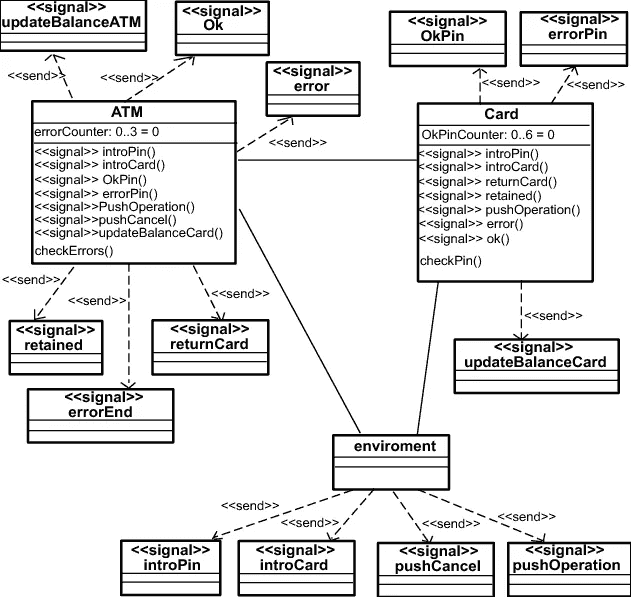
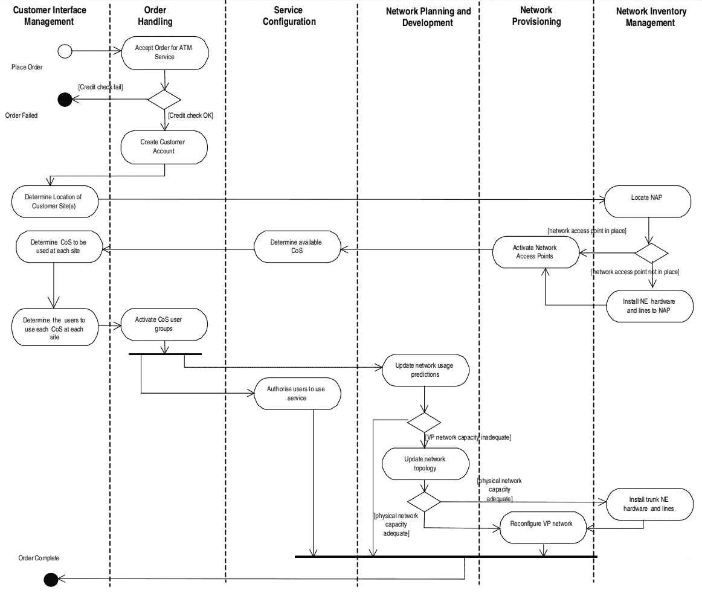
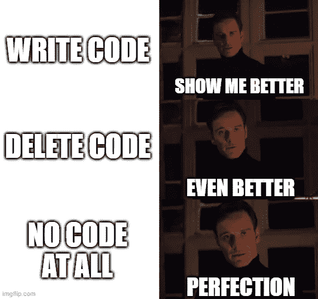
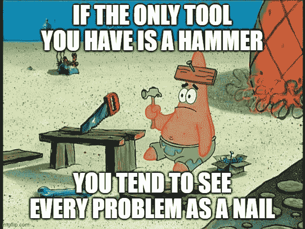

# 为什么是溪流？

> 原文：<https://javascript.plainenglish.io/why-streams-56dd72975ad8?source=collection_archive---------9----------------------->

势在必行，面向对象的编程非常强大，但是对于某些问题，流更适合。在本文中，我列举了一些用例，在这些用例中，我发现 RxJs 流比仅使用命令式方法能产生更好的解决方案。

Photo by [Karim Sakhibgareev](https://unsplash.com/@karimsan?utm_source=medium&utm_medium=referral) on [Unsplash](https://unsplash.com?utm_source=medium&utm_medium=referral)

我来自面向对象的背景，有 C++、C#和 JavaScript/TypeScript 方面的经验。我对面向对象的思维模式很有信心，我可以编写相当好的命令式代码来解决我的大部分问题。然而，在过去的几年里，我发现自己写了越来越多的重流代码。我认为我正在使用面向对象架构和流相结合来创建明显更好的代码。

在本文中，我回顾了那些我发现 streams 更优秀的用例。我关注的是在大多数 OO 代码库中应用流，而不是那些已经建立在类似 Redux 的状态管理(例如 NgRx)之上的代码库。

首先，我必须提出一个微不足道的概念。它可能很琐碎，但我花了一段时间才完全理解。

# 流不是面向对象的

如果你来自面向对象的背景，除了面向对象原则之外，你很有可能需要拥抱一种不同的方法*。因为**流不是面向对象的**。*

面向对象方法使用分治法。整个问题太大了，所以我们一次又一次地将它分成更小的块，并创建我们可以管理的更小的责任组——类。也许你已经这样做了很多年了。你知道设计模式，创建了很好的架构，你已经掌握了一些 MV*框架，三层架构，等等。

## 转换思维模式

设计合适的流有点违背这种思维模式。我们不应该问“谁拥有这些数据”、“这个任务属于哪个责任”或“要定义什么数据类型(类)”这样的典型问题。这些不一定对我们有帮助。

> 相反，关注目标:用这个流解决什么？然后:解决这个任务需要哪些输入(数据源，最好是输入流)？

剩下的会做相应的安排。一个典型的例子是这样的:我们将所有的输入都作为流。让我们将它们合并成一个单一的，然后通过一些映射操作，也许是一些过滤器，然后订阅结果，使事情在应该发生的时候发生。但这一开始可能会觉得有些奇怪。

对于更复杂的管道，会有许多中间数据类型。核心的面向对象思维可能会开始小声地为所有东西定义类型。你不应该。

对于异步任务，执行可能感觉太不稳定，并且没有明确的所有权。是的，因为它是一个流，而不是众所周知的面向对象解决方案(例如，一个类的异步函数)。

流可能组合来自不同来源的数据源，这可能感觉像是对单一责任原则的背叛。但是也许你的 OO 肌肉有点太活跃了。

## 面向对象是静态的，流关注动态

面向对象主要关注代码中更静态的部分:或多或少永久存在的对象(如服务)或被传递的数据。面向对象的思维模式接近于数据库、类，也许还有 UML 中的部署图。

Class diagram of the ATM system from [Carlos E. Cuesta](https://www.researchgate.net/figure/Class-diagram-of-the-ATM-system_fig3_222961575). Note that this tells us only a little about the dynamic behavior: about how things interact over time.

> 流更接近于 UML 的序列图或活动图。

Streams excel 在命令式代码较弱的地方:关注代码的动态行为，而不是单一的线性执行。

Example of UML activity diagram showing subscription to an ATM service from [David Lewis](https://www.researchgate.net/profile/David-Lewis-60). It focuses on the dynamic behavior rather than the classes&interfaces.

这两种方法并不相互排斥，它们经常相互补充。例如，您仍然可以将您的流分类。我经常这样做。它为应用程序提供了一个良好的面向对象架构，如果你已经有了一个面向对象框架(例如一个 2/3 层的 Node.js 应用程序或 Angular 中的任何东西)，这可能是你想要的。另一方面，也可以使用纯函数。

# 在哪里使用流？

编程很难。我们需要又快又好地解决复杂的问题。而且经常搞砸，经常是被过去的我写的烂代码搞砸。该死的。

因此，至少，我们应该选择各种各样的解决方案，为应对各种各样的挑战做好准备。让我们看看为什么溪流是我们腰带的重要资产。

## 1.溪流给地表带来了复杂性

溪流不容易。我认为命令式代码更容易理解。(这可能是因为我的教育和背景，但是，嘿，大多数程序员可能都是这么看的。)

但是命令式代码有一个基本问题:它关注顺序执行。

命令式代码的线性执行很容易理解。然而，如果一个命令式代码(例如一个对象)以各种方式被触发，我们必须处理不断变化的内部状态和一些约束，那么就很难看到全局。

我是说，涵盖 95%的可能状态转换是很容易的。但是我们错过的单边案例呢？我们如何确保所有可能的转换都被适当地覆盖？好吧，如果你是一个经验丰富的工程师，你有一些诀窍。你可以使用状态机。来自四人组的[设计模式，也来自你的经验。当然是各种层次各种口味的测试。坚实，干燥，YAGNI，最重要的是:通过多年的编码积累的普遍智慧。](https://www.amazon.com/Design-Patterns-Elements-Reusable-Object-Oriented/dp/0201633612/)

但是，您如何知道您已经涵盖了所有的边缘情况呢？

所以看似简单的命令式代码很容易成为丑陋的错误的温床。

如果应用得当，流可以为应用程序的正确性提供更强的保证。尽管它们是有代价的，但它们让问题的复杂性变得清晰可见。我们必须把这个问题作为一个整体来理解，来处理流。

> 当使用流时，我们必须丢掉简单的幻想。

## 2.数据流:创建一次，处理所有更改

假设我们有一个前端组件，它从 3 到 4 个来源收集数据，然后显示一些派生数据。这些资源中的任何一个都可能随时间任意改变，我们必须保持 UI 的更新。

命令式代码可能会在发生任何变化时重新计算。这非常简单易懂。但是说，我们必须保持一个间隔运行，不能停止&重新开始。或者数据很大并且经常变化，因此性能方面的问题即将出现。现在，无论什么时候*的某个东西*发生变化，我们都无法重新计算*所有的东西*。是时候变聪明，开始一个接一个地处理每个变化了，对吗？不对。变得聪明通常是一个非常错误的想法，并且经常会导致神秘的代码和/或大量的错误。

这正是溪流介入的时刻。如果 3–4 个数据源作为流可用，我们可以从它们构建一个管道来计算派生的数据。

通常，创建这个管道比编写命令式代码更困难。尤其是如果你是新来的。但是一旦我们理解了这个问题(并且有一点流的经验)，就很容易创建一个高效的、*不那么容易的*，但是*仍然更容易推理的*代码。

您构建的流管道将处理第一次计算，然后以同样的方式处理所有可能的更改。根据我的经验，这将为偷偷摸摸的边缘情况留下更少的空间，代码将有更少的错误，它将更短，更容易维护。

## 3.跨平台的标准化工具箱

[Rx 在许多编程语言中可用](http://reactivex.io/languages.html)。我主要关注 RxJs，但是这些例子在其他语言中也有效。

当构建管道来创建新的流时，**我们有一套令人印象深刻的操作符和其他工具供我们使用**。这个工具箱可以卸下我们肩上的重担。

Photo by [Barn Images](https://unsplash.com/@barnimages?utm_source=medium&utm_medium=referral) on [Unsplash](https://unsplash.com?utm_source=medium&utm_medium=referral)

RxJs 中的[操作符和其他工具](https://rxjs.dev/api)需要相当长的时间来熟悉。但它们可以极大地提高程序员的生产率，因为它们可能有助于解决许多更困难的问题。

在编程领域，投资于自己的生产力通常是一个非常好的主意。我强烈推荐所有 Js 开发者熟悉 RxJs。如果你是团队领导，也要从团队生产力的角度考虑这个问题。

不是所有的东西都值得投资。但如果用 Angular，最好熟悉 Angular 的细节。React 或 Vue 以及所有其他框架也是如此。我认为 RxJs 值得在这些值得熟悉的工具中占有一席之地。

掌握 RxJs 需要时间和大量的练习。你会搞砸几次。你会付出代价的。但以我的经验来看，这是值得的。

## 4.易测性

你做测试对吗？对吗？！

RxJs 有[相当好的测试工具，marble 测试真的很强大。它们很容易理解，它们可以处理与时间相关的东西(除了承诺)，它们帮助你惊人地准确识别你的流的行为！](https://rxjs.dev/guide/testing/marble-testing)

## 5.控制的解耦和反转

很难定义什么是好代码。但是有些方面抓住了好代码的一个重要属性。就像去耦一样:

> 好的代码很容易删除。

还有更多:

> 删除代码比编写代码更有趣。

你没感觉到吗？当删除一大块过时的代码时，当清除一些旧代码中一些令人讨厌的部分时…这很好。但最好的是:

> 最好的代码是根本没有代码。

尽管如此，我们还是在这里，在大部分工作日写代码。(有时在周末。谢谢你的耐心，我的爱人！)

**好的代码被解耦**。很容易独立于其他部分或多或少地修改或删除每个部分。而**流可以改善解耦**。

类似于控制反转(IoC)。最初，IoC 用于依赖注入(DI)。流有些类似:它们是对类交互的**控制反转。这是什么意思？假设我们有"*A 类"*管理一些数据，而"*B 类"*对这些数据的变化感兴趣。**

*   老办法:*A 类*期望回调或者给定接口通知它。*类 B* 将提供回调或者实现给定的接口。
*   更解耦的方式(又名[观察器模式](https://en.wikipedia.org/wiki/Observer_pattern)):*A 类*提供一个可观察值。B 类将认购——或将由外部方认购。*A 类*和*B 类*没有直接接触点。

看后一个怎么更解耦？还有一个好处:它可以无缝地处理更多订阅。

## 6.表演

我的另一个经验是，面向流的解决方案通常比基本的命令式方法更有效。出于这个原因，Angular 的 [OnPush 变化检测策略](https://netbasal.com/a-comprehensive-guide-to-angular-onpush-change-detection-strategy-5bac493074a4?gi=171010e2eb4f)在很大程度上依赖于流和*异步*管道。

流管道的微调本质上相对容易。当然，你必须了解订阅是如何工作的，并学习[区分时间变化](https://rxjs.dev/api/operators/distinctUntilChanged)、[分享](https://rxjs.dev/api/operators/share)、[分享](https://rxjs.dev/api/operators/shareReplay)操作符来让信息流闪耀。但是，这些仍然是强大的——一旦你开始理解它们——非常简单的工具。

关于这个主题，我有一个很好的调试挑战，请随意测试您的知识。

 [## RxJs 挑战:发现错误

### 我已经用 RxJs 流烧伤了自己(一点点),所以你不必这样做。欢迎来到 RxJs 上的这个简短的调试之旅。

javascript.plainenglish.io](/rxjs-challenge-spot-the-mistake-fa4fbd163135) 

## 7.妥协更少

当处理与时间相关的复杂问题时，我经常发现自己做出了令人不满意的妥协。类似这样的话:“嗯，让我们把时间间隔定为 100 毫秒，这就足够接近了。”它通常是绰绰有余的，但仍然…它在我的嘴里留下了不好的味道。

当使用 streams 时，我几乎发现自己面临这样的妥协。也许是因为当使用 streams 时，我被迫面对问题的整体复杂性。除了理解它，我还有合适的工具来轻松地创建解决方案。

> 当使用 streams 时，我可以用更少的时间和精力来更好地工作。

## 8.开始反复使用它们

想尝一口溪水吗？好消息:你也可以在面向对象的代码库中引入流。您不必全力以赴地面向流或功能化来获得流的好处。

目前，我在一个面向对象的代码库上工作，我们在需要的时候逐步引入流。新代码通常比旧代码更加面向流。尽管如此，我们还是计划保留优秀的老 OO 架构。它很好地服务于我们，解决了我们的许多问题。

> 因此，在保持面向对象架构的同时，我们到处添加更多的反应式解决方案。

当然，有一个关于代码库的**一致性的问题。你不应该登上你遇到的每一辆炒作列车。但是 streams 和 RxJs 的工具箱值得考虑采用。我认为收益远远大于成本，尤其是如果你能达到一个转折点，流的收益开始增加，事情变得更加协同。**

# 什么时候不使用流？

流只是熟练程序员手中的一个工具——一个重要的工具。当它使你的生活变得更容易时，你应该使用它。

If you only know OO, you’ll try to solve everything using OO. And the very same goes for streams.

让我们来看 3 个不应该急于使用流的用例。

## 非常简单的问题

你不需要溪流来做这些。它们只会让非常简单的问题变得更加困难。

## 严格线性执行

例如算法；或者大多数基本的 3 层和/或 MVC 架构。

通常，对 3 层 web 应用程序的调用是这样的:

*   *控制器*:客户端请求东西
*   *控制器* → *服务*:拿东西
*   *服务* → *仓库 1* :从数据库中获取一些东西
*   *维修* → *仓库 2* :从 DB 获取其他材料
*   *服务*:计算并返回东西给控制器
*   *控制器*:返回东西给客户端

很简单，不是吗？这里没有太多空间给溪流。ASP.NET MVC、 [Nest.js](https://nestjs.com/) ，甚至一个合适的 Laravel app 都可以做到这一点。

如果你有一个相当大的内存状态(比如一个游戏逻辑)与客户端交互，趋势就开始转变。这是一个很好的候选流。

## 我想用溪流

这是值得称赞的，然而，欲望不应该指导建筑决策。首先，找到一个适合流的问题。

# 包裹

当使用流可以提高您的性能和您创建的代码的质量时，我强调了以下几个方面。

1.  溪流给地表带来了复杂性
2.  数据流:创建一次，处理所有更改
3.  跨平台的标准化工具箱
4.  易测性
5.  控制的解耦和反转
6.  表演
7.  妥协更少
8.  开始反复使用它们

在接下来的几周里，我会写更多关于溪流的内容。感兴趣就订阅吧。

# 感谢

有专家帮助你，你可以学得很快。我从贝特森的 Viktor 和 Péter 那里学到了很多关于 NgRx &一些高级流的东西。谢谢伙计们。

*更多内容看* [*说白了就是*](http://plainenglish.io/) *。报名参加我们的* [*免费周报在这里*](http://newsletter.plainenglish.io/) *。*