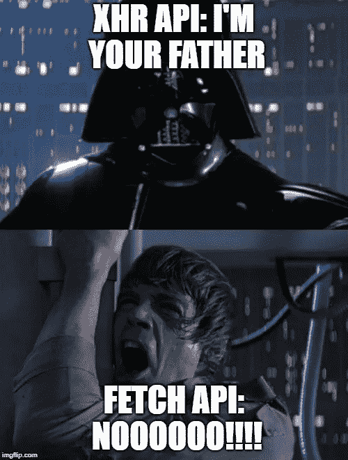
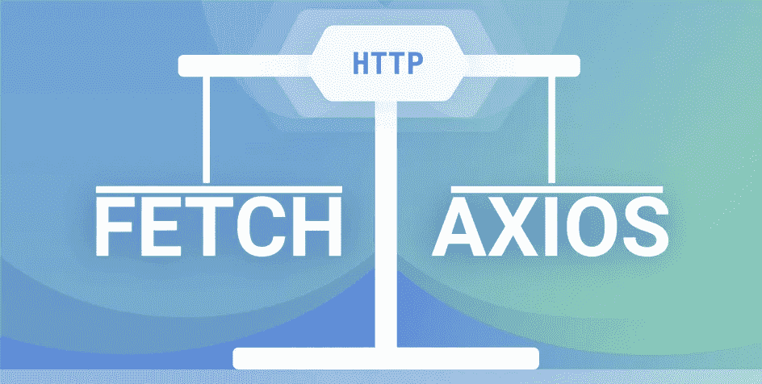

# 为什么 Axios 更适合获取

> 原文：<https://javascript.plainenglish.io/why-switch-to-axios-instead-of-fetch-d80c3fe2f156?source=collection_archive---------5----------------------->

## Axios 和 Fetch 之间的区别以及应该使用哪一个？

Axios 是一个 JavaScript 库，用于从 Node.js 发出 HTTP 请求，或者从浏览器发出 XMLHttpRequests，它支持 JavaScript ES6 自带的 Promise API。它的另一个特点是。fetch()的优势在于它执行 JSON 数据的自动转换。


## **Fetch()**

`Fetch()`是获取 API 中 JavaScript 窗口对象方法的一部分。它是内置的。`Fetch()`允许我们从 API 异步获取数据，无需安装任何额外的外部库。



```
fetch(url)  
.then((res) => {    
  // handle response  
})  
.catch((error) => {    
  // handle error  
});
```

`Fetch()`有几个参数

*   **网址— ( *必填* )**
*   **选项— ( *可选* )**

根据您的请求类型，您可以发送几个选项

```
- **method** - request type like POST, GET etc
- **headers** - request headers
- **body** -any payload you want to pass for POST/PUT requests
```


因为`Fetch()`没有将数据转换成类型，所以有几种方法可以根据预期的数据类型来处理响应。

*   `response.json()`——*最常见的*
*   `response.text()`
*   `response.blob()`
*   `response.formData()`
*   `response.arrayBuffer()`

下面的例子

```
const url = "http://api.com"
const data = { 
    firstName: "Sumeet", 
    lastName:"Bhalla", 
    age: 30 
  }fetch(url, {  
  method: "POST",  
  headers: {    "Content-Type": "application/json",  },  
  body: JSON.stringify(data),
})  
.then((response) => response.json())
.then((data) => console.log(data))
.catch((error) => console.log(error));
```

## **Axios**

`Axios`是一个 JavaScript 库，用于从 Node 或 XMLHttpRequest 或浏览器发出 HTTP 请求。作为一个现代化的库，它基于 Promise API。

```
axios.get(url)  
.then((response) => console.log(response))  
.catch((error) => console.log(error));
```

`Axios`也有几个参数([更多细节](https://github.com/axios/axios#request-config))—

*   `url —` **( *强制* )**
*   `baseUrl`
*   `params`
*   `auth`
*   `headers`
*   `responseType`
*   `data`

作为响应，Axios 返回一个承诺，该承诺将通过响应对象或错误对象来解决。在响应对象中，有以下值:

*   `data` : 实际响应体
*   `status`:呼叫的 HTTP 状态码，如`200`或`404`
*   `statusText` : HTTP 状态为文本消息
*   `headers`:与请求中相同
*   `config`:请求配置
*   `request` : XMLHttpRequest (XHR)对象

以下示例

```
axios({  
  url: "http://api.com",  
  method: "POST",  
  header: {    
    "Content-Type": "application/json",  
  },  
  data: { 
    firstName: "Sumeet", 
    lastName:"Bhalla", 
    age: 30 
  },
});
```

## **Axios vs Fetch()**



[link](https://blog.openreplay.com/fetch-vs-axios-which-is-the-best-library-for-making-http-requests)

**1 —** **简洁的代码** —因为`Fetch()`使用了响应的 body 属性，并且响应数据是字符串化的，所以你需要 2 个承诺来将数据转换成 JSON 或其他类型，然后才能使用它。`Axios`默认情况下这样做，并在单个响应中返回 JSON 中的数据。

```
fetch(url)  
.then((response) => response.json())
.then((data) => console.log(data))
.catch((error) => console.log(error));==== vs ====axios.get(url)    
.then((response)=>console.log(response))    .catch((error)=>console.log(error))
```

2 —在`Fetch()`中，您将 URL 作为参数传递，而在`Axios`中，您将它作为选项传递。

**3 —错误处理** = >在`Fetch()`中，您将需要检查响应状态，而不管响应类型如何，因为只有当请求以某种方式被拒绝时，Fetch()承诺才会被拒绝，否则您需要验证响应类型，然后从那时起抛出错误。它不会抛出网络错误等，所以你需要手动检查。

在`Axios`中，处理错误非常容易，因为 Axios 会抛出网络错误。如果出现类似`404`的不良响应，承诺将被拒绝，并返回一个错误，可以很容易地检查该错误，以确定错误的类型。

```
fetch('url')    
.then((response)=>{        
  if(!response.ok){            
    throw Error (response.statusText);        
  }        
  return response.json();    
})    
.then((data)=>console.log(data))    .catch((error)=>console.log(error))==== vs ====axios.get('url')    
.then((response)=> console.log(response))    
.catch((error)=>{        
  if(error.response){        
      console.log(error.response.data);    //not in 2xx range     
  } else if (error.request){                 
    console.log(error.request);        //no response received
  } else {                  
    console.log(error.message);      // Any other Error  
  }    
})
```

4 — `Axios`又能保护你了 [**跨站请求伪造(CSRF)**](https://www.netsparker.com/blog/web-security/csrf-cross-site-request-forgery/)

**5 —超时** —在`Fetch()`请求中设置超时稍微麻烦一些，因为您需要显式标识 *AbortController* 接口，然后使用 signal 属性来处理它。

而在`Axios`中，您可以直接使用 config 对象中的 timeout 属性。

```
const controller = new AbortController();
const signal = controller.signal;
const options = {  method: 'GET',  signal: signal};  
const timeoutId = setTimeout(() => controller.abort(), 3000); fetch('/userData', options)  
.then((response) => response.json())
.then((data) => console.log(data))
.catch(error => console.error('timeout exceeded'));==== vs ====axios.get({
  method: 'get',    
  url: '/userData',    
  timeout: 3000,    // 3 seconds timeout    
})    
.then((response)=> console.log(response))    
.catch((error)=>{                    
    console.error('timeout exceeded')
  }    
})
```

**6 —** **并发请求** —如果您想使用`Fetch()`并行运行多个请求，您可以使用 Promise.all()。类似地，`Axios`提供了一种方法，使用 Axios.all 用更少的代码行做同样的事情，然后使用 spread 操作符将响应分割成单独的对象。

```
Promise.all([    
  fetch('https://mywebsite.com/user/getInfo'),   
  fetch('https://mywebsite.com/user/getFriendList')])
.then(async([res1, res2]) => {  
  const userInfo= await res1.json();  
  const userFriendList= await res2.json();  
  console.log(userInfo);  
  console.log(userFriendList);
})
.catch(error => {  console.log(error);});==== vs ====axios.all([  
  axios.get('https://mywebsite.com/user/getInfo'),   
  axios.get('https://mywebsite.com/user/getFriendList')])
.then(axios.spread((obj1, obj2) => {  
  // Both requests are now complete  
  console.log(obj1.data);  
  console.log(obj2.data);
}));
```

**7 —上传和下载进度** — `Fetch()`允许您使用`response.body`属性中的一个`ReadableStream`对象来监控下载进度。它逐块提供主体数据，并允许您及时计算消耗了多少数据。然而，`Fetch()`没有给你任何方法来监控你的上传。！！

`Axios`另一方面，提供了一种监控上传和下载的方式。您可以使用 [Axios 进度条](https://github.com/rikmms/progress-bar-4-axios/)来监控下载，使用*onuploadpress*config 属性来监控上传状态。

**8—向后兼容** — `Fetch()`仅支持 Chrome 42+，Safari 10.1+，Firefox 39+，Edge 14+。甚至像 IE11 这样的老浏览器也可以毫无问题地运行`Axios`。如果您正在创建一个需要更广泛兼容性的应用程序，这可能很重要。

## **结论**

希望这能给你一些指导，告诉你为什么应该尝试并尽可能切换到 Axios，以及如何利用它的所有特性。


## **伟大的阅读**

*   https://better programming . pub/why-JavaScript-developers-should-prefere-axios-over-fetch-294 b28 a 96 e2c
*   https://medium . com/@ the Jason file/fetch-vs-axios-js-for-making-http-requests-2b 261 CD D3 af 5