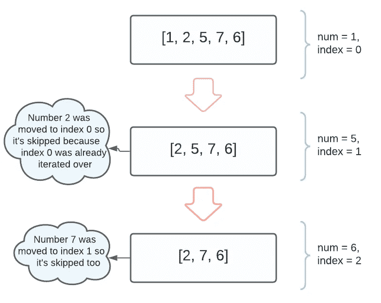

# 为什么 forEach JavaScript 方法不总是最佳选择

> 原文：<https://javascript.plainenglish.io/why-the-foreach-js-method-might-not-always-be-the-best-choice-5eeaf048c3a2?source=collection_archive---------12----------------------->

这是一个我发现自己多次陷入的陷阱。


Photo by [NeONBRAND](https://unsplash.com/@neonbrand?utm_source=medium&utm_medium=referral) on [Unsplash](https://unsplash.com?utm_source=medium&utm_medium=referral)

虽然当您想要在 JavaScript 中循环一个元素数组时，`Array.prototype.forEach()`方法看起来是一个不错的选择，但是在很多情况下，一个简单的`for`循环或另一个内置数组方法才是您所需要的。

让我们创建一个简单的`forEach`方法的糟糕用例的例子:

```
let array = [1, 2, 3];array.forEach(num => num += 1);
```

`forEach`接受一个回调函数作为参数(`num => num += 1`)，它又有一个参数`num`。这个参数将被赋予在`forEach`的每次迭代中被迭代的元素的值。因此，给定数组`[1, 2, 3]`，数字 1、2 和 3 将在每次迭代中被分配给回调的参数`num`。

现在可以说在原始值(比如数字)的情况下，JavaScript 是“按值传递”的。这意味着当我们传递数组的第一个元素时，在我们的例子中，数字`1`作为回调函数的参数，实际发生的是数字 1 的*副本*被赋给变量`num`。调用数组中索引`0`处的元素和回调函数中变量`num`的值完全相等；他们没有任何联系。

在回调中，我们将`num`的值重新分配给`num + 1`的结果(也就是说，我们将它的值增加 1)。因此，`num`现在将等于`2`(在第一次迭代时)。然而，*调用数组元素的值不会受到这种重新分配的影响，*因为“按值传递”行为。调用数组仍将包含元素 1、2 和 3。

这是一个我发现自己多次陷入的陷阱，通过写下它，我不仅试图分享它，还试图让我的脑袋永远围绕着它。一个有经验的开发人员只要看一下上面的例子就会知道有什么地方出错了。这个例子，按照现在的方式，没有有用的返回值(`forEach`总是返回`undefined`)，也没有副作用；换句话说，它什么也没做。

如果目标是增加数组中的每个元素，我们可以通过使用`Array.prototype.map()`方法来实现，如果我们不介意用一个新的数组来代替变异调用数组，或者用一个很好的旧的`for`循环来变异原始数组，就像这样:

```
for (let i = 0; i < array.length; i++) { array[i] += 1;}
```

长话短说，例如，您不能像使用`map`那样使用`forEach`循环来更改数组元素的值。如果这是你的目标，最简单的方法就是去做一个`for`环。但是，请注意，如果数组的元素本身是对象，那么*可以*改变它们。

编辑:然而，这个问题有一个不太常见的解决方法，使用分配给调用数组的第三个参数`forEach`，如下所示:

```
array.forEach((_, index, arr) => arr[index] += 1);
```

其他一些不适合使用`forEach`循环的情况是，在满足某个条件后，您打算退出循环机制，或者当您想在循环过程中改变调用数组时。在第一种情况下，`forEach`根本不会工作，因为没有办法退出它；在后一种情况下，如果突变影响了调用数组的长度属性，您可能会得到意想不到的结果。

例如:

```
let nums = [1, 2, 5, 7, 6];nums.forEach((num, index) => {
  if (num % 2 === 1) {
    nums.splice(index, 1);
  }
});nums; //returns [ 2, 7, 6 ]
```

在上面的例子中，我们试图使用`Array.prototype.splice()`破坏性方法从`nums`数组中移除每个奇数。不过从最终返回值可以看出，`nums`还是包含了奇数`7`。这是因为当`forEach`循环遍历数组时，每个元素及其对应的索引都作为参数传递给回调函数。当一个元素被移除时，下一个元素将占用被移除元素的槽，并因此占用其索引。在`forEach`的下一次迭代中，分配给`index`的值将随着迭代进行到下一个元素而递增，忽略向后移动一个槽的元素。

这在下面的流程图中有更好的解释:



*更多内容请看*[*plain English . io*](http://plainenglish.io/)