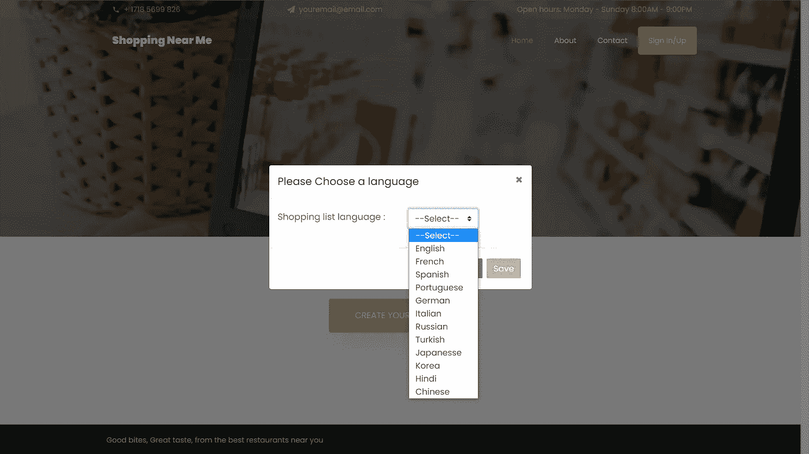
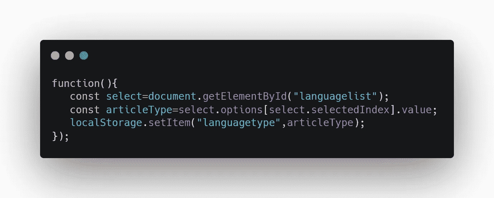

# 如果可以使用 Web 存储 API，为什么还要使用数据库呢？

> 原文：<https://javascript.plainenglish.io/why-use-a-database-when-you-can-use-the-web-storage-api-b87be20e2f1b?source=collection_archive---------11----------------------->


Photo by: @[kirill2020](https://unsplash.com/@kirill2020) on Unsplash.

每当我们决定在 web 应用程序上保存信息时，我们会立即想到数据库。比方说，如果我们要保存的信息涉及到一段数据，我们可以选择使用 PHP 中的 Session。

如果您决定使用会话或数据库，那么您必须将服务器考虑在内。使用服务器需要 PHP、Python 之类的后端语言，或者 Express.js 之类的框架，这需要一些额外的工作。

## Web 存储 API

为了避免通过会话和数据库存储少量信息，我们可以依赖 Web 存储 API，正如我们在 Mozilla Developer Network 中的朋友所定义的:

> Web 存储 API 提供了浏览器可以安全存储键/值对的机制。

Web 存储就像 JavaScript 中的键值数据类型，我们有一个属性，每个属性都有一个值。Web 存储技术与众不同，它可以在刷新页面甚至关闭标签时保持不变。

在不使用服务器的情况下，在页面之间甚至关闭浏览器时保存数据是一个好主意。

尽管我们是从使用数据库开始运行的，但 Web 存储仍然充当一个微型数据库，在特定设备上的浏览器中存储数据。当处理使用多个设备的用户时，使用 Web 存储没有帮助。

我在去年使用`localStorage`机制的时候了解了 Web 存储，但是在最近的一个项目中我没有使用 Web 存储 APIs tell 2021。

在我的项目中，我需要存储用户选择的值。存储的值将决定我们应该用哪种语言显示网站。



Photo by the author

上图显示了一个包含选择列表的表单。选择所需的语言并单击 save 后，我们将使用 Web Storage API 来存储所选的值(如下所示)。



正如你在上面的例子中看到的，在获得选择的值后，我们使用 Web 存储 API 的`localStorage`机制将其存储在“langaugetype”的名称下，尽管如果你不了解 Web 存储 API，这可能看起来很复杂。

现在让我们来看看 Web 存储 API 是如何工作的。

## 使用 Web 存储 API

Web 存储 API 有两种机制:`sessionStorage`和`localStorage`。两者都用于存储数据，但每种机制都有独特的使用案例。

## **会话存储机制**

对于`sessionStorage`,我们只为一个会话存储数据。这种机制会存储数据，直到您关闭浏览器/选项卡。我们可以说它有一个有效期。

开发人员很少使用`sessionStorage`，因此，我们将不深究这种机制。你不必担心`sessionStorage`如何工作，我们将专注于工作方式类似的`localStorage`。

如果对`sessionStorage`感兴趣可以去 Mozilla 开发者网查看[*window . session storage*](https://developer.mozilla.org/en-US/docs/Web/API/Window/sessionStorage)。

## `LocalStorage mechanisme`

localStorage 中的数据不会像 sessionStorage 那样过期。即使您关闭了浏览器/窗口，数据也会持续存在，破坏这些数据的唯一方法是通过 JavaScript 或清除浏览器缓存。

要在`localStorage`对象中设置数据，我们将使用 setItem()方法:

```
localStorage.setItem('dataname', 'datavalue');

//examplelocalStorage.setItem('birthday',new Date().toLocaleDateString());
```

为了从`localStorage`对象中获取数据，我们可以使用 getItem()方法:

```
const birthday= localStorage.getItem('birthday');
```

要获取本地存储的值，需要将其名称传递给 getItem()方法，这与在 Map 中存储和获取数据是一样的。

如果不再需要存储的数据，可以使用 removeItem()方法删除它:

```
localStorage.removeItem('birthday');
```

但是，Web 存储机制的存储空间有限，不同浏览器的存储空间各不相同。如果你决定清理被占用的空间，你可以使用 clear()方法。

```
localStorage.clear();
```

`localStorage`有一些缺点，比如不能以除字符串之外的任何格式存储数据，你可以通过使用 JSON.stringify()方法将你的数据转换成字符串，然后使用 JSON.parse()进行反向操作来克服这个缺点。

## 最后。

无论您使用的是`sessionStorage`还是`localStorage`，Web 存储 API 的这些机制都非常容易使用。

使用 Web 存储 API 和 fetch()方法，您可以将 SPA 或单页面应用程序推向下一个级别，而不需要外部方。

*更多内容请看*[***plain English . io***](http://plainenglish.io/)