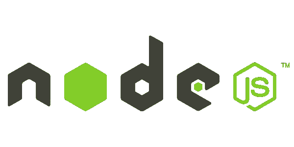

# 为什么使用 MERN 堆栈是一个受欢迎的创业应用想法

> 原文：<https://javascript.plainenglish.io/why-using-the-mern-stack-is-a-popular-start-up-app-idea-87a4a0e8ebbf?source=collection_archive---------1----------------------->

## **借助 MERN 堆栈的优势，您可以轻松构建初创应用**

## 要使任何应用程序成功，使用正确的技术总是谨慎的。MERN 堆栈为您的前端和后端开发提供了杠杆作用。

来源:谷歌图片

如果你是一家初创企业，无论你多么精通技术，对你来说一切都是新的。经营一个商业马车的轮子和作为轮子上的一个齿轮是两回事。

**根据 Investopedia 的报告，20%的初创企业在第一年就失败了。只有 25%的企业跨越了 15 年大关**。

除了投资，选择正确的技术堆栈是第一个障碍。对于企业来说，要确保快速的 web 开发和出色的功能，选择合适的技术栈可以为用户提供迷人的 web 体验。因此，如果你正在寻找[雇用 MERN 栈开发人员](https://www.valuecoders.com/hire-developers/hire-mern-stack-developers)、，那么这可能会成为应用程序开发的一个良好开端。

开发一个 web 应用程序需要大量的独特性和创造性。网页设计的稳健性和创造性不再是一个惊喜，而是让你的业务处于主导地位。对于初创企业来说，没有什么能与 MERN 在科技领域竞争。

# **初创企业需要做什么？**

**对于成功的初创企业，你应该点击所有要点，让市场感受到你的存在。**

*   **需要快速迭代—** —任何初创公司都应该时刻准备好测试产品并将其推向市场。
*   **快速可伸缩性-** 他们应该为可伸缩性做好准备，像 PayTM & Myntra 一样一夜成名。一个印度应用程序，Chingari 在几周内从 50 万增长到 1000 万。
*   在紧迫的期限内工作——时间就是金钱！在项目交付中，你应该像一道闪光一样快速移动，因为你的商业竞争对手随时准备超越你，抢尽风头。

> 如果你想知道 MERN 是如何让你占上风的？让我们结帐吧！

大多数企业家都知道通用的技术堆栈。然而*、*我们带来了一个全面的指南，来[、**聘请 MERN 栈开发者**进行 app 开发项目](https://www.valuecoders.com/hire-developers/hire-mern-stack-developers)给那些刚刚把脚放在踏板上的人。

# **什么是 MERN 堆栈？**

MERN 堆栈的流行在于它是一个健壮的和高度可伸缩的技术的集合，用于开发包含前端和后端数据库组件的可伸缩的主 web 应用程序。

A **mean stack development** 是一家拥有用户友好的全栈 JavaScript 框架的初创公司，该框架用于为初创公司的应用程序构建动态网站和应用程序。

它包括一些精心挑选的技术，如 **MongoDB、Express、React JS 和 Node.js.**

寻找 **MERN 的企业家们堆砌项目创意，**那么你就不是新的**。我们可以说有一个专门的社区在竞争使用 MERN 开发项目。**

**1。MongoDB:**

MongoDB 是一个**开源、跨平台、NoSql DBMS** 。面向文档的数据库，这意味着可以使用集合和文档保存数据。它以二进制 JSON 格式存储数据，确保客户机和服务器之间的快速数据交换。一家**初创的应用程序开发公司**使用这种可扩展的技术增强了其存储大量数据的能力。

MongoDB 被数以百万计的开发者用来开发最具创新性的产品和服务。即 **易贝、ivision、Adobe、Google、Shutterfly、intuit、SEGA**

## **2。快递:**

Express 是一个模块化、轻量级的 Node.js 框架，有助于[构建定制应用](https://www.valuecoders.com/application-development)。它是一个服务器端、后端、基于 JavaScript 的框架，用于编写简单、快速、安全的应用程序。

## **3。反应:**

开源 JavaScript 库是构建用户界面的理想选择，通常是单页面应用程序。它利用代码在多个平台上的可重用性，实现快速执行和可伸缩性。

已经使用 React 的成功初创公司有 **Pinterest、Wix、Myntra4。**

## **4。节点:**

Node JS 是一个跨平台的 JavaScript 运行时环境，设计用于在浏览器之外的服务器端运行 JavaScript 代码。

使用 Nodejs 的顶级品牌: **LinkedIN，网飞，优步，Trello**

# **MERN 堆栈组件-仔细查看**

让我们跳进 MERN 栈项目想法组件，使网页开发相对容易。

## **1。MongoDB:一个跨平台的文档数据库**

MongoDB 是一个文档数据库，使用基于 JSON(**JavaScript Object Notation)**的查询语言存储灵活的文档。内容字段的大小各不相同。MongoDB 是一个让您在灵活性和可伸缩性方面占上风的程序。

让我们来看看用例。

> **商业优势:**

*   MongoDB 工作在一个**可扩展的环境中，这使得它成为初创企业的巨大成功**
*   MongoDB 并不局限于在单一服务器上运行，这使它成为一个通用的
*   MongoDB 使用本地应用程序来维护数据的多个副本，并支持主从应用程序。
*   它适合 MapReduce 和灵活的聚合工具
*   MongoDB JavaScript 非常适合数据库，因为它使用语言而不是过程。

> **优点**

*   Mongo DB 在数据量和吞吐量方面进行了升级，为您提供了足够的跨数据中心的灵活性，使其保持一致。
*   它有一个灵活的数据模型和一个带有强大 GUI 和命令行工具的动态模式，使开发人员能够更快地构建和发展应用程序。
*   MongoDB 将数据存储在灵活的类似 JSON 的文档中，使得数据持久化和组合变得容易。
*   相对较低的成本，因为 MongoDB 运行在商用硬件上。此外，该技术还提供按需购买、按年付费的价格，以及 24/7 全球支持。

**如果你打算在商业应用中使用技术堆栈，你也应该了解它的局限性，以便你可以提前做好准备。**

> **缺点**

*   MongoDB 不支持关系数据库。然而，通过手动添加代码是可能的；然而，缓慢的执行会影响性能。
*   MongoDB 存在数据冗余问题，因为它存储每个值对的键名。因此，它增加了不必要的内存使用。
*   为了实现性能和可伸缩性，MongoDB 放弃了事务支持。它使得 MongoDB 非常容易进行水平扩展，从而利用廉价的硬件来平衡负载。

> **为什么要用 Mongo DB？**

寻求定制 web 应用开发服务的公司发现投资像 MERN 这样的技术栈更容易，这是最新技术的结合，Mongo DB 就是其中之一。,

*   更容易的文档索引
*   可伸缩性和数据处理(划分成小型机器)
*   无模式作为数据类型存储在单独的文档中
*   更容易设置 Mongo DB 环境
*   创建灵活快速的文档模型

## **2。Express:一个后端 Web 应用框架**

Express 是一个 Node.js web 应用程序框架，它简化了编写服务器代码的任务。对于开发人员来说，不需要使用与 HTTP 模块中相同的代码。

> **亲**:

快速和最小架构

> **缺点:**

数据以非规范化方式存储

> **为什么快递？**

*   使用内置路由器的代码可重用性
*   健壮的 AP
*   快速且可扩展
*   异步和单线程

## **3。React:用于构建用户界面的库**

脸书的产品，非常适合开发 HTML 视图(而不是使用模板)。它使用全面的编程语言来构建重复的 DOM 元素。

这些代码既可以在服务器上运行，也可以在浏览器上运行——这是 MERN 与平均值 T7 的区别。它包括**新特性、错误修复和新的弃用**警告，为未来的主要版本做准备。

**谈到受欢迎程度(超过 75 %)的开发者都在使用 React，React 仍然是最受喜爱的框架。同样受欢迎的棱角分明在该类别中排名第二(57.6 %)**

如果你已经有了一个应用的想法或者需要好的指导，联系一个[专门的 React 应用开发者](https://www.valuecoders.com/hire-developers/hire-reactjs-developers)可能是一个不错的选择。

> **React 使用统计:**

**创业公司应该什么时候选择 ReactJS？**

任何一家 [**初创定制应用开发公司**](https://www.valuecoders.com/application-development) 都希望有一个高效的框架和完美的技术来很好地应对业务需求。而是取决于项目需求、预算和时间

> **考虑初创企业何时选择 Reactjs 的一些关键点:**

*   如果您正在寻求可伸缩性，培训或雇佣 React 本地专家总是很容易的
*   当你想快速创造 MVP 时--当竞争激烈时，你需要创造一个快速的 MVP
*   当你为最后期限而烦恼的时候——MVP 只是一半的解决方案，你应该总是准备用很少的时间和精力进行不断的改变和更新。

如果您希望在有限的预算内进行管理，那么只有创意无法满足您的初创应用需求。你需要一个功能最少的产品(MVP ),但是你总有可能面临资金短缺。因此，Reactjs 被证明对最小化商业失败的风险至关重要。

> **业务优势:**

**这些特性将 React 描述为一个前端框架**

*   虚拟 DOM:原始 DOM 的轻量级副本，包括所有属性。
*   支持单向数据绑定意味着数据在整个应用程序中以一个方向流动，并有更好的控制。
*   React 是基于组件的；组件的逻辑是用 JavaScript 而不是模板编写的，这使得通过应用程序传递数据变得容易，并使状态保持在 DOM 之外。

> **优点:**

虚拟 DOM 确保了快速开发的用户友好体验

*   依赖虚拟 DOM 并重新渲染已更改的内容以获得更好的性能
*   值的紧密绑定或处理全局变量与全局变量
*   因为数据是单向移动的，所以代码是稳定的

> **缺点:**

以下几点展示了 React 前端框架的缺点:

*   MVC 框架的集成需要知道配置的变化。
*   开发人员必须编写他们的文档，因为 React 更新更快，这使得他们没有时间编写正确的指令。
*   它使用 JSX。这是一种语法扩展，允许 HTML 和 JavaScript 混合使用。然而，开发者和设计者抱怨 JSX 的复杂性和随之而来的陡峭的学习曲线。
*   学习的范围是不可预测的，所以不推荐给新的 web 开发人员。

> **为什么用 React？**

*   React 支持组件(**UI 的构建块)**，其中每个组件都有一个逻辑。这些组件还支持代码的可重用性，并使 web 应用程序的开发更加容易。
*   虚拟 DOM、JSX 和组件等特性使得它比其他框架相对更快。
*   需要使用 JavaScript 和 React 为 Android、iOS 轻松编码。

## **4。Node.js** :一个 JavaScript 运行时环境

Google V8 引擎支持 Nodejs，这使您能够使用 JavaScript 在前端同时执行。根据当前发布的版本，Node.js 取代了 Node.js 14 特性。

**以下特性 Node.js 作为后端开发框架:**

> **功能:**

*   在执行代码时，它是基于谷歌 Chrome 的 V8 JavaScript 引擎构建的。Node.js 库速度很快。
*   Node.js 不缓冲任何数据，因为这些应用程序以块的形式输出数据。
*   它包括异步 API(非阻塞的)。这意味着 Node.js 服务器独立于 API 来返回数据。
*   Node.js 使用带有事件循环的单线程模型。事件机制帮助服务器以非阻塞方式响应，并确保服务器的可伸缩性，而不是传统服务器创建有限的线程来处理请求。

> **优点:**

*   Node.js 支持一个 **Google V8 引擎**，可以使用 JavaScript 在前端同时执行。
*   这又是一个开源的、友好的、易于使用的
*   对 web app 和服务器有帮助。您可以在服务器端和客户端使用相同的代码。
*   可以构建强大的服务器端应用程序

> **缺点:**

*   Node.js 的 API 或应用程序编程接口是灵活的，但缺乏一致性。
*   生产力下降，因为你不得不从头开始写所有的东西，减慢了你的工作速度。
*   不支持多线程编程。它可以服务于更复杂的应用程序，但不适合长时间运行的计算。

> **为什么要用 Node.js？**

*   支持开源 JavaScript 运行时环境
*   单线程模型
*   更快的代码执行，因为它是建立在谷歌浏览器的 JavaScript 引擎上

*所以我相信这个教程一定增强了你在选择* ***MERN 堆栈时的整体知识&理解。*** *正如我在前几行所说，经营企业完全是另一回事。这不仅仅是投资、项目或资源分配的问题。如果你正在选择一个技术栈，你应该对此有一个很好的理解。*

我试图让自己听起来不那么理论化，并强调初创应用的好处。

> **让我们来看看企业目前正在享受的 MERN 堆栈的一些优势。**

*   **难以置信的用户体验** —正是因为用户体验对成功至关重要。这是一个完全响应的应用程序，可以增加流量。
*   **稳定和发展**—React Native 的多功能特性仍在发展，并得到了一个大型社区的支持。
*   **开发者可用性—** 你会在开发者市场看到一个强大的市场。它让你可以灵活地雇佣自由职业者或咨询中介专家。
*   **性价比高**:有了它，你就可以进行跨平台的开发，而不是分别使用 iOS 和 Android 的两个应用。
*   **节省时间**:因为你不必在 React Native 中为两个不同的平台创建两个单独的应用。

# 使用 MERN 堆栈的顶级品牌:

Source: Google images

# **片尾语:**

我希望你在浏览这个的时候没有休息喝咖啡。然而，这就是我们结束这篇文章的方式，在这里你了解了 MERN 及其在开发初创应用程序方面的受欢迎程度。

应用程序开发行业坚信，一家[优秀的 MERN stack 开发公司](https://www.valuecoders.com/top-mern-stack-development-services-company-india) 一定会让这些应用程序闻名于世，并为使用这种可行技术的初创应用程序提供一个优秀的平台。

你有让初创企业的应用程序开发取得惊人成功的策略。雇佣一个牢牢掌握最新技术的 MERN stack 应用开发者肯定会增加你的收入。

*更多内容请看*[*plain English . io*](http://plainenglish.io/)