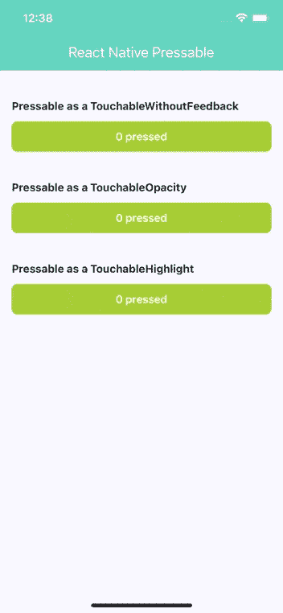

# 为什么我们要在反应中使用 Pressable

> 原文：<https://javascript.plainenglish.io/why-we-should-use-pressable-in-react-native-643baaa57a6b?source=collection_archive---------2----------------------->

## 可按压是可触摸组件的替代品


Photo by [AbsolutVision](https://unsplash.com/@freegraphictoday?utm_source=unsplash&utm_medium=referral&utm_content=creditCopyText) on [Unsplash](https://unsplash.com/s/photos/thinking?utm_source=unsplash&utm_medium=referral&utm_content=creditCopyText)

每个 React 本地开发人员都熟悉可触摸的组件。作为一名 React 本地开发人员，您可能已经访问过可触摸组件的文档，并且可能已经看到了警告:

> 如果你正在寻找一种更广泛且经得起未来考验的方式来处理基于触摸的输入，请查看[可按](https://reactnative.dev/docs/pressable) API。

什么是可压制元件？为什么要用它而不是可触摸组件？

今天我将试着回答这篇文章中的所有问题。让我们一起投入进去。

# 什么是可触摸组件？

首先，我们应该知道或探索“什么是可触摸组件？”。可触摸组件捕捉触摸手势，并在手势被识别时提供反馈。它们没有默认样式。但是你可以操纵样式，做任何你想做的事情。

React Native 提供了四种类型的触摸组件:

*   `[TouchableHighlight](https://reactnative.dev/docs/touchablehighlight)` —您可以用作网页上的按钮或链接。当用户点击按钮时，视图的背景将变暗
*   `[TouchableNativeFeedback](https://reactnative.dev/docs/touchablenativefeedback)` —使用自己的可绘制状态在 Android 上显示触摸反馈
*   `[TouchableOpacity](https://reactnative.dev/docs/touchableopacity)` —当用户点击时，通过降低按钮的不透明度来获得反馈
*   `[TouchableWithoutFeedback](https://reactnative.dev/docs/touchablewithoutfeedback)` —它处理触摸手势，没有任何反馈

# 什么是可压制元件？

`P[ressable](https://reactnative.dev/docs/pressable)`是在 [0.63](https://github.com/facebook/react-native/releases/tag/v0.63.0) 中作为新的核心 React 原生组件引入的。该组件可以在它定义的任何子组件上检测不同阶段的按压交互。

```
<Pressable onPress={onPressFunction}>
  <Text>I'm pressable!</Text>
</Pressable>
```

工作原理:

*   `onPressIn` —按下 onPressIn → onPressOut — onPress 后激活
*   `onPressOut` —停用，如果人离开手指超过 500 ms 才移开手指，则 onLongPress 被触发，按下→ 500ms → onLongPress → onPressOut

当我们使用移动应用程序时，我们可能会意外地点击按钮区域之外的地方。可按压组件提供了`HitRect`功能，帮助我们定义用户的触摸可以离开按钮多远。

此外，可按压组件提供了一个新的热门功能`PressRect`。它设置了视图的距离，在该视图中，当我们将手指慢慢从按钮上移开时，触摸被视为按压。

# 为什么要用它而不是可触摸组件？

## 可按压是一体化的可触摸组件

可按压组件具有可触摸组件的所有功能。因此，我们可以用单个组件替换所有的 TouchableOpacity、TouchableHighlight、TouchableNativeFeedback 和 TouchableWithoutFeedback。

## Pressable 是一个更广泛的面向未来的组件

可触摸组件使用罩下的`Mixin`。简单地说，Mixin 是一个包含其他类的帮助方法的类。但是脸书不建议使用它，因为它可能会在未来引起新的问题。

Pressable 使用 React Native 的`[Pressability](https://github.com/facebook/react-native/blob/16ea9ba8133a5340ed6751ec7d49bf03a0d4c5ea/Libraries/Pressability/Pressability.js#L347)` API。它被重构为 ES6 类，而不改变它们固有的行为。这就是为什么它是一个更广泛和面向未来的组件。

# 使用可按压的

让我们通过 Pressable 实现所有可触摸的组件。

让我们演示一个可压的例子:



Pressable Example

如果你想检查所有代码，这里有 [Github](https://github.com/Gapur/react-native-pressable-example) 的链接。

# 结论

感谢阅读——我希望这篇文章对你有用。编码快乐！

# 资源

[](https://morioh.com/p/5caf3eec8e1a) [## 如何在 React Native 中使用可压缩组件

### 了解如何在 React Native 中使用可压缩组件。可压件是 React Native 中引入的一个新的核心组件

morioh.com](https://morioh.com/p/5caf3eec8e1a) [](https://reactnative.dev/docs/pressable) [## 可压反应原生

### Pressable 是一个核心组件包装器，它可以在任何已定义的…

反应性发展](https://reactnative.dev/docs/pressable)  [## 反抗土著:一个可以压制他们的人

### 在使用移动应用程序时，你不可避免地要处理基于触摸的输入，例如按下…

博客. bam.tech](https://blog.bam.tech/developer-news/one-pressable-to-rule-them-all) 

*更多内容请看*[***plain English . io***](http://plainenglish.io/)