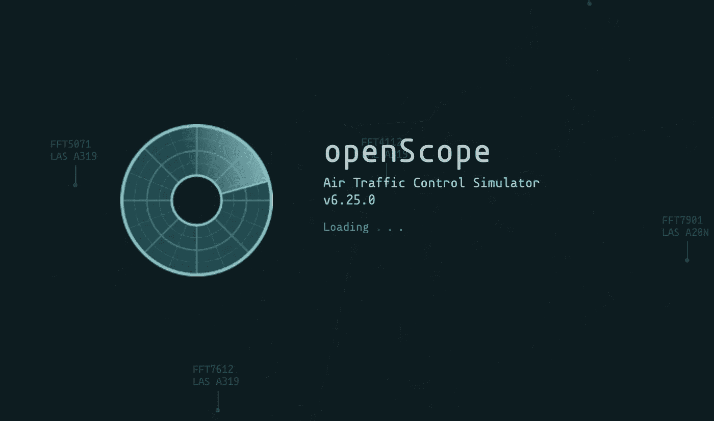
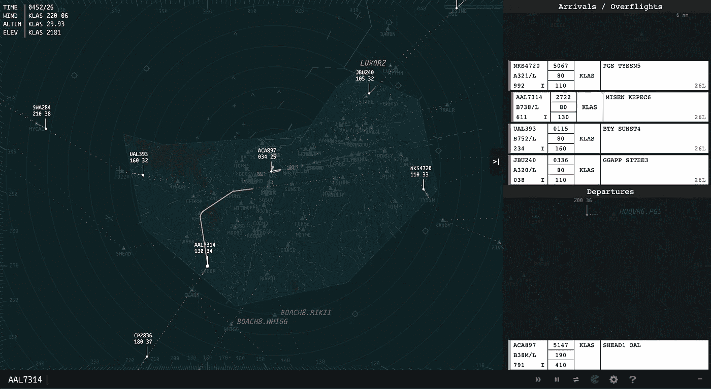
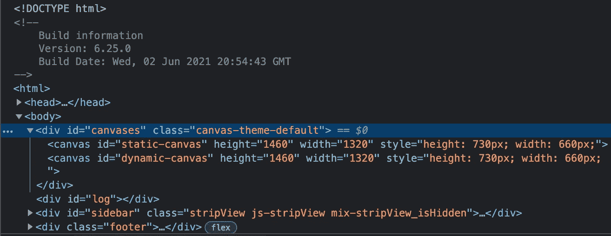

# 为什么我们在 OpenScope 使用分层的 HTML 画布

> 原文：<https://javascript.plainenglish.io/why-we-use-layered-html-canvases-at-openscope-e10273974447?source=collection_archive---------13----------------------->

OpenScope Air Traffic Control Simulator

几年来，我一直是一个名为 [OpenScope](https://www.openscope.co/) 项目的积极维护者。OpenScope 是一个基于浏览器的空中交通管制模拟器，由 JavaScript、HTML canvas 和 JSON 驱动。没有后端，全部在浏览器里完成。它也是开源的，任何人都可以[为](https://github.com/openscope/openscope/blob/develop/CONTRIBUTING.md)做贡献，只要你遵循指南并且会说航空语。

# 问题

当我第一次开始为这个项目做贡献的时候，在性能方面有一些问题。

在我继续之前，让我们先了解一些基础知识。

**Canvas:**[Canvas API](https://developer.mozilla.org/en-US/docs/Web/API/Canvas_API)提供了一种使用 javascript 和 HTML `canvas`元素绘制图形的方法。

制作动画:用动画技术给(电影、人物或图画)以运动的*外观*。

用代码制作动画就像画一本翻页书。

为了让事物看起来会移动，必须重画它们，只做微小的改变。这些微小变化的集合，随着时间的推移，形成了运动的*外观*。

这是相同的概念，只是用代码而不是笔和纸来完成。

这里需要注意的另一件事是，对于代码，在每一帧(页面)之间，我们必须做数学计算来精确地计算下一个绘图应该去哪里。

## **游戏循环:**

> **游戏循环**是整个游戏程序的整体流程控制。这是一个循环，因为游戏不断重复做一系列动作，直到用户退出。游戏循环的每次迭代被称为一个**帧**。大多数实时游戏每秒更新几次:30 和 60 是两个最常见的间隔。如果一个游戏以 60 FPS ( **帧每秒**)运行，这意味着游戏循环每秒完成 60 次迭代。

*—来源:*[*https://www.informit.com/articles/article.aspx?p=2167437&seqNum = 2*](https://www.informit.com/articles/article.aspx?p=2167437&seqNum=2)

# OpenScope UI 简介

运行任何种类的模拟器都需要动画。为了用代码制作动画，你需要有一个 [**游戏循环**](http://isaacsukin.com/news/2015/01/detailed-explanation-javascript-game-loops-and-timing) **。**为了在使用 javascript 的浏览器上以一种高性能的方式做到这一点，你需要使用`[requestAnimationFrame](https://developer.mozilla.org/en-US/docs/Web/API/window/requestAnimationFrame)`。

我们在 HTML 画布上画了很多东西:导航设备、地形、移动的飞机、文本、飞机路线、sid、星星、跑道等等。

OpenScope view with all the visualizations on: Navaids, Runways, Airport, SIDs, STARs, and a selected aircraft route

如您所见，这里发生了很多事情。底部的菜单栏和右边的弹出按钮都是 HTML 元素，不是画布或动画循环的一部分。

# 性能问题

我们不断收到动画不稳定的报告，或者电脑风扇在播放一会儿后发出比正常情况下更大的呼呼声。所以我们决定调查一下。

没过多久，我们就发现我们在帧之间做了太多事情，并且“*丢帧”*。丢帧意味着从一帧到下一帧的计算，意味着我们没有足够的时间按时渲染下一帧。想象一下，从上面的活页本中随意抽出几页，这是一个掉页框。

一次浏览 Chrome 上的`performance`标签，很明显我们丢失了大量的帧。

简单的原因是我们在帧之间做了太多。看着上面的图片，我相信你能明白为什么。该视图中的所有内容都需要在每帧之间重新绘制。

到目前为止，在我的职业生涯中，我只接触过两次 canvas api。我以前从来没有机会深入研究画布问题，所以我很期待这次挑战。

经过一些研究，我发现了两件事:

*   `canvas`元素是一个 HTML 元素(duh ),可以通过 CSS 接收样式。像`background-color`之类的东西。这在现在看来是显而易见的，但在当时却是一个小小的启示。
*   `canvas`元素*可以*有透明背景。

# 堆叠画布

对于这个下一个领悟，我不知道是在一篇文章里看到的，还是自己想出来的。我通常没这么聪明，所以假设我在某处读到过。

如果我们能够识别出那些经常改变的元素和那些不经常改变的元素，我们就可以更好地将它们分开，只在需要的时候重画。此外，如果我们可以做出这样的决定，我们可以在他们自己的 HTML 画布上绘制每个人。

我们可以堆叠 HTML 画布！

借用 React `shallowRender`和`deepRender`中的两个术语来描述每个画布将做什么，我们开始对它进行编码。

我们把可渲染的东西分成两组:

*   需要改变每一帧的东西
*   当视图改变时需要改变的东西(平移/缩放)。飞机路径、地形、导航设备、SIDS/STARS、空域等。

这些昂贵的物品都属于`deepRender`集团，这并不奇怪。只有在需要的时候才更新它们，这是一个巨大的突破，并真正在性能上产生了巨大的差异。

你可以看到我们如何管理对多个 HTML 画布的绘制[这里](https://github.com/openscope/openscope/blob/develop/src/assets/scripts/client/canvas/CanvasController.js#L402)在 [CanvasController](https://github.com/openscope/openscope/blob/develop/src/assets/scripts/client/canvas/CanvasController.js#L402) 中。

Photo by [Sandie Clarke](https://unsplash.com/@honeypoppet?utm_source=medium&utm_medium=referral) on [Unsplash](https://unsplash.com?utm_source=medium&utm_medium=referral)

# 结论

这个故事的寓意是:

*   HTML `canvas`元素可以有一个透明的背景，并且可以相互堆叠
*   仅在需要时重新绘制昂贵的项目

请在 [OpenScope](http://openscope.co) 查看这段代码，或者访问我们的 [repo](https://github.com/openscope/openscope) 。

## 参考

*   [https://www.openscope.co/](https://www.openscope.co/)
*   [https://github . com/open scope/open scope/blob/develop/contributing . MD](https://github.com/openscope/openscope/blob/develop/CONTRIBUTING.md)
*   [https://developer.mozilla.org/en-US/docs/Web/API/Canvas_API](https://developer.mozilla.org/en-US/docs/Web/API/Canvas_API)
*   https://www.informit.com/articles/article.aspx?p=2167437&seqNum = 2
*   [http://isaacsukin . com/news/2015/01/detailed-explain-JavaScript-game-loops-and-timing](http://isaacsukin.com/news/2015/01/detailed-explanation-javascript-game-loops-and-timing)
*   [https://developer . Mozilla . org/en-US/docs/Web/API/window/request animation frame](https://developer.mozilla.org/en-US/docs/Web/API/window/requestAnimationFrame)
*   [https://github.com/openscope/openscope](https://github.com/openscope/openscope)
*   [https://github . com/open scope/open scope/blob/develop/src/assets/scripts/client/canvas controller . js # L402](https://github.com/openscope/openscope/blob/develop/src/assets/scripts/client/canvas/CanvasController.js#L402)

*更多内容看* [*说白了。报名参加我们的*](http://plainenglish.io/) [*免费每周简讯*](http://newsletter.plainenglish.io/) *。在我们的* [*社区*](https://discord.gg/GtDtUAvyhW) *获得独家写作机会和建议。*