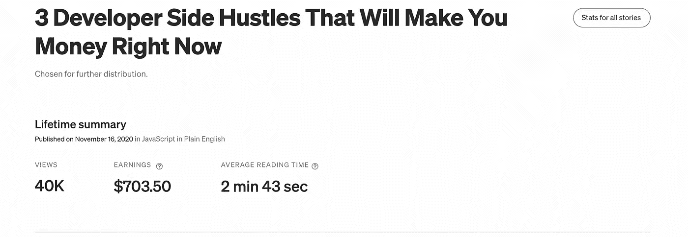
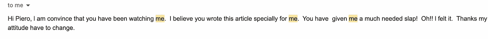
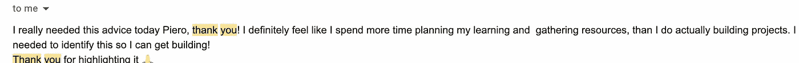

# 作为一名软件开发人员，为什么你真的需要一份兼职

> 原文：<https://javascript.plainenglish.io/why-you-really-need-a-side-hustle-as-a-software-developer-5396289c6184?source=collection_archive---------9----------------------->

## 你朝九晚五的工作是不够的。

Photo by [Justaf Abduh](https://unsplash.com/@jabacule?utm_source=unsplash&utm_medium=referral&utm_content=creditCopyText) on [Unsplash](https://unsplash.com/s/photos/side-hustle?utm_source=unsplash&utm_medium=referral&utm_content=creditCopyText)

你朝九晚五的工作是不够的。

这是我每天都在重复的一句话。我热爱我的工作。我从小就想成为一名程序员。然而，自从我尝试了在我的皮肤上做侧面按摩的好处后，我再也不想回去做一件事了。

让我们一起来看看作为一名开发者，拥有一份兼职能给你生活的方方面面带来什么好处。

## 你不应该把所有的鸡蛋放在一个篮子里

我讨厌引用过度使用的引语，但不幸的是，这条规则是有效的。经过 4 年的职业经历，我明白了在公司里没有人是不可替代的。

有一天你可能会失业。由于家庭问题，你可能需要暂停工作，或者全球性的疫情可能会让你工作的公司破产。

拥有一个副业只是一种更安全的生活方式，作为一个开发者，到处都有找到副业的机会。你可以写科技文章，录制现场编码流，你可以打开你自己的科技 Youtube 频道。作为一名开发者，将你的技能货币化的机会是无穷无尽的。

## 你可以赚很多钱

我看到开发人员一直在用他们的技能赚大钱。如果你不信，可以看看下面这两篇文章:

 [## 开设了我的第一门课程，赚了 50 多万美元！美国医学协会(American Medical Association)

### 嘿 IH！上周，我提前推出了我的第一门课程，面向 JavaScript 开发者的 CSS。我刚刚结束了预订…

www.indiehackers.com](https://www.indiehackers.com/post/launched-my-first-course-earned-over-us-500-000-ama-4382405cd5)  [## 我是如何从一本书里赚到 4 万美元的…在我出版它之前。

### 在我开始之前，我想声明我将在这篇文章中讨论金钱，但请不要对此进行解读…

medium.com](https://medium.com/@emmabostian/how-i-made-40-000-off-a-book-before-i-even-published-it-4125ac812a94) 

如你所见，凭借你的编码技能，你可以创造奇迹。随着时间的推移，你只需要努力建立一个新的收入来源。作为一名作家，我自己也在这样做，我也在这个平台上慢慢找到了我的成功。

The earning of one of my articles here on Medium

## 建立权威，建立联系

感谢我作为一名科技作家的兼职，我已经能够在网上建立一个小的权威。这是一个让我觉得自己有用并建立联系的机会，可以带来可能的工作机会。

例如，在我工作过的两家公司中，在我与他们的面试中，我用我的文章来证明我对该领域的热情和特定语言的技能。这些文章和我的努力得到了雇主的高度赞赏，它们帮助我获得了这份工作。

请记住，如果你能作为一名开发人员在科技领域为自己创造一个有意义的副业，它的结果也会对你朝九晚五的工作产生积极的影响。更多的权力意味着更多的关系，而适当的关系可以带来新的工作机会。此外，一个伟大的副业会影响其他人的生活，有时你会在收件箱里收到这样的消息

## 结论

朝九晚五的工作很棒，但是只关注职业生涯中的一种可能性会有局限性。不要给你的潜力设置障碍，探索建立副业的机会，这可以产生金钱、职业机会和新的关系。

—皮耶罗

**你还想要更多的**？⬇️

## [想学习如何通过开发挣更多的钱并达到财务自由吗？这是我给你的免费指南。](https://tinyurl.com/MoneyDev)