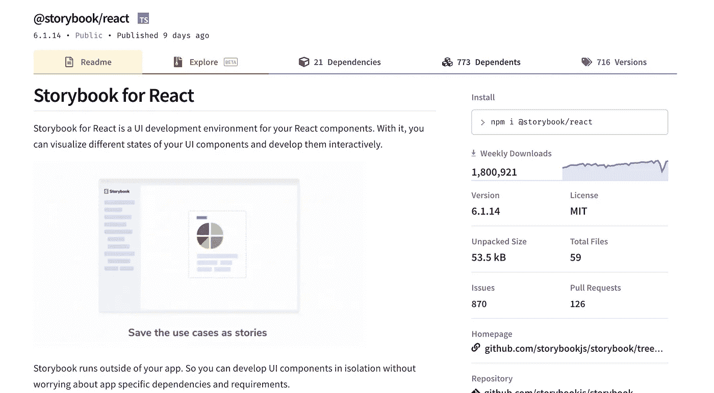
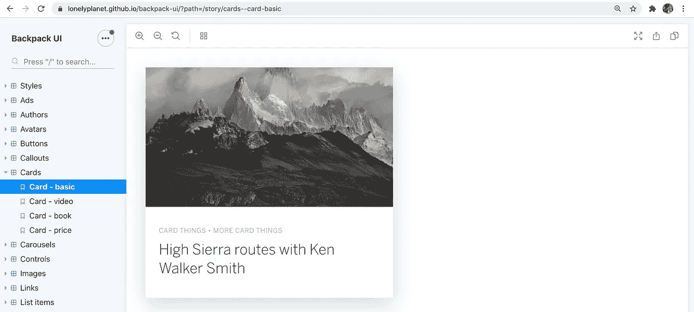

# 为什么你应该在你的下一个项目中使用故事书

> 原文：<https://javascript.plainenglish.io/why-you-should-be-using-storybook-in-your-next-project-f4859e8b5378?source=collection_archive---------9----------------------->

## Storybook 已经席卷了开发者世界，每周下载量超过 180 万次。

Storybook 被像 [Airbnb](http://airbnb.io/react-dates/?path=/story/daterangepicker-drp--default) 、Lyft、 [IBM](https://react.carbondesignsystem.com/?path=/story/accordion--accordion) 、 [Shopify](https://5d559397bae39100201eedc1-nqqiwjtuqe.chromatic.com/) 这样的公司以及数以千计的其他公司用来孤立地记录和开发组件。

在这篇文章中，我们将讨论故事书到底是什么，以及为什么你应该在你的下一个项目中使用它。

# 什么是故事书？

Storybook 是一个构建和记录 UI 组件的工具。这并不是 React 独占的工具，他们还支持 [React Native](https://www.learnstorybook.com/intro-to-storybook/react-native/en/get-started/) 、 [Angular](https://storybook.js.org/blog/tag/angular/) 、 [Vue](https://storybook.js.org/blog/introducing-storybook-for-vue/) 等多种框架。

有了 Storybook，你可以开发整个 UI，而不必启动一个开发项目，所以你可以一次专注于开发一个东西。

Storybook 帮助您记录构建的组件，并在将它们与应用程序的其余部分集成之前，轻松地对它们进行可视化测试，以防止出现错误。

对于 React 应用程序，Storybook 运行一个单独的开发服务器，并给出您指定的组件的目录视图。假设你的组件接收道具作为输入，Storybook 允许你在实例化它的时候传入单独的道具，并且使用插件，在查看你的组件的时候尝试不同的值！

Storybook Component Catalog

# 我为什么要在乎？

当我第一次听说 Storybook 时，它最初看起来像是一个额外的依赖，会减慢开发工作，而不会提供更多的价值。然而，开发故事所花费的时间是由 storybook 强制执行的代码质量来弥补的。

以 UI 为中心的开发中的一个常见范例是构建增量式的小型软件，构建可以在隔离环境中独立进行单元测试的模块化组件。

Storybook 加强了这种开发实践，鼓励开发人员编写干净的模块化代码。

它也迫使你直接面对布局和风格。当您在 Storybook 中查看组件时，您可以看到它在更广泛的应用程序上下文之外的行为。

# 实践中的故事书

作为一名软件开发人员，今年我已经在我开始的所有新项目中使用 Storybook，感觉棒极了。在将它介绍给与我一起工作的开发团队后，他们都跳上了宣传列车。PR 变得更容易审查，因为我们可以快速直观地测试组件，以确保它们符合设计规范。

设计人员喜欢它，因为他们可以滚动浏览故事书，并确保开发的组件符合设计规范，而不必在本地运行整个应用程序或在应用程序中查找每个组件。

# 结论

Storybook 让我和我的团队更容易编写更好的代码，并轻松地与团队的其他成员共享我们所做的组件。故事书也非常容易设置，你可以点击这里查看故事书网站。

## 保持联络

你可以在这里[注册我的时事通讯](https://newsletter.cometcode.io/)或者在我的[网站](https://www.caelinsutch.com/)查看我正在做的事情。请随时联系我，在 Linkedin[或 Twitter](https://www.linkedin.com/in/caelinsutch)[上联系我，我喜欢听到阅读我文章的人的声音:)](https://twitter.com/caelin_sutch)