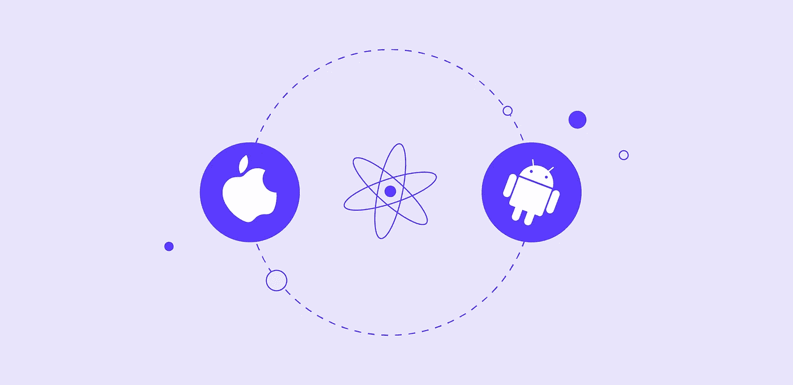
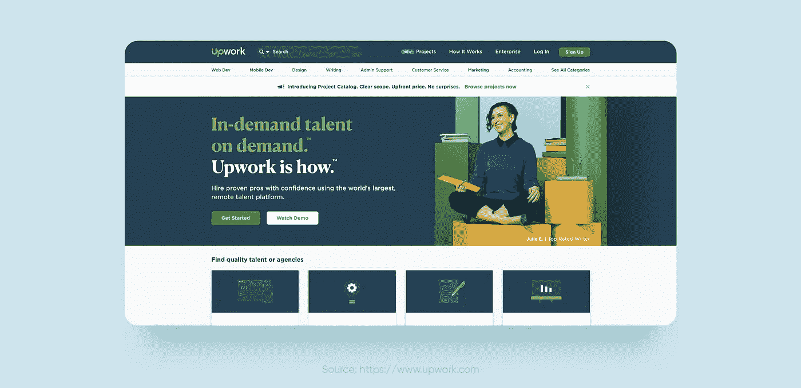
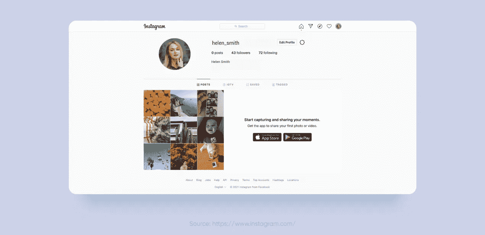

# 为什么您应该选择 React Native 进行 MVP 开发

> 原文：<https://javascript.plainenglish.io/why-you-should-choose-react-native-for-mvp-development-34f0d3954a0?source=collection_archive---------13----------------------->

## 问题“为什么反应原生？”用鲜明的例子。

在过去的几年里，产品开发的游戏规则已经发生了变化。尽快推出你的产品，获得客户的反馈，并不断改进，直到它完全符合你的梦想，这一点至关重要。一家提供 React 原生开发服务的公司如何帮助你完成这项任务？让我们来看看！

如果你担心你的产品在用户中的表现，以及在竞争中的表现，最小可行产品，或者 MVP，是一个聪明的商业策略的一部分。MVP 是许多世界大公司成功的第一支柱，如脸书、Instagram、Shopify、Twitter、亚马逊、Dropbox、优步和 iPhone。

这就像一个艺术家——你从一个粗略的草图开始，然后添加更多的细节。但是，创造你的杰作的最好工具是什么呢？类似 AngularJS、Xamarin、Meteor 和 React Native 这样的框架各有利弊。选择正确的产品是为了找到最适合您特定需求的产品。

# MVP 能给你的企业带来什么好处？

MVP 是产品的一个版本，它具有足够的特性来在产品开发周期的早期验证一个产品想法。企业可以从 React Native for MVP 开发中获得的好处:

*   这是确定这个想法是否值得追求的最快方法
*   早期的反馈有助于理解用户的期望，然后根据他们告诉你的，找出如何改进这个想法。当您处理后续功能时，用户会验证您的想法
*   通过 MVP，你可以迅速将你的创业想法变成现实，并在产品开发的早期阶段向未来的投资者推销
*   这将帮助你更好地了解市场——你的竞争对手是谁，他们产品的盈利能力来自于什么，他们缺少什么

# 什么是 React Native？

React Native 是由脸书团队创建的开源开发框架。现在是 Android 和 iOS 开发使用最多的技术。React Native 帮助企业创建经济高效的 MVP。

React Native 在 Github 上有。截至 2020 年 8 月 16 日，它有 2207 名贡献者。React Native 社区已经在 72 个分支中提交了 20，740 次，发布了 347 个版本。

# 为什么反应原生？

React Native 允许你在很短的时间内和可承受的预算内创建一个伟大的 MVP。它被 Instagram、Shopify、Skype、沃尔玛、Pinterest、Soundcloud、彭博、特斯拉和阿迪达斯使用。

让我们深入到 MVP 的世界中，自然地做出反应，找出如何将你的商业想法转化为现实。

# 你的企业如何从 React 原生 MVP 开发中获益？

在 MVP 开发的所有框架中，React Native 是最佳选择，因为它需要的投资和时间最少。下面是 React Native 对于 MVP 开发的好处:

## **单一代码库和可重用代码**

React 原生开发者不必为不同的操作系统分别编写代码。一个单一的代码库可以用来开发一个在 iOS 和 Android 上无缝工作的 MVP。你可以同时进入这两个市场，接触更广泛的受众。

使用 React Native，您不仅可以同时开发两个应用程序，还可以重用代码库并构建一个 web 应用程序

## **维修方便**

由于 React 原生 MVP 开发需要使用单一代码，维护过程变得容易。跨平台的 app 不需要太多维护。另外，React Native 有很好的调试工具。

## **免费开源**

选择 React Native 进行 MVP 开发，就选择了拥有预建组件开源库的框架，而且这个库还在不断扩展。您的开发人员可以使用之前编写的代码，这样可以节省时间和金钱。

## **快速设计和轻松编辑**

由于 React Native 的预制 UI 工具包，您可以快速为您的 MVP 创建一个用户友好且有吸引力的设计。React 原生开发者可以在用户继续使用的同时，顺利将新功能集成到产品中。

## **第三方插件**

您可以在构建 MVP 时使用第三方创建的模块。例如，您可以将谷歌地图添加到您的基本功能中。

## **简单的产品测试**

你可以同时在 Android 和 iOS 上测试你的产品。

## **类似本机的外观和感觉**

React Native for MVP 开发:UI 通过原生视图呈现，给人愉悦的用户体验。

## **高性价比的移动应用开发**

正如我们已经说过的，同一个团队可以同时为 iOS 和 Android 开发一个应用。这大大降低了开发成本——劳动力成本可以减少大约一半。

## **容易找到 React 原生开发者**

React Native 使用 JavaScript，这是最流行的编程语言之一。你可以在 Fiverr、Upwork 或 Toptal 等平台上雇佣一名自由职业者，根据候选人的个人资料和他们作为 React 本地专家参与的项目进行筛选。另一个选择是与 Purrweb 团队合作——强大的工程背景、扎实的 JavaScript 知识以及丰富的 iOS 和 Android 开发经验将保证您满足项目目标和期限。

Upwork makes it easy to connect with developers and start doing great work

 [## 使用 UI/UX 设计来简化复杂的事情

### 你好！我是 Kristina Spiridonova，是使用复制交易平台的客户经理，我会告诉你…

www.purrweb.com](https://www.purrweb.com/blog/investments-app-development/?utm_source=medium&utm_medium=why+react+native) 

# 以 MVP 起家的独角兽创业公司或为何选择 React Native 进行 MVP 开发

胸怀大志，梦想远大，但要从小处着手。MVP 是创造卓越客户体验的关键，因此也是业务兴旺的关键。以下是一些成为十亿美元公司的最低可行产品的例子:

## 脸谱网

MVP 的想法是通过在线社区将哈佛学生联系起来。扎克伯格为他的产品建立了一个基本模型，并将其发布给一小群用户。他编写了一个名为“TheFacebook”的网站，学生可以通过他们的学院或班级联系到一起。除了编辑他们的兴趣和跟踪朋友的页面，他们没有太多可以做的。它在 2004 年的特点是:

*   仅限@harvard.edu 电子邮件地址的用户帐户；
*   好友请求
*   带有单张照片的个人资料
*   能够列出用户元数据，如性别，生日，宿舍，电话号码，最喜欢的音乐，最喜欢的书，“关于我”，课程
*   按姓名、学年、课程搜索
*   隐私限制

扎克伯格在短短一个月内推出了它，并开始寻求用户的反馈。后续功能是根据用户的评论添加的。今天，脸书已经成为互联网上最受欢迎的社交媒体平台。截至 2020 年第一季度，其拥有 26 亿月活跃用户。

脸书广告是 Android 的第一个反应原生应用

脸书广告有直观的导航，完美地处理了广告格式、货币惯例、时区等方面的差异。

## 照片墙

上线的初级版本比现在的应用要简单得多。在 MVP 形式下，Instagram 用户只能应用过滤器，与朋友分享照片。

在被脸书收购之前，他们为 iOS 和 Android 开发了独立的 Instagram 应用。然后 React Native 被集成到现有的原生应用中，这使得 iOS 和 Android 都可以更快更容易地添加新功能。而现在 React Native 被用来建立和维护 Instagram。

## 购物化

Shopify 成立于 2004 年，此前曾试图开设一家滑雪板设备在线商店 Snowdevil。由于对现有的电子商务产品不满，Tobias Lütke 建立了自己的产品。Shopify 从一家滑雪板商店成长为一个价值 100 亿美元的商业生态系统，一个零售商建立自己的电子商务商店的平台。它很容易导航，人们可以在瞬间建立网上商店。

从 2020 年开始，所有新的 Shopify 应用程序都是使用 React Native 构建的。在 Shopify 渠道和移动工程副总裁 Farhan Thawar 发布的博客[帖子](https://engineering.shopify.com/blogs/engineering/react-native-future-mobile-shopify)中，他宣布公司决定使用 React Native 构建所有新的移动应用程序，因为它消除了为 iOS 和 Android 维护单独代码库的需要。

# 如何让自己的 MVP 成功？

专注于核心功能，确保你的 MVP 工作时不会崩溃，并从用户那里收集数据。当你的想法被验证后，你应该继续开发后续功能。

模式如下:推出你的 MVP，获得用户反馈，改进你的产品。从头再做一遍。最终产品将为目标受众量身定制。

# 结论

交付新产品是一项有风险的业务。顾客不只是想要使用它，他们想要得到愉悦。这就是 MVP 可以帮助你避免不必要支出的地方。通过这种方法，您可以在真实的市场条件下测试业务想法，并在最短的时间内收到用户反馈。这是推出新产品的安全方式。

React Native 在 MVP 开发方面有着巨大的潜力——不管你的商业理念是什么。随着开发人员不断添加新功能，该框架正在快速发展。React Native 是完成项目的最短路径。