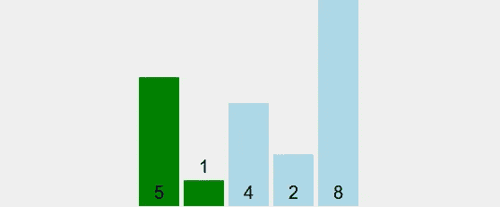
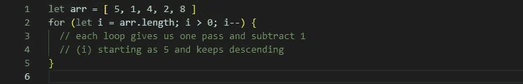
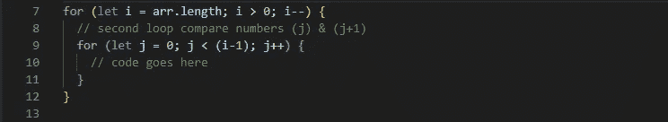
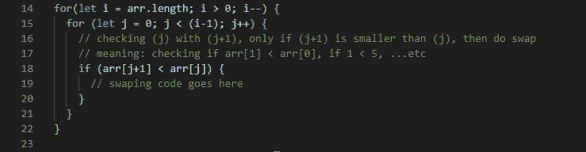
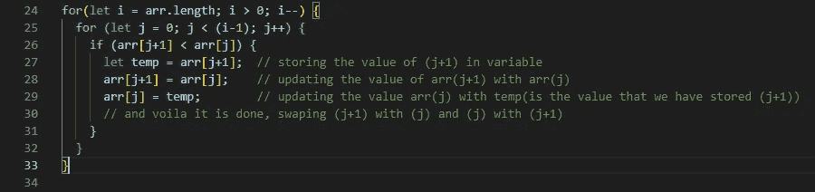
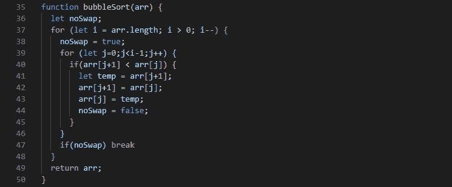

# 为什么你应该知道冒泡排序

> 原文：<https://javascript.plainenglish.io/why-you-should-know-how-to-bubble-sort-752f09b5e51c?source=collection_archive---------20----------------------->

## 因为知道了就不会用了



**冒泡排序**，是一个简单的算法，它反复遍历列表，比较相邻的元素，如果它们的顺序不对，就交换它们。重复遍历列表，直到列表被排序。这种比较算法是以较小或较大的元素“冒泡”到列表顶部的方式命名的。

这种简单的算法在大型或真实世界中表现不佳，主要用作教育工具。诸如[快速排序](https://en.wikipedia.org/wiki/Quicksort)、[时间排序](https://en.wikipedia.org/wiki/Timsort)或[合并排序](https://en.wikipedia.org/wiki/Merge_sort)等更高效的算法被内置于 Python 和 Java 等流行编程语言中的排序库所使用。

虽然冒泡排序是理解和实现起来最简单的排序算法之一，但是它的[*O*(*n*2)](https://en.wikipedia.org/wiki/Big_O_notation)复杂性意味着它的效率在包含少量元素的列表上会显著降低。即使在简单的 *O* ( *n* 2)排序算法中，像[插入排序](https://en.wikipedia.org/wiki/Insertion_sort)这样的算法通常要高效得多。

由于其简单性，冒泡排序经常被用来向计算机科学的入门学生介绍算法或排序算法的概念。

# 分步示例

```
***First Pass***
( **5** **1** 4 2 8 ) → ( **1** **5** 4 2 8 ), Here, algorithm compares the first two elements, and swaps since 5 > 1.
( 1 **5** **4** 2 8 ) → ( 1 **4** **5** 2 8 ), Swap since 5 > 4
( 1 4 **5** **2** 8 ) → ( 1 4 **2** **5** 8 ), Swap since 5 > 2
( 1 4 2 **5** **8** ) → ( 1 4 2 **5** **8** ), Now, since these elements are already in order (8 > 5), algorithm does not swap them.***Second Pass***
( **1** **4** 2 5 8 ) → ( **1** **4** 2 5 8 )
( 1 **4** **2** 5 8 ) → ( 1 **2** **4** 5 8 ), Swap since 4 > 2
( 1 2 **4** **5** 8 ) → ( 1 2 **4** **5** 8 )
( 1 2 4 **5** **8** ) → ( 1 2 4 **5** **8** )Now, the array is already sorted, but the algorithm does not know if it is completed. The algorithm needs one **whole** pass without **any** swap to know it is sorted.***Third Pass***
( **1** **2** 4 5 8 ) → ( **1** **2** 4 5 8 )
( 1 **2** **4** 5 8 ) → ( 1 **2** **4** 5 8 )
( 1 2 **4** **5** 8 ) → ( 1 2 **4** **5** 8 )
( 1 2 4 **5** **8** ) → ( 1 2 4 **5** **8** )
```

# 分步编码示例



Step 1



Step 2



Step 3



Step 4

## 冒泡排序的优化版本



Checking if the first loop(i) pass at least one time without swapping, then prevent unnecessary loops

更普遍的情况是，在一次扫描中，可能会有一个以上的元素被放置在它们的最终位置。特别是，在每一遍之后，最后一次交换之后的所有元素都被排序，并且不需要再次检查。这允许跳过许多元素，导致在最坏的情况下比较计数提高了 50%。

# 表演

冒泡排序的最坏情况和平均复杂度为[*о*](https://en.wikipedia.org/wiki/Big_o_notation)(*n*2)，其中 *n* 是被排序的项目数。大多数实用的排序算法具有更好的最坏情况或平均复杂度，通常是*O*(*n*log*n*)。甚至其他的*о*(*n*2)排序算法，比如[插入排序](https://en.wikipedia.org/wiki/Insertion_sort)，一般都比冒泡排序运行的更快，也不会更复杂。因此，冒泡排序不是一种实用的排序算法。

冒泡排序优于大多数其他算法，甚至优于[快速排序](https://en.wikipedia.org/wiki/Quicksort)，但优于[插入排序](https://en.wikipedia.org/wiki/Insertion_sort)的唯一显著优势是，检测列表是否被有效排序的能力内置于算法中。当列表已经排序时(最好的情况)，冒泡排序的复杂度只有 *O* ( *n* )。相比之下，大多数其他算法，甚至那些具有更好的[平均情况复杂度](https://en.wikipedia.org/wiki/Average-case_complexity)的算法，在集合上执行它们的整个排序过程，因此更加复杂。然而，[插入排序](https://en.wikipedia.org/wiki/Insertion_sort)不仅具有这一优势，而且在基本排序的列表上(具有少量的[反转](https://en.wikipedia.org/wiki/Inversion_(discrete_mathematics)))表现更好。此外，如果需要这种行为，可以在算法运行前通过检查列表将其添加到任何其他算法中。

在大集合的情况下，应该避免冒泡排序。在逆序收集的情况下，这将是无效的。

# 奖金

前谷歌首席执行官埃里克·施密特在一次采访中问当时的总统候选人巴拉克·奥巴马排序一百万整数的最佳方式，奥巴马停顿了一下，然后回答道:“我认为冒泡排序是错误的。”