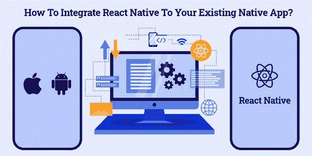
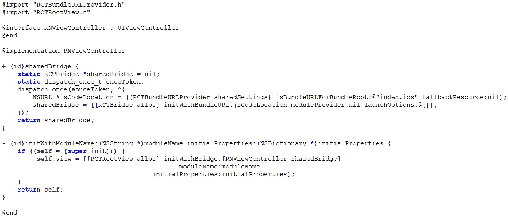
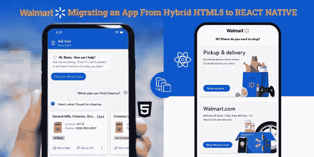
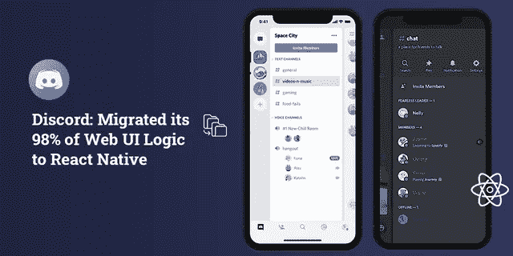

# 为什么您应该考虑迁移到 React Native

> 原文：<https://javascript.plainenglish.io/why-you-should-migrate-your-existing-app-to-react-native-e2949eb2e7c3?source=collection_archive---------9----------------------->

## (主要原因+现实生活中的例子)

然而，使用本地应用程序管理您的企业的数字存在？当然，你不仅错过了市场的潜在用户部分，而且直接将你的业务转给了你的竞争对手。

由于 Android 和 iOS 已经成为拥有 550 万应用程序的主要应用程序商店，因此使用 Android 或 iOS 原生应用程序将很快让您回到现实！

为了让您的企业在未来几十年保持竞争力，是时候迁移您现有的应用程序，以实现原生反应，并为您的应用程序添加跨平台兼容性。

42%的开发人员选择了 React Native，毫无疑问，React Native 是新项目的必由之路。这不仅是在迁移现有项目的情况下，也是开始新项目的一个很好的选择。

现在，你们大多数人都在挠头，如何在现有应用中利用 React 本地应用开发的当前趋势？为了帮助你做到这一点，我们创建了一个详细的博客，解释为什么你应该迁移你的应用程序到 React Native 的主要原因。React Native 可以增加巨大的商业利益，并帮助您节省开发成本和时间。

> 因此，让我们直接进入详细的指南，解释如何将您的应用程序迁移到 React Native 可以帮助您更明智地开发您的产品。

## 我们是否应该将我们的应用迁移到 React Native？

自 2015 年推出以来，React Native 的宣传一直在蓬勃发展，没有任何下降的迹象。但这并不意味着迁移过程会更简单。它有自己的挑战和复杂性。最重要的是，这取决于您采取什么步骤来迁移您的应用程序。嗯，那件事以后再讨论吧！

> 现在继续我们的主要问题“我们是否应该采取行动以适应当地环境”？

我不会花很多时间或精力来解释为什么值得迁移到 React Native，因为有很多关于这个主题的资源。但是我会解释它的 5 个重要原因。

*   *了解当前市场趋势，迫使迁移以适应本地需求*
*   *了解为什么要将应用迁移到 React Native？*
*   *如何将 React Native 集成到你现有的原生 App 中？*
*   *应用迁移的主要挑战及其解决方案*
*   *设定主要目标以迁移您的应用程序来实现原生反应的真实例子*
*   *结论:反应原生的进化*

下面就让我们先睹为快详细介绍一下吧！

## **1。了解当前的市场趋势，推动迁移以适应本地需求**

随着 2021 年全球[70 亿](https://www.statista.com/statistics/218984/number-of-global-mobile-users-since-2010/)移动应用用户的出现，毫无疑问，移动应用行业正在快速发展。而智能手机的渗透率和移动应用的使用正在迅速扩大，并且在不久的将来没有放缓的迹象，因此 [**招聘移动应用开发者**](https://www.xicom.ae/services/mobile-app-developers/) 已经成为组织的迫切需求。

但当我环顾四周，注意到我周围的人，他们的眼睛粘在他们的移动设备上。但是，令人惊讶的是，我发现 70%是 Android 用户，30%是 iOS 用户。

*   据统计，2020 年的年度移动应用开发为 2018 亿美元，同比增长 7%。
*   2020 年，全球应用商店的支出将达到 1430 亿美元，增长 20%。
*   全球移动应用收入从 2020 年的 5810 亿美元猛增至 2023 年的 9830 亿美元。
*   根据这些研究，千禧一代平均每天查看智能手机 150 次，92%的移动时间花在应用程序上。

***如果说 Native 和 React Native 那么 7.9k 的人说以前用过，4.8k 的用户更喜欢再用。而 9.1k 人表示听说过 React Native，14k 人有兴趣学习。***

所以很明显，react native 是一路领先，和原生开发竞争的。

让我们来看看为什么迁移您的原生应用程序以使原生应用程序对您的业务有益，以及它如何帮助您节省时间和开发成本…

## **2。了解为什么您应该将应用程序迁移到 React Native？**

不管你的应用程序开发想法有多好，应用程序的成功总是取决于你集成到应用程序中的技术。选择正确的技术是一个关键的决定，它决定了你将在一个市场呆多久。作为一个如此庞大的社区的孩子，并得到脸书的支持，React Native 在未来肯定不会有任何发展。

> **React Native 是一个完美的选择，当:**

*   ***你的时间不多了，赶快启动你的应用***

使用 React Native，开发时间和上市时间都显著缩短。无论您是一家正在尝试 MVP 的初创公司，还是一家正在寻找灵活、强大或可扩展解决方案的企业，React Native 都是满足您业务期望的唯一选择。

*   ***您希望您的 Android 或 iOS 应用程序兼容多个平台***

这一切都归功于 React Native 的代码可重用性，它允许您使用相同的代码库为多个平台创建移动应用程序，而不会牺牲应用程序的质量、效率和性能。据统计，使用 React Native 构建的顶级应用的成本重用率在脸书上为 93%，在 TaskRabbit 上为 86%，在 Skype 上为 85%。

> 听起来很有希望！

通过 [**雇佣一个移动应用开发团队**](https://www.xicom.ae/services/mobile-app-development/) ，你可以在比开发一个本地应用更短的时间内轻松地为两个目标平台开发一个先进的移动应用。

*   ***你需要开发一个预算有限的 app***

说到计算 app 开发成本，逻辑很简单。你花在开发上的时间越少，它需要的预算就越少。事实是，由两名 React 原生应用程序开发人员组成的团队可以轻松发布一款应用程序，所需时间比开发一款原生 iOS 和 Android 应用程序要少。

*   ***你真的很期待跨平台***

React Native 不仅是一个出色的跨平台应用程序开发框架，而且还迅速成为应用程序开发框架的首选。通过使用相同的代码库， [**软件开发公司**](https://www.xicom.ae/) 不仅能够为 iOS、Android，也能为 web 创建应用程序。

*   ***你想在你的安卓应用版本*** 中集成 iOS 功能

React Native 是一个理想的框架，使您能够与原生 Swift 集成。如果代码写得很好并且稳定，那么毫无疑问，它也可以与另一个代码一起顺利工作。

*   ***你需要经常更新***

React Native 应用程序开发人员非常熟悉 React Native 的热重新加载功能，该功能允许他们立即在前端进行频繁的更改，而不必再次下载文件。

> 简而言之:让我们假设您已经准备好迁移您的原生应用程序以实现原生反应，但问题是如何实现？

# **3。如何将 React Native 集成到你现有的原生 App 中？**

在直接进入 [**雇佣应用开发者**](https://www.xicom.ae/solutions/hire-developers/) 的过程之前，有必要知道原生应用基本上是由视图组成的。因此，要将 React Native 集成到原生应用程序中，您需要遵循相同的模式，在 iOS 上使用 **RCTRootView** ，在 Android 上使用 **ReactRootView** 。

如果你不熟悉将 React Native 与现有应用程序集成，那么我建议你遵循以下几个步骤:

要开始迁移，首先我们需要一个容器来运行 React 本地视图。但是，在 Native 中，视图包含在 Android 的**活动**和 iOS 的 **UIVewController** 中。所以 RN 视图将是遵循相同结构的另一个原生视图。然而，对于你们中的许多人来说，我们将在这里定义容器和 RN 视图之间的关系。

**一个容器和多个 RN 视图之间的关系:**像任何视图一样，RN 视图可以很容易地组合到本地视图层次结构的任何部分，然后进一步添加到其他类型的视图中。

**一个容器和一个 RN 视图之间的关系:**整个视口将被具有一个 RN 视图的容器覆盖。这被认为是最好的选择，因为它保持了简单的结构，并允许您在 RN 中轻松地处理视图层次结构。

*然而，你需要记住的是只创建一个桥，并在你所有的 RN 视图中共享它。还有，你可以使用下面的****UIViewController****容器作为 iOS 的参考:*

# **4。主要应用迁移挑战及其解决方案**

将 React Native 与 Native 集成起来可能听起来令人兴奋，但很快这种兴奋就会变成大错。通过桥接的方式将这两种技术融合在一起意味着为即将发生的问题做好准备。为了帮助您更好地理解这是如何工作的，预计会遇到哪些挑战以及如何应对这些挑战。

> **在 React Native 的边缘进行管理的挑战**

*   因为 React Native 是一门年轻的语言，所以当更新发生在 Reach Native 机制内部时，要准备好处理无意义的错误消息。
*   将 React Native 视为 UI 库是一个缺点。
*   iOS/SDK 更新需要一段时间才能让 React Native 适应其核心库。

> **专家提示在 React Native 中组织高效编码**

*   虽然 React Native 本身提供了一个测试代码的好机会，但是建议使用额外的工具，比如 recompose 和 redux。
*   可以合并 Java(Android)和 Swift (iOS)，同时开发一个复杂的应用程序或平台。
*   此外，您可以通过保持 60 FPS 标准来利用 React 动画库。

> **使用 React Native 节省时间和金钱**

*   由于不需要为单个移动平台构建应用程序，因此可以轻松降低应用程序开发的成本。
*   代码的可重用性将导致更容易的代码维护。
*   可以使用 React 本地应用程序开发人员开发应用程序。

如果你 [**雇佣拥有合适技能和专业知识的移动应用开发者**](https://www.xicom.ae/services/mobile-app-developers/) ，那么将原生应用迁移到 React Native 是很容易做到的。但是，如果你仍然不确定，是否应该进一步将 React Native 添加到你的应用程序中，那么你必须看看 React Native 的这些真实案例。

# **5。设定主要目标以迁移您的应用程序来实现原生反应的真实例子**

到目前为止，各种组织都在怀疑，将他们的原生应用迁移到这个年轻的框架是否是一个有价值的决定。但是所有那些冒险从本地迁移到本地的大企业都比以前更成功了。这些企业不仅为其他企业树立了一个完美的榜样，而且也给了 React Native 在未来不会有任何发展的强大信心。

## **1。沃尔玛:从混合 HTML5 迁移应用到原生应用**

沃尔玛对 react 的迁移来自于一个混合应用。沃尔玛选择反应原生而非原生，只是因为其命名开发人员的生产力和简单的应用商店审查过程。来自沃尔玛实验室的开发人员资助调试 React Native 应用程序的功能非常复杂，但他们对 React Native 的图形性能以及 RAM 和 CPU 资源的使用非常满意。

但是，为了全面提高应用程序的性能，重要的是你要雇佣一家由合适的程序员团队支持的 [**移动应用程序开发公司**](https://www.xicom.ae/services/mobile-app-development/) ，以确保应用程序开发过程的顺利进行。

## **2。不和谐:迁移了 98%的网络用户界面逻辑以适应本地需求**

Discord 已经决定将其 98%的 web UI 逻辑迁移到 React Native(仅限 iOS)，令人惊讶的是，iOS 的 1.0 版本在 2 周内内置，尽管只有一个开发人员的帮助。此外，将 iOS 迁移到 Android PoC 只需要两天时间。

# **结论**

有了不同编程语言和平台的多种选择，用最好的技术编写应用程序开发项目是组织最复杂的任务之一。虽然开发人员需要在多种语言和框架方面具有高水平的熟练程度和专业知识才能获得最大的影响力，但 React Native 已经解决了复杂项目的编码问题。

希望通过这篇博客，你已经理解了 React Native 是如何鼓励行业领先品牌将其数字业务从原生平台迁移到跨平台平台平台的。我们已经解释了将您的应用程序迁移到 React Native 的各个方面，但如果您有任何疑问，建议联系 [**移动应用程序开发公司**](https://www.xicom.ae/services/mobile-app-development/) ，该公司由高技能专业人员提供支持，能够为您的所有业务需求提供可靠的解决方案。