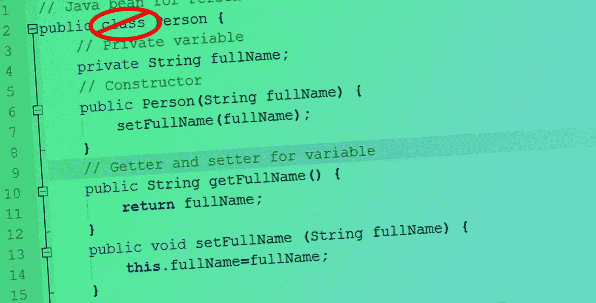

# 为什么不应该在 JavaScript 中使用类

> 原文：<https://javascript.plainenglish.io/why-you-should-not-use-classes-in-javascript-ca960d13c625?source=collection_archive---------0----------------------->



Photo Illustration by David Fekke

我最近写了一篇关于我喜欢用 JavaScript 创建对象的方式的[帖子](https://fek.io/blog/crockford-objects-in-java-script)。我把这种类型的对象创建称为“Crockford Objects”，以“ [JavaScript: The Good Parts](https://www.amazon.com/JavaScript-Good-Parts-Douglas-Crockford/dp/0596517742) ”的作者道格拉斯·克洛克福特的名字命名。


Douglas Crockford

我收到了很多人的反馈，他们告诉我我没有解释为什么他们不应该在 JavaScript 中使用**类**关键字。我没有解释为什么，因为我不是说你不能使用它，我只是不喜欢使用 **class** 关键字来定义一个对象。

# **JavaScript 不是面向对象的语言**

如果你熟悉 JavaScript 的历史，Brendan Eich 被告知他将能够为基于 Scheme 的 Netscape Navigator 编写脚本语言。 [Scheme](https://www.scheme.com/tspl4/) 是一种函数式编程语言。然后艾希被告知，它必须看起来类似于 Java，因此得名‘JavaScript’。哦，顺便说一下，他只有两周时间来完成。

所以 JavaScript 从来就不是面向对象的语言。它实际上是一种面向原型的语言。

道格拉斯·克洛克福特喜欢开玩笑说，大多数开始使用 JavaScript 的开发人员都懒得先学习这门语言。如果你开始研究这种语言，你会发现它与 Java 和 C#有很多相似之处。在 Java 和 C#中，你将类定义为新对象的模板。在 JavaScript 中，一切都是对象。

作为对 C#和 Java 开发人员的让步，类被添加到 JavaScript 中。在幕后，JavaScript 引擎仍然以同样的方式创建对象。

# **装订**

绑定是长期 React 开发人员在其应用程序中熟悉的一个问题。用类定义的对象必须显式使用“this”关键字。如果将类方法传递给回调，可能会遇到绑定问题。这就是为什么你会看到很多代码中的方法必须绑定到正确的上下文。我们来看一个例子；

从上面的例子可以看出,“myMethod”函数被绑定回了自身。为了在构造函数中执行这个函数，我们不得不使用' this '关键字三次。

# 继承**不好**

当我第一次学习面向对象编程时，我学到的三个主要特性之一是继承。你可以用 **extends** 关键字从一个基类扩展来实现。

```
class Cat extends Animal {// Body here}
```

在 JavaScript 中，这是由父类的 prototype 属性的委托来完成的。这种类型的操作有性能方面的考虑，但这不是避免继承的主要原因。

即使在真正的面向对象语言中，也应该避免继承。开发人员在继承链中遇到的一个常见问题是脆弱的基类问题。这有时被称为大猩猩/香蕉问题。主要问题与父对象的紧密耦合有关。如果您需要对父对象进行更改，它会反映到整个对象树中。我目前正在开发一个 Java API，这是一个大问题。

在大多数情况下，即使在面向对象的语言中，组合对象也是比从父对象继承更好的方法。在像 Java 或 Swift 这样的严格类型语言中，从接口或协议继承比从类继承更好。同样在 Java 和 C#中，你可以从一个抽象类继承。

# **封装**

封装是面向对象编程的另一个特性，它实际上是一个很好的特性。封装背后的思想是，我们能够通过使用只能从类体内部访问的数据和方法来隐藏对象的实现细节。虽然可以通过使用' # '字符在类内部创建私有函数，但是我们不能在 JavaScript 中将变量设为私有。

从上面的例子可以看出，我们在类的外部设置了类中的所有属性。这违反了面向对象编程的关键原则之一。

# **反应过来**

React 是我使用过的前端框架之一，他们最近改变了创建组件的默认方式。以前在 React 中，你会创建一个扩展 React 的类。组件'。当 React 16.8 发布时，他们增加了一个名为“钩子”的新功能。如果你需要在你的组件中管理状态，你可以在你的函数中使用“useState”钩子。这允许我们编写和返回导出函数而不是类的组件。

使用以前的类，我们将创建如下所示的组件:

现在，我们可以只使用一个**函数**和**使用状态**钩子来组装同一个组件。

正如我们从上一个例子中看到的，为一个组件创建一个函数要比我们在前一个例子中使用类容易得多。

# 摘要

当我编写 JavaScript 对象时，我更喜欢使用工厂函数而不是类。通过使用工厂函数，我们不再需要使用“this”关键字或“new”关键字来创建新对象。仍然有一些原因让你想继续使用 JavaScript 中的类。在技术上，使用“new”关键字比使用“Object.create”或“Object.freeze”更快，但我们谈论的是几毫秒。

Eric Elliot 在 [JavaScript 场景](https://medium.com/javascript-scene)中写了许多关于“class”关键字的好文章。我推荐阅读他关于[类](https://medium.com/javascript-scene/why-composition-is-harder-with-classes-c3e627dcd0aa)关键词的帖子。

[](https://medium.com/javascript-scene) [## JavaScript 场景

### JavaScript、软件领导、软件开发和相关技术。

medium.com](https://medium.com/javascript-scene) 

*更多内容尽在*[*plain English . io*](http://plainenglish.io/)