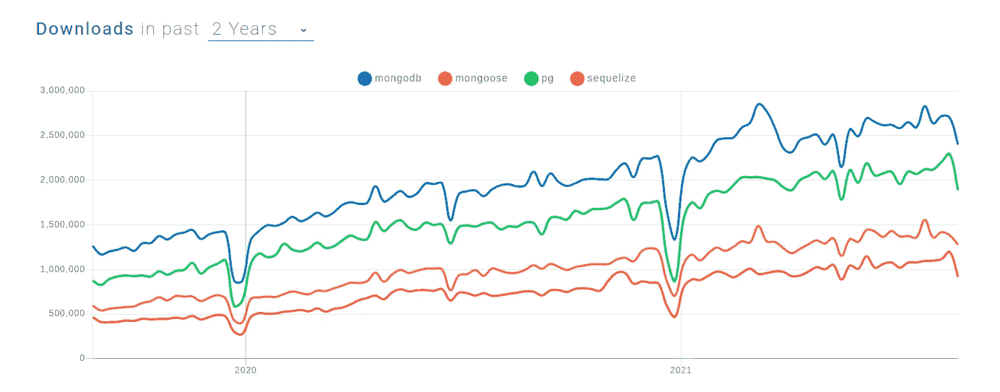

# 为什么不应该在您的项目中使用 MongoDB

> 原文：<https://javascript.plainenglish.io/why-you-should-not-use-mongodb-for-your-project-bf0f1caa6672?source=collection_archive---------1----------------------->

## 大多数情况下，使用关系数据库会更好。

Photo by [Kwang Javier](https://unsplash.com/@kwangjavier?utm_source=medium&utm_medium=referral) on [Unsplash](https://unsplash.com?utm_source=medium&utm_medium=referral)

MongoDB 似乎是 JavaScript web 应用程序最受欢迎的数据库，但是我真的不明白为什么。我用 MongoDB 继承了一个项目，每个人都希望它是用关系数据库开发的。我坚信大多数时候你不需要 MongoDB，使用 PostgreSQL 这样的关系数据库会更好。

# 为什么 MongoDB 这么受欢迎？

MongoDB 是用 JavaScript 开发 web 应用程序的流行工具栈的一部分。MEAN 代表 MongoDB，Express.js，Angular，Node.js[MongoDB](https://www.mongodb.com/)作为数据存储，node . js 和 [Express.js](https://expressjs.com/) 提供 web 服务器和框架，前端用 [Angular](https://angular.io/) 编写。MERN 和 MEVN 是类似的堆栈，分别用 R [eact](https://reactjs.org/) 和 [Vue.js](https://vuejs.org/) 替换 Angular。

# 实际上，它有多受欢迎？

我主要感兴趣的是它与 Postgres 相比如何。不幸的是，没有一个栈有一个吸引人的名字，我可以很容易地搜索到。因此，让我们来分别看看 MongoDB 和 PostgreSQL 最流行的模块:

number of weekly downloads for the most popular MongoDB and PostgreSQL packages on npm, via [npmtrends](https://www.npmtrends.com/mongodb-vs-mongoose-vs-pg-vs-sequelize)

如你所见，最受欢迎的 mongo 包`mongodb`比最受欢迎的 PostgreSQL 包`pg`每周的下载量多 50 万次。其次，`mongoose`和`sequelize`的距离相近。再看 Github 的明星数量，对于`mongodb`和`pg`来说都是一个级别的。同样，`mongoose`和`sequelize`也是如此。因此，可以公平地说，MongoDB 和 PostgreSQL 在 JavaScript 开发人员中受到同样的重视，但是 MongoDB 使用得更广泛。

# MongoDB 和 PostgreSQL 有什么不同？

PostgreSQL logo from Daniel Lundin, [PostgreSQL License](https://www.postgresql.org/about/licence/), MongoDB logo from MongoDB, Inc., Attribution, via Wikimedia Commons

好了，我们已经谈了很多关于 MongoDB 和 PostgreSQL 的流行程度，
那么 MongoDB 和 PostgreSQL 有什么区别呢？

两者都是流行的开源数据库，像 AWS 这样的云提供商为两者提供托管解决方案，但除此之外，它们是非常不同的。

## MongoDB

MongoDB 是一个 NoSQL 文档存储。每个文档或数据都以 JSON 格式存储。NoSQL 意味着它不能用 SQL 查询，也不能表达不同文档之间的关系。例如，在订单跟踪系统中，您有一个用户集合和一个单独的集合来存储订单。现在，您希望强制每个订单都连接到一个现有用户。使用 MongoDB 不容易做到这一点，必须在应用程序代码中完成。

它还是一个“无模式”的数据库，这意味着对存储什么类型的数据的约束是可选的。在前面的例子中，这可能意味着对于一些订单，您将价格存储为数字，对于一些订单，您将价格存储为字符串，对于一些订单，价格可能会丢失。

最后但同样重要的是，MongoDB 支持分片和复制，这使得您可以轻松地扩展数据库，以支持更高的数据量和每秒更多的查询。

# 一种数据库系统

另一方面，PostgreSQL 是一个 SQL 数据库。它在行和表中存储数据，并允许对表之间的关系进行约束。对于订购系统，您可以为用户和订单实现单独的表，并使用 f [外键](https://www.w3schools.com/sql/sql_foreignkey.asp)来确保您永远不会有与用户无关的订单。

我们的 PostgreSQL 数据库的 SQL 模式也可以确保一行中的字段存在并符合某种类型。订单的价格列不可为空，类型为 float。试图存储任何其他内容都会导致异常。

最后，还有一些对分片和复制的支持，但我经常在简单的主从设置中看到。从根本上说，扩展关系数据库有其固有的局限性，因为一旦必须将数据分布到多个实例中，就很难实施关系约束。

# 为什么我不应该使用 MongoDB？

## 它会减慢你的发展速度

乍一看，MongoDB 似乎是一个不错的选择。将数据存储在 JSON 中使得与 javascript 代码交互变得容易，您不会受到模式的约束，也不会有学习 SQL 的开销。

但是大多数时候，拥有关系模式是一件好事。数据中有关系，用 SQL 强制它们很容易。它减少了应用程序代码中边缘情况的数量。例如，您不必处理订单与现有用户无关的情况，数据库不允许这种情况。

对于使用模式强制类型也是如此。知道一个字段总是某种类型会大大减少应用程序需要支持的不同状态的数量。反过来，这也使得测试更加容易。

你可以把每个应用程序想象成一个状态机，更少的状态意味着你的应用程序更容易理解、维护和扩展。相反，随着项目的发展，越来越多的状态和边缘案例会导致您添加的每个新特性产生更多的状态。进而减缓新功能的开发。让事情尽可能的小和约束是值得的。

有些人可能会争辩说，一个约束模式还会限制你如何用新的、尚未发现的特性来扩展你的软件。相反，我发现它是一个很好的文档来源，可以简化开发。还是那句话，软件越容易理解，就越容易扩展。随着用例的变化，有一些工具和实践可以帮助您[随着时间的推移发展您的模式](https://martinfowler.com/articles/evodb.html)。

## 您不需要可伸缩性

MongoDB 的一个重要论点是可伸缩性，但是可伸缩性意味着什么呢？对于一个项目，您预计会有多少数据和多少查询？在我参与的最后两个专业项目中，我们做了包络计算，发现我们很可能永远不会超过 PostgreSQL 提供的容量。

举几个例子:AWS RDS 的数据限制是几十 TB，也就是 10 个左右。Airbnb 的平台上大约有 10⁷的房产，medium 的活跃作家应该比 10⁶少。因此，对于许多用例来说，存储是足够的。对每秒请求数的粗略计算更加困难，但是我再次发现，在许多用例中，实际数字通常低得惊人。

仍然有许多用例超出了单个关系数据库的能力，但是我猜想当它足够时会有更多的用例。如果这还不够(因为你正在开发下一个你知道会腾飞的社交网络),那么你的架构需要仔细的系统设计。追随最流行的 JavaScript 技术栈是不够的。

# 最后的想法

我们编写软件来为企业解决问题。问题和我们对这些问题的理解都会随着时间而改变，所以你的软件也会随着时间而改变。

有些违背直觉，限制软件中选项和状态的数量将会比许可结构更好地支持这种变化。

这就是为什么我认为作为默认选项，您应该总是更喜欢像 PostgreSQL 这样的关系数据库而不是 MongoDB。除非你能提出一个令人信服的理由来解释为什么它行不通。但是一个好的论点需要一些数字。如果您没有这些，请返回默认设置。

# 资源

 [## 什么是均值叠加？简介和示例

### MEAN 架构旨在使用 JavaScript 构建 web 应用程序和处理 JSON 变得非常简单…

www.mongodb.com](https://www.mongodb.com/mean-stack)  [## Mongodb 与 PostgresSQL:比较数据库结构

### 任何公司最重要的功能之一是一个安全的数据库。网络钓鱼攻击、恶意软件…

www.xplenty.com](https://www.xplenty.com/blog/mongodb-vs-postgresql/)  [## 进化数据库设计

### Pramod Sadalage Pramod 开发了进化数据库设计和数据库重构的原始技术…

martinfowler.com](https://martinfowler.com/articles/evodb.html) 

*更多内容看*[***plain English . io***](http://plainenglish.io/)