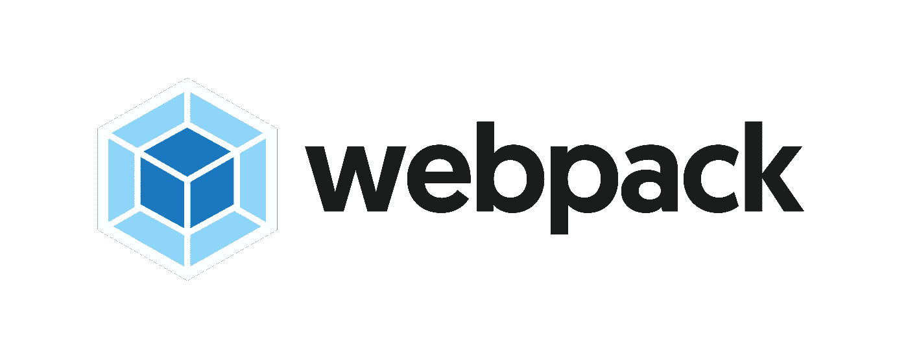
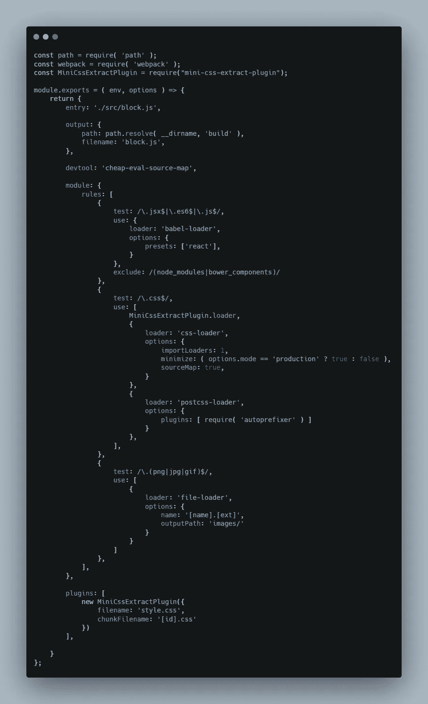

# 为什么不应该使用 Webpack

> 原文：<https://javascript.plainenglish.io/why-you-should-not-use-webpack-f07f4fd7c116?source=collection_archive---------0----------------------->

Webpack Logo

Webpack 是当今最受欢迎的捆扎机之一。大量的生产应用程序和框架，如 Next.js，Create React App 等等，都使用它进行捆绑和构建。此外，它拥有最大的插件库。然而，自 Webpack 问世以来，时代已经发生了变化，现在它已经不是很多情况下的最佳工具。

# Webpack 发展的原因

回到 2014 年，当 Webpack 首次发布时，JavaScript 生态系统非常不同。Grunt 和 Gulp 主导了构建工具领域，它们的高级插件可以做很多事情，比如自动化发布，或者编译 Sass 之类的东西。许多包裹是通过 CDNs(内容交付网络)提供的。但是，如果您想在本地捆绑 npm 包，以便可以在前端代码中使用它，并且不需要使用托管版本，则需要使用 Browserify。Browserify 的问题是，虽然它有插件支持，但它远不如 Grunt 或 Gulp 等构建工具好。输入 Webpack。Webpack 将捆绑和构建合并到一个工具中，并使其更易于配置。

# 现在的生态系统

如今，有许多其他的捆绑器，如 Rollup、Parcel、Vite 和 Snowpack，以及一个新的本机模块系统 ESM 或 ECMAScript 模块。较新的捆扎机具有更简单的配置，允许人们更容易地添加/创建插件和配置设置，一些捆扎机利用 ESM 来实现超快的重新加载速度和更小的捆扎机。因此，Webpack 不再是最好的工具了。

# 不应使用 Webpack 的原因

# 1.开发模式速度

当您启动开发服务器时，Webpack 必须捆绑所有模块。因此，当您启动 dev 服务器时，它可能会非常慢，通常需要 2 到 30 秒，甚至多达 150 秒才能完成。为了让事情变得更快，package 等捆绑器利用缓存，Webpack 现在在版本 5 中实现了缓存，但并不是所有的框架和插件都支持缓存，一些捆绑器，如 Vite 和 Snowpack，通过利用原生 ESM，已经设法变得更快，达到 250 毫秒的重新加载时间。虽然 Webpack 正试图在这方面进行改进，但在 dev 模式下添加对 ESM 的支持将非常难以实现，而且暂时不太可能实现。

# 2.易于配置

Webpack 以需要学习大量知识才能配置它而闻名。你需要插件来做简单的事情，比如[加载 css](https://github.com/webpack-contrib/style-loader) ，而配置文件非常复杂

A sample webpack config file

许多 bundler，比如 Parcel 和 Vite，允许你做很多事情，包括上图中的大部分事情，而不需要任何配置文件，大多数其他现代 bundler 有更简单的配置语法。有些东西，比如 Create React App，可以帮你管理一切，但是灵活性很小，当你进一步开发你的应用时，经常会导致你“弹出”(删除配置文件，这样你就可以自己制作了)。

# 3.捆绑大小

因为它需要 polyfills 来加载模块，所以 Webpack 的捆绑包大小可能比其他使用 ESM 和现代 JavaScript 语法的捆绑包大得多。使用 polyfills 具有支持浏览器的优势，但也可以使用利用 [nomodule](https://developer.mozilla.org/en-US/docs/Web/HTML/Element/script) 标签的插件来最大限度地支持浏览器，同时保持其对现代浏览器的快速支持。但是，由于 webpack 目前不支持现代 ESM，因此这对于 it 来说是不可能的。

# 可供选择的事物

有许多其他捆扎机可供选择，它们有助于解决上述三个问题中的部分或全部。

*   [**包裹**](https://v2.parceljs.org/) **:** 部分修复问题 1，完全修复问题 2
*   [**汇总**](https://rollupjs.org/) **:** 完全修复问题 3，部分修复问题 1 和 2
*   [**Vite**](https://vitejs.dev/)**:**完全修复了这三个问题
*   [**积雪场**](https://www.snowpack.dev/) **:** 完全修复问题 1 和 3，部分修复问题 2

# 结论

虽然 Webpack 有大量的插件和社区支持，但在很多方面，它并不是最好的选择。就我个人而言，我更喜欢 Vite，因为它以一种有效的方式解决了所有这三个问题，使其像 package 一样容易配置，但仍然使用 ESM 并获得其优势。然而，上面列出的四个捆扎机质量都非常高。

这是我写的第一篇文章，所以可能会有一些瑕疵，如果有，请告诉我。谢谢大家！

*更多内容请看*[*plain English . io*](http://plainenglish.io/)