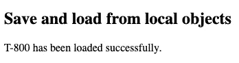

# 为什么在 JavaScript 中应该选择 JSON 而不是 XML

> 原文：<https://javascript.plainenglish.io/why-you-should-prefer-json-over-xml-in-javascript-a6ec8d5091cd?source=collection_archive---------8----------------------->

## 3 分钟指南#07

## JSON 是 JavaScript 中交换数据的首选


Illustration made by [Author](http://www.arnoldcode.com/) with ❤️

JSON 代表 *JavaScript Object Notation，*这不是巧合，因为三个阴谋论者走进了一家酒吧。

JSON 最初是 JavaScript (1999)的一个子集，这种与语言的密切关系使它成为在服务器和客户机之间传输数据的完美助手。

此外，JSON 易于人类阅读。创建过程不像 XML 那样繁琐，而且架构的处理也非常简单。

如果我没有像二级汽车经销商一样卖给你 JSON，请坐下来比较 XML 和 JSON 的内在价值。

# XML 与 JSON 的比较


Footage from [Used Cars](https://setthetape.com/2019/08/09/used-cars-blu-ray-review/)

那么另一个模型 XML 呢？

可以说，XML 是过去十年的模型。至少在使用 JavaScript 时，你应该避免使用它。XML 比你的邻居更健谈。

我们从一个简单的例子开始，这个例子来自与我同名的阿诺德·施瓦辛格。

XML 在节点之间存储信息:`<node>information</node>`。每条信息都有自己的节点。

这看起来臃肿，读起来确实刺耳。将开销与我们存储的数据进行比较。

与具有相同数据的 JSON 相比，JSON 以`key:value`对的形式存储信息。

这看起来更加渺茫和阴暗。有了 C 语言背景，你已经有了家的感觉。

这是关键的一点，JSON 得分并打了一个本垒打。语法几乎类似于 POJO(普通的旧 JavaScript 对象)。

文章可以在这里结束，但如果你不知道如何处理这个聪明的产品，这一切都没有意义。

保存和加载是编程世界中随处可见的关键词。

## 保存和加载

我将向您展示在浏览器中存储 JSON 到`localStorage`的简单例子。对`localStorage`的读写过程与您与服务器通信的过程相同。

JSON 将被转换成一个字符串，然后保存。当你要把它加载回去的时候，它也将是一个字符串。

因此，任何对象都会用`JSON.stringify(yourDesire)`转换成一个字符串，在加载之后，必须用`JSON.parse(yourDesire)`转换回来。

我现在向您展示如何从本地存储中保存和加载 JSON。

我们使用`localStorage`将我们的终结器对象保存到浏览器的本地存储中，方法是用`JSON.stringify()`将它转换成一个字符串。

要做到这一点，我们需要提供一个`id`和我们想要保存的`string`，因此保存会跟随`localStorage.setItem(id, string)`并在我们想要从中加载内容时跟随`localStorage.getItem(id)`。

然后我们可以用`dot-operator`正确地访问它，如在`loadObject.modelName`中显示结果:



HTML surface to “SavingAndLoadingJSON.js”

# JSON 比 XML 更好


Photo by [Ferenc Almasi](https://unsplash.com/@flowforfrank?utm_source=medium&utm_medium=referral) on [Unsplash](https://unsplash.com?utm_source=medium&utm_medium=referral)

JSON 允许您拥有 JavaScript 拥有的所有数据类型。有`strings`、`booleans`、`numbers`、`objects`和`arrays`。

如果你想在 XML 中实现`arrays`，你需要像这样的多个节点:

```
<numbers>
    <value>21</value>
    <value>hello</value>
    <value>25</value>
    <value>darling</value>
    <value>69</value>
</numbers>
```

与 JSON 相比:

```
{
  "array":[21, "hello", 25, "darling", 69]
}
```

*无论如何，任何传输的 JSON 都是一个字符串，我们可以很容易地将它解析回一个对象。*

为了使用 XML，你需要一个 XML 解析器。不管你存储的数据有多简单。

# 结论

JavaScript 获得了 JSON 的内置功能。总之，最好使用 JSON，而不是老式的 XML。

*   用 XML 存储数据会有很大的开销
*   JSON 已经是 JavaScript 的一个子集，有内置功能
*   JSON 更适合人类阅读
*   JSON 对人类来说更容易编写
*   在客户机和服务器之间传输数据或者保存和加载数据时，JSON 比 XML 更好

[***节省自己大量的时间，专注于重要的主题。***](https://arnoldcodeacademy.ck.page/26-web-dev-cheat-sheets)


Arnold Code Academy 26 Web Developer Cheatsheets

***感谢阅读。如果你对这些文章感兴趣，这里有一篇我预先挑选的:***

[](https://medium.com/nerd-for-tech/the-reasons-not-to-migrate-from-javascript-to-typescript-89b587ed9ac9) [## 不从 JavaScript 迁移到 TypeScript 的原因！

### 如何为媒体找到我的声音

medium.com](https://medium.com/nerd-for-tech/the-reasons-not-to-migrate-from-javascript-to-typescript-89b587ed9ac9) 

*更多内容请看*[***plain English . io***](http://plainenglish.io)