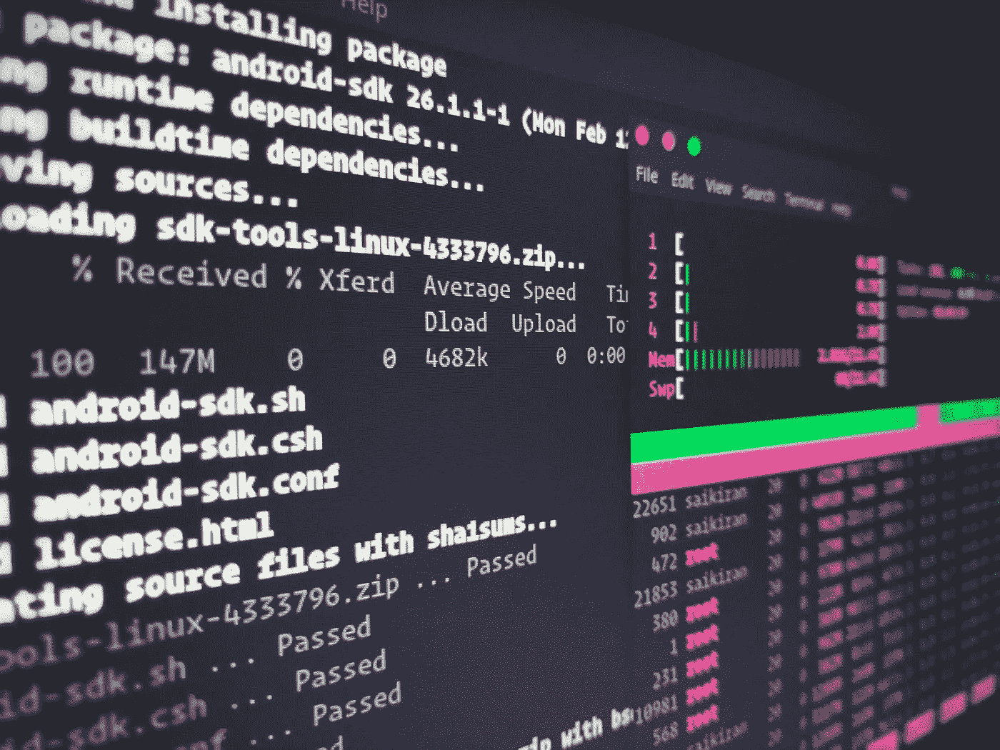
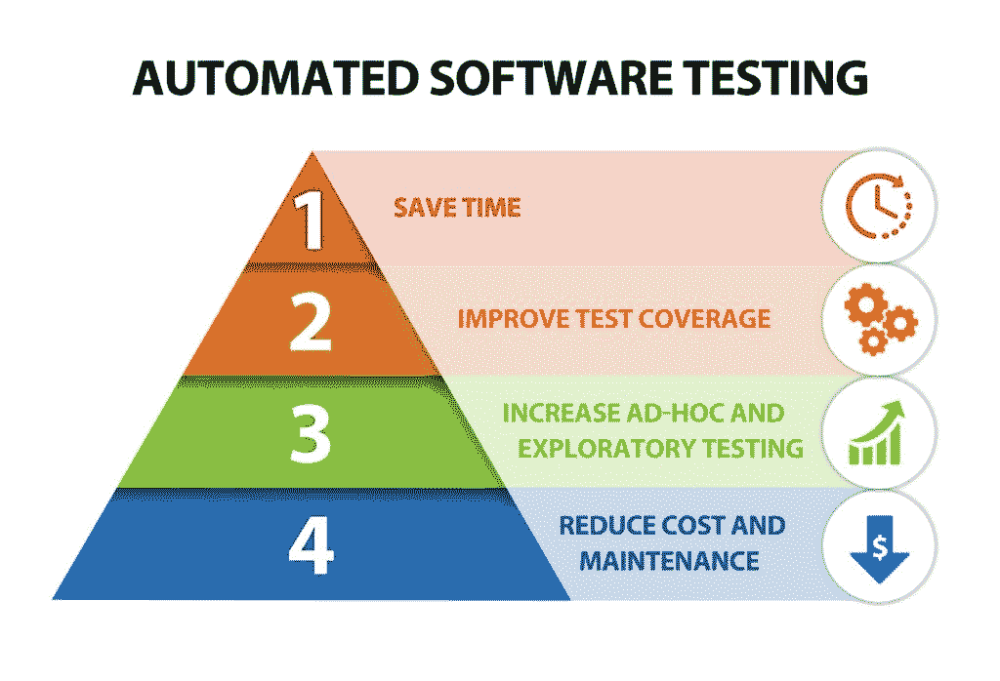
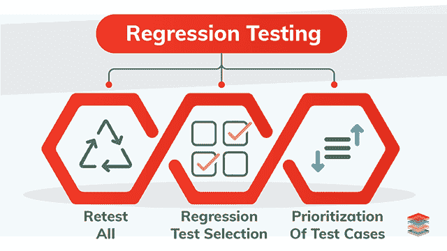

# 为什么您应该运行自动化的 Web 应用程序测试

> 原文：<https://javascript.plainenglish.io/why-you-should-run-automated-web-app-testing-b58323e9e68e?source=collection_archive---------15----------------------->

了解不同类型的自动化测试

[https://unsplash.com/photos/Tjbk79TARiE](https://unsplash.com/photos/Tjbk79TARiE)

# 什么是软件测试？

软件测试意味着从客户的角度来测试软件，而不是从开发者的角度。

我们来看一个实时场景。假设开发人员已经为 web 应用程序创建了一个注册页面。开发人员测试注册页面并确认它运行正常。但是有时候，开发者忘记了在不同的模式下测试注册页面。假设密码长度必须是八个或多于八个且少于十六个字符。开发人员可能忘记通知用户密码长度不能超过 16 个字符的条件。这叫做 bug。

测试工程师将为所有场景编写案例并执行测试。测试人员将通知开发人员应用程序是如何测试的，他们使用了什么输入，以及截图和他们的评论。基于测试工程师的输出，开发人员将修改代码，并要求测试工程师再次测试。重复这个过程，直到问题得到解决。

*简单来说，测试工程师编写测试用例，检查测试用例是否通过——这就是所谓的* [*手工测试*](https://www.toolsqa.com/software-testing/manual-testing/) *。*

# 什么是测试自动化？

测试应用程序时，测试人员通常会编写测试用例，并手动执行测试。同样的测试，当使用软件工具和编程脚本时，被称为[测试自动化](https://www.perfecto.io/blog/what-is-test-automation)。

*简单来说，使用工具和脚本而不是使用人力资源来自动化测试用例称为测试自动化。*

测试自动化工具或脚本根据您的需求重复使用回放预先录制的动作。测试自动化通过为许多问题提供更简单的解决方案来帮助测试人员。使用工具和脚本节省了测试人员在重复性任务上花费的时间。因此，大型软件开发公司认为实现测试自动化是至关重要的。另一方面，小型软件公司认为这将花费他们太多。

[*图像来源*](https://xbosoft.com/software-testing-services/test-automation/)

需要注意的是，测试自动化并不意味着工具会为你做所有的测试。首先，您需要手动创建一个脚本来使用工具测试它。然后，创建的脚本将根据您的需求运行任意多次，无需人工干预。

# 什么时候使用测试自动化？

在这里，我们将看到什么时候应该使用测试自动化。每个人在考虑实现测试自动化的时候都会想到这个问题。如果您正在使用下面提到的任何一种测试方法，您必须使用测试自动化。

1.  重复测试
2.  回归测试

# 重复测试:

是的，如果你在做重复性测试，那么你可以使用测试自动化。这会减少你需要花费的时间和金钱。如果您每天、每周或每月都在做相同的测试，那么这些测试用例就有资格自动化。如果你试图发现一个新的错误或者改变一个应用程序的特性，那么不要使用测试自动化。

# 回归测试:

[*图片来源*](https://www.xenonstack.com/insights/what-is-regression-testing/)

[回归测试](https://en.wikipedia.org/wiki/Regression_testing)测试现有的软件应用程序，以确保在新代码被提交/添加到现有的应用程序后，应用程序没有被破坏并且工作良好。这个场景是测试自动化的完美途径。测试自动化将大大减少花费的时间和金钱。假设您有一个大型应用程序，预计需要大约十天的时间来完成测试。您可以自动化这种类型的测试，而不是让员工在这上面花费十天时间。

# 测试自动化的优势

1.  测试自动化通过减少人工工作节省了时间和金钱。
2.  它比手工测试更快。
3.  测试自动化给了我们更好的投资回报，并且极大地增加了测试用例的范围和覆盖率。使用测试自动化，我们正在获得更好的测试准确性。
4.  根据我们的需求，我们可以无数次运行一个测试用例。我们可以全天候运行测试用例。

# 结论

测试在软件应用开发中起着非常重要的作用。我是全栈开发者。我觉得软件测试改善了顾客/客户的应用程序体验。每个开发的软件应用程序都有缺陷(或大或小)——这是一个非常普遍的事实。每个开发人员和开发团队都必须接受这个事实。测试工程师在将应用程序发送给客户之前，尽最大努力捕捉程序中的 bug。今天，我们遵循敏捷方法。测试工程师和 QA 团队每天都要编写和测试如此多的测试用例。手动进行的重复测试给团队带来了迟缓，并增加了时间和金钱方面的成本。如果你自动化测试，它将降低这些成本。

因此，在处理重复的测试用例时，以及在添加新代码后测试现有应用程序时，使用测试自动化工具。

希望这篇文章对你很有帮助。

感谢您的阅读。

*更多内容尽在*[*plain English . io*](http://plainenglish.io/)