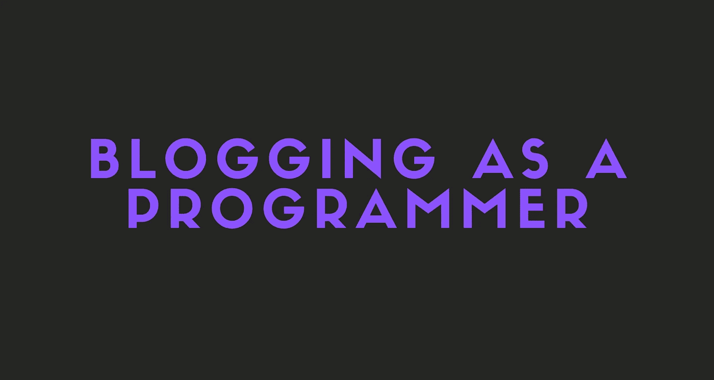

# 为什么你应该以程序员的身份开始写博客

> 原文：<https://javascript.plainenglish.io/why-you-should-start-blogging-as-a-programmer-bd36154d9cd8?source=collection_archive---------20----------------------->

## 了解为什么你应该作为一名程序员尽快开始写博客

在这个故事中，我将谈论为什么你应该作为一名程序员开始写博客。我会说为什么它很棒，你能从中学到什么等等。

如你所知，我正在 Medium 上写编程故事，我真的认为每个开发人员都需要一个博客来分享他们的知识和想法。

开始吧！

# 为什么你应该写博客

## 博客会提高你的技能

写博客的时候，你会想。你会想很多如何解释某件事。它可以是一些代码、架构、框架等等。

在向你的读者解释一些东西的同时，你也会更好地理解它。

假设你正在谈论一段你并不真正理解的代码。实际情况是，你尝试了许多不同的方式向你的读者解释它。当你这样做的时候，你会自然而然地开始更好地理解它。

## 博客会帮你找到工作

我没开玩笑。一个伟大的博客总是给人留下深刻印象。它向招聘人员表明，你可以谈论你正在做的事情，并清楚地理解你看到和编写的代码。

如果你不必为别人工作，你也可以从你的博客中赚钱。你可以自己的平台货币化，也可以在 Medium 等平台上写作。这就是我正在做的，到目前为止一切都很好。

## 写博客会提高你的写作技巧

这一点非常重要，尤其是如果你还在上学的话。

写博客的时候，你会在寻找最佳句子的同时学到很多新单词，总体来说会真正提高你的写作技巧。

由于写博客，我个人在写作和口语方面进步了很多。我真的建议尝试一下。

# 如何开始写博客

如果你是博客新手，我个人建议使用 Medium 或 Hashnode 这样的平台。

你当然可以建立自己的平台，但在你刚开始的时候，你会很难获得读者。

从 Medium 或 Hashnode 开始，写一个故事，为它制作一个图像，并添加适当的标签。

而且说实话，这就是你要做的全部！之后，只要想出新的故事创意，按照自己喜欢的方式写就行了。相信我，如果你坚持不懈地写作，你很快就会有一个合适的读者群。

# 最后的想法

好吧，就这样。你已经知道为什么你应该作为一个程序员开始写博客。

希望这个故事对你有帮助。我很想知道在读完这个故事后，你是否已经决定开始写博客了！

# 仅此而已。感谢您阅读这个故事！

如果你喜欢这个故事，一定要为它鼓掌！你想问我什么都可以。

在 Twitter 上关注我:

 [## re _ ally 边缘

twitter.com](https://twitter.com/Re_allyedge) 

在 Patreon 上支持我:

 [## 阿里木阿尔斯兰卡亚是创造编程故事和教程。帕特里翁

### 今天就成为阿里木阿尔斯兰卡亚的赞助人:在世界上最大的…

www.patreon.com](https://www.patreon.com/allyedge) 

*多内容于* [***浅显易懂***](http://plainenglish.io/)