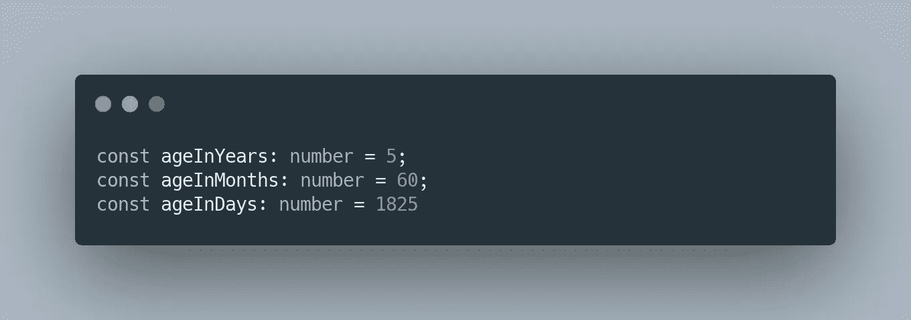
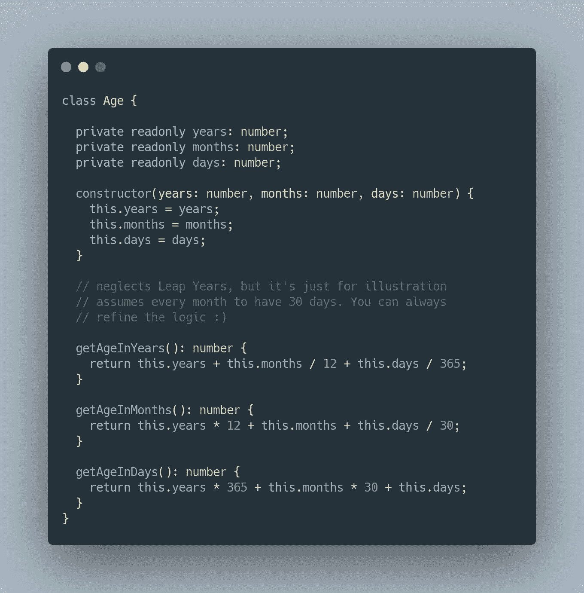
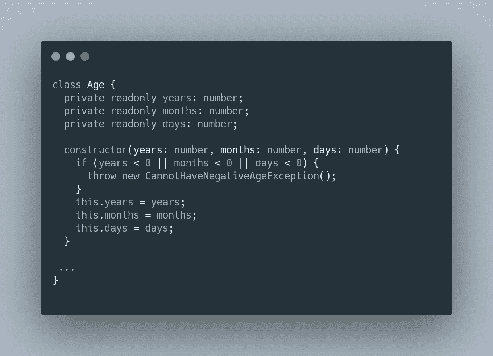
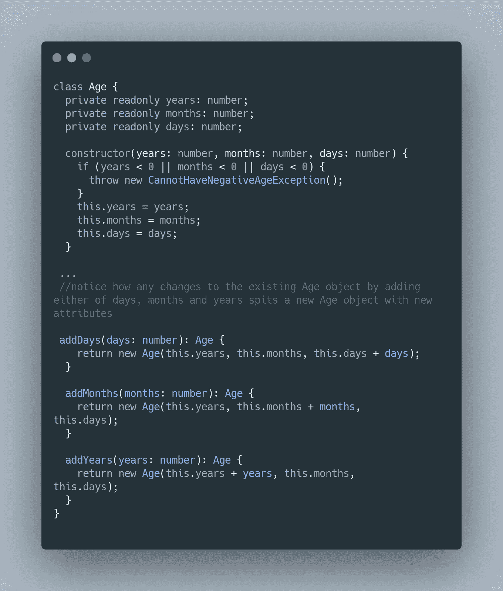
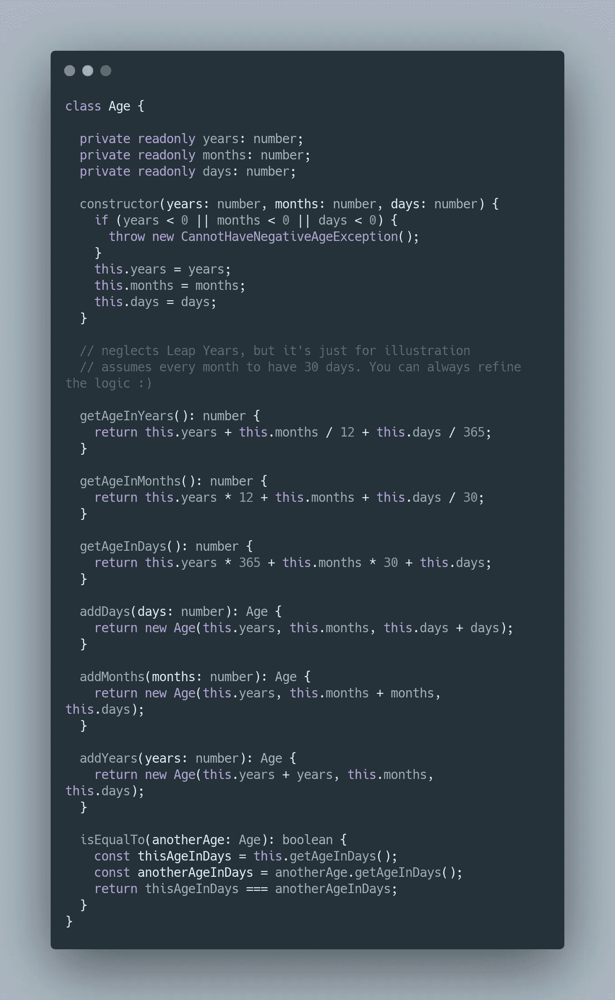

# 为什么不应该在代码中用数字来表示年龄

> 原文：<https://javascript.plainenglish.io/why-you-should-stop-representing-age-as-a-number-in-your-code-ea1026a86bc8?source=collection_archive---------7----------------------->

## “年龄只是一个数字”这句名言在编程界也适用吗？年龄可以简单的是一个*整数*类型吗？或者是某种比单纯的原始类型更进化的东西？年龄可以是负数吗？我打赌原始整数值可以。那么在编程语言中，什么能更好地表示年龄呢？

Photo by [Nathan Dumlao](https://unsplash.com/@nate_dumlao?utm_source=medium&utm_medium=referral) on [Unsplash](https://unsplash.com?utm_source=medium&utm_medium=referral)

*年龄*和*整数*(尽管他们看起来像是为彼此而生)是完全不同的*类型*，有着不同的属性和行为。让我们试着大声思考。一个*整数*可以和另一个*整数*相加或相减，你需要用*年龄*来做吗？也许吧。一个*整数*可以与另一个*整数*相乘或相除，你需要用*年龄*来做吗？大概不会。一个*整数*可以是负数，那么*年龄*可以是负数吗？肯定不是。

通过一些初步的论证，我们看到整数已经开始偏离作为年龄的典型代表。在使用原始类型编程时，这种对更丰富结构的曲解通常被称为*原始痴迷*

> **原始执念**
> 
> 使用原始数据类型来表示领域概念。例如，我们用一个字符串来表示一条消息，用一个整数来表示一笔钱，或者用一个结构/字典/散列来表示一个特定的对象。
> ——[https://wiki.c2.com/?PrimitiveObsession](https://wiki.c2.com/?PrimitiveObsession)

那么，如果年龄不仅仅是一个整数表示，那么它是什么呢？让我们在正确表示*年龄*的复杂性的基础上更详细地探讨这个想法…

*注意:下面列出的代码示例使用了 TypeScript。然而，这些概念足够基本，也可以合并到其他语言中。*

# 粗切削

年龄可以用天数、月数和年数来表示，甚至可以用这些数字的组合来表示。

如果我们简单地使用年龄作为一个整数变量，我们如何让其他开发人员知道年龄是年、月还是天？我见过的解决这个问题的最天真的方法是通过变量命名约定。

对于一个开发人员来说，不断计算不同表示的值是不是太麻烦了？此外，我们太乐观了，认为翻译中不会失去意义。想象一下，如果这个*年龄*变量作为参数传递给其他函数。

这种方法的问题是，它太容易出现人为错误和解释，让人感到不舒服。如果你还不熟悉，读一读关于火星气候轨道飞行器的失败。

那么我们如何进一步改进呢？通过建立一个基本的抽象——一个类。

好吧，我们有了一个好的开始。通过一些行为/方法将原始类型转换为良好的抽象，从而以日、月和年的不同表示形式获得*年龄*。

我们可以进一步改进我们的代码。还记得我们谈到过的一个事实，即*年龄*不能为负。但是我们上面的代码只接受年、月和日的任何数字值。所以让我们在构造函数中快速解决这个问题:

上面的代码片段确保了我们的 *Age* 对象仅由有效且允许的属性构成。

# 最终切割

到目前为止，我们已经构建了一个更加丰富的概念，叫做 ***值对象。***

> **值对象** :
> 值对象是包含属性但没有概念标识的对象。它们应该被视为不可变的。

简单来说，以年龄为例，年龄对象本身没有任何身份。它通常与另一个实体(可以通过唯一标识与其他对象区分开来的对象)相关联，如人(例如，每个人都有一个唯一的 SSN 号码)。

关于不变性的第二个概念是什么使得值对象更加令人兴奋。如果*年龄*改变，现有的对象会吐出一个新的*年龄*对象本身，留下原来的不动。例如，当我们向一个 *age* 对象添加日/月/年时，它将返回一个具有新属性的新对象，如下面的代码所示。

有了不变性，您的代码对于多线程编程来说更加健壮，因为引用完整性对于每个对象都是完整的。这可能会增加某些语言的开销，这些语言并没有将不可变性作为主要构造，但是，这一级别的权衡是非常小的，您几乎总是会在多线程世界中受益。

你可以通过包含`comparison`行为来进一步丰富这个模型，以帮助比较两个*年龄*对象。结合我们到目前为止所做的所有更改，我们的最终年龄表示将如下所示:

# 奖金(更新)

尽管我使用了数字(年、月和日)来构建*年龄*对象(以使博客更简单、更短)，但实际上年龄是两个时间点之间的差异。因此，在构造函数中接受一个*日期/时间*对象参数来表示出生日期&时间可能更有意义(例如，如果用于一个人)。
然后，其他的计算，如 *getAgeInMonths* 、 *getAgeInYears* 和*年龄比较*等，可以从初始日期/时间本身导出。

**要注意的事情**:记住要考虑时区和日期时间对象。

# 摘要

永远探索你可以构建的更丰富的抽象，也就是值对象，而不是过早地沉迷于原始类型。就像 *Age 一样，*还有几个其他的构造经常因为只使用基本类型而被曲解。金钱是另一个例子。大多数代码库将把货币描述成浮点数或大小数，完全忽略了货币的货币方面。

所以下一次当你考虑一个类型的时候，使用真实世界的场景来概念化它，并且在不同的用例中遵循它们在真实世界中的行为。

*更多内容请看*[*plain English . io*](http://plainenglish.io/)