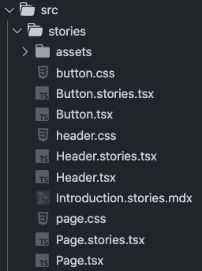

# 为什么你应该在你的下一个项目中使用故事书

> 原文：<https://javascript.plainenglish.io/why-you-should-use-storybook-for-your-next-project-1a991e6a8e65?source=collection_archive---------7----------------------->

## 孤立地构建 UI 组件，并用 Storybook 跟踪它们。


Photo by [Gui Avelar](https://unsplash.com/@31gatanes?utm_source=medium&utm_medium=referral) on [Unsplash](https://unsplash.com?utm_source=medium&utm_medium=referral)

如果有一种方法可以在一个地方看到所有的 UI 组件，那不是很好吗？想象一下能够孤立地构建每个组件，然后针对难以达到的情况测试它们。这正是故事书的用途。

# 什么是故事书？

> Storybook 是一个开源工具，用于构建独立的 UI 组件和页面。它简化了 UI 开发、测试和文档。

故事书允许你为你的项目创建 UI 系统。您可以使用任何您喜欢的 JavaScript 框架，比如 React、Vue、Angular 等等。

在本文中，我们将了解以下内容:

*   了解为什么我们应该使用故事书
*   在 React 应用程序中设置故事书
*   创作你的第一个故事

# 我们为什么要用故事书？

## 孤立地构建组件

您可以独立构建 UI 组件，而无需设置任何开发堆栈。您不需要任何数据或 API。这允许您专注于构建原子组件，而没有任何多余的噪音。然后，您可以将这些组件放在您的应用程序中。

## 测试难以达到的用例

您可以通过创建故事来轻松模拟难以触及的用例。故事捕获 UI 组件的呈现状态。您可以直观地测试您的组件以防止错误。

还有一个庞大的附加组件生态系统来帮助你。目前有 8 个预装附件，包括以下我认为最有用的:

*   [动作](https://storybook.js.org/addons/@storybook/addon-actions/) —显示事件处理程序参数收到的数据
*   [视口](https://storybook.js.org/addons/@storybook/addon-viewport/)——调整呈现组件的 iframe 的尺寸
*   [控制](https://storybook.js.org/addons/@storybook/addon-controls/) —与组件参数交互的 GUI

另一个非预装的有用附加组件是[可访问性](https://storybook.js.org/addons/@storybook/addon-a11y/)。可访问性允许您测试组件是否符合 web 可访问性标准。

## 文档用户界面组件

Storybook 可以作为所有 UI 组件的文档来源。

如果您正在处理一个大型项目或在一个团队中工作，这尤其有用。一旦一个项目变得太大，记住你构建的所有组件是不可能的。如果您在团队中工作，所有开发人员都可以找到您的应用程序中使用的组件，以防止重复代码。

# 在 React 应用程序中设置故事书

接下来，让我们看看如何在一个新的 React 和 TypeScript 项目中设置 Storybook。最简单的开始方式是使用`create-react-app`。运行以下命令，生成一个支持 TypeScript 的新 React 项目。

```
npx create-react-app YOUR-APP-NAME --template typescript
```

一旦创建了新的应用程序，在项目的根目录下运行`npx sb init`来添加 Storybook。

此命令将对您的项目进行以下更改:

*   安装所需的依赖项。
*   设置必要的脚本来运行和构建故事书。
*   添加默认故事书配置。
*   添加一些样板故事让你开始。

如果您检查您的`package.json`文件，您应该看到添加了以下附加脚本。


接下来，运行`npm run storybook`以开发模式启动 Storybook。这将在 [http://localhost:6006](http://localhost:6006) 打开一个新的浏览器选项卡。


如果我们查看一下我们的`src`文件夹，我们还会看到一个名为`stories`的新文件夹。任何具有`stories.tsx`名称的文件都在 Storybook 中表示，如上所示。



# 创作你的第一个故事

最后，让我们开始使用故事书。

在`Button.tsx`文件中，我们将看到已经为我们创建了一个基本的按钮组件。它需要以下道具:

*   主要的
*   背景颜色
*   大小
*   标签
*   onClick

在`button.css`文件中，我们可以看到这些道具将如何相应地设计我们的按钮。例如，如果我们有一个带有`primary`道具的按钮，那么它的颜色为`white`，背景色为`#1ea7fd`。


最后，在`Button.stories.tsx`文件中，我们将看到将按钮组件导出到 Storybook 并添加故事的代码。下面的代码配置按钮组件的故事。

```
export default {
  title: "Example/Button",
  component: Button,
  argTypes: {
    backgroundColor: { control: "color" },
  },
} as Meta;
```

然后，我们为要传递给按钮组件的参数创建一个模板。

```
const Template: Story<ButtonProps> = (args) => <Button {...args} />;
```

最后，我们可以创造故事。故事捕获 UI 组件的呈现状态。例如，下面的代码创建了一个名为 Primary 的按钮组件的故事。我们可以看到带有属性`primary: true`和`label: “Button”`的按钮组件的外观。

```
export const Primary = Template.bind({});
Primary.args = {
  primary: true,
  label: "Button",
};
```


如果我们将标签文本更改为其他内容，我们可以看到 Storybook 中反映的更改。

```
export const Primary = Template.bind({});
Primary.args = {
  primary: true,
  label: "Click me!",
};
```


# 结论

感谢阅读！我希望这篇文章有助于您理解 Storybook 是什么以及如何在 React 应用程序中使用它。如果你想看看故事书的例子，可以点击这里查看官方的故事书图书馆。

我最近一直在钻研故事书，所以请继续关注即将到来的更多文章！

如果您对了解测试感兴趣，请查看下面的文章，开始使用 Jest 和 React 测试库。

[](/introduction-to-testing-in-react-with-jest-and-react-testing-library-c1c32bb11739) [## React with Jest 和 React 测试库中的测试介绍

### create-react-app 中的 App.test.js 和 setupTests.js 文件是用来做什么的？

javascript.plainenglish.io](/introduction-to-testing-in-react-with-jest-and-react-testing-library-c1c32bb11739) 

*更多内容尽在*[plain English . io](http://plainenglish.io/)