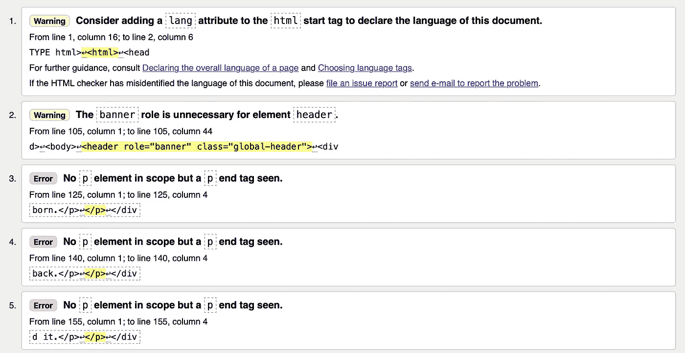
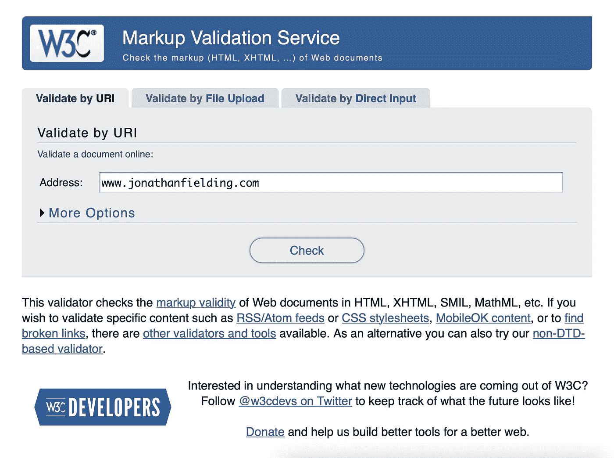
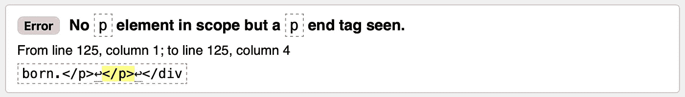
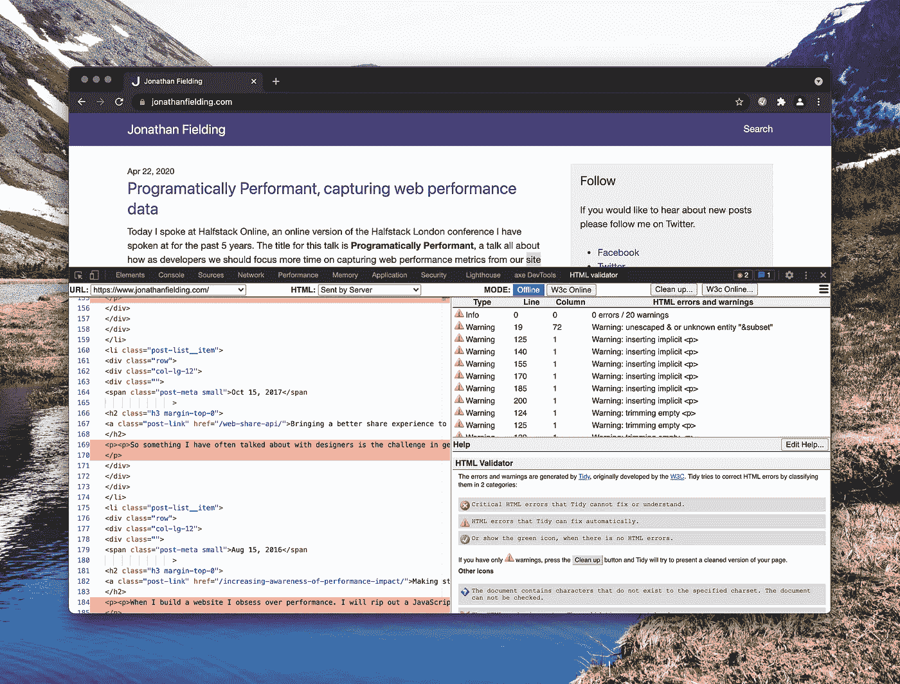

# 为什么你应该验证你的网站 HTML，你可以用什么工具来做

> 原文：<https://javascript.plainenglish.io/why-you-should-validate-your-website-html-and-what-tools-can-you-use-to-do-it-72e683ff39ab?source=collection_archive---------11----------------------->



Screenshot of the [W3C HTML Validator](https://validator.w3.org/nu/?doc=https%3A%2F%2Fwww.jonathanfielding.com%2F)

当我第一次开始构建网站时，我遇到了 W3C HTML 验证器，它允许我验证我编写的 HTML 是否是有效的标记。我发现我使用这个工具越多，它就越能帮助我成为一名更好的 web 开发人员，因为我能够从我犯的任何错误中吸取教训，并学会编写更好的 HTML 标记。

如今，为 web 构建要复杂得多，React、Vue.js 和 Angular 等工具都将我们的代码抽象成离散的组件，这使得简单地查看 HTML 文档整体上是否是有效的 HTML 变得比以往任何时候都更具挑战性。

今天我想看看我们如何从验证我们的 HTML 中获益，以及我们可以使用什么工具来做到这一点。

# 为什么有效的 HTML 很重要？

首先，让我们更深入地了解一下为什么向用户的浏览器呈现有效的 HTML 很重要。

当浏览器呈现具有无效 HTML 标记的页面时，它将尝试协调标记，以便仍然能够向用户呈现页面。以这个 HTML 为例。

```
<div><h1>Jonathan's Blog</div>
```

当浏览器试图协调这一点时，它假定您的意思是整个文本字符串已经是标题的一部分，所以将如下协调 HTML 并呈现它。

```
<div><h1>Jonathan's Blog</h1></div>
```

这种协调过程的局限性在于，它不能总是预测您作为开发人员的意图，这可能导致您的应用程序呈现不正确。在这个特殊的例子中，我可能只想让我的名字成为标题的一部分，所以实际上我想要的 HTML 可能是:

```
<div><h1>Jonathan's</h1> Blog</div>
```

同样重要的是要记住，这种协调过程会因浏览器而异，这意味着一个浏览器可能会表现得很好，而另一个可能会看起来很糟糕。

# 我可以用什么工具来验证我的 HTML？

避免编写无效标记所导致的问题的一种方法是使用代码验证工具来验证您的标记。这些工具将验证您的标记是否有效，帮助您在问题进入生产之前发现它们。

根据您的使用情况，有几种代码验证工具可供您使用，其中第一种是官方的 W3C 验证工具，可以在[http://validator.w3.org](http://validator.w3.org)找到。

要使用该工具，只需如下所示输入您网站的 URL，然后单击“检查”。



单击提交后，您将被带到您的结果，在那里您将看到一个错误和警告列表。

每个错误都会告诉您发现什么是不正确的，问题的位置，以及一个显示问题的简短 HTML 片段，您可以使用它来搜索您的代码库以发现问题(注意，在您的实际代码中，代码的间距可能不同)。



Example error taken from the W3C validator tool report for www.jonathanfielding.com

W3C HTML validator 非常适合任何静态网站或服务器呈现的网站，因为它不会执行您在呈现页面时使用的任何 JavaScript。

一个替代的(也许更方便的)验证器是 Mark Gueurys 浏览器扩展，它对 Chrome 和 Firefox 都可用。

要使用该扩展，首先你需要从 https://www.gueury.com/mozilla/download.html[下载并安装相关版本。然后，您只需访问您想要验证的站点并打开开发工具。在那里你会看到一个新的标签项，你可以点击它叫做 HTML 验证器，点击它，然后你会看到一个当前页面的报告。](https://www.gueury.com/mozilla/download.html)



Screenshot of Chrome showing an HTML validity report for www.jonathanfielding.com

我发现这个插件特别有用的地方是，它在左侧窗格显示 HTML 文档，所有错误都用红色标出。在右边，它显示一个已经发现的错误列表，当你点击它们时，它会给你更多关于错误的细节。

除了这些验证 HTML 的工具之外，如果您使用 React 这样的库来呈现页面，您还可以选择使用 JavaScript linters 来独立验证各个组件。一个这样的例子是 React 的 [ESLint 插件，它让你访问 React 特有的林挺规则，这将帮助你在你的 JSX 中编写有效的标记。](https://github.com/yannickcr/eslint-plugin-react)

# 概括起来

在你建立网站的时候验证你写的任何 HTML 将会消除你对不同的浏览器渲染引擎如何渲染你的网站的猜测。这将帮助您减少花费在调试标记问题上的时间。

如果你想超越验证你的 HTML，你可能会对如何验证你写的 CSS 感兴趣。Visualwebz 写了一篇关于 CSS 验证的短文，你也可以在 Medium 上找到。

 [## 什么是 CSS 验证

### 什么是 CSS 验证，假设你正在为一家大公司创建你的网页，你想给他们留下深刻印象。你…

seattlewebsitedesign.medium.com](https://seattlewebsitedesign.medium.com/what-is-css-validation-e2dd3eadcd4d) 

*更多内容请看*[***plain English . io***](http://plainenglish.io)