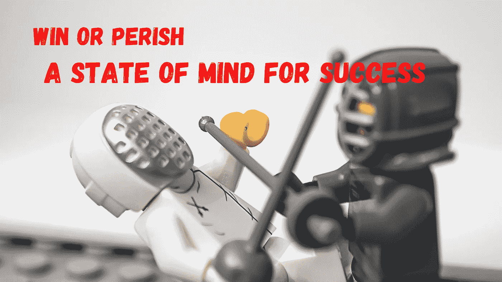

# 成功或失败:如何成为一名成功的开发者

> 原文：<https://javascript.plainenglish.io/win-or-perish-how-to-become-a-successful-developer-f6f8e9e6b242?source=collection_archive---------11----------------------->

通往成功的道路上没有捷径。你需要努力工作。但最重要的是，你需要有一个战士的心态。

# 为什么要采取这种心态？

生活不易。每一天，你都需要练习和学习新的东西，因为世界在变化。如果你忘了做那件事，就像你用一把小枪和一辆坦克开战一样。

我们现在将看到如何集中精力并采用这种心态成为一名更好的开发人员。

# 停止拖延

这是一条基本的建议。这句话你听过多少遍了？有多少次你推迟了你的税单或者说我明天会学习这个新的框架？

是的，我们的日程很忙，我们更喜欢看网飞的新节目，但是推迟任务会剥夺你完成任务所需的精力。

当我们试图记住所有要做的事情并决定以后再做时，我们就失去了宝贵的时间。

# 切断一切干扰

在通往成功的道路上，你需要排除一切干扰。例如，当我们开始开发一项新功能时，你的手机在哪里？

我猜在你附近，在你的桌子上？而且屏幕清晰可见？

不要那样做。例如，如果你收到一个关于脸书的新通知，你会忍不住去看它，然后失去注意力。

每一次分心，甚至只是一个松散信息的声音都会打扰你，你需要几分钟来重新集中注意力。

我个人的建议:

把手机放在身边没问题，但是要打开静音模式，打开你桌子上的屏幕。你需要把它藏起来！

# 优先考虑你的工作

我在一家小法国创业公司工作，我们用 JIRA。每天，我们都会收到新的 bug 罚单，我们有太多的任务要做。我们不能解决所有的问题，因此，我们需要分清主次。

在我的 JIRA 板上，我可以让用户在 1 小时内解决一个小问题。如果一天下来能去掉几张这样的小票，我会很开心的。但是在你所有的票中，你可能有一张票需要 8 个小时的工作，但是你可以为 50 个用户修复错误。

我现在问你:

你更愿意为 50 个用户选择一张 8 小时的票，还是为 8 个用户选择 8 张 1 小时的票？

一个好的程序员能够区分工作的优先级，对其他任务说不。你的时间很宝贵，不要浪费它，为你的公司带来真正的价值！

# 学习和实践

我要求你现在就打开你的日程表，每周增加一个最少 1 小时的循环时间来学习新东西。

技术在变化。你不能推迟你的继续学习。是的，每个星期，你都会想跳过这个环节，因为你需要开发一个新的功能。但是通过这一个小时的训练，你可以学到新的东西来加快你接下来的任务。

# 不要放弃

当我被困在某项任务或修复某个 bug 时，我有过多少次这样的感觉！

使用互联网或向同事寻求帮助，尝试解决这个问题，但不要放弃。当你真的想成功的时候，你会发现一些意想不到的资源。

当然，正是在这种情况下，我们学到了更多。

如果现在没人能帮你，试着大声解释这个问题。想象一只小鸭子在你的桌子上，并解释你试图做什么以及为什么没有成功。当你试着把它公式化的时候，有时你能找到一个解决方法。

# 别忘了休息一下

在所有这些艰苦的工作之后，我的最后(但不是最不重要的)一点建议。；)

因为连续 8 个小时无法集中注意力，所以休息一下。

有时候，我真的急于结束一项任务，我想跳过休息。但是如果我这样做了，我的注意力会下降，我会被困在一个任务上。

有时候，我会花一个小时去寻找解决方案，却不知道问题出在哪里。我去午休，当我回来时，我在 5 分钟内发现了这个 bug！；)

# 结论

成为一名成功的开发者就像为军队工作一样。只有最优秀的士兵才能生存。在战斗中，你要么胜利，要么灭亡。

跳过培训，不给你的公司带来价值，将来没人会雇佣你。

感谢阅读。本文仅是我个人观点。我希望你喜欢它。

*更多内容看*[*plain English . io*](http://plainenglish.io/)