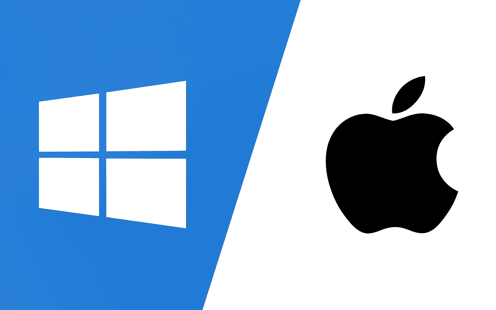

# Windows 与 macOS 的网络开发

> 原文：<https://javascript.plainenglish.io/windows-vs-macos-for-web-development-daaa1d4c5b50?source=collection_archive---------3----------------------->

## 不同平台上的生产率比较

Windows VS macOS

在过去的三年里，我每天都要在不同的平台上工作。有些项目是严格针对 Windows 的，所以我需要在 Windows 上调试。其他项目是跨平台的，我可以在 Mac 上使用它们。我的技术栈现在很典型，包括 JS、TS、Angular、Web-components、GCP、Firebase、AWS、Webpack、Node.js、Docker 和 VS Code。让我来分享一下在 2021 年使用每种操作系统进行网络开发的利弊。

## 虚拟化

即使与英特尔上的 mac 相比，Windows 也有更多用于虚拟化的应用。你可以在 power shell 中使用一个命令来启用 Microsoft Hyper-V，完全免费。Mac 的选择更少。苹果硅处理器的新 MAC 根本没有变种。

**Windows** **1:0** macOS

## 末端的

您可以在任何操作系统上安装任何终端。Windows 甚至可以在幕后运行 Linux。但是 mac 上的默认终端比命令提示符和 Power Shell 放在一起舒服多了。

这也是我更喜欢在 windows 上使用 Cmder 的原因。您可以在终端中复制/粘贴文本，并像在普通文本编辑器中一样编辑文本。还有就是可以设置一个热键，像游戏里的主机一样用 ctrl+~(ctrl+~)打开。您可以使用预装的 git、ssh 和许多其他开发工具安装完整版。轻量级和完整版都是免费的。

在 macOS 上，你也有替代品。功能和速度相似的是 iTerm2。所以在 mac 上，你至少可以有同样的体验。默认终端在 macOS 上肯定更好。

windows**1:1**MAC OS

## 移动开发

一切都很简单，macOS 赢这一轮是因为你可以调试 iOS 和 Android 设备。在 Windows 上，你只能调试 Android，因为没有针对 Windows 的 Safari。

windows**1:2**MAC OS

## 网络工具

当你在大公司工作时，通常你必须使用公司 VPN。很多时候，公司为他们的员工提供 VPN 客户端。通常，这是预配置的第三方应用程序，只能在您的公司内部使用。从我的经验来看，在 Windows 上，你可以安装它并使用多年。但在 Mac 上，随着每次操作系统更新，您可能会面临客户端没有针对当前操作系统版本进行优化的问题。

**Windows****2:2**MAC OS

## 操作系统功能

苹果 macOS 在苹果设备之间有一个**共享剪贴板**。这是一个很棒的功能，我经常使用。例如，您可以启动开发服务器，复制 URL 并立即在 iPhone 上打开它。

Windows 有一个简单而强大的**截图工具**，而且你知道，我比苹果截图 app 更喜欢它。第三方 app 可以解决截图问题但不能实现共享剪贴板。

此外，在 macOS 上，只需一个命令，您就可以设置您的机器进行开发。只需在终端输入`xcode-select --install`。这些工具主要是针对苹果设备的开发，但是 git 和 ssh 我们无处不在。这是安装它们最简单的方法。

windows**2:3**MAC OS

## 软件

这个话题很有趣，取决于业务领域和你工作的公司。如果你需要使用微软的软件，它在 Windows 上会更好。Windows 版本将有更多的本地功能，也可以通过插件进行扩展。如果您不需要使用 outlook 或 excel，可以忽略这一点，因为一般来说，web 开发软件所需的一切在这两种平台上都可以很好地工作。从我的角度来看，苹果比微软更好地控制质量，苹果的软件运行更流畅，速度更快。

windows**2:4**MAC OS

## 基于 UNIX 的操作系统

早期它也是支持 macOS 的一个优势，因为 UNIX/LINUX 操作系统对于编程是必不可少的。此外，Linux 总是比 Windows 更安全。但是时间在流逝，现在你只需点击几下鼠标就可以安装 Linux，并直接在 windows 中运行，所以没有指向任何人。

Windows **2:4** macOS

# 结论

最终比分:Windows **2:4** macOS。

对我来说，两个都用很舒服。Windows 10 稳定快速。你可以买到比 MacBook 便宜很多的笔记本电脑。装有 Windows 系统的个人电脑绝对适合网络开发。但是比较同价位的设备，我更喜欢苹果设备，因为 MacBooks 和它们的软件质量更好。您将花费更少的时间和精力来建立和支持开发环境。

**感谢阅读！**

你可以在 Medium 上关注我的更多科技文章，也可以在 Twitter 上找到我。