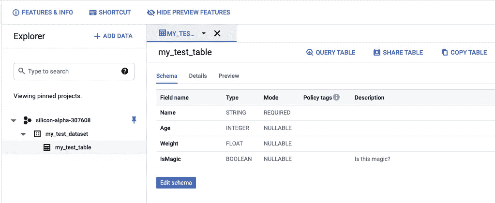
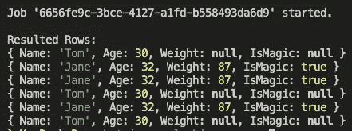

# 使用 Node.js 在 BigQuery 中处理数据

> 原文：<https://javascript.plainenglish.io/working-with-data-in-bigquery-using-node-js-4738561f5329?source=collection_archive---------14----------------------->

本文将介绍 BigQuery 的实际用法，并展示如何使用 Node.js 读写数据。

Photo by [Caspar Camille Rubin](https://unsplash.com/@casparrubin)on [Unsplash](https://www.unsplash.com/)

# BigQuery 术语

在开始任何实现之前，需要澄清 BigQuery 中使用的一些基本术语。

**数据集**

在 BigQuery 中，有称为*数据集*的实体。数据集只不过是项目顶层的一个容器，用于组织和控制对表和视图的访问。因此，一个表必须有一个它所属的数据集，所以在构建第一个表之前，首先必须创建一个数据集。

在开始时，可以将数据集视为一种简单的分组机制，即使在引擎盖下，它当然还有更多。

**表格和表格模式**

Google BigQuery 是一个关系数据库，使用表结构来组织行中的单个记录，而每个记录都由列组成，这些列也被称为*字段*。

另外，对于 RDBMS 来说，Google 通过由列及其定义组成的表模式来定义 BigQuery 表。表的模式既可以在创建表时应用，也可以在第一组数据填充表时由 BigQuery 自动检测，尽管我总是建议预先定义模式。

如果你有使用基于 SQL 的 RDBMS 的经验，你会很快进入 BigQuery。

**列**

BigQuery 通过四个不同的属性定义了表模式的列/字段。

**列名**

列名必须是不区分大小写的字母数字字符串，最多 128 个字符。下划线也是允许的，并且名称必须以字母或下划线开头。

尽管列中不允许有三个名称:

*   *_ 表 _*
*   *_FILE_*
*   *_ 分区*

**列描述**

列说明是描述列的可选字符串，最多包含 1，024 个字符。

**型**

类型是描述列的数据类型的必填字段。可能的值有，例如:

*   *INT64*
*   *浮子 64*
*   *布尔*
*   *弦*

您可以在官方 BigQuery 文档中找到所有可能值的列表。

**模式**

每个列也可以有一个所谓的可选模式。列的模式可以是三个可能值之一。

*   *可空* — *允许空*值(默认)
*   *必需的* — *不允许空值*
*   *重复* —该字段包含指定数据类型的值的数组，而不是单个值。

# 动手 BigQuery

在定义了开始使用 BigQuery 之前应该了解的绝对基础知识之后，我们现在将使用 Node.js 建立一个小型 BigQuery 项目。

因为这是一篇使用 Node.js 的文章，我希望 Node.js 和 NPM 在读者的机器上是可用的。

**使用 BigQuery 建立一个干净的 Node.js 项目**

*   首先，我们必须使用 npm init 创建一个新的 NPM 模块。
*   其次，我们必须使用`npm i --save @google-cloud/bigquery`安装 BigQuery NPM 模块
*   最后，我们需要创建一个新的 JavaScript 文件来放入我们的代码→ `touch index.js`

**GCP 服务账户**

无论应用程序大小如何，我总是建议通过 GCP IAM 创建一个额外的服务帐户，以确保安全和正确的权限，无论谁运行应用程序。如何详细创建附加服务帐户超出了本文的范围，但是可以通过几个简单的步骤来简化:

*   在 GCP 上:进入“IAM & Admin”→服务帐户→创建服务帐户
*   创建一个新帐户并选择适当的角色，例如，对于本文:BigQuery 数据编辑器+ BigQuery 用户
*   选择已创建的服务帐户→密钥→添加密钥→创建新密钥→密钥类型 JSON →下载密钥

确保将密钥文件添加到刚刚创建的 Node.js 项目中。请注意，您永远不应该将这些关键文件提交给 Git！如果您想知道如何在 Git 中安全地存储您的秘密，[您可以查看我在 medium 上的另一篇文章](https://levelup.gitconnected.com/securing-your-secrets-in-git-the-safe-way-using-gcp-kms-ada49e8386af):

**通过代码**创建数据集和表格

现在让我们进入实际代码，创建一个数据集、一个表和一个模式来插入我们的数据。

尽管上面的脚本应该很简单，但让我们快速浏览一下:

*   首先，创建一个新的 BigQuery 客户端。确保用您的特定参数值替换它的参数值。例如，你的 GCP 项目应该和我的不同。
*   其次，构造一个简单的包装器方法，用于在 BigQuery 上创建新的数据集，将数据集名称作为输入参数，并返回创建的数据集的 ID。
*   第三，通过表名和数据集 ID 创建一个新表，该表应该被附加到并返回表 ID。
*   之后，我们定义了将创建数据集和表方法调用捆绑在一起的主方法。

当您运行该脚本时，该程序应该将以下内容输出到控制台:

`*Dataset ‘my_test_dataset' created*`

`Table 'my_test_table' created`

您还应该通过检查 GCP 控制台中的 BigQuery 来验证结果。如下图所示，应用程序在演示项目 silicon-alpha-307608 中使用上述模式创建了数据集和表。

**⚠️ IMPORTANT️ ⚠️**

在 BigQuery 中创建新表后，BigQuery 通常需要 1-2 分钟来准备好表。所以最好不要创建一个表，然后立即将数据传入表中以防止出错。

**将数据流式传输到一个大查询表**

将数据流入 BigQuery 表非常容易，您可以在下面的代码片段中看到一个例子。您必须确保您使用的服务帐户拥有“BigQuery User”角色或更高级的角色，否则，它将由于缺少权限而引发错误。

将数据插入 BigQuery 表非常简单:

*   首先，定义要插入的行。确保行与定义的表模式匹配。否则，它将抛出一个错误。
*   其次，告诉 BigQuery 您想要将行插入到相应数据集下的表中。

在您尝试插入无效行的情况下，它将抛出一个类似于下面代码片段中的错误，告诉您 Hello 字段不存在。

**从 BigQuery** 查询数据

从 BigQuery 请求数据几乎和插入数据一样简单，尽管有点不同。与插入数据类似，我们也需要“BigQuery 用户”角色来检索数据。

从 BigQuery 检索数据可以总结为三个简单的步骤:

*   首先，创建定义所选字段、要检索的行数等的 SQL 查询。
*   其次，创建并触发一个查询作业，该作业在后台异步运行所提供的查询。
*   第三，获取第二步返回的作业对象，并等待查询结果。

在下图中，您可以看到前面的插入脚本运行三次后，运行 getData()方法的控制台输出。

回顾上面的三个步骤，您可能会问，“为什么我在第二个步骤中还没有收到查询结果，而必须发出一个额外的请求来显式地获取它？”。好问题。我们将在下一节给出这个问题的答案。

# BigQuery 作业

BigQuery 中的作业类似于其他技术中的作业。简单地说，作业是由 BigQuery 自动创建、调度和运行的异步操作。

一般来说，查询需要通过作业来执行。这是因为作业可能需要很长时间才能完成，并且您不希望应用程序被阻塞几个小时。

因此，对于长时间运行的查询，通常的情况是创建相应的作业，并不时地轮询它以检查其状态。因为插入数据不是长时间运行的作业，所以插入可以直接运行而无需创建作业。

我们在上面的查询中等待作业，因为我们知道这不会花很长时间。但是首先，当您使用 BigQuery 进行 BigData 分析并查询几 TB 或 PB 的数据时，应该考虑使用一些非阻塞方法。

**BigQuery 作业状态**

BigQuery 中的作业可以处于三种不同状态之一:

*   *待定* —作业已安排，但尚未开始
*   *正在运行* —工作正在进行中
*   *完成* —工作已经完成。尽管 BigQuery 将*完成*状态报告为*成功*或*失败*，但这取决于可能的错误。

由于上述状态，当然也可以取消已经运行的作业。如果您不小心触发了一个长时间运行的作业，或者如果一个作业花费的时间比预期的要长，并且您想要停止它以防止过多的开销，那么这将非常有用。

# 下一步是什么？

在下面的文章中，我们将了解 BigQuery 中的分区表是什么，以及如何使用它们来提高表的性能和成本。

# 关于作者

Pascal Zwikirsch 是 Usercentrics 的技术团队负责人。他管理一个由几个前端和后端开发人员组成的跨职能团队，同时在技术世界和产品经理及利益相关者之间提供无缝连接。

Pascal 曾经做过几年的前端开发人员，现在专攻后端服务、云架构和 DevOps 原则**。他详细地体验了两个世界。这段经历和与产品经理的合作使他有能力构建成熟的可扩展软件。**

除了作为 B2B 开发团队的团队领导，他还喜欢以独立技术作家的身份在文章中分享自己深入的知识和见解。

## 你想联系吗？

如果你想联系我，请在 LinkedIn 上给我打电话。

此外，请随意查看我的书籍推荐📚。

 [## 我的书籍推荐

### 在接下来的章节中，你可以找到我对所有日常生活话题的书籍推荐，它们对我帮助很大。

mr-pascal.medium.com](https://mr-pascal.medium.com/my-book-recommendations-4b9f73bf961b)  [## 通过我的推荐链接加入 Medium—Pascal Zwikirsch

### 作为一个媒体会员，你的会员费的一部分会给你阅读的作家，你可以完全接触到每一个故事…

mr-pascal.medium.com](https://mr-pascal.medium.com/membership)